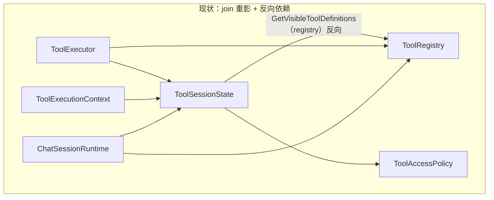
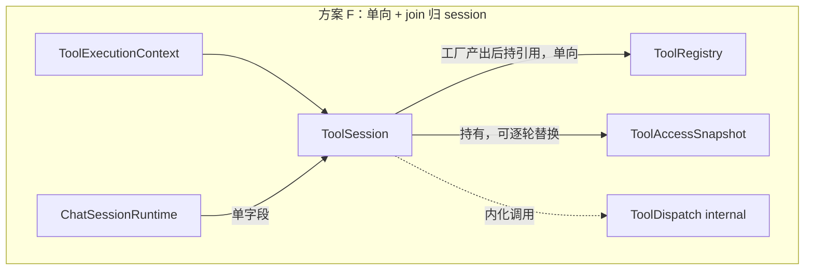

# Completion Tools 架构再设计：从「分层正确」到「装配顺手」

> **读者**：读过 [tool-architecture-complexity.md](tool-architecture-complexity.md) 后想继续收敛方案的人。
> **关系**：本文是上一篇「复杂性讨论稿」的第二轮。上一篇把复杂性来源和候选方案 A–E 摆开；本文做三件事——**重新定位真正的痛点**、**用行业范式精确对标**、**把推荐方案坐实成一份已验证可编译的骨架（方案 F）**。
> **文档性质**：设计收敛稿，仍非最终 RFC。
> **实施状态**：✅ 已落地（2026-06-08）。`ToolSession` / `ToolAccessSnapshot` / internal `ToolDispatch` 已替换旧三件套，ChatSession / Agent.Core / FamilyChat.Server 及测试全部迁移，整 sln 通过（Completion.Tools 26 测试、FamilyChat.Server 23 测试全绿）。
> **最后更新**：2026-06-08

---

## 0. TL;DR

- 上一篇把痛点归为「使用方要同时理解 3 个概念」。**但读真实消费代码后，痛点其实更具体、也更可证伪**：
  1. **依赖拓扑反向**：`ToolSessionState.GetVisibleToolDefinitions(registry)` 让 session 反过来依赖 registry，join 节点没有稳定归属。
  2. **两种生命周期被错误合并**：`ToolSessionState` 同时装了「整个 session 稳定的 services/items/执行序号」和「每轮都会变的 access」，导致 `Agent.Core` 每轮 `new ToolSessionState(policy)` 时**把执行序号一起重置了**——而 `ChatSession` 复用同一个 session 序号却跨轮递增。**同一字段，两个消费者语义不一致，这是设计耦合的硬证据。**
  3. **`ToolExecutor` 不是多余的，它是被遮蔽的 join 节点**：它的真实职责是 `registry × access → 可见/可执行`。问题不是「它该不该存在」，而是「它该不该作为使用方必须手拼的一等概念」。
- **方案 F（推荐）**：把 `ToolRegistry` 变成 session 工厂，`ToolSession` 收口为**唯一有状态主概念**（内化 executor），`ToolAccessPolicy` 正名为不可变的 `ToolAccessSnapshot` 并作为 session 上**可逐轮替换**的属性。
- 行业三条共识精确支撑这个方向：**有状态主概念由静态工厂产出**（OTel `provider.GetTracer`、ADO.NET `connection.CreateCommand`）、**dispatch 通常不作为一等公开对象**（ASP.NET 无 `Executor`、MediatR 的 `IMediator` 是无状态单例）、**access 是 scope 的属性或编译后的 metadata，而非使用方手拼的并列对象**（capability set）。
- 方案 F 的类型骨架已写成**隔离可编译实验并跑通**（`gitignore/tool-session-redesign/`，`ALL PASS`），同时复现 `ChatSession` 与 `Agent.Core` 两种装配，确认消费方代码确实变顺、且顺带修复了序号重置。

---

## 1. 先把真正的痛点钉死

上一篇的诊断没有错，但偏「感受」（「为什么我要理解三个概念」）。要让重构有方向，得把痛点变成**可在代码里指认、可证伪**的命题。读完 `ChatSession` 与 `Agent.Core` 的真实装配后，我把痛点收敛成三条。

### 1.1 痛点一：依赖拓扑反向，join 节点无归属

工具系统本质上有**两个正交轴**：

- **能力轴**：有哪些工具、schema 是什么 → `ToolRegistry`（静态、可共享）。
- **视图轴**：当前 session 能看见/执行哪些 → access。

「当前可见工具集」是这两个轴的**交叉派生量**（`registry × access`）。它必须落在某个对象上。当前实现把它放在了 `session` 上，于是 session 不得不反向依赖 registry：

```csharp
// prototypes/ChatSession/ChatSessionEngine.State.cs（出现两次）
runtime.ToolSessionState.GetVisibleToolDefinitions(runtime.ToolRegistry).Length > 0
```

这个「把 registry 当参数传回给 session」的形状就是别扭的根源。它说明 join 节点（`registry × access`）没有自己的稳定归属，只能临时寄居在 session 的一个方法签名里。

`ToolExecutor` 其实正是想承载这个 join：

```csharp
// prototypes/ChatSession/ChatSessionEngine.cs:21
var toolExecutor = new ToolExecutor(_runtime.ToolRegistry, _runtime.ToolSessionState);
var tools = toolExecutor.VisibleToolDefinitions;
```

**所以「Registry + SessionState + Executor 三个概念」之所以让人累，不是数量问题，而是 join 节点既出现在 `Executor` 又泄漏进 `SessionState.GetVisibleToolDefinitions(registry)`，职责重影。**

### 1.2 痛点二：两种生命周期被合并，已造成可观测的不一致

`ToolSessionState` 当前同时持有：

| 字段 | 真实生命周期 | 谁会逐轮改它 |
|:-----|:-------------|:-------------|
| `Services` | 整个 session 稳定 | 没人 |
| `Items` | 整个 session 稳定 | 没人 |
| 执行序号 `_nextExecutionSequence` | 应当整个 session 单调递增 | 没人（应当） |
| `ToolAccess`（access） | **每轮可能变**（workflow state 驱动） | `Agent.Core` |

把「逐轮可变的 access」和「整段稳定的序号」放进同一个不可变对象，后果是：一旦要换 access，就只能整体重建对象，**连带把序号也重置了**。这正是 `Agent.Core` 的现状：

```csharp
// prototypes/Agent.Core/AgentEngine.cs:196
private ToolExecutor CreateToolExecutor(ToolAccessPolicy toolAccessPolicy) {
    return new ToolExecutor(
        ToolRegistry,
        new ToolSessionState(toolAccess: toolAccessPolicy)   // 每轮新建 → 序号从 0 重来
    );
}
```

对照 `ChatSession`：它整段复用同一个 `ToolSessionState`，序号跨轮递增。

**于是同一个 `ExecutionSequence` 概念，在两个消费者里语义不同：一个是「session 内全局序号」，一个是「turn 内序号」。** 这不是风格问题，是把两种生命周期塞进一个对象后必然漏出的语义裂缝。任何依赖「session 内唯一执行序号」的下游（去重、审计、日志关联）都会踩到。

### 1.3 痛点三：`ToolAccessPolicy` 名字透支了职责

这点上一篇已说清，此处只补一个判断：它当前的真实形态就是一个 **capability set 的不可变快照**（一组「隐藏工具名」），既不是规则解释器，也不该是。名字叫 `Policy` 会持续诱导「是不是要长成 allow/deny 优先级、动态谓词、环境条件」的想象。**正名比改造更划算。**

---

## 2. 行业范式：精确对标，而不是泛泛类比

上一篇列了 DB / Web / RPC / Compiler 四个类比，方向对但偏粗。把它们对齐到「静态能力 / 有状态绑定 / 单次调用 / 谁做 dispatch / access 形态」五列后，能挤出更硬的结论：

| 系统 | 静态能力层 | 有状态主概念（工厂产出） | 单次调用（纯数据） | dispatch 是否一等公开对象 | access / scope 形态 |
|:-----|:-----------|:--------------------------|:-------------------|:--------------------------|:--------------------|
| OpenTelemetry | `TracerProvider` | `Tracer`（`provider.GetTracer`） | `Activity` / `Span` | 否，SDK 内化 | sampler/processor 链 |
| ADO.NET | `DbProviderFactory` | `DbConnection`（持 tx/session） | `DbCommand`（`conn.CreateCommand`） | 否，provider 内化 | connection string / tx |
| ASP.NET Core | `EndpointDataSource` | `HttpContext` + `RequestServices`(scope) | endpoint 调用 | **否，middleware 内化（无 `Executor`）** | authorization 编译进 endpoint metadata + 运行时评估 |
| MediatR | handler 注册表 | （无 session）`IMediator` 无状态单例 | `Send(request)` | 是，但**无状态** | pipeline behaviors |
| gRPC | `ServiceDefinition` | `Channel` / `CallInvoker` | `AsyncCall` | 否，runtime 内化 | interceptors / call credentials |
| Capability security | — | capability holder | invoke | — | **capability set（持有即授权）** |

提炼出三条对本设计直接可用的共识：

- **共识 A：有状态主概念由静态工厂产出。** `provider.GetTracer(...)`、`connection.CreateCommand()` 都是「静态能力对象上 `.CreateXxx()` 出一个有状态绑定对象」。→ 支持 `registry.CreateSession(...)`，而不是让使用方 `new ToolExecutor(registry, sessionState)` 手拼两段。
- **共识 B：dispatch 极少作为「使用方必须持有的一等对象」。** ASP.NET 根本没有公开的 `Executor`；MediatR 的 `IMediator` 虽存在却是无状态单例。→ 支持把 `ToolExecutor` **内化**进 `ToolSession`（`session.ExecuteAsync(...)`），底层调度逻辑收成 internal helper。
- **共识 C：access 要么编译进静态 metadata，要么作为运行态 scope 的属性，几乎不会裸露成使用方手拼的并列对象。** 工具 access 是 per-turn 动态的（不能编译进 registry），所以它应是**运行态 scope（session）的一个可替换属性**，而非与 registry/executor 并列的第三个主概念。→ 支持 `session.Access = snapshot`。

> 一个值得点名的「反范式」对照：把状态塞回工具实例（上一篇方案 D）对应的是「在 `DbCommand` 上挂连接状态」式做法，业内普遍弃用，原因正是共享实例污染。本文不再讨论 D。

---

## 3. 方案 F：registry 即工厂，session 即唯一主概念

### 3.1 一句话

> 让 `ToolRegistry` 产出 `ToolSession`；`ToolSession` 是使用方唯一需要持有的有状态对象，内化 executor，持有一个**可逐轮替换**的 `ToolAccessSnapshot`；`ToolExecutionContext` 保持纯数据。

### 3.2 依赖拓扑：从「反向 + 重影」到「单向 + 单一归属」





关键变化：

- **join（`registry × access → 可见/可执行`）只剩一个归属：`ToolSession`。** `VisibleDefinitions` 是 session 的计算属性，不再把 registry 传回去。
- **使用方只持有 `ToolSession` 一个对象**（仍可经 `session.Registry` 取回 registry）。
- **`ToolExecutor` 作为公开概念消失**，调度逻辑落到 internal 的 `ToolDispatch`（无状态），保留为「高级逃生口」但不进主路径。

### 3.3 类型骨架（已验证可编译，`ALL PASS`）

> 下列骨架已在 `gitignore/tool-session-redesign/` 落成隔离可编译实验并跑通，且用 mock 复现了 `ChatSession` / `Agent.Core` 两种装配。这里只列方案 F 的核心类型（省去 stub 与 mock）。

```csharp
// 能力层：静态共享 + session 工厂（共识 A）
public sealed class ToolRegistry {
    public ToolRegistry(IEnumerable<ITool> tools);
    public ImmutableArray<ToolDefinition> AllDefinitions { get; }
    public IEnumerable<RegisteredTool> Tools { get; }
    public bool TryGet(string toolName, out RegisteredTool tool);

    // 唯一公开装配入口
    public ToolSession CreateSession(
        ToolAccessSnapshot? access = null,
        IServiceProvider? services = null,
        IReadOnlyDictionary<string, object?>? items = null);
}

// access 视图：不可变 capability 快照（共识 C，原 ToolAccessPolicy 正名）
public sealed class ToolAccessSnapshot {
    public static ToolAccessSnapshot AllowAll { get; }
    public ToolAccessSnapshot(IEnumerable<string>? hiddenToolNames = null);
    public IReadOnlySet<string> HiddenToolNames { get; }
    public bool IsVisible(string toolName);
    public bool IsExecutable(string toolName);
}

// 唯一有状态主概念：内化 executor（共识 B）
public sealed class ToolSession {
    internal ToolSession(ToolRegistry registry, ToolAccessSnapshot access,
        IServiceProvider? services, IReadOnlyDictionary<string, object?>? items);

    // 可 rebind：工具集动态变化时换 registry，不重置序号（修复痛点二）
    public ToolRegistry Registry { get; set; }
    public IServiceProvider? Services { get; }
    public IReadOnlyDictionary<string, object?>? Items { get; }

    // 逐轮可替换；services/items/序号保持稳定（修复痛点二）
    public ToolAccessSnapshot Access { get; set; }

    // join 归 session：不再把 registry 传回去（修复痛点一）
    public ImmutableArray<ToolDefinition> VisibleDefinitions { get; }

    public ValueTask<ToolCallExecutionResult> ExecuteAsync(
        RawToolCall call, CancellationToken cancellationToken);

    internal long AllocateExecutionSequence();  // 跨轮单调递增
}

// per-call 上下文：纯数据，持有 ToolSession
public sealed record ToolExecutionContext(
    ToolSession Session, RawToolCall RawToolCall, long ExecutionSequence) {
    public IServiceProvider? Services => Session.Services;
    public IReadOnlyDictionary<string, object?>? Items => Session.Items;
}

// 调度/授权/日志/异常治理：无状态，internal（共识 B 的「逃生口」）
internal static class ToolDispatch {
    public static ValueTask<ToolCallExecutionResult> ExecuteAsync(
        ToolSession session, RawToolCall call, CancellationToken cancellationToken);
}
```

### 3.4 三个关键决策

1. **执行序号归 `ToolSession`，跨轮单调递增。** 这直接修复痛点二。实验里 `Agent.Core` 模式跑三轮，执行结果为 `[a#1, a#2, a#3]`（旧实现会是 `[a#1, a#1, a#1]`）。
2. **`Access` 与 `Registry` 都是可变属性，不是构造即冻结。** 这是对「两个消费者对可变性需求相反」的正面回应：`ChatSession` 设一次不动，`Agent.Core` 每轮 `session.Access = snapshot`，并在工具集动态变化（`_toolsDirty`）时 `session.Registry = rebuilt`。两者都可变的关键收益是：**执行序号归 session 私有，既不随 access 逐轮替换重置，也不随 registry rebind 重置**，从而完整兑现「session 级序号」。Agent loop 单线程顺序执行，可变属性无线程安全问题。若未来需要并发派生，再提供 `session.Fork(...)` 复制稳定态，不影响当前形态。
3. **`ToolExecutor` 删除、调度内化为 `ToolDispatch`。** 保留它为 internal 无状态 helper，是为了给「无状态 dispatcher + 纯数据 session」这条备选路线（见 §6 方案 G）留接口，而不必现在就公开。

---

## 4. 消费方 before / after

### 4.1 ChatSession

`ChatSessionRuntime` 从持有两个字段收成一个：

```csharp
// Before
public sealed record ChatSessionRuntime(
    ICompletionClient CompletionClient, string CompletionSurfaceId,
    ToolRegistry ToolRegistry, ToolSessionState ToolSessionState);

// After
public sealed record ChatSessionRuntime(
    ICompletionClient CompletionClient, string CompletionSurfaceId,
    ToolSession ToolSession);                 // Registry 仍可经 ToolSession.Registry 取回
```

每轮装配与那个别扭的校验点：

```csharp
// Before
var toolExecutor = new ToolExecutor(_runtime.ToolRegistry, _runtime.ToolSessionState);
var tools = toolExecutor.VisibleToolDefinitions;
// ...
... runtime.ToolSessionState.GetVisibleToolDefinitions(runtime.ToolRegistry).Length > 0  // 反向依赖

// After
var session = _runtime.ToolSession;
var tools = session.VisibleDefinitions;
// ...
... runtime.ToolSession.VisibleDefinitions.Length > 0                                    // 干净
```

### 4.2 Agent.Core

session 在 engine 生命周期内创建一次，每轮只换 access：

```csharp
// Before：每轮新建 SessionState → 序号重置
private ToolExecutor CreateToolExecutor(ToolAccessPolicy policy)
    => new ToolExecutor(ToolRegistry, new ToolSessionState(toolAccess: policy));

// After：session 持久，逐轮替换 access，序号跨轮递增
private ToolSession EnsureSession()
    => _toolSession ??= ToolRegistry.CreateSession(/* services, items */);

// 每轮：
var session = EnsureSession();
session.Access = projection.ToolAccessSnapshot;   // 来自 IApp.Render 聚合
var tools = session.VisibleDefinitions;
// ... session.ExecuteAsync(call, ct)
```

> 注意：`IApp` / `AppHostProjection` 当前产出 `ToolAccessPolicy`，迁移时随正名一起改为 `ToolAccessSnapshot` 即可，投影聚合逻辑不变。

---

## 5. 与上一篇 A–E 的关系

| 上一篇方案 | 在方案 F 中的处置 |
|:-----------|:------------------|
| A（收口为 `ToolSession`） | **采纳并坐实**：加上工厂入口 `registry.CreateSession` 与 join 归属，明确 `ToolExecutor` 删除而非「可能保留」。 |
| B（Policy → Snapshot） | **采纳并强化**：明确它是 capability 快照、是 session 的可替换属性，而非并列主概念。 |
| C（`ToolId + mask`） | **降级为内部演进**：方案 F 不在公开面引入 `ToolId`；待大量 agent 并发时，在 `ToolDispatch` / `VisibleDefinitions` 内部把 `HashSet<string>` 换成 id+mask，对外零变化。 |
| D（状态塞回 `ITool`） | **明确否决**：对应业内反范式。 |
| E（维持现状） | **否决**：痛点二已造成可观测的语义不一致，不只是「解释成本高」。 |

**所以方案 F ≈ A + B，但补上了三块上一篇没有的实质内容**：把痛点从「概念数量」修正为「拓扑反向 + 生命周期合并」、用行业三共识给出方向的硬支撑、并把序号生命周期与 access 可变性这两个被忽略的张力显式解决。

---

## 6. 一个被认真考虑过的备选：方案 G（纯无状态 dispatcher）

为了证明 F 不是唯一解，这里给出对立面 G，并说明为何选 F。

**方案 G**：不要有状态的 `ToolSession`。`ToolDispatch` 公开为无状态单例，`session` 退化为纯数据包 `ToolSessionData(access, services, items, sequenceRef)`，调用时显式传：

```csharp
var defs = dispatch.GetVisibleDefinitions(registry, access);
var result = await dispatch.ExecuteAsync(registry, sessionData, call, ct);
```

- **优点**：最接近 MediatR / 函数式；无可变属性；天然可并发复用 dispatcher。
- **缺点**：把 join 的两个输入（registry、access）和稳定态（services/items/序号）全甩给调用点，每次调用参数列表更长；序号的「session 唯一性」又得靠外部 `sequenceRef` 维持，等于把痛点二换个地方再现。
- **结论**：G 在「高频无状态」语境里更优，但当前真实消费者（`ChatSession`、`Agent.Core`）都是**单 agent、顺序 loop、强烈希望「一个对象代表本会话工具运行态」**。F 的有状态 session 更贴合，且把序号唯一性收进对象内部。**F 胜在贴合当前真实形态，同时用 internal `ToolDispatch` 给 G 留了将来上位的接口。**

---

## 7. 开放问题（希望评审重点回应）

1. **`ExecutionSequence` 的权威语义到底是 session 级还是 turn 级？** 方案 F 选 session 级（跨轮递增）。若下游其实想要 turn 级，则应显式引入 `TurnId` 而非靠「每轮重建对象」副作用获得——后者是 bug，不是 feature。
2. **`Access` 可变属性 vs 每轮传参（`ExecuteAsync(call, access, ct)`）**：F 选可变属性以贴合单线程 loop。是否有并发派生 session 的近期需求？若有，倾向改为 `session.Fork(access)`。
3. **`ToolDispatch` 是否需要现在就公开？** F 暂留 internal。只有当出现「同一 registry、大量短命 session、想共享一个无状态调度器」的场景时才公开。
4. **`ToolSession` 与未来 `LlmSession` 的关系**：上一篇的 archive 计划提过 `LlmSession`。`ToolSession` 应是 `LlmSession` 的一个子构件，还是 `LlmSession` 直接实现工具装配入口？建议前者（组合优于继承），但需确认。

---

## 8. 迁移影响面（若采纳 F）

- **新增**：`ToolSession`、`ToolAccessSnapshot`、internal `ToolDispatch`。
- **删除**：`ToolExecutor`、`ToolSessionState`、`ToolAccessPolicy`（按本仓库「重构优于兼容层」的取向，直接替换而非并存）。
- **签名变更**：`ToolExecutionContext.Session` 类型 `ToolSessionState → ToolSession`。**工具作者若只用 `context.Items/Services/ExecutionSequence/RawToolCall` 则无感**；只有直接摸 `context.Session` 的少数工具需跟改。
- **消费点**：`ChatSessionRuntime`（两字段→一字段）、`ChatSessionEngine`（去掉 `new ToolExecutor`，两处 `GetVisibleToolDefinitions(registry)` 改 `VisibleDefinitions`）、`AgentEngine`（`CreateToolExecutor` → `EnsureSession` + 每轮 `Access=`）、`IApp`/`AppHostProjection`（`ToolAccessPolicy → ToolAccessSnapshot`）。
- **测试**：`tests/Completion.Tests/Tools/*`、`tests/FamilyChat.Server.Tests/*` 里的 `new ToolSessionState(...)` / `new ToolExecutor(...)` 改为 `registry.CreateSession(...)`。README 主路径样例同步。

---

## 9. 结论

- 真正要消解的复杂性不是「概念多」，而是**join 节点无归属（拓扑反向）**与**两种生命周期被合并（已造成序号语义不一致）**。
- 行业三条共识（工厂产出有状态主概念、dispatch 不作一等对象、access 是 scope 属性）精确指向同一个形状：**`registry.CreateSession()` → `ToolSession`（唯一主概念，内化 executor）+ 可替换的 `ToolAccessSnapshot`**。
- 这个形状已被一份可编译实验坐实：消费方代码变顺、反向依赖消失、并顺手修复执行序号重置。
- 它不否定上一次「能力/状态分离」的重构，而是把那次重构**对外的装配面收口到位**，并补上两处被忽略的生命周期张力。

> 可运行实验：`gitignore/tool-session-redesign/`（`dotnet run`，输出 `ALL PASS`）。
