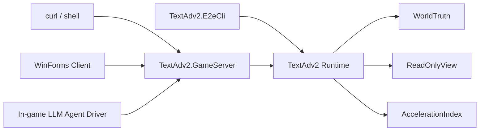

# TextAdv2 - GameServer Refactor Plan

> 状态：执行中；Phase 1-3 主干已落地，当前正在收口 Phase 3/4 的 host 合同与集成测试
> 更新：Phase 5 已有 server-owned logical clock；Phase 6 已开始第一刀，用 runtime sidecar state 持久化 logical time 与 movement history
> 适用范围：`prototypes/TextAdv2/`、拟新增的 `prototypes/TextAdv2.E2eCli/`、拟新增的 `prototypes/TextAdv2.GameServer/`
> 目标：把 TextAdv2 从一次性终端 demo 重构为“engine/runtime + 外部 host”结构，并最终落成一个可持续运行的本地 GameServer

## 一句话结论

这次重构的目标，不是把当前 CLI 直接替换成 Minimal API，而是先把 **authoritative game runtime** 从一次性进程壳里解出来，再让不同入口复用它。

最终形态 SHOULD 是：

1. `prototypes/TextAdv2` 变成纯 DLL 形式的 engine/runtime，本体不背 ASP.NET 依赖，也不持有命令行解析职责。
2. `prototypes/TextAdv2.E2eCli` 变成独立的 dev/admin CLI，按命令参数驱动 runtime，承担现在 `Program.cs` 里的演示与调试职责。
3. `prototypes/TextAdv2.GameServer` 变成常驻 Minimal API host，作为人类玩家、终端脚本、WinForms 客户端和内置 LLM Agent 的统一外部交互面。

## 最终目标状态

### 项目拆分

最终建议的项目边界如下：

| 项目 | 责任 | SHOULD 包含 | SHOULD NOT 包含 |
|:---|:---|:---|:---|
| `prototypes/TextAdv2` | 核心 engine/runtime | `WorldTruth`、`ReadOnlyView`、`AccelerationIndex`、runtime/application services、命令/查询 DTO、sample world bootstrap | ASP.NET host、HTTP endpoint、命令行参数解析、终端输出格式绑定 |
| `prototypes/TextAdv2.E2eCli` | 一次性 dev/admin CLI | 命令解析、文本/JSON 输出、样例世界初始化、离线调试流程 | 世界真相本体逻辑、只存在于 CLI 的业务语义 |
| `prototypes/TextAdv2.GameServer` | 常驻 GameServer host | Minimal API、runtime 生命周期管理、逻辑时间入口、后台 agent driver、本地 dev 配置 | 重复实现一份世界逻辑、绕过 runtime 直接操作 `WorldTruth` |

这意味着：

- TextAdv2 本体将从可执行程序回退为可复用库。
- CLI 和 GameServer 都只是 runtime 的壳，而不是新的业务核心。
- 测试、CLI、HTTP、内置 Agent 必须复用同一套命令与查询语义。

### 核心分层

最终状态下，TextAdv2 核心内部建议稳定为四层：

| 命名空间 | 责任 |
|:---|:---|
| `Atelia.TextAdv2.WorldTruth` | 世界唯一真相；持久化 schema；authoritative state |
| `Atelia.TextAdv2.ReadOnlyView` | 只读观察与导航投影；结构化查询结果 |
| `Atelia.TextAdv2.AccelerationIndex` | 可丢弃、可重建的派生索引与 heuristic snapshot |
| `Atelia.TextAdv2.Runtime` | repo/world 生命周期、命令执行、查询编排、时间推进、日志与一致性边界 |

这里最关键的新增层是 `Runtime`：

- HTTP handler 不应该直接碰 `WorldState`。
- CLI 也不应该自己实现一套 move/observe/plan 逻辑。
- 内置 LLM Agent 更不应该有“旁路写世界”的特殊入口。

### Authoritative Runtime

最终 GameServer SHOULD 只暴露一个 authoritative runtime 实例，统一持有：

- `Repository` 的打开路径与生命周期
- 当前已加载的 `WorldState`
- sample world bootstrap / reopen 逻辑
- 命令执行串行化边界
- server-owned 逻辑时间
- movement/action history
- `AccelerationIndex` 快照与重建时机

这意味着任何 mutation 都必须经过 runtime，而不是由各个入口各自开 repo、各自 commit。

### 对外交互面

最终对外应区分两类交互面：

| 交互面 | 面向对象 | 典型能力 | 备注 |
|:---|:---|:---|:---|
| Actor-scoped gameplay API | 人类玩家、WinForms 客户端、游戏内 LLM Agent | 观察当前位置、查询可走出口、移动、规划到目标地点的路线、查看自己的行动历史 | 默认不要求全知视角 |
| Admin/dev API | `curl`、调试脚本、开发者工具、E2E CLI | reset sample world、world dump、observe any actor/location、重建索引、逻辑时间推进、调试统计 | 本地 dev 用途，当前阶段不做认证 |

这里的关键约束是：

- 游戏内 Agent SHOULD 走和普通玩家相同的 actor-scoped 语义面。
- admin/dev 能力可以存在，但它们不应被误当成游戏内角色能力。
- “没有认证”只是当前本地开发阶段的部署约束，不等于放弃逻辑上的边界区分。

### 逻辑时间

最终 GameServer SHOULD 持有自己的逻辑时间，而不是把“时间推进”交给外部客户端自行拼装。

近期最稳妥的定义是：

- 第一版只实现 server-owned logical clock。
- 先支持显式 `tick` / `advance-time`，不急着绑定 wall clock。
- 后续如果需要自动时间流逝、NPC 调度或 LLM Agent 回合驱动，再在此基础上叠加 scheduler。

### 入口关系

最终结构的依赖关系可概括为：

对于内置 LLM Agent，有两种都可接受的落点：

1. 作为 GameServer 内部后台服务，直接调用同一套 runtime command/query surface。
2. 作为外部 client，经 HTTP 调用 GameServer。

无论哪种，都 SHOULD 避免第二套特权接口。

### 测试位置

最终测试策略 SHOULD 是：

- 核心行为测试放在 `tests/TextAdv2.Tests/`。
- 当前 `Program.cs` 里的行为覆盖，应该迁移为 runtime 级单元测试或集成测试。
- `TextAdv2.E2eCli` 只保留少量“入口是否接对 runtime”的 smoke tests，而不承担主规格定义职责。

换句话说，E2E CLI 仍然有价值，但它的职责是 dev/admin harness，不是业务真相的唯一可执行规格。

## 为什么要这样拆

当前一次性 CLI 结构存在四个自然瓶颈：

1. repo 路径是临时目录，进程结束即散。
2. movement history 仅存在于进程内字典，缺乏明确的生命周期与语义。
3. 命令解析、世界加载、业务执行、输出渲染耦在同一个入口里。
4. 一旦引入持续运行的时间逻辑、玩家客户端和内置 Agent，就会出现多个入口同时修改世界的问题。

所以真正需要抽出来的不是“HTTP endpoint”，而是“统一的 authoritative runtime”。

## 分步骤实施计划

### Phase 1：抽出 Runtime/Application 层

第一步 SHOULD 只做一件事：把现在 `Program.cs` 里真正属于业务编排的部分，抽进 TextAdv2 本体。

近期建议新增例如下面这些概念：

- `TextAdv2Runtime` 或 `GameRuntime`
- runtime 级 `OpenOrCreateSampleWorld(...)`
- runtime 级 `ObserveActor(...)` / `ObserveNavigation(...)`
- runtime 级 `MoveActor(...)`
- runtime 级 `PlanRoute(...)` / `PlanRouteForActor(...)`
- runtime 级 `TraceActorRoute(...)`

这一步完成后，应满足：

- `Program.cs` 不再持有主要业务语义。
- CLI、测试、未来 HTTP 都能复用同一套方法。
- 当前现有测试仍可继续跑通。

### Phase 1 产物

- TextAdv2 本体新增 `Runtime` 命名空间
- runtime 生命周期对象
- 从现有入口抽出的命令/查询方法
- 对应的 runtime 级测试

### Phase 2：把 TextAdv2 本体回退为 DLL，并拆出独立 E2E CLI

第二步 SHOULD 正式完成工程拆分。

建议动作：

- 把 `prototypes/TextAdv2/TextAdv2.csproj` 从 `Exe` 改为 `Library`
- 新建 `prototypes/TextAdv2.E2eCli/`
- 将当前 CLI 参数、文本输出和 JSON 输出迁移到新项目
- 让 E2E CLI 只调用 runtime，不再直接拥有 world mutation 逻辑

这一步的目标不是删除 CLI，而是把它摆回正确位置：

- 它是 dev/admin 工具。
- 它可以复现调试场景。
- 它不再决定核心业务结构。

### Phase 2 验收问题

- TextAdv2 核心是否已经可以被测试项目和外部 host 直接引用？
- CLI 是否只是 runtime 的薄壳？
- 现有 e2e 行为是否已迁移为测试覆盖，而不依赖人工跑命令才能验证？

### Phase 3：新建 GameServer Host

第三步 SHOULD 新建 `prototypes/TextAdv2.GameServer/`，并让它承担常驻进程职责。

第一版 GameServer 建议保持极简：

- Minimal API
- 本地 dev 配置
- 单 runtime 实例
- 显式 repoDir 配置
- 空 repo 时 sample world bootstrap
- 不做认证

首批 endpoint 建议优先覆盖：

- `GET /admin/world`
- `GET /actors/{actorId}/observation`
- `GET /actors/{actorId}/navigation`
- `POST /actors/{actorId}/moves/{passageId}`
- `GET /actors/{actorId}/route-trace`
- `POST /actors/{actorId}/plan-route`
- `POST /admin/reset-sample-world`

这里的重点不是 REST 纯度，而是先把“常驻 runtime + 外部交互面”闭环打通。

当前主线已经完成的部分：

- `TextAdv2.GameServer` 已作为独立 host 项目存在，并持有单实例 runtime
- 基础 admin / actor / location / route 端点已经落地并可执行
- `TextAdv2` 本体已回退为 Library，GameServer 不再依赖旧的一次性入口

当前阶段下一步应继续收口：

- host-level integration tests
- 最小稳定 HTTP 合同
- 更明确的 actor-scoped / admin-dev 边界命名

### Phase 4：建立命令串行化与边界区分

一旦 GameServer 常驻起来，下一步 SHOULD 明确“谁可以在何种语义下改世界”。

建议近期约束：

- 所有 mutation 通过 runtime 串行执行
- 查询可以并发读，但不得绕过 runtime 获取未定义的一致性视图
- actor-scoped gameplay API 与 admin/dev API 在路由和 DTO 上明确分离
- 游戏内 Agent 默认走 actor-scoped 语义面

具体实现上，第一版用 `lock` 或单消费者队列都可以；关键是要先有明确的单写者模型。

当前主线已开始这一阶段：

- GameServer 已用单实例 runtime service + `lock` 形成单写者模型
- actor-scoped 端点保留在 `/actors/...`
- location / arbitrary route 这类全知型查询已收口到 `/admin/...` 前缀下

### Phase 5：引入逻辑时间与后台 Agent Driver

当常驻 server 与基本交互面稳定后，再进入“世界会自己往前走”这一步。

近期建议顺序：

1. 先实现显式逻辑时间推进 API
2. 再把行动历史、时间推进、可能的环境变化挂到同一 runtime 上
3. 最后再引入后台 LLM Agent driver

这里的核心约束是：

- 内置 Agent 不是直接写数据库的特权模块
- 它仍然是 runtime 的一个调用方
- 它的输入应优先来自 actor-scoped observation，而不是全图真相

当前主线已开始第一刀：

- runtime / GameServer 已有显式 observe-time / advance-time 入口
- logical time 已进入 runtime sidecar state，可随同 repoDir 重开恢复
- 这一步的核心边界仍保持不变：时间由 server/runtime 持有并推进，不提前把持久化语义焊进 WorldTruth

### Phase 6：持久化语义与运维细节收口

最后一阶段再收口那些“常驻以后一定会问”的问题：

- movement/action history 是进程内 telemetry，还是 durable action log
- `AccelerationIndex` snapshot 由谁持有、何时失效、何时重建
- server 重启后的自动恢复边界
- sample world 之外的真实世界装载入口
- 本地 dev 配置与诊断输出

在这一步之前，不要急着把 host 做成复杂平台。

当前主线已开始第一刀：

- runtime sidecar state 已持久化 logical time 与 movement history
- GameServer 重启后可以恢复上述 runtime-owned 状态
- 这部分状态当前仍然位于 WorldTruth 之外，保持为 host/runtime 级语义

当前回合新增第二刀：

- `AccelerationIndex` 的首个 runtime 边界已落地：route acceleration snapshot 由 runtime 持有
- snapshot 默认不自动构建，需通过 admin / E2E 显式提供 landmark 集合进行 rebuild
- plan-route / plan-actor-route 在 snapshot 激活后自动消费 landmark heuristic
- snapshot 当前明确是 non-persistent、runtime-local 的派生索引，重开后需要显式重建

当前回合新增第三刀：

- `LocationRoutePlanner` 已输出结构化搜索统计，route 结果现在可直接观测 heuristic name、landmark count、expanded / relaxed / frontier 指标
- 已补 zero-vs-landmark 的 route planner 对比测试，证明当前接缝不仅“接上了 heuristic”，而且能看到至少一类图上的搜索收缩

当前回合新增第四刀：

- runtime route acceleration 已显式检测导航图签名变化，snapshot 状态现在会区分 `active` / `stale` / `inactive`
- plan-route / plan-actor-route 在 snapshot stale 时会安全退回 zero heuristic，而不是继续静默消费旧 landmark 表
- 当前 stale 语义只负责停用旧 snapshot，不负责自动重建

当前回合新增第五刀：

- sample world 已有 builder-owned 的推荐 landmark profile，可作为 route acceleration 的显式默认配置
- runtime / GameServer / E2E 现在都支持显式 rebuild 这个默认 profile，而不必每次手写 landmark 列表
- 这一步仍保持“默认不自动构建”，只是在显式重建时支持标准推荐配置

当前仍明确保留的边界：

- runtime sidecar state 还不是 crash-atomic log；它与 world commit 之间暂不承诺原子一致性
- `AccelerationIndex` 的持久化与自动重建策略尚未进入主线
- sample world 之外的真实世界装载入口仍未收口

## 近期非目标

以下内容当前 SHOULD 明确延后：

- 身份认证与权限系统
- 互联网部署、多租户或公网服务化
- 真正的多人并发冲突解决策略
- Web 前端 UI
- 完整 NPC / GM / scenario framework
- 分布式 server 或跨进程共享世界

这些都重要，但都不该抢在“先有一个结构清晰的本地 authoritative GameServer”之前。

## 推荐的第一刀

如果只做一个最值当的下一步，我建议是：

1. 先把当前 `Program.cs` 的业务编排抽成 `Runtime`。
2. 让现有 CLI 退化为薄壳。
3. 然后再新建独立的 `TextAdv2.E2eCli` 项目。

这样做的好处是：

- 不会把“拆 CLI”和“上 HTTP”混成一锅。
- 每一步都能保持现有测试与调试流程继续可用。
- 到第三步再起 GameServer 时，host 只是在接 runtime，而不是顺手再发明一套业务内核。
