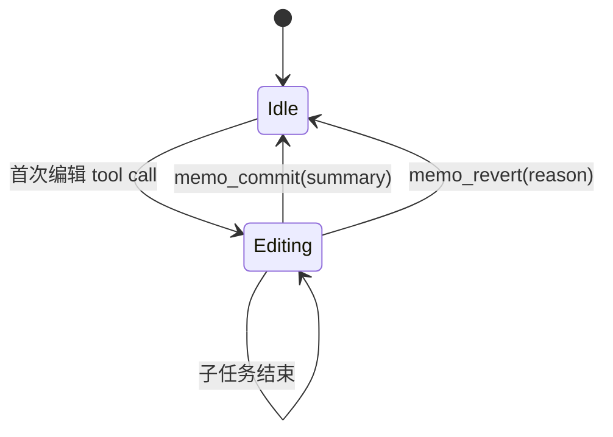

# Agent Memory Editing Architecture
## 设计文档 v0.1
**作者**: Atelia Team
**日期**: 2025-10-08
**状态**: Draft / Discussion

---

## 执行摘要

本文档定义了一套面向 LLM Agent 的**认知友好型编辑架构**，核心特性包括：
- **编辑状态管理**：显式的 idle/editing/committed 状态机
- **预览驱动交互**：每次编辑立即渲染 diff，延迟提交
- **递归任务栈**：支持嵌套子任务，自动压缩历史，构建思维树
- **字母索引**：用 A/B/C 代替数字，避免 0/1-based 混淆
- **记忆压缩**：commit/revert 时折叠中间步骤，只保留摘要

---

## 1. 核心动机

### 1.1 当前痛点
- **无状态编辑**：每次 tool call 立即生效，无法预览/撤销
- **上下文膨胀**：所有编辑细节都留在 chat history，干扰后续推理
- **认知负荷高**：LLM 需要手动追踪"我在第几步"、"尝试过什么"
- **错误成本大**：一旦替换错误，只能重新 memo_read 再操作

### 1.2 设计目标
- **可逆性**：任何编辑在 commit 前都可撤销
- **透明性**：LLM 始终能看到"当前状态 + 待定变更"
- **轻量级**：压缩历史后的 token 成本接近"直接编辑"
- **递归性**：支持"编辑过程中发现需要先完成子任务"的自然流程

---

## 2. 状态机设计

### 2.1 编辑会话生命周期



### 2.2 状态定义

#### Idle（空闲）
- **记忆内容**：最后一次 committed 的版本
- **可见视图**：完整记忆文本（可选带行号）
- **可用操作**：memo_read, memo_replace_*, memo_append

#### Editing（编辑中）
- **记忆内容**：base 版本 + pending changes 队列
- **可见视图**：
  ```
  📝 编辑会话 #3 (进行中)
  基准版本: 1234 字符

  待定变更：
  [A] 替换 "旧文本" → "新文本" (位置 234, +12 字符)
  [B] 删除 "过时章节" (位置 567, -89 字符)

  预览 (仅显示变更附近):
  ─────────────────────────
   220│ ## 核心功能
   221│ - 旧文本新文本
   222│ - 其他内容
  ─────────────────────────
   560│
   561│ [已删除 89 字符]
   562│
  ─────────────────────────

  💡 使用 memo_commit("完成功能描述更新") 提交
     或 memo_revert("发现逻辑错误") 撤销
  ```
- **可用操作**：继续编辑、memo_commit、memo_revert、memo_preview

#### 离开 Editing 时的动作
- `memo_commit(summary: string)`
  1. 应用所有 pending changes 到记忆（持久化为新的基线）
  2. 压缩 chat history：删除编辑期间的 tool call/result
  3. 插入一条摘要消息，例如：
     ```
     [编辑会话 #3 已提交]
     摘要: 完成功能描述更新
     变更: 2 处替换, +45 字符
     ```
- `memo_revert(reason: string)`
  1. 丢弃所有 pending changes，回复到进入 Editing 前的基线
  2. 压缩 chat history
  3. 插入一条摘要，例如：
     ```
     [编辑会话 #3 已撤销]
     原因: 发现逻辑错误，需要重新调研
     ```

---

## 3. 预览与索引系统

### 3.1 字母索引设计
- **匹配候选**：默认展示前 5 个候选并用 A-E 标记；如需查看更多，可通过 `show_all_matches` 之类的参数延伸到剩余字母（最多 26 个）
- **待定变更**：A-Z（每个编辑会话最多 26 个操作，对应待定变更列表）
- **优点**：
  - 无 0/1-based 歧义
  - 视觉区分度高
  - 易于语音/手写输入

**示例交互**：
```
Tool: memory_notebook_replace
Args: { "old_text": "result = 0", "new_text": "result = initial" }

返回：
找到 3 个匹配：
[A] 第 23 行：void Init() { int result = 0; }
[B] 第 67 行：void Process() { int result = 0; } ← 推荐
[C] 第 102 行：void Test() { int result = 0; }

请添加 match_id: "B" 确认选择
或使用 memo_commit_auto 让系统自动选择推荐项
```

> 默认只展示前 5 个候选（A-E）。若提示“还有 X 个未显示”，可以追加 `show_all_matches=true` 或更具体的锚点参数获取剩余条目。

### 3.2 Diff 渲染规则
- **简洁模式（默认）**：只显示变更前后各 3 行
- **完整模式**：显示整个变更区域
- **统计模式**：只显示 `+N/-M 字符` 和位置

**可配置参数**：
```json
{
  "preview_mode": "compact",  // compact | full | stats
  "context_lines": 3,
  "max_preview_length": 500
}
```

---

## 4. 递归任务栈

### 4.1 核心概念
- **任务 (Task)**：一个带目标的工作单元（如"修改配置文件"）
- **任务栈**：当前活跃任务的层级结构
- **思维树**：已完成任务的摘要树，用于建立"我做过什么"的整体印象

### 4.2 任务生命周期

```
开始任务：memo_begin_task("修改配置以启用新功能")
  ↓
执行编辑：memory_notebook_replace(...)
  ↓
发现依赖：memo_begin_task("先检查依赖版本")  ← 嵌套
    ↓
  解决依赖：memory_notebook_replace(...)
    ↓
  结束子任务：memo_commit("依赖版本已更新")  ← pop 子任务
  ↓
继续主任务：memory_notebook_replace(...)
  ↓
完成主任务：memo_commit("新功能配置完成")  ← pop 主任务
```

### 4.3 思维树可视化

**实时视图（渲染在每次 user 消息中）**：
```
📊 当前任务栈：
┌─ [主任务] 修改配置以启用新功能 (进行中)
│   ├─ ✅ 检查依赖版本 → 依赖版本已更新
│   ├─ 📝 更新配置参数 (当前)
│   └─ ⏳ 编写文档 (待办)
└─ (栈深度: 1)

🌳 已完成任务树（本次会话）：
- ✅ 调研现有方案
  ├─ ✅ 阅读文档 A
  └─ ✅ 阅读文档 B
- 📝 修改配置以启用新功能 (当前)
```

### 4.4 历史压缩策略

**压缩前**（chat history，~5000 tokens）：
```
User: 请修改配置
Assistant: 我先检查依赖版本
Tool: memo_read
Result: [完整配置文件 2000 字符]
Tool: memory_notebook_replace(...)
Result: 找到 3 个匹配...
Tool: memory_notebook_replace(match_id="B")
Result: 预览: ...
Tool: memo_commit("依赖版本已更新")
Result: 已提交
Assistant: 现在更新配置参数
Tool: memory_notebook_replace(...)
...
```

**压缩后**（~200 tokens）：
```
User: 请修改配置
[任务: 修改配置以启用新功能]
  ├─ ✅ 检查依赖版本 → 依赖版本已更新
  └─ 📝 更新配置参数 (当前预览)
      变更 [A]: 替换 "old" → "new" (位置 234)

💡 使用 memo_commit 或 memo_revert 继续
```

---

## 5. 工具接口设计

### 5.1 新增工具

#### `memo_begin_task(goal: string, parent_task_id?: string)`
- **功能**：开始一个新任务，压入任务栈
- **返回**：任务 ID + 更新后的任务栈视图
- **副作用**：在 chat history 插入任务节点标记

#### `memo_commit(summary: string, auto_pop_task?: bool)`
- **功能**：提交当前编辑会话
- **参数**：
  - `summary`：人类可读的变更摘要
  - `auto_pop_task`：是否同时结束当前任务（默认 true）
- **返回**：提交确认 + 更新后的记忆长度
- **副作用**：压缩 history，更新任务树

#### `memo_revert(reason: string)`
- **功能**：撤销当前编辑会话
- **返回**：撤销确认
- **副作用**：压缩 history，任务状态标记为失败

#### `memo_preview(format?: "compact" | "full" | "diff")`
- **功能**：查看当前待定变更的预览
- **返回**：格式化的 diff 视图

#### `memo_commit_auto()`
- **功能**：自动提交，使用默认摘要（基于变更内容生成）
- **适用场景**：简单的单步编辑

### 5.2 修改现有工具

#### `memory_notebook_replace / memory_notebook_replace_span`
- **新增参数**：
  - `match_id?: string`：字母索引（A-Z）
  - `preview_only?: bool`：仅预览不进入编辑状态
- **返回行为**：
  - 多匹配时：返回带字母索引的候选列表 + 进入编辑状态
  - 单匹配时：直接进入编辑状态 + 显示预览
  - `preview_only=true`：仅返回预览，不改变状态

### 5.3 请求 / 响应示例

**查找并进入编辑状态**

请求：
```json
{
  "old_text": "\"experimental\": []",
  "new_text": "\"experimental\": [\"X\"]",
  "search_after": "\"features\": {"
}
```

响应（裁剪后的关键字段）：
```json
{
  "status": "editing",
  "session_id": "sess-1742",
  "pending_changes": [
    {
      "change_id": "A",
      "position": 567,
      "preview": "\n  567|-    \"experimental\": []\n  567|+    \"experimental\": [\"X\"]\n"
    }
  ],
  "next_actions": [
    "memo_commit(summary)",
    "memo_revert(reason)",
    "memory_notebook_replace(..., match_id)"
  ]
}
```

**多匹配时的候选返回**

```json
{
  "status": "needs_match",
  "candidates": [
    { "match_id": "A", "line": 12, "context": "database.timeout: 30" },
    { "match_id": "B", "line": 45, "context": "api.timeout: 30", "recommended": true },
    { "match_id": "C", "line": 78, "context": "cache.timeout: 30" }
  ],
  "hint": "默认展示前 5 项，如需更多请设置 show_all_matches=true"
}
```

**提交编辑**

请求：
```json
{
  "session_id": "sess-1742",
  "summary": "启用实验性功能 X"
}
```

响应：
```json
{
  "status": "committed",
  "summary": "启用实验性功能 X",
  "applied_changes": 1,
  "new_length": 1239,
  "history_delta": { "messages_removed": 4, "tokens_saved": 2500 }
}
```

### 5.4 与现有 TextReplacementEngine 的衔接
- `TextReplacementEngine.Execute` 继续负责行文本查找与替换，只需扩展 `ReplacementRequest` 结构以携带 `match_id`（或 `anchor_occurrence`）。
- 新的编辑状态由外层的 `EditingSession` 管理；`Execute` 返回的文本不再直接写回记忆，而是作为 pending change 缓存。
- `memo_commit` 时再调用一次 `TextReplacementEngine`，以 `IsAppend=false`、带定位信息的方式批量应用所有 `PendingChange`，从而复用现有的查找/替换逻辑。
- `memo_preview` 可以直接调用 `Execute` 的“预览模式”（不写入 Memory，仅返回替换后的片段），避免重复实现差异计算。

---

## 6. 实现路线图

### 6.1 MVP：编辑状态与提交流程（预计 2-3 天）
- [ ] `EditingSession` 类——维护基线与 pending changes
- [ ] 基础 diff 渲染（紧凑模式）
- [ ] `memo_commit / memo_revert` 的最小实现与历史压缩钩子
- [ ] 单元测试覆盖：Idle ↔ Editing 转换、预览生成

> ✅ 交付物：单文件的延迟提交编辑工作流，支持手动 commit/revert。

### 6.2 短期增强：多匹配与任务栈（预计 4-5 天）
- Phase 2（多匹配改进）
  - [ ] `match_id` 参数 + 字母索引渲染（默认 A-E）
  - [ ] 智能默认选择 + `show_all_matches` 支持
  - [ ] 集成测试：多匹配 → 指定 match_id → commit
- Phase 3（任务栈与压缩）
  - [ ] `TaskStack` 结构 + `memo_begin_task`
  - [ ] Chat history 压缩引擎、思维树渲染
  - [ ] 嵌套任务、撤销流程测试

> 🟡 目标：降低多匹配歧义，同时让 Agent 能追踪“我正在做什么”。

### 6.3 后续探索：行号方案与体验优化（可选）
- Phase 4：行号/行 hash 桥接（预计 2 天）
  - 带行号的预览渲染、`line_key` 支持
  - 行 hash 校验避免陈旧引用
- Phase 5：持续体验优化
  - 自动摘要生成、冲突检测
  - 大文件性能、用户反馈闭环

> 🔭 这些工作在 MVP 成功后按需排期，彼此独立，可逐项取舍。

---

## 7. 设计决策记录

### Q1: 为什么不用标准 Git-style diff？
**A**: LLM 更适合读"结构化标记"而非 `+/-` 行。我们的 diff 格式优先考虑语义清晰度。

### Q2: 压缩历史会不会丢失重要信息？
**A**: 摘要保留关键决策点。如需详细追溯，可在 commit 前调用 `memo_export_session()` 导出完整日志。

### Q3: 任务栈深度有限制吗？
**A**: 建议不超过 3 层。更深的嵌套应该拆分为独立的顶层任务。

### Q4: 与传统 IDE 的 undo/redo 有何不同？
**A**: 我们不支持细粒度 undo，只支持"撤销整个编辑会话"。这更符合 LLM 的"一次性完成任务"思维模式。

---

## 8. 未来扩展

### 8.1 多文件编辑
当前设计聚焦单文件。未来可扩展为：
```
memo_begin_task("重构模块 A")
  ├─ file: config.json
  │   └─ 变更 [A]: ...
  └─ file: main.py
      └─ 变更 [B]: ...

memo_commit("重构完成")  ← 原子性提交所有文件
```

### 8.2 协作编辑
支持多个 Agent 并发编辑不同任务：
```
Agent A: [任务 1] 更新文档
Agent B: [任务 2] 修复 bug
→ 合并时检测冲突
```

### 8.3 语义搜索定位
结合向量数据库，支持"找到讨论性能优化的那一段"之类的模糊查询。

---

## 9. 参考资料

- [Claude Code Editing Patterns](internal)
- [ChatGPT replace_string_in_file](internal)
- [Git Interactive Rebase](https://git-scm.com/docs/git-rebase)
- [Obsidian Edit History](https://obsidian.md)

---

## 附录 A: 完整示例流程

### 场景：LLM 修改配置文件启用新功能

```
═══════════════════════════════════════════════════════════════════
[初始状态: Idle]
当前记忆: config.json (1234 字符)
═══════════════════════════════════════════════════════════════════

User: 请在配置文件中启用实验性功能 X

───────────────────────────────────────────────────────────────────
Assistant: 我需要先查看当前配置以确定正确位置

Tool: memo_begin_task
Args: { "goal": "启用实验性功能 X" }

Result:
✅ 任务 #1 已创建: "启用实验性功能 X"
📊 任务栈: [#1 启用实验性功能 X] (深度: 1)

───────────────────────────────────────────────────────────────────
Tool: memo_read

Result:
{
  "features": {
    "stable": ["A", "B", "C"],
    "experimental": []
  }
}

───────────────────────────────────────────────────────────────────
Assistant: 我需要在 experimental 数组中添加 "X"

Tool: memory_notebook_replace
Args: {
  "old_text": "\"experimental\": []",
  "new_text": "\"experimental\": [\"X\"]"
}

Result:
[状态转换: Idle → Editing]

📝 编辑会话 #1 (进行中)
基准版本: 1234 字符

待定变更：
[A] 替换 "\"experimental\": []" → "\"experimental\": [\"X\"]"
    位置: 567
    影响: +5 字符

预览：
─────────────────────────
 565│   "features": {
 566│     "stable": ["A", "B", "C"],
 567│-    "experimental": []
 567│+    "experimental": ["X"]
 568│   }
 569│ }
─────────────────────────

💡 使用 memo_commit("...") 提交或 memo_revert("...") 撤销

───────────────────────────────────────────────────────────────────
Assistant: 看起来正确，提交变更

Tool: memo_commit
Args: { "summary": "启用实验性功能 X" }

Result:
[状态转换: Editing --memo_commit--> Idle]

✅ 编辑会话 #1 已提交
摘要: 启用实验性功能 X
变更: 1 处替换, +5 字符
新记忆长度: 1239 字符

✅ 任务 #1 完成: "启用实验性功能 X"
📊 任务栈: (空)

🌳 本次会话已完成任务：
- ✅ 启用实验性功能 X

[历史压缩] 已删除 4 条中间消息，节省 ~2500 tokens

───────────────────────────────────────────────────────────────────
Assistant (最终): 已完成！配置文件已更新，实验性功能 X 现已启用。
```

### 场景：遇到多匹配 + 字母索引

```
User: 请将所有 timeout 从 30 改为 60

───────────────────────────────────────────────────────────────────
Tool: memory_notebook_replace
Args: {
  "old_text": "timeout: 30",
  "new_text": "timeout: 60"
}

Result:
[状态转换: Idle → Editing]

找到 3 个匹配：

[A] 第 12 行：database.timeout: 30
    上下文：# 数据库连接配置

[B] 第 45 行：api.timeout: 30 ← 推荐（基于上下文相关性）
    上下文：# API 调用配置

[C] 第 78 行：cache.timeout: 30
    上下文：# 缓存过期时间

💡 请指定 match_id 或使用 memo_commit_auto 接受推荐

───────────────────────────────────────────────────────────────────
Assistant: 我需要修改所有三处，先从第一个开始

Tool: memory_notebook_replace
Args: {
  "old_text": "timeout: 30",
  "new_text": "timeout: 60",
  "match_id": "A"
}

Result:
待定变更：
[A] 替换 "timeout: 30" → "timeout: 60" (第 12 行)

───────────────────────────────────────────────────────────────────
Tool: memory_notebook_replace
Args: {
  "old_text": "timeout: 30",
  "new_text": "timeout: 60",
  "match_id": "B"
}

Result:
待定变更：
[A] 替换 "timeout: 30" → "timeout: 60" (第 12 行)
[B] 替换 "timeout: 30" → "timeout: 60" (第 45 行)

───────────────────────────────────────────────────────────────────
Tool: memory_notebook_replace
Args: {
  "old_text": "timeout: 30",
  "new_text": "timeout: 60",
  "match_id": "C"
}

Result:
待定变更：
[A] 替换 "timeout: 30" → "timeout: 60" (第 12 行)
[B] 替换 "timeout: 30" → "timeout: 60" (第 45 行)
[C] 替换 "timeout: 30" → "timeout: 60" (第 78 行)

───────────────────────────────────────────────────────────────────
Tool: memo_commit
Args: { "summary": "统一超时时间为 60 秒" }

Result:
✅ 编辑会话已提交
变更: 3 处替换, +6 字符
```

### 场景：嵌套任务 + 发现依赖

```
User: 请添加新功能模块 Y

───────────────────────────────────────────────────────────────────
Tool: memo_begin_task
Args: { "goal": "添加新功能模块 Y" }

Result:
📊 任务栈: [#2 添加新功能模块 Y] (深度: 1)

───────────────────────────────────────────────────────────────────
Assistant: 我需要先检查依赖版本是否满足要求

Tool: memo_begin_task
Args: {
  "goal": "检查依赖版本",
  "parent_task_id": "2"
}

Result:
📊 任务栈:
┌─ [#2] 添加新功能模块 Y
│   └─ [#3] 检查依赖版本 (当前)
└─ (深度: 2)

───────────────────────────────────────────────────────────────────
[进行依赖检查和更新...]

Tool: memo_commit
Args: {
  "summary": "依赖版本已确认满足要求",
  "auto_pop_task": true
}

Result:
✅ 任务 #3 完成: "检查依赖版本"
📊 任务栈: [#2 添加新功能模块 Y] (深度: 1)

───────────────────────────────────────────────────────────────────
[继续主任务...]

Tool: memo_commit
Args: { "summary": "功能模块 Y 添加完成" }

Result:
✅ 任务 #2 完成: "添加新功能模块 Y"

🌳 本次会话已完成任务：
- ✅ 启用实验性功能 X
- ✅ 添加新功能模块 Y
  └─ ✅ 检查依赖版本
```

---

## 附录 B: 技术实现要点

### B.1 EditingSession 结构

```csharp
internal sealed class EditingSession {
    public string SessionId { get; }
    public string BaseContent { get; }
    public List<PendingChange> Changes { get; }
    public DateTime StartedAt { get; }

    public record PendingChange(
        string ChangeId,        // "A", "B", "C"...
        int Position,
        int OldLength,
        string NewText,
        string ContextBefore,
        string ContextAfter
    );

    public string RenderPreview(PreviewMode mode);
    public string ApplyChanges();
    public void AddChange(PendingChange change);
    public void RemoveChange(string changeId);
}
```

### B.2 TaskStack 结构

```csharp
internal sealed class TaskStack {
    private readonly Stack<TaskNode> _stack = new();
    private readonly List<TaskNode> _completed = new();

    public record TaskNode(
        string TaskId,
        string Goal,
        DateTime StartedAt,
        TaskStatus Status,
        string? Summary,
        List<TaskNode> Children
    );

    public enum TaskStatus {
        Active,
        Completed,
        Reverted
    }

    public string RenderTree();
    public void Push(string goal);
    public TaskNode Pop(string summary, bool success);
}
```

### B.3 历史压缩算法

```csharp
internal sealed class HistoryCompressor {
    public CompressedHistory Compress(
        IEnumerable<ChatMessage> messages,
        EditingSession session,
        string commitSummary
    ) {
        // 1. 识别编辑会话边界
        var sessionMessages = messages
            .SkipWhile(m => m.Timestamp < session.StartedAt)
            .TakeWhile(m => m.Type != MessageType.Commit);

        // 2. 提取关键信息
        var keyDecisions = ExtractDecisions(sessionMessages);

        // 3. 生成摘要节点
        return new CompressedHistory {
            Summary = commitSummary,
            Changes = session.Changes.Select(c => c.ToSummary()),
            KeyDecisions = keyDecisions,
            TokensSaved = CalculateTokensSaved(sessionMessages)
        };
    }
}
```

---

## 附录 C: 配置参数

### 全局配置

```json
{
  "editing": {
    "auto_preview": true,
    "max_pending_changes": 26,
    "preview_context_lines": 3,
    "preview_max_length": 500
  },
  "tasks": {
    "max_stack_depth": 3,
    "auto_pop_on_commit": true,
    "show_tree_in_prompt": true
  },
  "history": {
    "enable_compression": true,
    "compression_threshold": 5,
    "keep_key_decisions": true
  },
  "matching": {
    "auto_select_single_match": true,
    "smart_recommendation": true,
    "max_candidates_shown": 5
  }
}
```

---

## 附录 D: 开放问题

### Q1: 如何处理非常大的文件？
**当前想法**：
- 编辑会话只渲染"变更窗口"（前后各 N 行）
- 完整 diff 可按需通过 `memo_export_diff()` 获取
- 考虑引入"分块编辑"模式

### Q2: 多个 Agent 并发编辑同一文件？
**当前想法**：
- Phase 1 不支持，报错提示冲突
- Phase 2 可引入"编辑锁"或"分支"机制

### Q3: 如何与传统 Git 工作流集成？
**当前想法**：
- `memo_commit` 可选触发 `git commit`
- 任务树可映射为 Git 分支结构
- 待详细设计

---

## 变更日志

### v0.1 (2025-10-08)
- 初始设计文档
- 定义核心状态机
- 设计字母索引系统
- 规划递归任务栈
- 编写完整示例流程
