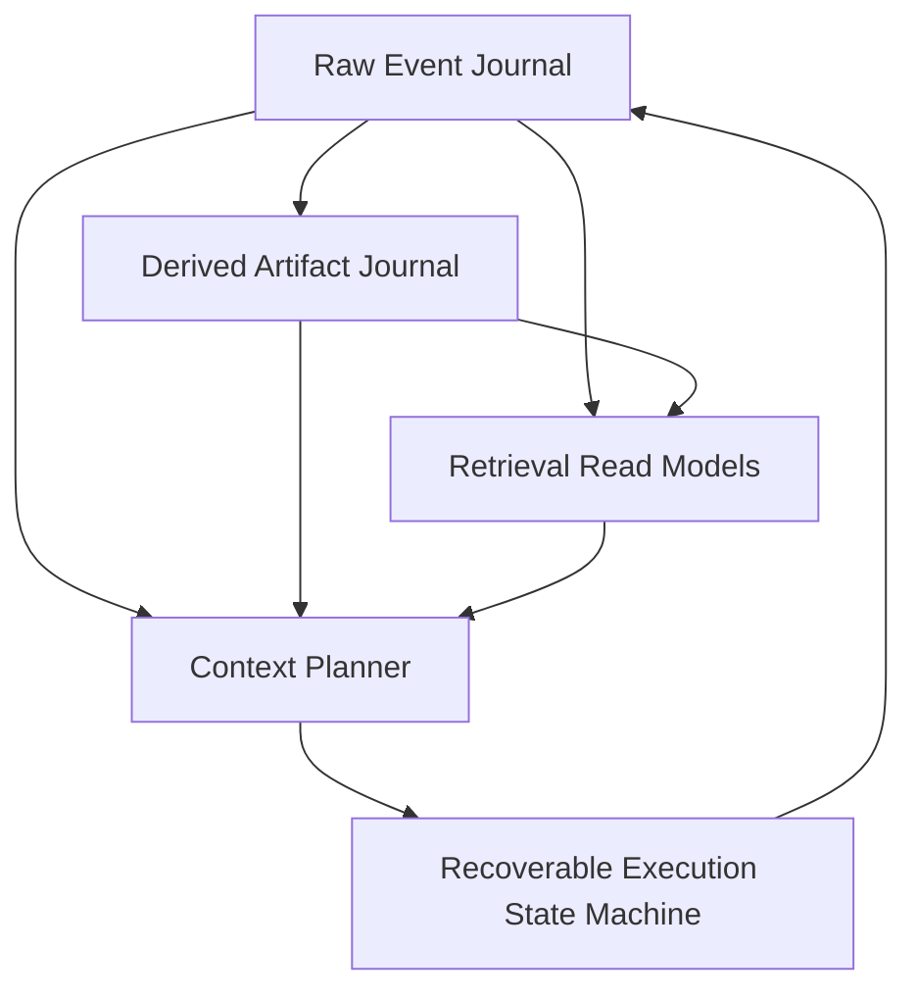
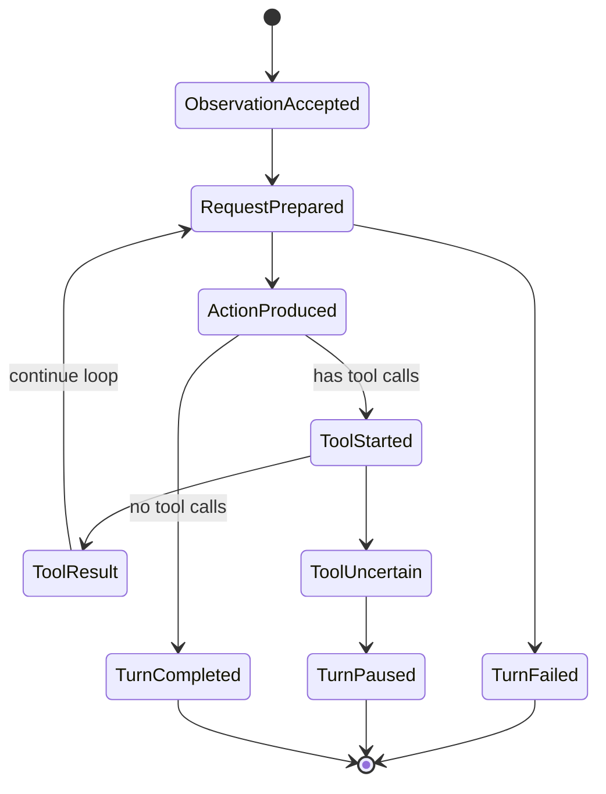

# ChatSession 事件源与长期上下文架构路线图

> **状态**：Architecture Baseline / Roadmap
> **日期**：2026-07-22
> **底层依赖**：[EventJournal 功能需求与粗粒度设计基线](../EventJournal/event-journal-requirements-and-design.md)
> **相关既有研究**：[Dynamic Logical Context Store for Long-Running Role-Play Agents](../Galatea/backlog/idea/dynamic-logical-context-store-for-long-running-role-play-agents.md)

## 1. 文档定位

本文记录 ChatSession / Galatea 从“StateJournal 当前工作态 + 定期压缩”演进到“不可变事件源 + 可重建派生产物 + 精确上下文规划 + 可恢复执行”的总体路线。

它回答：

- 哪些数据是长期事实源。
- Recap、Autobiography、World Understanding 等内容应如何建模。
- 每次 completion 的上下文如何动态选择并精确复现。
- tool-loop 如何逐步持久化并在崩溃后恢复。
- 全文、向量和图召回应放在哪一层。
- 如何分阶段替换当前 ChatSession/StateJournal 路径。

本文不是每种 payload 的最终 wire spec，也不要求首个实现会话建成完整 Memory OS。后续会话应从本文的阶段列表领取一个垂直切片，产出更窄的 Decision/Spec/实现与测试。

## 2. 当前问题

当前 ChatSession 以 StateJournal root 和 durable deque 表达会话工作态：

- 普通 turn 完成后整体 commit。
- compaction 用 Recap 替换旧消息前缀。
- ContextHeader / MemoryPack 表示当前应注入的压缩信息。
- StateJournal commit history 可以追溯旧状态，但它不是领域事件源。

这条路径已经验证了会话、回放、legacy recovery 与 Rewrite maintainer，但对长期自主 Agent 有四个结构性限制：

1. 原始体验与当前投影混在同一工作态中；compaction 的自然操作是改写当前 deque。
2. tool-loop 只在整轮结束后提交，中途崩溃无法精确判断 completion 或工具执行到了哪一步。
3. Recap、自传、世界理解等派生解释被当作“当前文本块”，缺少统一 provenance 与版本 lineage。
4. 上下文主要由固定 recent window 构造，难以在不同 artifact anchor、raw suffix 和动态召回之间做预算化选择。

下一代架构的目标不是给现有 deque 旁边补一份 raw log，而是重新划分事实源、解释层、投影层和执行状态。

## 3. 核心决策

### decision [S-CS-RAW-EVENTS-AUTHORITATIVE] Raw Events 是长期事实源

Agent 实际接收、生成和执行过的内容，以不可变 raw events 保存。compaction、摘要更新或上下文切换不得删除或改写 raw events。

### decision [S-CS-ARTIFACTS-DERIVED] Memory Artifacts 是派生解释

Recap、Autobiography、World Understanding、关系状态、开放线索等都是由 raw events 和既有 artifacts 推导出的版本化产物。它们可以被替换、废弃或重算，但不能冒充原始体验。

### decision [S-CS-PROJECTION-NOT-SSOT] MemoryPack 是 Context Projection

现有 `MemoryPack` 继续作为“本轮上下文需要的有序文本块投影”是有价值的，但它不再是长期记忆的唯一事实源。它应由选定的 artifact set 和其他固定配置 materialize。

### decision [S-CS-CONTEXT-PLAN-PERSISTED] 实际上下文选择必须持久化

每次 completion 前，系统必须保存精确 `ContextPlan` 和 canonical request。崩溃恢复不能仅凭“当前配置 + 当前 head”重新运行 planner，因为配置、索引和 token estimator 可能已经变化。

### decision [S-CS-EXECUTION-INCREMENTAL] 执行状态逐步事件化

Observation、completion request、assistant action、tool intent、tool result 和 turn completion 必须在各自边界逐步持久化。不能继续把整个 tool-loop 当成一个只在末尾 commit 的内存事务。

### decision [S-CS-INDEXES-REBUILDABLE] Retrieval Index 不进入正确性核心

全文、向量、实体图、时间索引和统计 read model 必须能从 raw events / artifacts 重建。索引损坏或丢失会降低召回能力，但不得改变历史事实或使 session 无法恢复。

## 4. 五层架构



五层职责如下：

| 层 | Canonical Data | 主要职责 |
|:---|:---------------|:---------|
| Raw Event Journal | 不可变 session events | 保存发生过什么、维持版本树与回放顺序 |
| Derived Artifact Journal | 带 provenance 的不可变 artifacts | 保存系统如何解释和压缩历史 |
| Retrieval Read Models | 可重建索引 | 按语义、实体、时间、关键词发现候选材料 |
| Context Planner | 持久化 ContextPlan | 在 token/cost/latency 预算内选择 exact context |
| Execution State Machine | 逐步执行事件 | 驱动 completion/tool-loop，并从任意持久边界恢复 |

这些层可以物理共用同一个 EventJournal store，也可以使用多个 store；逻辑上的权威边界不能因为物理共置而消失。

## 5. Raw Event Journal

### 5.1 角色

Raw Event Journal 保存“Agent 生命周期中确实发生过的事情”，包括外部输入、模型输出、工具交互和控制状态。它是审计、回放、迁移和所有派生分析的根。

EventJournal 只看到 bytes；`Atelia.ChatSession` 在 payload 中定义 versioned envelope 和 event kind。

### 5.2 建议的事件信封

后续 wire spec 应至少表达：

| 字段 | 含义 |
|:-----|:-----|
| `Schema` | ChatSession event schema id / version |
| `SessionId` | 逻辑 session 身份；单 store 单 session 时仍可保留用于导出 |
| `EventKind` | 领域事件判别器 |
| `CorrelationId` | 同一 turn / maintenance job / tool-loop 的关联 id |
| `CausationEvent` | 直接导致本事件的上层事件，可选 |
| `OccurredAtUtc` | 外部时间，若业务需要；不能替代 Parent 顺序 |
| `Body` | event-kind-specific payload |

`EventAddress` 已经提供 store 内唯一身份和 Parent 顺序，不应再用时间戳或自增 ordinal 冒充因果顺序。

### 5.3 首轮 EventKind

建议按“实际发生的边界”建模，而不是按当前方法名照搬：

| EventKind | 含义 |
|:----------|:-----|
| `session-created` | session identity、初始 system/config |
| `observation-accepted` | 外部 observation 已进入 session |
| `context-plan-committed` | 已选定本次 completion 的 exact inputs |
| `completion-request-prepared` | canonical request 与 attempt identity 已持久化 |
| `assistant-action-produced` | completion response 已接收并规范化为 ActionMessage |
| `tool-execution-started` | 工具副作用前已保存 intent 与 idempotency key |
| `tool-result-observed` | 工具返回结果已持久化 |
| `tool-execution-uncertain` | 无法判断副作用是否发生，需要查询或人工处理 |
| `turn-completed` | 本轮达到无未处理 tool call 的完成状态 |
| `turn-failed` | 本轮以可诊断失败结束 |
| `turn-paused` | 本轮等待人工、资源或外部事件 |
| `session-configuration-changed` | system prompt、model policy 等持久配置发生变化 |

`completion-request-prepared` 与 `context-plan-committed` 可以在 MVP 合并为一个 payload；概念上仍应区分“选择了什么”和“实际发给 completion client 的 canonical bytes”。

### 5.4 Raw 与 operational event 的边界

“Raw”不是只指用户和 assistant 可见文本。为了恢复真实执行过程，以下内容也属于事实：

- 模型返回了哪些 tool calls。
- 哪个调用已开始执行。
- 工具返回了什么，或为何状态不确定。
- 哪次 completion attempt 失败、重试或被放弃。

provider-native 临时字段不应未经筛选整包回写。Canonical event schema 只保存后续回放、审计和恢复真正需要的信息；需要 HTTP 法证时可另存 provider call log。

### 5.5 分支、rewind 与替代未来

ChatSession branch 直接映射到 EventJournal branch：

- 正常会话沿当前 branch 追加。
- rewind 不删除 Event，而是移动 ref 或从历史 Event 创建新 branch。
- reroll 从同一个 Observation/ContextPlan 附近产生替代 AssistantAction 分支。
- 被放弃的未来仍可通过 reflog 或显式 branch 保留。

上层 UI 必须区分“当前有效父链”和“曾发生但当前不可达的旁支”。

## 6. Derived Artifact Journal

### 6.1 统一概念

以下内容统一称为 `DerivedContextArtifact`：

- Recap / rolling summary。
- First-Person Autobiography。
- World Understanding。
- Scene / episode summary。
- Relationship state。
- World facts / known unknowns。
- Open threads / promises / unresolved hooks。
- Continuity、style 或 identity constraints。

这些 artifact 的内容形状可以是 Markdown、JSON、图节点或其他二进制格式。统一的是 provenance 与生命周期，不是正文 schema。

### 6.2 Artifact 最小字段

建议 schema 至少包含：

| 字段 | 含义 |
|:-----|:-----|
| `ArtifactKind` | 稳定 kind，例如 `autobiography` |
| `ProfileId` | 具体维护 profile / policy id |
| `Producer` | analyzer / model / code version |
| `ProducerFingerprint` | prompt、model、关键配置与 codec 的稳定 fingerprint |
| `SourceRawHead` | 生成时观察到的 raw branch head |
| `SourceRanges` | 实际吸收的 raw EventAddress 区间或集合 |
| `InputArtifacts` | 本次读取的旧 artifact 地址 |
| `PreviousArtifact` | 同 lineage 的上一版，可空 |
| `Content` | 不透明 artifact body |
| `Invocation` | 可选 completion / analyzer audit 摘要 |
| `Status` | produced / rejected / superseded 等领域状态 |

Artifact 本身 append-only。所谓“最新版”由 lineage、ArtifactSet 或可重建索引确定，不通过原地更新 `EventAddress -> mutable value` 字典实现。

### 6.3 Provenance 不变量

任何进入长期上下文的 artifact 都应能回答：

1. 它由哪个 profile 和 producer 生成。
2. 它读取了哪个 raw head、哪些 raw ranges。
3. 它基于哪一版旧 artifact。
4. prompt/model/config 是否与当前版本相同。
5. 它是否已被后续 artifact 取代。

这使 analyzer 升级后可以重建，并允许人工比较“同一原始经历的不同解释”。

### 6.4 Coherent Artifact Set

Autobiography 与 World Understanding 可能并行生成，但一次上下文不应偶然混用不同 source head 的半套结果。

建议增加 `ArtifactSetCommitted`：

- 引用一组完整 artifact addresses。
- 记录共同或各自的 source raw head。
- 记录 set profile / purpose。
- 只有 set commit 成功后，Context Planner 才把整组作为候选。

若其中一个 maintainer 失败，旧 active set 保持可用；已成功写出的单个 artifact 可以留作诊断或未来复用，但不自动进入当前 coherent set。

### 6.5 MemoryPack 的新角色

`MemoryPack` 变为 materialized context view：

```text
selected ArtifactSet
+ pinned/manual context blocks
+ rendering profile
-> MemoryPack
-> ContextHeader projection
```

现有 `RewriteMemoryBlockMaintainer` 可作为首批 artifact producer 继续使用：输入旧 artifact + raw range，输出完整新 artifact。变化在于结果先写入 Artifact Journal 和 ArtifactSet，而不是只覆盖一个当前 block。

## 7. Context Planner

### 7.1 Planner 的问题

真正要优化的不是“最近保留多少条”，而是：在固定预算下，哪组 artifact anchor、raw suffix 和召回材料最能支持下一次行动。

基础候选策略：

1. 最新 coherent artifact set + 最短 raw suffix。
2. 更早 artifact set + 更长 raw suffix。
3. 最新 artifact set + 当前任务相关 recalled artifacts / raw ranges。
4. 无 artifact 的纯 raw 回放，用于 bootstrap、审计或小历史。

Planner 应比较信息完整性、token、费用、延迟和 staleness，而不是永远在固定阈值切“前一半”。

### 7.2 ContextPlan

建议持久化：

```csharp
public sealed record ContextPlan(
    EventAddress RawHead,
    EventAddress? ArtifactSet,
    EventAddress? RawStartExclusive,
    EventAddress RawEndInclusive,
    IReadOnlyList<EventAddress> RecalledItems,
    string RenderingProfileId,
    string ModelProfileId,
    string PlannerFingerprint,
    ulong EstimatedTokens,
    ContextBudgetBreakdown Budget,
    string SelectionReason
);
```

精确字段后续可调整，但必须固定四类事实：

- planner 基于哪个 raw head 作出决定。
- 选择了哪组 artifacts 和 raw range。
- 选择了哪些动态召回项。
- 使用哪版 planner、rendering、model、token、retriever 与 ranker policy。

### 7.3 Exact Request Manifest

只保存 ContextPlan 仍不足以精确恢复，因为 renderer、prompt template 或 serializer 可能升级。`CompletionRequestPrepared` 应保存：

- exact canonical `CompletionRequest`，或可逐字节重建它的完整 manifest。
- request hash。
- completion surface / model / connection identity。
- attempt id 与 correlation id。
- 关联 ContextPlan event。

推荐首版直接保存 canonical request body，避免恢复时重新执行 planner/renderer。provider API adapter 仍可在发送时重新生成 provider-native wire request。

权威边界必须单一：

- exact canonical request / request manifest 是崩溃恢复和重发的 Canonical Source。
- `ContextPlan` 是选择过程的结构化解释与审计记录，不得替代 exact request 参与恢复重建。
- `PlannerFingerprint` 应覆盖 planner recipe、token policy、retriever/ranker 配置及其关键版本；它用于解释和复现实验，不改变“恢复直接使用已持久化 exact request”的规则。

### 7.4 Token Budget

Planner 至少区分：

- fixed system / identity budget。
- artifact budget。
- recent raw suffix budget。
- dynamic recall budget。
- tool schema budget。
- expected completion output reserve。

当前 `threshold-tokens = 24000` 可继续作为触发 artifact maintenance 的实验参数，但不应成为长期存储格式或唯一切分规则。

### 7.5 选择结果也是事实

Retrieval index 可以重建，查询结果却可能因模型、索引版本或时间变化。凡是实际进入 completion request 的 recalled item，都必须写入 ContextPlan / request manifest。这样未来能够解释模型为什么在当时看到了这些材料。

## 8. 可恢复 Execution State Machine

### 8.1 状态流



每条箭头都由已持久化 Event 驱动。恢复时读取 branch head 和最近未闭合 correlation id，即可确定下一合法动作。

### 8.2 Completion 恢复

发送请求前先写 `completion-request-prepared`。可能的崩溃窗口：

- prepared 前崩溃：安全地重新规划。
- prepared 后、发送前崩溃：发送已保存 request。
- 发送后、响应持久化前崩溃：响应是否生成可能不确定。

对最后一种情况：

- provider 支持 idempotency / result lookup 时，用 attempt id 查询或重试。
- provider 不支持时，记录旧 attempt 为 abandoned/uncertain，再创建新 attempt。
- 不得把新 completion 假装成旧 attempt 的同一响应。

completion 通常没有外部业务副作用，但会产生费用，因此 attempt history 仍应保留。

### 8.3 Tool 执行协议

工具调用至少分三步：

1. 持久化 `tool-execution-started`，包含 tool call、validated arguments、operation id / idempotency key。
2. 执行工具。
3. 持久化 `tool-result-observed` 或 `tool-execution-uncertain`。

operation id 应由 session / turn / tool call identity 确定性产生，不能每次恢复随机生成。

### 8.4 Exactly-Once 边界

Journal 只能保证 intent 和观察结果可恢复，不能单独保证外部世界 exactly-once。

工具应按能力分级：

| Tool 能力 | 恢复策略 |
|:----------|:---------|
| 原生 idempotency key | 使用同一 key 安全重试 |
| 可按 operation id 查询状态 | 先查询，再决定补写结果或重试 |
| 事务性本地工具 | journal 与本地事务按专门协议协调 |
| 非幂等且不可查询 | 标记 `uncertain`，暂停并请求人工/领域补偿 |

系统绝不能在 crash 后盲目重试“付款、发送消息、删除资源”等非幂等工具。

### 8.5 TurnCompleted 的意义

`turn-completed` 是领域完成标记，不是此前所有 events 的聚合存储。它可记录最终 Action 地址、工具结果范围和状态摘要，但 raw event 仍逐条保留。

## 9. Dynamic Retrieval

### 9.1 独立 Read Path

动态召回不属于 `IMemoryBlockMaintainer`。Maintainer/producer 在写入与巩固路径生成 artifacts；Retriever 在每次 ContextPlan 前从 read models 选择候选材料。

未来可根据真实后端定义 `IMemoryRetriever` 或 `IContextMemorySource`，但应先完成一个端到端 backend，再固化公共接口。

### 9.2 可组合索引

长期 Role-Play / Agent memory 不应押注单一向量库：

- 全文 / FTS：专有名词、代码、原话、路径和精确事实。
- 向量：语义相似的经历与主题。
- 时间索引：最近、某一时期、事件区间。
- Entity / relation graph：人物、关系、承诺、项目、地点。
- Artifact lineage index：查同 kind 最新版本、source head 与 supersession。
- Open-thread index：尚未闭合的问题、计划和承诺。

候选可由多个 retriever 汇合，再由 ranker / planner 在预算内选择。索引只保存 address 和派生特征，不复制成为新的事实源。

### 9.3 Rebuild 与版本

每个 index 应记录：

- index schema/version。
- source raw/artifact high-watermark。
- embedding/model/tokenizer fingerprint（若适用）。
- rebuild 状态与错误。

索引落后时系统可以降级到 recent raw + artifacts；不能因向量库不可用而无法恢复基本会话。

## 10. Artifact Maintenance 调度

### 10.1 Cursor，而不是删除前缀

每个 artifact profile 保存自己的 source cursor：

- 上一版吸收到哪个 raw Event。
- 本轮计划吸收哪个范围。
- 生成结果对应哪个 source head。

cursor 必须在 source branch / raw Parent lineage 的作用域内解释，不是 store 级全局 ordinal。发生 rewind、reroll 或从历史 Event 分叉后，新 branch 必须从该 lineage 上可达的 artifact/cursor 起步；另一个 branch 上更“靠后”的 cursor 不能直接跳过当前 branch 尚未吸收的 raw events。

“即将滑出上下文”仍是触发维护的好时机，但维护完成后不删除 raw prefix，只推进 artifact lineage / active set。

### 10.2 触发条件

调度器可以组合：

- context token pressure。
- 未吸收 raw token / event 数量。
- artifact age / staleness。
- scene 或 episode 边界。
- turn idle 时间。
- 显式人工请求。
- profile-specific high watermark。

不同 artifact kind 不必同频更新。World Understanding、自传、开放线索和向量索引可以有独立 cursor 与成本策略。

### 10.3 并行与过期结果

producer 可以基于同一 `SourceRawHead` 并行运行。完成时：

- 结果始终可以作为带 provenance 的 artifact 保存。
- 只有满足 ArtifactSet policy 的组合才能成为 active set。
- raw branch 已前进不自动使结果无效；它只是覆盖到较早 head，Planner 需要追加更长 raw suffix。
- 不得把 artifact 的 source head 偷换成 producer 完成时的最新 head。

## 11. StateJournal 与现有代码的迁移定位

### 11.1 StateJournal 的后续角色

新架构中，StateJournal 不再作为 ChatSession 长期历史的主导 SSOT。它仍可用于：

- 早期迁移期的现有 session 读取。
- 可丢弃、可重建的 materialized projection。
- 适合对象图事务的其他领域状态。

不应长期维持“EventJournal raw history 与 StateJournal message deque 双写且都自称权威”的状态。迁移完成后必须明确唯一事实源。

### 11.2 现有 Memory substrate 的复用

以下资产继续有价值：

- `MemoryPack` / `MemoryPackDraft`：上下文投影。
- `MemoryRewriteProfile`：artifact producer 配置。
- `RewriteMemoryBlockMaintainer`：短文本 artifact 的低成本 producer。
- `MemoryMaintenanceOrchestrator`：同 snapshot 并行生成结果并形成 coherent update 的原型。
- `HistoryWindowSplitPolicy`：迁移期与 backtest 基线，不再是最终 Planner 的唯一策略。
- legacy upgrade export / importer：旧 session 到 raw events 的迁移输入。

需要改变的是持久化归属和 provenance，而不是把已验证的 Rewrite 执行器推倒重写。

### 11.3 Compaction 的新语义

现有 compaction 是：

```text
messages = recap + recent suffix
```

新架构中它被拆为：

```text
raw events 保持不变
artifact producer 追加 recap/artifacts
Context Planner 选择 artifact anchor + raw suffix
```

因此“compact”不再是 destructive history mutation，而是生成新解释并改变 context projection。

## 12. 分阶段路线图

### CS-0：领域 Schema 与 Replay Contract

产出：ChatSession event envelope、首批 EventKind、版本演进规则、事件到当前 projection 的纯 replay reducer。

验收：

- 给定 event sequence，可确定性重建当前 messages/config/execution status。
- 未知 schema/version fail-fast 或按明确兼容规则跳过。
- reducer 不访问 LLM、工具或外部索引。

### CS-1：Raw EventJournal 垂直切片

依赖：EventJournal EJ-0 至 EJ-3。

产出：创建 session、追加 observation/action、读取 head、顺序 replay、branch fork。

验收：

- 一个无工具 turn 可写入并 reopen。
- 原始事件不会因投影变化消失。
- 从历史 Event 创建 branch 后可产生替代未来。

### CS-2：Legacy Import 与 Projection 对照

产出：把现有 `chat-session-legacy-upgrade-export.json` 导入 raw events；用 reducer 生成与旧 repo 等价的可见历史。

验收：

- `cyber-copy-upgraded` 的 observation/action/recap 顺序可对照。
- legacy-inferred metadata 继续保留来源标记。
- 导入不修改旧 repo。

### CS-3：可恢复的无工具 Completion

产出：最小 raw-only `ContextPlan` 形状、canonical request 恢复合同、completion attempt、Action 和 TurnCompleted 逐步落盘。本阶段只选择固定前缀与 raw suffix，不设计 artifact anchor、retrieval 候选比较或高级预算策略。

验收：

- 在 request 前后、response 前后注入崩溃，reopen 后状态明确。
- 已准备 request 不因配置变化被悄悄重建。
- duplicate attempt 有不同 identity 和可审计原因。

### CS-4：可恢复 Tool Loop

产出：tool started/result/uncertain 事件、idempotency contract、恢复驱动器。

验收：

- 幂等工具在每个 failpoint 后可安全恢复。
- 可查询工具先 reconcile 再行动。
- 非幂等不可查询工具进入 paused/uncertain，不盲重试。
- 多轮 tool calls 后仍能确定性 replay 到相同 loop state。

### CS-5：Artifact Journal 与现有 Rewrite Profiles

产出：Artifact schema、lineage、ArtifactSetCommitted；把 Autobiography 与 World Understanding 写入 artifact store。

验收：

- 每个 artifact 可追溯 raw range、旧 artifact、profile 和 invocation。
- 两个 maintainer 只在 coherent set 完成后一起激活。
- producer 失败不破坏上一 active set。
- MemoryPack 可由 artifact set materialize。

### CS-6：Context Planner v1

产出：在 CS-3 已锁定的 `ContextPlan` / exact request 恢复合同上，增加 artifact anchor、raw suffix、retrieval 候选比较、预算分配与可解释选择。CS-6 不重新定义 canonical request 的恢复权威性。

验收：

- 能在“最新 artifact + 短 suffix”和“旧 artifact + 长 suffix”间做可解释选择。
- token budget 分项可审计。
- 同一已提交 plan 在软件配置变化后仍可复现原 request。

### CS-7：Retrieval Read Models

产出：先实现一个真实后端，建议从 SQLite FTS 或简单 entity/open-thread index 开始；随后再评估向量与图。

验收：

- 删除索引后可从 journal 重建。
- 索引不可用时 planner 可降级。
- 实际召回地址进入 ContextPlan。
- backtest 能比较无召回与有召回的上下文质量/成本。

### CS-8：切换权威源与清理旧路径

产出：新 session 默认 EventJournal；旧 StateJournal session 只读迁移；删除长期双写和 destructive compaction 主路径。

验收：

- 新 session 生命周期不依赖 StateJournal message deque。
- migration 有校验报告和可回滚输入备份。
- 旧 exporter / diagnostics 仍能读取归档数据。
- 文档明确 StateJournal projection 是否保留及其可重建性。

## 13. 每个后续会话的交付模板

为避免多会话递归推进时重新扩大范围，每个任务应说明：

1. **所属阶段**：例如 `EJ-2` 或 `CS-4`。
2. **输入文档**：引用本文与更窄的 Decision/Spec。
3. **唯一核心假设**：本次改动试图验证什么。
4. **持久化边界**：哪些 bytes/events 成为新的 Canonical Source。
5. **失败矩阵**：至少覆盖写入前、写入后、flush 前、flush 后。
6. **兼容策略**：新项目早期优先彻底重构，不默认保留兼容 wrapper。
7. **可执行验收**：focused tests、reopen、replay、failpoint 或 backtest。
8. **未解决问题**：只记录，不在任务外顺手扩张。

推荐一次会话只闭合一个可运行垂直切片。例如“Observation → RequestPrepared → Action → reopen replay”优于一次性创建十几个空接口。

## 14. 开放问题

### 14.1 近期必须决定

1. ChatSession event envelope 的 exact schema 与 codec。
2. raw event、artifact 和 ref 是共用一个 EventJournal store，还是每 session / 每类 journal 分开。
3. ArtifactSet 的一致性规则与 profile identity。
4. canonical CompletionRequest 的持久化形状及敏感信息处理。
5. tool operation id 的生成规则和工具能力声明。
6. replay reducer 的状态模型，特别是未完成 turn 和并行 tool calls。
7. legacy event source 到新 EventKind 的映射。

### 14.2 有真实负载后再决定

1. 向量数据库、图数据库或混合 retrieval backend。
2. artifact 自动 supersession / confidence 模型。
3. 多 Parent merge 与跨 branch artifact 复用。
4. 多 session 共用 knowledge artifacts。
5. EventJournal GC/repack 与冷存储。
6. planner 学习型 ranking、成本模型和自动评测。
7. provider-side request/result lookup 的统一抽象。

## 15. 架构成功标准

当路线完成到 Context Planner 与可恢复 tool-loop 时，系统应具备以下性质：

- 任意 compaction 或 maintainer 都不会抹去原始经历。
- 任意 artifact 都能追溯到 raw source 和 producer。
- 任意 completion 都能回答“当时到底看到了什么”。
- 任意 tool-loop 崩溃都能落入明确的可继续、可查询、失败或 uncertain 状态。
- rewind / reroll 通过 branch 表达，不靠删除历史伪造过去。
- retrieval index 全部丢失后，session 仍可从 journals 恢复基本运行。
- 新 maintainer、retriever 或模型版本可以重算解释层，而不改写 raw truth。

这组性质比“当前 prompt 是否更聪明”更重要：它们构成长期自主 Agent 能持续演化而不失去可追溯性的工程地基。
