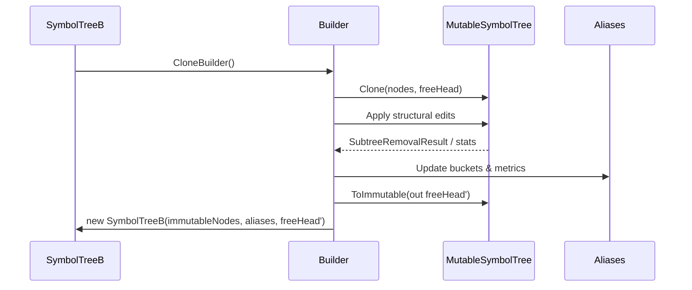

# SymbolTree Node Structure Extraction Plan

## 背景
`SymbolTreeBuilder` 当前承担节点存储、freelist 管理、命名空间/类型拓扑、别名桶维护以及调试诊断等多项职责，代码体量超过一千行。结构性操作（如子节点遍历、freelist 回收、命名空间链构建）与别名逻辑、增删策略交织在一起，带来如下问题：

- 边界模糊：结构相关代码散落在整个类中，难以单独测试或重用。
- 认知负担高：修改任一节点操作都需要理解整份 Builder。
- 风险隔离不足：结构层 bug 容易与别名或 delta 逻辑互相污染，增加排查难度。
- 演进阻力大：想引入 Copy-on-Write、并行构建等优化时，没有清晰的结构层可供替换。

## 目标
- 将“节点结构”相关职责抽离到单独的内部类型，使其成为维护节点树与 freelist 的唯一入口。
- 形成清晰的结构层 API，Builder 聚焦于 delta 应用、别名维护与统计。
- 提升可测试性：针对结构层编写单元测试（freelist、祖先/子节点定位、空 namespace 级联删除等）。
- 为后续结构持久化、Copy-on-Write、并行构建预留扩展点。

## 非目标
- 不在本次重构中改写别名维护策略或引入新数据结构。
- 不立即替换 `NodeB` 的存储形态（初期仍使用 `List<NodeB>` 作为工作副本）。
- 不改变现有调试入口（`DebugUtil` 等），只调整其调用位置。

## 设计细节

### 1. 类型布局与职责
```mermaid
digraph G {
  Builder [label="SymbolTreeBuilder\n(Delta orchestration, alias coordination)"];
  Structure [label="MutableSymbolTree\n(Node store + freelist + namespace ops)"];
  Aliases [label="Alias dictionaries\n(Exact / NonExact)"];
  Builder -> Structure
  Builder -> Aliases
}
```

- `MutableSymbolTree` 提供纯结构操作，保持对节点数组与 freelist 的独占所有权。
- 别名字典与结构层解耦；Builder 根据结构层返回的结果更新别名桶、统计信息与调试输出。
- 访问节点序列需通过结构层提供的受控迭代器/结果对象，禁止直接操纵底层 `List<NodeB>`。
- 命名约定：`Ensure*` 表示“若不存在则创建”，`TryFind*` 通过 `out` 返回索引并返回 `bool`，`Get*` 必须存在，否则抛出异常。
- 命名空间规划：后续计划将构建期类型聚合于 `CodeCortexV2.Index.SymbolTreeInternal.Mutable` 命名空间，便于与查询期快照（`SymbolTreeB`）及潜在别名模块区分职责。
- 命名空间落地清单：
  - `CodeCortexV2.Index.SymbolTreeInternal.Mutable`：结构层主体类型（`MutableSymbolTree`、`MutableNodeCursor`、`MutableTraversalStack` 等）。
  - `CodeCortexV2.Index.SymbolTreeInternal.Diagnostics`：结构层健康监控、调试断言协作类型（`StructureHealthMonitor`、`SymbolTreeIntegrityReport`）。
  - `CodeCortexV2.Index.SymbolTreeInternal.Legacy`：迁移期间的过渡包装和兼容入口（Phase 2 完成后移除）。
  - 命名空间调整需同步更新计划中的 `docs/CodeCortex/Namespace_Map.md` 并在 PR 描述列出影响范围。

### 2. 所有权与生命周期
- **创建阶段**：
  - `MutableSymbolTree.CreateEmpty()`：构建空索引（含根命名空间）。
  - `MutableSymbolTree.Clone(ImmutableArray<NodeB> snapshot, int freeHead)`：从不可变快照克隆到工作副本，所有权从快照转移到 Builder。
- **使用阶段**：Builder 在 `WithDelta` 内持有结构层的唯一引用，所有结构性修改通过其公开 API 完成。
- **完成阶段**：
  - `ImmutableArray<NodeB> MutableSymbolTree.ToImmutable(out int freeHead)`：将内部 `List<NodeB>` 转回不可变数组，并输出新的 freelist 头；调用后结构层转入只读状态。
  - 结构层通过返回值（如 `SubtreeRemovalResult`）或统计对象上报 `_freedThisDelta` / `_reusedThisDelta` 等数据，避免跨层字段共享。
- **扩展空间**：未来若实现 Copy-on-Write，可在 `Clone`/`ToImmutable` 中复用未修改的段。

### 3. API 草案
- `ref readonly NodeB GetNode(int nodeId)`：只读访问节点；调用方需保证索引有效。
- `bool TryFindChildByNameKind(int parentId, string name, NodeKind kind, out int childId)`：无副作用查询。
- `bool TryFindTypeChild(int parentId, string name, out int childId)`：类型限定查询，过滤历史遗留占位节点。
- `int EnsureNamespaceChain(ReadOnlySpan<string> segments, Func<string[], SymbolEntry> entryFactory)`：逐段创建缺失命名空间节点并返回末尾索引。
- `int NewChild(int parentId, string name, NodeKind kind, SymbolEntry? entry)`：在 freelist/尾部分配新节点。
- `void DetachNode(int nodeId)` / `void ReleaseNode(int nodeId)` / `bool TryPopFreeNode(out int nodeId)`：维护 freelist 与父子链的完整性。
- `SubtreeRemovalResult RemoveTypeSubtree(int rootId)`：返回被删除节点 ID 列表、释放计数及父节点信息，供 Builder 执行别名清理与级联逻辑。
- `SubtreeRemovalResult` 由结构层在遍历过程中完成去重（复用线程局部 `HashSet<int>` 或对象池），向上层提供零重复的节点集合以保持别名操作幂等。
- `SubtreeRemovalResult` 需要暴露度量字段与状态标记：
  - `ImmutableArray<int> RemovedIds`（删除节点 ID）、`int FreedCount`（入 freelist 数）、`int VisitedCount`（遍历节点数）。
  - `bool RequiresAliasScan`：当结构层检测到别名索引可能不同步时置为 `true`，Builder 根据环境变量决定是否触发兜底扫描。
  - `ImmutableArray<IntegrityViolation>` `IntegrityViolations`：记录在删除过程中发现的不变量破坏，供健康监控消费。
  - `DocId? SuspectedDocId`：若 `RequiresAliasScan` 为 `true`，提供可选 DocId 以缩小兜底扫描范围。
  - 以上字段在 DEBUG 构建下需要通过断言确保一致性（例如 `FreedCount <= RemovedIds.Length`）。
- `IEnumerable<int> EnumerateAncestors(int startId, NodeKind stopKind)`：用于回溯命名空间或类型祖先链。
- `bool HasMatchingDescendant(int nodeId, string targetDocId)`：保留当前兼容行为，集中到结构层方便测试。

### 4. 结构不变量契约
结构层需要维护以下核心不变量，并在 DEBUG 构建下通过断言快速暴露违规：

1. **父子一致性**：若 `node.Parent >= 0`，则其父节点的 `FirstChild` 链表必须包含该节点。
2. **Freelist 隔离性**：`node.Parent == FreeParentSentinel` 的节点不得出现在任何 `FirstChild` 链中。
3. **类型节点完整性**：`NodeKind.Type` 节点必须具备非空 `Entry` 或至少一个子节点。
4. **根节点稳定性**：索引 `0` 始终为根命名空间，`Parent == -1` 且不可释放。
5. **删除契约稳定性**：`SubtreeRemovalResult` 必须满足上述度量约束；当检测到 `IntegrityViolations` 时，结构层需要立即输出 `DebugUtil.Print("SymbolTreeIntegrity", ...)` 并在 DEBUG 构建下触发断言。

### 5. Builder 集成流程


流程保证数据流单向：结构层不直接操作别名字典，Builder 也不会触碰结构层内部存储，实现关注点分离。

### 6. Copy-on-Write 预留路线
1. 将内部容器替换为 `ImmutableArray<NodeB>.Builder` 或自定义 `struct Span<NodeB>`，记录被修改的段。
2. 在 `Clone` 阶段标记“借用”源快照的区间，首次写入时再分配新内存。
3. 在 `ToImmutable` 阶段复用未修改的区间，降低分配与拷贝成本。
4. 引入 `NodeHandle`（包装索引）便于未来跨内存布局迁移。

## 迁移阶段
- **Phase 1a（纯查询迁移）**：引入 `MutableSymbolTree` 骨架，迁移 `TryFindChildByNameKind`、`TryFindTypeChild`、`FindNearestNamespaceAncestor` 等无副作用方法。
- **Phase 1b（节点与 freelist 迁移）**：迁移 `NewChild`、`DetachNode`、`TryPopFreeNode`、`ReleaseNode`，引入 `SubtreeRemovalResult`。
- **Phase 1c（命名空间链迁移）**：迁移 `EnsureNamespaceChain` 等方法，保留原有 fail-fast 逻辑。
- **Phase 2（混合职责拆解）**：重构 `TidyTypeSiblings`、`CollapseEmptyTypeAncestors`，结构部分进入 `MutableSymbolTree`，别名逻辑保留在 Builder。
- **Phase 3（诊断与优化，可选）**：集中 DEBUG 断言与日志，评估批量 API 或性能优化。

每个阶段独立提交并回归测试，以降低风险并便于回滚。

### Phase 验收清单
- **Phase 1a**：
  - [ ] 查询型方法具备单元测试覆盖（命名空间、类型查找、祖先遍历）。
  - [ ] `Legacy*` 适配层提供 Debug 日志指引迁移路径。
  - [ ] `Namespace_Map` 文档同步更新。
- **Phase 1b**：
  - [ ] `SubtreeRemovalResult` 新字段（`VisitedCount`、`RequiresAliasScan`、`IntegrityViolations`）在测试中断言。
  - [ ] `StructureHealthMonitor` 初版接入，并验证 `DebugUtil` 输出。
  - [ ] 删除场景性能门控数据写入 `docs/Performance/Indexing_Benchmarks.md`。
- **Phase 1c**：
  - [ ] 命名空间链迁移后性能回归基线更新。
  - [ ] Fail-fast 断言（命名空间链）在 DEBUG 构建验证。
  - [ ] 命名空间 ADR 草稿提交评审。
- **Phase 2**：
  - [ ] `TidyTypeSiblings`、`CollapseEmptyTypeAncestors` 拆分完成，Legacy 包装标记 `[Obsolete]`。
  - [ ] 健康监控报告聚合（误报率 < 5%）。
  - [ ] 性能门控通过并附在 PR 描述。
- **Phase 3**：
  - [ ] DEBUG 断言/日志开关文档化（`ATELIA_SYMBOLTREE_INTEGRITY_CHECK` 指南）。
  - [ ] 性能优化实验记录在基准文档。
  - [ ] Copy-on-Write 路线评估结论写入后续展望。

## 兼容性与临时适配
- Phase 1 期间，引入诸如 `LegacyFindTypeChild(...) => _structure.TryFindTypeChild(...)` 的薄适配层，确保调用点改动最小。
- Phase 2 开始后，为 `Legacy*` 包装加上 `[Obsolete]` 标记并拉通编译告警，限制存续时间不超过两个迭代。
- 在 Phase 2 完成后删除所有 `Legacy*` 包装，并在 PR checklist 中显式确认。
- 对外保持 `SymbolTreeBuilder` 现有公共 API 不变，避免上层调用方感知破坏性变化。

## 测试策略
- **结构层单元测试**：新增 `MutableSymbolTreeTests`，覆盖命名空间补全、freelist 复用、子树删除结果、空 namespace 级联等场景。
- **边界用例**：空树/单节点树、深度嵌套类型、freelist 耗尽后的扩容行为、历史占位节点清理路径、别名桶被刻意篡改后的兜底行为。
- **完整性测试**：新增“别名索引中毒”场景，验证兜底扫描/健康报告在 Debug 与 Release (telemetry) 下的表现；新增 `RemoveTypeSubtree` 去重断言，确保返回集合唯一。
- **性能基线**：使用 BenchmarkDotNet 对比重构前后的 `SymbolTreeBuilder.WithDelta` 在纯新增、纯删除、混合 delta 下的耗时和分配。
- **集成验证**：保留并扩展现有 `SymbolTree.WithDelta` 及更高层测试，确保功能兼容。
- **调试构建**：在 DEBUG 构建下运行，确认新增断言与诊断输出正常。
- **健康监控**：实现 `StructureHealthMonitor`，消费 `SubtreeRemovalResult` 的 `IntegrityViolations` 与 `RequiresAliasScan` 标记；测试中需要验证 `DebugUtil.Print("SymbolTreeIntegrity", ...)` 的输出及 `ATELIA_SYMBOLTREE_INTEGRITY_CHECK` 三种模式（`full`/`telemetry`/`off`）。
- **性能门控**：在 CI 中记录 `WithDelta` 与 `RemoveTypeSubtree` 的耗时、分配基线（允许回归不超过 10%），结果写入 `docs/Performance/Indexing_Benchmarks.md` 并在 PR 检查表强制勾选。

## 风险与缓解
- **别名顺序被破坏**：结构层返回结果后，由 Builder 统一调度别名更新；在单元测试中模拟错序，确保失败路径可测试。
- **API 泄露导致结构被绕过**：通过 `internal sealed`+受控访问（不暴露可变集合）防止越界；在代码审查与 analyzer 中标记禁止模式。
- **freelist 统计缺失**：`SubtreeRemovalResult` 上报释放计数；Builder 聚合后继续写入调试日志。
- **别名索引损坏**：构建“健康报告”机制记录 `ExpectedRemovals/ActualRemovals/ScanFallbackCount`。在 DEBUG 下实时 fail-fast；在 Release 下依据环境变量（`ATELIA_SYMBOLTREE_INTEGRITY_CHECK=full|telemetry|off`）选择同步扫描、异步告警或禁用。
- **性能回退**：性能基线测试作为 CI 检查项之一；若出现回退，优先优化结构层内部算法而非回退重构。
- **健康报告噪声**：通过 `StructureHealthMonitor` 记录 `IntegrityViolations` 触发频次，超过阈值（默认每小时 5 次）升级为 Warning 并附带最近一次 `SubtreeRemovalResult` 摘要，便于排查误报。

## 关键设计决策（草拟 ADR）
- **ADR-001：继续使用 `List<NodeB>` 作为工作副本**
  - 决策原因：保持与现有实现一致，降低初次迁移风险；便于通过索引器高效读写。
  - 后续演进：在 Copy-on-Write 阶段再考虑替换容器。
- **ADR-002：别名维护仍由 `SymbolTreeBuilder` 负责**
  - 决策原因：别名索引需要与 `MatchFlags`、查询策略保持一致；结构层聚焦结构安全。
  - 后续演进：当结构层稳定后，可探索进一步拆分出别名专用模块。
- **ADR-00X：命名空间划分与命名统一**
  - 决策原因：结构层与诊断、迁移包装的职责区分需要在命名层面明确，降低交叉引用与循环依赖的风险。
  - 约束与交付物：Phase 1c 前提交 ADR，包含类型分类表、测试命名空间准则、文档同步指引（更新 `Namespace_Map` / `ContextUI`）、Legacy 命名空间的退役时间表（两次迭代内完成）。
  - 后续演进：若 Phase 3 引入专用别名模块，需更新该 ADR 以覆盖 Alias 层的命名空间及互操作策略。

## ⚠️ 反模式警告
- **直接访问 `_structure._nodes`**：绕过不变量校验，禁止；必须通过公开 API 操作。
- **在结构层内部引用别名字典**：打破关注点分离；需要由 Builder 在获取结果后执行别名更新。
- **在 DEBUG 断言触发后继续运行**：断言命中说明结构层已被破坏，应立即 fail-fast。

## 待进一步确认的问题

### 1. `MutableSymbolTree` 的最终命名
- **方案 A：保留 `MutableSymbolTree`，待 Phase 2 复盘后再定案**
  - 优点：与 `SymbolTreeB` 构成直观的 Mutable/Immutable 对照，迁移期间无需额外重命名；可以在职责真正稳定后，以 ADR 形式一次性敲定命名。
  - 风险：若 Phase 2 期间引入别名子模块，`Mutable` 标识的语义可能不够突出“结构存储层”，持续时间越长越可能造成命名空间内的概念冲突。
- **方案 B：在 Phase 1 期间提前重命名为 `SymbolTreeStorage`（或类似存储语义的名称）**
  - 优点：及时强调类型的结构存储职责，与未来可能的别名模块形成更清晰的边界；可以同步完成命名空间梳理，减少后续大范围重命名的需求。
  - 风险：迁移尚未收敛时进行重命名，可能导致适配层、Legacy 包装和测试命名空间不断调整；若最终仍决定使用其他名称，可能重复付出成本。

### 2. 健康监控阈值与告警策略
- **方案 A：采用固定阈值 + 速率限制的基线方案（Claude 建议）**
  - 优点：实现简单易验证，可快速上线；阈值一致性便于编写集成测试和性能基线，对 CI 友好。
  - 风险：面对超大解决方案时，固定阈值可能出现误报或过早触发速率限制，需要人工频繁调参。
- **方案 B：引入按规模自适应的动态阈值，并在速率限制命中时降级为 telemetry-only**
  - 优点：能够根据节点数、别名体量等指标自动放宽或收紧阈值，减少误报；在频繁触发时通过降级降噪。
  - 风险：实现复杂度和验证成本显著增加，需要额外的监控指标和灰度方案；动态阈值调整本身可能成为新的稳定性风险，需要建立回退策略。
- **共同后续动作**：Phase 1b 结束后收集一周数据，评估哪种阈值模型误报率更低；无论选择哪一种，都需要在 ADR 中记录决策与回退路径。

## 实施步骤概览
1. **准备**：提交 Phase 1a PR，引入结构层骨架与首批单元测试。
2. **迁移**：按阶段推进其余方法迁移，每阶段结束运行完整测试+性能基线。
3. **清理**：移除 Legacy 包装、补充文档、更新相关引用。
4. **验证**：在代表性工作负载下进行端到端验证，并记录性能对比数据。

## 后续展望
- 当结构层稳定后，继续拆分别名管理，形成 Delta orchestration / Structure / Aliases 的三层架构。
- 探索 Copy-on-Write、快照缓存、SIMD 等更底层优化；必要时引入非托管存储或共享内存方案。
- 评估别名索引的并发查询性能，考虑引入分片字典或 .NET 8+ `FrozenDictionary`，以及专用 `AliasBuilder`/`AliasSnapshot` 命名空间。
- 将结构层文档纳入团队知识库，形成长期维护手册。

---
通过将节点结构抽离为独立类型，我们能够显著降低 `SymbolTreeBuilder` 的复杂度，为增量重构与性能优化扫清道路。
