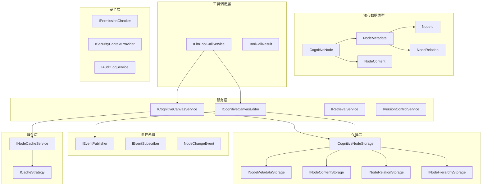

# MemoTree 核心类型设计文档

> 版本: v1.0  
> 创建日期: 2025-07-23  
> 基于: MVP_Design_Draft.md 和 Autonomous_Cognitive_Canvas_Concept_v2.md

## 1. 文档概述

本文档定义了MemoTree系统的核心数据类型、接口和类结构。MemoTree是一个为LLM提供持久化、结构化上下文管理的工具，将LLM的上下文抽象为可展开/折叠的多级LOD Markdown树。

### 1.1 设计原则

- **单一职责原则**: 每个类型专注于单一功能
- **开闭原则**: 对扩展开放，对修改封闭
- **依赖倒置**: 依赖抽象而非具体实现
- **接口隔离**: 提供最小化的接口定义
- **可测试性**: 支持单元测试和Mock对象

### 1.2 技术栈

- **.NET 9.0**: 目标框架
- **Microsoft.Extensions.DependencyInjection**: 依赖注入容器
- **YamlDotNet**: YAML序列化/反序列化
- **LibGit2Sharp**: Git版本控制集成
- **Microsoft.CodeAnalysis (Roslyn)**: 代码分析集成
- **System.Reactive**: 响应式编程支持
- **Microsoft.Extensions.Caching**: 缓存抽象
- **Microsoft.Extensions.Logging**: 日志记录

### 1.3 命名约定

- **接口**: 以 `I` 开头，使用 PascalCase（如 `ICognitiveNodeStorage`）
- **类型**: 使用 PascalCase（如 `CognitiveNode`）
- **枚举**: 使用 PascalCase，成员也使用 PascalCase（如 `NodeType.Concept`）
- **记录类型**: 使用 PascalCase，属性使用 PascalCase（如 `NodeMetadata`）
- **方法**: 异步方法以 `Async` 结尾（如 `GetNodeAsync`）
- **参数**: 使用 camelCase（如 `nodeId`, `cancellationToken`）

### 1.4 版本兼容性

本设计考虑了向前兼容性：

- 所有公共接口都支持扩展而不破坏现有实现
- 使用可选参数和默认值来添加新功能
- 记录类型支持非破坏性的属性添加
- 枚举类型预留了扩展空间

## 2. 核心数据类型

### 2.1 认知节点 (Cognitive Node)

#### 2.1.1 节点标识符

```csharp
/// <summary>
/// 认知节点的唯一标识符
/// </summary>
public readonly struct NodeId : IEquatable<NodeId>
{
    public string Value { get; }
    
    public NodeId(string value)
    {
        if (string.IsNullOrWhiteSpace(value))
            throw new ArgumentException("NodeId cannot be null or empty", nameof(value));
        Value = value;
    }
    
    public static NodeId Generate() => new(Guid.NewGuid().ToString("N")[..12]);
    public static NodeId Root => new("root");
    
    public bool Equals(NodeId other) => Value == other.Value;
    public override bool Equals(object? obj) => obj is NodeId other && Equals(other);
    public override int GetHashCode() => Value.GetHashCode();
    public override string ToString() => Value;
    
    public static implicit operator string(NodeId nodeId) => nodeId.Value;
    public static explicit operator NodeId(string value) => new(value);
}
```

#### 2.1.2 LOD级别定义

```csharp
/// <summary>
/// 详细程度级别 (Level of Detail)
/// </summary>
public enum LodLevel
{
    /// <summary>
    /// 标题级 - 仅显示节点标题
    /// </summary>
    Title = 3,
    
    /// <summary>
    /// 摘要级 - 显示标题和简要摘要
    /// </summary>
    Summary = 2,
    
    /// <summary>
    /// 详细级 - 显示完整内容
    /// </summary>
    Detail = 1
}
```

#### 2.1.3 节点类型

```csharp
/// <summary>
/// 认知节点类型
/// </summary>
public enum NodeType
{
    /// <summary>
    /// 概念节点 - 核心概念和理论
    /// </summary>
    Concept,
    
    /// <summary>
    /// 记忆节点 - 经验记忆和事实信息
    /// </summary>
    Memory,
    
    /// <summary>
    /// 计划节点 - 任务规划和待办事项
    /// </summary>
    Plan,
    
    /// <summary>
    /// 引用节点 - 外部引用和链接
    /// </summary>
    Reference,
    
    /// <summary>
    /// 代码节点 - 代码相关信息
    /// </summary>
    Code
}
```

#### 2.1.4 节点关系

```csharp
/// <summary>
/// 节点间关系类型
/// </summary>
public enum RelationType
{
    /// <summary>
    /// 引用关系
    /// </summary>
    References,
    
    /// <summary>
    /// 启发关系
    /// </summary>
    InspiredBy,
    
    /// <summary>
    /// 矛盾关系
    /// </summary>
    Contradicts,
    
    /// <summary>
    /// 扩展关系
    /// </summary>
    Extends,
    
    /// <summary>
    /// 依赖关系
    /// </summary>
    DependsOn
}

/// <summary>
/// 节点关系定义
/// </summary>
public record NodeRelation
{
    public RelationType Type { get; init; }
    public NodeId TargetId { get; init; }
    public string Description { get; init; } = string.Empty;
    public DateTime CreatedAt { get; init; } = DateTime.UtcNow;
}
```

#### 2.1.5 节点元数据

```csharp
/// <summary>
/// 认知节点元数据
/// </summary>
public record NodeMetadata
{
    public NodeId Id { get; init; }
    public NodeId? ParentId { get; init; }
    public NodeType Type { get; init; }
    public string Title { get; init; } = string.Empty;
    public DateTime CreatedAt { get; init; } = DateTime.UtcNow;
    public DateTime LastModified { get; init; } = DateTime.UtcNow;
    public IReadOnlyList<string> Tags { get; init; } = Array.Empty<string>();
    public IReadOnlyList<NodeRelation> Relations { get; init; } = Array.Empty<NodeRelation>();
    public IReadOnlyDictionary<LodLevel, string> ContentHashes { get; init; } = 
        new Dictionary<LodLevel, string>();
    public bool IsDirty { get; init; } = false;
}
```

#### 2.1.6 节点内容

```csharp
/// <summary>
/// 节点内容数据
/// </summary>
public record NodeContent
{
    public NodeId Id { get; init; }
    public LodLevel Level { get; init; }
    public string Content { get; init; } = string.Empty;
    public string ContentHash { get; init; } = string.Empty;
    public DateTime LastModified { get; init; } = DateTime.UtcNow;
}
```

#### 2.1.7 完整认知节点

```csharp
/// <summary>
/// 完整的认知节点，包含元数据和所有LOD级别的内容
/// </summary>
public record CognitiveNode
{
    public NodeMetadata Metadata { get; init; } = new();
    public IReadOnlyDictionary<LodLevel, NodeContent> Contents { get; init; } = 
        new Dictionary<LodLevel, NodeContent>();
    
    /// <summary>
    /// 获取指定LOD级别的内容
    /// </summary>
    public NodeContent? GetContent(LodLevel level) => 
        Contents.TryGetValue(level, out var content) ? content : null;
    
    /// <summary>
    /// 检查是否有指定LOD级别的内容
    /// </summary>
    public bool HasContent(LodLevel level) => Contents.ContainsKey(level);
    
    /// <summary>
    /// 获取所有可用的LOD级别
    /// </summary>
    public IEnumerable<LodLevel> AvailableLevels => Contents.Keys;
}
```

### 2.2 外部链接类型

#### 2.2.1 外部链接

```csharp
/// <summary>
/// 外部文件链接类型
/// </summary>
public enum ExternalLinkType
{
    /// <summary>
    /// 源代码文件
    /// </summary>
    SourceFile,
    
    /// <summary>
    /// 文档文件
    /// </summary>
    Documentation,
    
    /// <summary>
    /// 配置文件
    /// </summary>
    Configuration,
    
    /// <summary>
    /// 媒体文件
    /// </summary>
    Media,
    
    /// <summary>
    /// 其他文件
    /// </summary>
    Other
}

/// <summary>
/// 外部文件链接定义
/// </summary>
public record ExternalLink
{
    public string Path { get; init; } = string.Empty;
    public ExternalLinkType Type { get; init; }
    public string ContentHash { get; init; } = string.Empty;
    public DateTime LastChecked { get; init; } = DateTime.UtcNow;
    public IReadOnlyList<string> RoslynSymbols { get; init; } = Array.Empty<string>();
    public IReadOnlyDictionary<string, object> Metadata { get; init; } = 
        new Dictionary<string, object>();
}
```

### 2.3 视图和渲染类型

#### 2.3.1 视图状态

```csharp
/// <summary>
/// 节点在视图中的状态
/// </summary>
public record NodeViewState
{
    public NodeId Id { get; init; }
    public LodLevel CurrentLevel { get; init; } = LodLevel.Summary;
    public bool IsExpanded { get; init; } = false;
    public bool IsVisible { get; init; } = true;
    public int Order { get; init; } = 0;
}

/// <summary>
/// 认知画布视图状态
/// </summary>
public record CanvasViewState
{
    public string Name { get; init; } = "default";
    public DateTime LastModified { get; init; } = DateTime.UtcNow;
    public IReadOnlyList<NodeViewState> NodeStates { get; init; } = Array.Empty<NodeViewState>();
    public NodeId? FocusedNodeId { get; init; }
    public IReadOnlyDictionary<string, object> ViewSettings { get; init; } = 
        new Dictionary<string, object>();
}
```

## 3. 核心接口定义

### 3.1 存储接口（优化版）

```csharp
/// <summary>
/// 节点元数据存储接口
/// </summary>
public interface INodeMetadataStorage
{
    /// <summary>
    /// 获取节点元数据
    /// </summary>
    Task<NodeMetadata?> GetAsync(NodeId nodeId, CancellationToken cancellationToken = default);

    /// <summary>
    /// 保存节点元数据
    /// </summary>
    Task SaveAsync(NodeMetadata metadata, CancellationToken cancellationToken = default);

    /// <summary>
    /// 删除节点元数据
    /// </summary>
    Task DeleteAsync(NodeId nodeId, CancellationToken cancellationToken = default);

    /// <summary>
    /// 批量获取元数据
    /// </summary>
    Task<IReadOnlyDictionary<NodeId, NodeMetadata>> GetBatchAsync(IEnumerable<NodeId> nodeIds, CancellationToken cancellationToken = default);

    /// <summary>
    /// 异步枚举所有元数据
    /// </summary>
    IAsyncEnumerable<NodeMetadata> GetAllAsync(CancellationToken cancellationToken = default);
}

/// <summary>
/// 节点内容存储接口
/// </summary>
public interface INodeContentStorage
{
    /// <summary>
    /// 获取节点内容
    /// </summary>
    Task<NodeContent?> GetAsync(NodeId nodeId, LodLevel level, CancellationToken cancellationToken = default);

    /// <summary>
    /// 保存节点内容
    /// </summary>
    Task SaveAsync(NodeContent content, CancellationToken cancellationToken = default);

    /// <summary>
    /// 删除节点内容
    /// </summary>
    Task DeleteAsync(NodeId nodeId, LodLevel level, CancellationToken cancellationToken = default);

    /// <summary>
    /// 删除节点的所有内容
    /// </summary>
    Task DeleteAllAsync(NodeId nodeId, CancellationToken cancellationToken = default);

    /// <summary>
    /// 获取节点的所有内容级别
    /// </summary>
    Task<IReadOnlyDictionary<LodLevel, NodeContent>> GetAllLevelsAsync(NodeId nodeId, CancellationToken cancellationToken = default);
}

/// <summary>
/// 节点关系存储接口
/// </summary>
public interface INodeRelationStorage
{
    /// <summary>
    /// 获取节点的所有关系
    /// </summary>
    Task<IReadOnlyList<NodeRelation>> GetRelationsAsync(NodeId nodeId, CancellationToken cancellationToken = default);

    /// <summary>
    /// 添加节点关系
    /// </summary>
    Task AddRelationAsync(NodeId sourceId, NodeRelation relation, CancellationToken cancellationToken = default);

    /// <summary>
    /// 移除节点关系
    /// </summary>
    Task RemoveRelationAsync(NodeId sourceId, NodeId targetId, RelationType relationType, CancellationToken cancellationToken = default);

    /// <summary>
    /// 获取指向指定节点的所有关系
    /// </summary>
    Task<IReadOnlyList<(NodeId SourceId, NodeRelation Relation)>> GetIncomingRelationsAsync(NodeId targetId, CancellationToken cancellationToken = default);
}

/// <summary>
/// 节点层次结构存储接口
/// </summary>
public interface INodeHierarchyStorage
{
    /// <summary>
    /// 获取子节点ID列表
    /// </summary>
    Task<IReadOnlyList<NodeId>> GetChildrenAsync(NodeId parentId, CancellationToken cancellationToken = default);

    /// <summary>
    /// 获取父节点ID
    /// </summary>
    Task<NodeId?> GetParentAsync(NodeId nodeId, CancellationToken cancellationToken = default);

    /// <summary>
    /// 移动节点到新父节点
    /// </summary>
    Task MoveNodeAsync(NodeId nodeId, NodeId? newParentId, CancellationToken cancellationToken = default);

    /// <summary>
    /// 获取节点路径（从根到节点）
    /// </summary>
    Task<IReadOnlyList<NodeId>> GetPathAsync(NodeId nodeId, CancellationToken cancellationToken = default);

    /// <summary>
    /// 获取子树中的所有节点ID
    /// </summary>
    IAsyncEnumerable<NodeId> GetDescendantsAsync(NodeId rootId, CancellationToken cancellationToken = default);
}

/// <summary>
/// 复合存储接口（组合所有存储功能）
/// </summary>
public interface ICognitiveNodeStorage : INodeMetadataStorage, INodeContentStorage, INodeRelationStorage, INodeHierarchyStorage
{
    /// <summary>
    /// 获取完整节点
    /// </summary>
    Task<CognitiveNode?> GetCompleteNodeAsync(NodeId nodeId, CancellationToken cancellationToken = default);

    /// <summary>
    /// 保存完整节点
    /// </summary>
    Task SaveCompleteNodeAsync(CognitiveNode node, CancellationToken cancellationToken = default);

    /// <summary>
    /// 事务性操作
    /// </summary>
    Task<T> ExecuteInTransactionAsync<T>(Func<ICognitiveNodeStorage, CancellationToken, Task<T>> operation, CancellationToken cancellationToken = default);
}

/// <summary>
/// 视图状态存储接口
/// </summary>
public interface IViewStateStorage
{
    /// <summary>
    /// 获取视图状态
    /// </summary>
    Task<CanvasViewState?> GetViewStateAsync(string viewName, CancellationToken cancellationToken = default);

    /// <summary>
    /// 保存视图状态
    /// </summary>
    Task SaveViewStateAsync(CanvasViewState viewState, CancellationToken cancellationToken = default);

    /// <summary>
    /// 获取所有视图名称
    /// </summary>
    Task<IReadOnlyList<string>> GetViewNamesAsync(CancellationToken cancellationToken = default);

    /// <summary>
    /// 删除视图状态
    /// </summary>
    Task DeleteViewStateAsync(string viewName, CancellationToken cancellationToken = default);
}
```

### 3.2 版本控制接口

```csharp
/// <summary>
/// Git版本控制操作接口
/// </summary>
public interface IVersionControlService
{
    /// <summary>
    /// 提交更改
    /// </summary>
    Task<string> CommitAsync(string message, CancellationToken cancellationToken = default);

    /// <summary>
    /// 获取提交历史
    /// </summary>
    Task<IReadOnlyList<CommitInfo>> GetHistoryAsync(int maxCount = 100, CancellationToken cancellationToken = default);

    /// <summary>
    /// 回滚到指定提交
    /// </summary>
    Task ResetToCommitAsync(string commitHash, CancellationToken cancellationToken = default);

    /// <summary>
    /// 创建分支
    /// </summary>
    Task CreateBranchAsync(string branchName, CancellationToken cancellationToken = default);

    /// <summary>
    /// 切换分支
    /// </summary>
    Task CheckoutBranchAsync(string branchName, CancellationToken cancellationToken = default);

    /// <summary>
    /// 合并分支
    /// </summary>
    Task MergeBranchAsync(string sourceBranch, string targetBranch, CancellationToken cancellationToken = default);
}

/// <summary>
/// 提交信息
/// </summary>
public record CommitInfo
{
    public string Hash { get; init; } = string.Empty;
    public string Message { get; init; } = string.Empty;
    public string Author { get; init; } = string.Empty;
    public DateTime Timestamp { get; init; } = DateTime.UtcNow;
    public IReadOnlyList<string> ChangedFiles { get; init; } = Array.Empty<string>();
}
```

### 3.3 检索接口

```csharp
/// <summary>
/// 检索服务接口
/// </summary>
public interface IRetrievalService
{
    /// <summary>
    /// 全文搜索
    /// </summary>
    Task<IReadOnlyList<SearchResult>> FullTextSearchAsync(string query, int maxResults = 10, CancellationToken cancellationToken = default);

    /// <summary>
    /// 语义搜索
    /// </summary>
    Task<IReadOnlyList<SearchResult>> SemanticSearchAsync(string query, int maxResults = 10, CancellationToken cancellationToken = default);

    /// <summary>
    /// 关系搜索
    /// </summary>
    Task<IReadOnlyList<NodeId>> RelationSearchAsync(NodeId startNodeId, RelationType relationType, int maxDepth = 3, CancellationToken cancellationToken = default);

    /// <summary>
    /// 重建索引
    /// </summary>
    Task RebuildIndexAsync(CancellationToken cancellationToken = default);
}

/// <summary>
/// 搜索结果
/// </summary>
public record SearchResult
{
    public NodeId NodeId { get; init; }
    public LodLevel Level { get; init; }
    public double Score { get; init; }
    public string Snippet { get; init; } = string.Empty;
    public IReadOnlyList<string> HighlightedTerms { get; init; } = Array.Empty<string>();
}
```

### 3.4 编辑操作接口

```csharp
/// <summary>
/// 认知画布编辑器接口
/// </summary>
public interface ICognitiveCanvasEditor
{
    /// <summary>
    /// 创建新节点
    /// </summary>
    Task<NodeId> CreateNodeAsync(NodeId? parentId, NodeType type, string title, string content, CancellationToken cancellationToken = default);

    /// <summary>
    /// 更新节点内容
    /// </summary>
    Task UpdateNodeContentAsync(NodeId nodeId, LodLevel level, string content, CancellationToken cancellationToken = default);

    /// <summary>
    /// 更新节点元数据
    /// </summary>
    Task UpdateNodeMetadataAsync(NodeId nodeId, Action<NodeMetadata> updateAction, CancellationToken cancellationToken = default);

    /// <summary>
    /// 删除节点
    /// </summary>
    Task DeleteNodeAsync(NodeId nodeId, bool recursive = false, CancellationToken cancellationToken = default);

    /// <summary>
    /// 移动节点
    /// </summary>
    Task MoveNodeAsync(NodeId nodeId, NodeId? newParentId, CancellationToken cancellationToken = default);

    /// <summary>
    /// 分割节点
    /// </summary>
    Task<NodeId> SplitNodeAsync(NodeId nodeId, string splitPoint, CancellationToken cancellationToken = default);

    /// <summary>
    /// 合并节点
    /// </summary>
    Task MergeNodesAsync(NodeId sourceNodeId, NodeId targetNodeId, CancellationToken cancellationToken = default);

    /// <summary>
    /// 添加节点关系
    /// </summary>
    Task AddRelationAsync(NodeId sourceNodeId, NodeId targetNodeId, RelationType relationType, string description = "", CancellationToken cancellationToken = default);

    /// <summary>
    /// 移除节点关系
    /// </summary>
    Task RemoveRelationAsync(NodeId sourceNodeId, NodeId targetNodeId, RelationType relationType, CancellationToken cancellationToken = default);
}
```

## 4. 服务类型定义

### 4.1 认知画布服务

```csharp
/// <summary>
/// 认知画布核心服务
/// </summary>
public interface ICognitiveCanvasService
{
    /// <summary>
    /// 渲染指定视图的Markdown内容
    /// </summary>
    Task<string> RenderViewAsync(string viewName, CancellationToken cancellationToken = default);

    /// <summary>
    /// 展开节点到指定LOD级别
    /// </summary>
    Task ExpandNodeAsync(string viewName, NodeId nodeId, LodLevel level, CancellationToken cancellationToken = default);

    /// <summary>
    /// 折叠节点
    /// </summary>
    Task CollapseNodeAsync(string viewName, NodeId nodeId, CancellationToken cancellationToken = default);

    /// <summary>
    /// 获取节点树结构
    /// </summary>
    Task<IReadOnlyList<NodeTreeItem>> GetNodeTreeAsync(NodeId? rootId = null, CancellationToken cancellationToken = default);

    /// <summary>
    /// 应用FIFO策略管理上下文窗口
    /// </summary>
    Task ApplyFifoStrategyAsync(string viewName, int maxTokens, CancellationToken cancellationToken = default);
}

/// <summary>
/// 节点树项
/// </summary>
public record NodeTreeItem
{
    public NodeId Id { get; init; }
    public string Title { get; init; } = string.Empty;
    public NodeType Type { get; init; }
    public int Level { get; init; }
    public bool HasChildren { get; init; }
    public IReadOnlyList<NodeTreeItem> Children { get; init; } = Array.Empty<NodeTreeItem>();
}
```

### 4.2 外部数据源集成

```csharp
/// <summary>
/// Roslyn代码分析服务接口
/// </summary>
public interface IRoslynIntegrationService
{
    /// <summary>
    /// 加载代码库工作空间
    /// </summary>
    Task LoadWorkspaceAsync(string solutionPath, CancellationToken cancellationToken = default);

    /// <summary>
    /// 获取代码库结构
    /// </summary>
    Task<CodebaseStructure> GetCodebaseStructureAsync(CancellationToken cancellationToken = default);

    /// <summary>
    /// 分析符号信息
    /// </summary>
    Task<SymbolInfo> AnalyzeSymbolAsync(string symbolName, CancellationToken cancellationToken = default);

    /// <summary>
    /// 执行重构操作
    /// </summary>
    Task<RefactoringResult> ExecuteRefactoringAsync(RefactoringOperation operation, CancellationToken cancellationToken = default);

    /// <summary>
    /// 监听代码变更
    /// </summary>
    IObservable<CodeChangeEvent> ObserveCodeChanges();
}

/// <summary>
/// 代码库结构
/// </summary>
public record CodebaseStructure
{
    public string SolutionPath { get; init; } = string.Empty;
    public IReadOnlyList<ProjectInfo> Projects { get; init; } = Array.Empty<ProjectInfo>();
    public DateTime LastAnalyzed { get; init; } = DateTime.UtcNow;
}

/// <summary>
/// 项目信息
/// </summary>
public record ProjectInfo
{
    public string Name { get; init; } = string.Empty;
    public string Path { get; init; } = string.Empty;
    public IReadOnlyList<NamespaceInfo> Namespaces { get; init; } = Array.Empty<NamespaceInfo>();
}

/// <summary>
/// 命名空间信息
/// </summary>
public record NamespaceInfo
{
    public string Name { get; init; } = string.Empty;
    public IReadOnlyList<TypeInfo> Types { get; init; } = Array.Empty<TypeInfo>();
}

/// <summary>
/// 类型信息
/// </summary>
public record TypeInfo
{
    public string Name { get; init; } = string.Empty;
    public string FullName { get; init; } = string.Empty;
    public TypeKind Kind { get; init; }
    public IReadOnlyList<MemberInfo> Members { get; init; } = Array.Empty<MemberInfo>();
    public string Documentation { get; init; } = string.Empty;
}

/// <summary>
/// 成员信息
/// </summary>
public record MemberInfo
{
    public string Name { get; init; } = string.Empty;
    public MemberKind Kind { get; init; }
    public string Signature { get; init; } = string.Empty;
    public string Documentation { get; init; } = string.Empty;
}

/// <summary>
/// 类型种类
/// </summary>
public enum TypeKind
{
    Class,
    Interface,
    Struct,
    Enum,
    Delegate
}

/// <summary>
/// 成员种类
/// </summary>
public enum MemberKind
{
    Field,
    Property,
    Method,
    Constructor,
    Event
}

/// <summary>
/// 符号信息
/// </summary>
public record SymbolInfo
{
    public string Name { get; init; } = string.Empty;
    public string FullName { get; init; } = string.Empty;
    public SymbolKind Kind { get; init; }
    public string Documentation { get; init; } = string.Empty;
    public IReadOnlyList<string> References { get; init; } = Array.Empty<string>();
    public IReadOnlyList<string> Dependencies { get; init; } = Array.Empty<string>();
}

/// <summary>
/// 符号种类
/// </summary>
public enum SymbolKind
{
    Namespace,
    Type,
    Method,
    Property,
    Field,
    Event,
    Parameter,
    Local
}

/// <summary>
/// 重构操作
/// </summary>
public abstract record RefactoringOperation
{
    public string Description { get; init; } = string.Empty;
}

/// <summary>
/// 重命名重构操作
/// </summary>
public record RenameRefactoringOperation : RefactoringOperation
{
    public string OldName { get; init; } = string.Empty;
    public string NewName { get; init; } = string.Empty;
    public string SymbolKind { get; init; } = string.Empty;
}

/// <summary>
/// 重构结果
/// </summary>
public record RefactoringResult
{
    public bool Success { get; init; }
    public string Message { get; init; } = string.Empty;
    public IReadOnlyList<string> ChangedFiles { get; init; } = Array.Empty<string>();
}

/// <summary>
/// 代码变更事件
/// </summary>
public record CodeChangeEvent
{
    public string FilePath { get; init; } = string.Empty;
    public ChangeType ChangeType { get; init; }
    public DateTime Timestamp { get; init; } = DateTime.UtcNow;
    public IReadOnlyList<string> AffectedSymbols { get; init; } = Array.Empty<string>();
}

/// <summary>
/// 变更类型
/// </summary>
public enum ChangeType
{
    Added,
    Modified,
    Deleted,
    Renamed
}
```

### 4.3 环境信息服务

```csharp
/// <summary>
/// Agent环境信息服务接口
/// </summary>
public interface IAgentEnvironmentService
{
    /// <summary>
    /// 获取当前上下文使用情况
    /// </summary>
    Task<ContextUsageInfo> GetContextUsageAsync(CancellationToken cancellationToken = default);

    /// <summary>
    /// 获取系统状态信息
    /// </summary>
    Task<SystemStatusInfo> GetSystemStatusAsync(CancellationToken cancellationToken = default);

    /// <summary>
    /// 获取用户偏好设置
    /// </summary>
    Task<UserPreferences> GetUserPreferencesAsync(CancellationToken cancellationToken = default);

    /// <summary>
    /// 更新用户偏好设置
    /// </summary>
    Task UpdateUserPreferencesAsync(UserPreferences preferences, CancellationToken cancellationToken = default);
}

/// <summary>
/// 上下文使用情况信息
/// </summary>
public record ContextUsageInfo
{
    public int CurrentTokens { get; init; }
    public int MaxTokens { get; init; }
    public double UsagePercentage { get; init; }
    public int ActiveNodes { get; init; }
    public int ExpandedNodes { get; init; }
    public DateTime LastUpdated { get; init; } = DateTime.UtcNow;
}

/// <summary>
/// 系统状态信息
/// </summary>
public record SystemStatusInfo
{
    public DateTime CurrentTime { get; init; } = DateTime.UtcNow;
    public string TimeZone { get; init; } = string.Empty;
    public string Location { get; init; } = string.Empty;
    public double MemoryUsageMB { get; init; }
    public double CpuUsagePercentage { get; init; }
    public string Version { get; init; } = string.Empty;
    public TimeSpan Uptime { get; init; }
}

/// <summary>
/// 用户偏好设置
/// </summary>
public record UserPreferences
{
    public LodLevel DefaultLodLevel { get; init; } = LodLevel.Summary;
    public int MaxContextTokens { get; init; } = 8000;
    public bool AutoSaveEnabled { get; init; } = true;
    public TimeSpan AutoSaveInterval { get; init; } = TimeSpan.FromMinutes(5);
    public string PreferredLanguage { get; init; } = "zh-CN";
    public IReadOnlyDictionary<string, object> CustomSettings { get; init; } =
        new Dictionary<string, object>();
}
```

## 5. 工具调用API类型

### 5.1 LLM工具调用接口

```csharp
/// <summary>
/// LLM工具调用服务接口
/// </summary>
public interface ILlmToolCallService
{
    /// <summary>
    /// 展开节点
    /// </summary>
    Task<ToolCallResult> ExpandNodeAsync(ExpandNodeRequest request, CancellationToken cancellationToken = default);

    /// <summary>
    /// 折叠节点
    /// </summary>
    Task<ToolCallResult> CollapseNodeAsync(CollapseNodeRequest request, CancellationToken cancellationToken = default);

    /// <summary>
    /// 创建节点
    /// </summary>
    Task<ToolCallResult> CreateNodeAsync(CreateNodeRequest request, CancellationToken cancellationToken = default);

    /// <summary>
    /// 更新节点
    /// </summary>
    Task<ToolCallResult> UpdateNodeAsync(UpdateNodeRequest request, CancellationToken cancellationToken = default);

    /// <summary>
    /// 搜索节点
    /// </summary>
    Task<ToolCallResult> SearchNodesAsync(SearchNodesRequest request, CancellationToken cancellationToken = default);

    /// <summary>
    /// 提交更改
    /// </summary>
    Task<ToolCallResult> CommitChangesAsync(CommitChangesRequest request, CancellationToken cancellationToken = default);
}

/// <summary>
/// 工具调用结果
/// </summary>
public record ToolCallResult
{
    public bool Success { get; init; }
    public string Message { get; init; } = string.Empty;
    public object? Data { get; init; }
    public IReadOnlyList<string> Warnings { get; init; } = Array.Empty<string>();
    public string? ErrorCode { get; init; }
}

/// <summary>
/// 展开节点请求
/// </summary>
public record ExpandNodeRequest
{
    public string ViewName { get; init; } = "default";
    public NodeId NodeId { get; init; }
    public LodLevel Level { get; init; } = LodLevel.Detail;
}

/// <summary>
/// 折叠节点请求
/// </summary>
public record CollapseNodeRequest
{
    public string ViewName { get; init; } = "default";
    public NodeId NodeId { get; init; }
}

/// <summary>
/// 创建节点请求
/// </summary>
public record CreateNodeRequest
{
    public NodeId? ParentId { get; init; }
    public NodeType Type { get; init; }
    public string Title { get; init; } = string.Empty;
    public string Content { get; init; } = string.Empty;
    public IReadOnlyList<string> Tags { get; init; } = Array.Empty<string>();
    public string CommitMessage { get; init; } = string.Empty;
}

/// <summary>
/// 更新节点请求
/// </summary>
public record UpdateNodeRequest
{
    public NodeId NodeId { get; init; }
    public LodLevel? Level { get; init; }
    public string? Content { get; init; }
    public string? Title { get; init; }
    public IReadOnlyList<string>? Tags { get; init; }
    public string CommitMessage { get; init; } = string.Empty;
}

/// <summary>
/// 搜索节点请求
/// </summary>
public record SearchNodesRequest
{
    public string Query { get; init; } = string.Empty;
    public SearchType SearchType { get; init; } = SearchType.FullText;
    public int MaxResults { get; init; } = 10;
    public IReadOnlyList<NodeType>? NodeTypes { get; init; }
    public IReadOnlyList<string>? Tags { get; init; }
}

/// <summary>
/// 搜索类型
/// </summary>
public enum SearchType
{
    FullText,
    Semantic,
    Relation
}

/// <summary>
/// 提交更改请求
/// </summary>
public record CommitChangesRequest
{
    public string Message { get; init; } = string.Empty;
    public IReadOnlyList<NodeId>? SpecificNodes { get; init; }
}
```

## 6. 配置和选项类型

### 6.1 系统配置

```csharp
/// <summary>
/// MemoTree系统配置选项
/// </summary>
public class MemoTreeOptions
{
    /// <summary>
    /// 工作空间根目录路径
    /// </summary>
    public string WorkspaceRoot { get; set; } = "./workspace";

    /// <summary>
    /// 认知节点存储目录名
    /// </summary>
    public string CogNodesDirectory { get; set; } = "CogNodes";

    /// <summary>
    /// 视图状态文件名
    /// </summary>
    public string ViewStateFileName { get; set; } = "last-view.json";

    /// <summary>
    /// 索引缓存文件名
    /// </summary>
    public string IndexCacheFileName { get; set; } = "index-cache.json";

    /// <summary>
    /// 默认最大上下文Token数
    /// </summary>
    public int DefaultMaxContextTokens { get; set; } = 8000;

    /// <summary>
    /// 自动保存间隔（分钟）
    /// </summary>
    public int AutoSaveIntervalMinutes { get; set; } = 5;

    /// <summary>
    /// 是否启用Git版本控制
    /// </summary>
    public bool EnableVersionControl { get; set; } = true;

    /// <summary>
    /// 是否启用Roslyn集成
    /// </summary>
    public bool EnableRoslynIntegration { get; set; } = true;

    /// <summary>
    /// 支持的文件扩展名
    /// </summary>
    public IList<string> SupportedFileExtensions { get; set; } = new List<string>
    {
        ".md", ".txt", ".cs", ".json", ".yaml", ".yml"
    };
}

/// <summary>
/// 存储配置选项
/// </summary>
public class StorageOptions
{
    /// <summary>
    /// 元数据文件名
    /// </summary>
    public string MetadataFileName { get; set; } = "meta.yaml";

    /// <summary>
    /// 详细内容文件名
    /// </summary>
    public string DetailContentFileName { get; set; } = "full-text.md";

    /// <summary>
    /// 摘要内容文件名
    /// </summary>
    public string SummaryContentFileName { get; set; } = "summary.md";

    /// <summary>
    /// 简要内容文件名
    /// </summary>
    public string BriefContentFileName { get; set; } = "brief.md";

    /// <summary>
    /// 外部链接文件名
    /// </summary>
    public string ExternalLinksFileName { get; set; } = "external-links.json";

    /// <summary>
    /// 内容哈希算法
    /// </summary>
    public string HashAlgorithm { get; set; } = "SHA256";
}

/// <summary>
/// 检索配置选项
/// </summary>
public class RetrievalOptions
{
    /// <summary>
    /// 是否启用全文搜索
    /// </summary>
    public bool EnableFullTextSearch { get; set; } = true;

    /// <summary>
    /// 是否启用语义搜索
    /// </summary>
    public bool EnableSemanticSearch { get; set; } = false;

    /// <summary>
    /// 全文搜索索引目录
    /// </summary>
    public string FullTextIndexDirectory { get; set; } = "./indexes/fulltext";

    /// <summary>
    /// 语义搜索向量维度
    /// </summary>
    public int VectorDimension { get; set; } = 768;

    /// <summary>
    /// 语义搜索索引目录
    /// </summary>
    public string SemanticIndexDirectory { get; set; } = "./indexes/semantic";

    /// <summary>
    /// 搜索结果最大数量
    /// </summary>
    public int MaxSearchResults { get; set; } = 50;
}
```

## 7. 异常类型定义

```csharp
/// <summary>
/// MemoTree基础异常
/// </summary>
public abstract class MemoTreeException : Exception
{
    protected MemoTreeException(string message) : base(message) { }
    protected MemoTreeException(string message, Exception innerException) : base(message, innerException) { }
}

/// <summary>
/// 节点未找到异常
/// </summary>
public class NodeNotFoundException : MemoTreeException
{
    public NodeId NodeId { get; }

    public NodeNotFoundException(NodeId nodeId)
        : base($"Node with ID '{nodeId}' was not found.")
    {
        NodeId = nodeId;
    }
}

/// <summary>
/// 节点内容未找到异常
/// </summary>
public class NodeContentNotFoundException : MemoTreeException
{
    public NodeId NodeId { get; }
    public LodLevel Level { get; }

    public NodeContentNotFoundException(NodeId nodeId, LodLevel level)
        : base($"Content for node '{nodeId}' at level '{level}' was not found.")
    {
        NodeId = nodeId;
        Level = level;
    }
}

/// <summary>
/// 版本控制异常
/// </summary>
public class VersionControlException : MemoTreeException
{
    public VersionControlException(string message) : base(message) { }
    public VersionControlException(string message, Exception innerException) : base(message, innerException) { }
}

/// <summary>
/// 存储异常
/// </summary>
public class StorageException : MemoTreeException
{
    public StorageException(string message) : base(message) { }
    public StorageException(string message, Exception innerException) : base(message, innerException) { }
}

/// <summary>
/// 检索异常
/// </summary>
public class RetrievalException : MemoTreeException
{
    public RetrievalException(string message) : base(message) { }
    public RetrievalException(string message, Exception innerException) : base(message, innerException) { }
}
```

---

## 8. 事件系统类型

### 8.1 节点变更事件

```csharp
/// <summary>
/// 节点变更事件基类
/// </summary>
public abstract record NodeChangeEvent
{
    public NodeId NodeId { get; init; }
    public DateTime Timestamp { get; init; } = DateTime.UtcNow;
    public string UserId { get; init; } = string.Empty;
}

/// <summary>
/// 节点创建事件
/// </summary>
public record NodeCreatedEvent : NodeChangeEvent
{
    public NodeType NodeType { get; init; }
    public string Title { get; init; } = string.Empty;
    public NodeId? ParentId { get; init; }
}

/// <summary>
/// 节点更新事件
/// </summary>
public record NodeUpdatedEvent : NodeChangeEvent
{
    public LodLevel Level { get; init; }
    public string? OldContent { get; init; }
    public string? NewContent { get; init; }
    public NodeMetadata? OldMetadata { get; init; }
    public NodeMetadata? NewMetadata { get; init; }
}

/// <summary>
/// 节点删除事件
/// </summary>
public record NodeDeletedEvent : NodeChangeEvent
{
    public NodeType NodeType { get; init; }
    public string Title { get; init; } = string.Empty;
    public bool WasRecursive { get; init; }
}

/// <summary>
/// 节点关系变更事件
/// </summary>
public record NodeRelationChangedEvent : NodeChangeEvent
{
    public NodeId TargetNodeId { get; init; }
    public RelationType RelationType { get; init; }
    public bool IsAdded { get; init; }
    public string Description { get; init; } = string.Empty;
}
```

### 8.2 事件发布订阅接口

```csharp
/// <summary>
/// 事件发布器接口
/// </summary>
public interface IEventPublisher
{
    /// <summary>
    /// 发布事件
    /// </summary>
    Task PublishAsync<T>(T eventData, CancellationToken cancellationToken = default) where T : NodeChangeEvent;

    /// <summary>
    /// 批量发布事件
    /// </summary>
    Task PublishBatchAsync<T>(IEnumerable<T> events, CancellationToken cancellationToken = default) where T : NodeChangeEvent;
}

/// <summary>
/// 事件订阅器接口
/// </summary>
public interface IEventSubscriber
{
    /// <summary>
    /// 订阅特定类型的事件
    /// </summary>
    IDisposable Subscribe<T>(Func<T, CancellationToken, Task> handler) where T : NodeChangeEvent;

    /// <summary>
    /// 订阅所有节点变更事件
    /// </summary>
    IDisposable SubscribeAll(Func<NodeChangeEvent, CancellationToken, Task> handler);
}
```

## 9. 工厂和构建器模式

### 9.1 节点工厂接口

```csharp
/// <summary>
/// 认知节点工厂接口
/// </summary>
public interface ICognitiveNodeFactory
{
    /// <summary>
    /// 创建新的认知节点
    /// </summary>
    CognitiveNode CreateNode(NodeType type, string title, NodeId? parentId = null);

    /// <summary>
    /// 从元数据创建节点
    /// </summary>
    CognitiveNode CreateFromMetadata(NodeMetadata metadata);

    /// <summary>
    /// 创建根节点
    /// </summary>
    CognitiveNode CreateRootNode();
}

/// <summary>
/// 流畅的节点构建器接口
/// </summary>
public interface ICognitiveNodeBuilder
{
    /// <summary>
    /// 设置节点类型
    /// </summary>
    ICognitiveNodeBuilder OfType(NodeType type);

    /// <summary>
    /// 设置标题
    /// </summary>
    ICognitiveNodeBuilder WithTitle(string title);

    /// <summary>
    /// 设置父节点
    /// </summary>
    ICognitiveNodeBuilder UnderParent(NodeId parentId);

    /// <summary>
    /// 作为根节点
    /// </summary>
    ICognitiveNodeBuilder AsRoot();

    /// <summary>
    /// 添加单个标签
    /// </summary>
    ICognitiveNodeBuilder Tagged(string tag);

    /// <summary>
    /// 添加多个标签
    /// </summary>
    ICognitiveNodeBuilder TaggedWith(params string[] tags);

    /// <summary>
    /// 添加标签集合
    /// </summary>
    ICognitiveNodeBuilder TaggedWith(IEnumerable<string> tags);

    /// <summary>
    /// 设置详细内容
    /// </summary>
    ICognitiveNodeBuilder WithDetailContent(string content);

    /// <summary>
    /// 设置摘要内容
    /// </summary>
    ICognitiveNodeBuilder WithSummaryContent(string content);

    /// <summary>
    /// 设置简要内容
    /// </summary>
    ICognitiveNodeBuilder WithTitleContent(string content);

    /// <summary>
    /// 设置指定级别的内容
    /// </summary>
    ICognitiveNodeBuilder WithContent(LodLevel level, string content);

    /// <summary>
    /// 添加引用关系
    /// </summary>
    ICognitiveNodeBuilder References(NodeId targetId, string description = "");

    /// <summary>
    /// 添加启发关系
    /// </summary>
    ICognitiveNodeBuilder InspiredBy(NodeId targetId, string description = "");

    /// <summary>
    /// 添加扩展关系
    /// </summary>
    ICognitiveNodeBuilder Extends(NodeId targetId, string description = "");

    /// <summary>
    /// 添加依赖关系
    /// </summary>
    ICognitiveNodeBuilder DependsOn(NodeId targetId, string description = "");

    /// <summary>
    /// 添加矛盾关系
    /// </summary>
    ICognitiveNodeBuilder Contradicts(NodeId targetId, string description = "");

    /// <summary>
    /// 添加自定义关系
    /// </summary>
    ICognitiveNodeBuilder RelatedTo(NodeId targetId, RelationType type, string description = "");

    /// <summary>
    /// 设置创建时间
    /// </summary>
    ICognitiveNodeBuilder CreatedAt(DateTime timestamp);

    /// <summary>
    /// 使用当前时间作为创建时间
    /// </summary>
    ICognitiveNodeBuilder CreatedNow();

    /// <summary>
    /// 构建节点
    /// </summary>
    CognitiveNode Build();

    /// <summary>
    /// 构建并验证节点
    /// </summary>
    Task<(CognitiveNode Node, ValidationResult Validation)> BuildAndValidateAsync(INodeValidator validator, CancellationToken cancellationToken = default);

    /// <summary>
    /// 重置构建器到初始状态
    /// </summary>
    ICognitiveNodeBuilder Reset();

    /// <summary>
    /// 从现有节点创建构建器
    /// </summary>
    ICognitiveNodeBuilder FromExisting(CognitiveNode node);
}
```

## 10. 缓存和性能优化类型

### 10.1 缓存策略接口

```csharp
/// <summary>
/// 缓存策略接口
/// </summary>
public interface ICacheStrategy<TKey, TValue>
{
    /// <summary>
    /// 获取缓存项
    /// </summary>
    Task<TValue?> GetAsync(TKey key, CancellationToken cancellationToken = default);

    /// <summary>
    /// 设置缓存项
    /// </summary>
    Task SetAsync(TKey key, TValue value, TimeSpan? expiration = null, CancellationToken cancellationToken = default);

    /// <summary>
    /// 移除缓存项
    /// </summary>
    Task RemoveAsync(TKey key, CancellationToken cancellationToken = default);

    /// <summary>
    /// 清空缓存
    /// </summary>
    Task ClearAsync(CancellationToken cancellationToken = default);

    /// <summary>
    /// 获取缓存统计信息
    /// </summary>
    Task<CacheStatistics> GetStatisticsAsync(CancellationToken cancellationToken = default);
}

/// <summary>
/// 缓存统计信息
/// </summary>
public record CacheStatistics
{
    public long HitCount { get; init; }
    public long MissCount { get; init; }
    public long TotalRequests { get; init; }
    public double HitRatio { get; init; }
    public long ItemCount { get; init; }
    public long MemoryUsageBytes { get; init; }
    public DateTime LastUpdated { get; init; } = DateTime.UtcNow;
}

/// <summary>
/// 节点缓存服务接口
/// </summary>
public interface INodeCacheService
{
    /// <summary>
    /// 获取缓存的节点元数据
    /// </summary>
    Task<NodeMetadata?> GetMetadataAsync(NodeId nodeId, CancellationToken cancellationToken = default);

    /// <summary>
    /// 缓存节点元数据
    /// </summary>
    Task SetMetadataAsync(NodeId nodeId, NodeMetadata metadata, CancellationToken cancellationToken = default);

    /// <summary>
    /// 获取缓存的节点内容
    /// </summary>
    Task<NodeContent?> GetContentAsync(NodeId nodeId, LodLevel level, CancellationToken cancellationToken = default);

    /// <summary>
    /// 缓存节点内容
    /// </summary>
    Task SetContentAsync(NodeId nodeId, LodLevel level, NodeContent content, CancellationToken cancellationToken = default);

    /// <summary>
    /// 使节点缓存失效
    /// </summary>
    Task InvalidateNodeAsync(NodeId nodeId, CancellationToken cancellationToken = default);

    /// <summary>
    /// 预加载相关节点
    /// </summary>
    Task PreloadRelatedNodesAsync(NodeId nodeId, int depth = 1, CancellationToken cancellationToken = default);
}
```

## 11. 验证和约束类型

### 11.1 验证接口

```csharp
/// <summary>
/// 验证结果
/// </summary>
public record ValidationResult
{
    public bool IsValid { get; init; }
    public IReadOnlyList<ValidationError> Errors { get; init; } = Array.Empty<ValidationError>();
    public IReadOnlyList<ValidationWarning> Warnings { get; init; } = Array.Empty<ValidationWarning>();

    public static ValidationResult Success() => new() { IsValid = true };
    public static ValidationResult Failure(params ValidationError[] errors) =>
        new() { IsValid = false, Errors = errors };
}

/// <summary>
/// 验证错误
/// </summary>
public record ValidationError
{
    public string Code { get; init; } = string.Empty;
    public string Message { get; init; } = string.Empty;
    public string PropertyName { get; init; } = string.Empty;
    public object? AttemptedValue { get; init; }
}

/// <summary>
/// 验证警告
/// </summary>
public record ValidationWarning
{
    public string Code { get; init; } = string.Empty;
    public string Message { get; init; } = string.Empty;
    public string PropertyName { get; init; } = string.Empty;
}

/// <summary>
/// 节点验证器接口
/// </summary>
public interface INodeValidator
{
    /// <summary>
    /// 验证节点元数据
    /// </summary>
    Task<ValidationResult> ValidateMetadataAsync(NodeMetadata metadata, CancellationToken cancellationToken = default);

    /// <summary>
    /// 验证节点内容
    /// </summary>
    Task<ValidationResult> ValidateContentAsync(NodeContent content, CancellationToken cancellationToken = default);

    /// <summary>
    /// 验证完整节点
    /// </summary>
    Task<ValidationResult> ValidateNodeAsync(CognitiveNode node, CancellationToken cancellationToken = default);

    /// <summary>
    /// 验证节点关系
    /// </summary>
    Task<ValidationResult> ValidateRelationAsync(NodeId sourceId, NodeId targetId, RelationType relationType, CancellationToken cancellationToken = default);
}

/// <summary>
/// 业务规则验证器接口
/// </summary>
public interface IBusinessRuleValidator
{
    /// <summary>
    /// 验证节点创建规则
    /// </summary>
    Task<ValidationResult> ValidateNodeCreationAsync(NodeType type, NodeId? parentId, CancellationToken cancellationToken = default);

    /// <summary>
    /// 验证节点删除规则
    /// </summary>
    Task<ValidationResult> ValidateNodeDeletionAsync(NodeId nodeId, bool recursive, CancellationToken cancellationToken = default);

    /// <summary>
    /// 验证节点移动规则
    /// </summary>
    Task<ValidationResult> ValidateNodeMoveAsync(NodeId nodeId, NodeId? newParentId, CancellationToken cancellationToken = default);

    /// <summary>
    /// 验证循环引用
    /// </summary>
    Task<ValidationResult> ValidateCircularReferenceAsync(NodeId sourceId, NodeId targetId, CancellationToken cancellationToken = default);
}
```

### 11.2 约束定义

```csharp
/// <summary>
/// 节点约束定义
/// </summary>
public static class NodeConstraints
{
    /// <summary>
    /// 节点ID最大长度
    /// </summary>
    public const int MaxNodeIdLength = 50;

    /// <summary>
    /// 节点标题最大长度
    /// </summary>
    public const int MaxTitleLength = 200;

    /// <summary>
    /// 节点内容最大长度（字符数）
    /// </summary>
    public const int MaxContentLength = 1_000_000;

    /// <summary>
    /// 最大标签数量
    /// </summary>
    public const int MaxTagCount = 20;

    /// <summary>
    /// 标签最大长度
    /// </summary>
    public const int MaxTagLength = 50;

    /// <summary>
    /// 最大关系数量
    /// </summary>
    public const int MaxRelationCount = 100;

    /// <summary>
    /// 关系描述最大长度
    /// </summary>
    public const int MaxRelationDescriptionLength = 500;

    /// <summary>
    /// 最大子节点数量
    /// </summary>
    public const int MaxChildrenCount = 1000;

    /// <summary>
    /// 最大树深度
    /// </summary>
    public const int MaxTreeDepth = 20;

    /// <summary>
    /// 外部链接路径最大长度
    /// </summary>
    public const int MaxExternalLinkPathLength = 1000;
}

/// <summary>
/// 系统限制定义
/// </summary>
public static class SystemLimits
{
    /// <summary>
    /// 默认最大上下文Token数
    /// </summary>
    public const int DefaultMaxContextTokens = 8000;

    /// <summary>
    /// 最大并发操作数
    /// </summary>
    public const int MaxConcurrentOperations = 10;

    /// <summary>
    /// 最大搜索结果数
    /// </summary>
    public const int MaxSearchResults = 100;

    /// <summary>
    /// 缓存项最大生存时间（小时）
    /// </summary>
    public const int MaxCacheItemLifetimeHours = 24;

    /// <summary>
    /// 最大批处理大小
    /// </summary>
    public const int MaxBatchSize = 50;

    /// <summary>
    /// Git提交消息最大长度
    /// </summary>
    public const int MaxCommitMessageLength = 500;
}
```

## 12. 扩展和插件类型

### 12.1 插件接口

```csharp
/// <summary>
/// MemoTree插件接口
/// </summary>
public interface IMemoTreePlugin
{
    /// <summary>
    /// 插件名称
    /// </summary>
    string Name { get; }

    /// <summary>
    /// 插件版本
    /// </summary>
    string Version { get; }

    /// <summary>
    /// 插件描述
    /// </summary>
    string Description { get; }

    /// <summary>
    /// 初始化插件
    /// </summary>
    Task InitializeAsync(IServiceProvider serviceProvider, CancellationToken cancellationToken = default);

    /// <summary>
    /// 启动插件
    /// </summary>
    Task StartAsync(CancellationToken cancellationToken = default);

    /// <summary>
    /// 停止插件
    /// </summary>
    Task StopAsync(CancellationToken cancellationToken = default);

    /// <summary>
    /// 释放插件资源
    /// </summary>
    Task DisposeAsync();
}

/// <summary>
/// 数据源插件接口
/// </summary>
public interface IDataSourcePlugin : IMemoTreePlugin
{
    /// <summary>
    /// 数据源类型
    /// </summary>
    string DataSourceType { get; }

    /// <summary>
    /// 获取数据源信息
    /// </summary>
    Task<DataSourceInfo> GetDataSourceInfoAsync(CancellationToken cancellationToken = default);

    /// <summary>
    /// 同步数据
    /// </summary>
    Task<SyncResult> SyncDataAsync(CancellationToken cancellationToken = default);

    /// <summary>
    /// 监听数据变更
    /// </summary>
    IObservable<DataChangeEvent> ObserveDataChanges();
}

/// <summary>
/// 数据源信息
/// </summary>
public record DataSourceInfo
{
    public string Name { get; init; } = string.Empty;
    public string Type { get; init; } = string.Empty;
    public string ConnectionString { get; init; } = string.Empty;
    public DateTime LastSyncTime { get; init; } = DateTime.UtcNow;
    public bool IsConnected { get; init; }
    public IReadOnlyDictionary<string, object> Metadata { get; init; } =
        new Dictionary<string, object>();
}

/// <summary>
/// 同步结果
/// </summary>
public record SyncResult
{
    public bool Success { get; init; }
    public int ItemsProcessed { get; init; }
    public int ItemsAdded { get; init; }
    public int ItemsUpdated { get; init; }
    public int ItemsDeleted { get; init; }
    public TimeSpan Duration { get; init; }
    public string? ErrorMessage { get; init; }
    public IReadOnlyList<string> Warnings { get; init; } = Array.Empty<string>();
}

/// <summary>
/// 数据变更事件
/// </summary>
public record DataChangeEvent
{
    public string DataSourceType { get; init; } = string.Empty;
    public string ItemId { get; init; } = string.Empty;
    public ChangeType ChangeType { get; init; }
    public DateTime Timestamp { get; init; } = DateTime.UtcNow;
    public IReadOnlyDictionary<string, object> Data { get; init; } =
        new Dictionary<string, object>();
}
```

## 13. 权限和安全类型

### 13.1 权限模型

```csharp
/// <summary>
/// 权限类型
/// </summary>
[Flags]
public enum Permission
{
    None = 0,
    Read = 1,
    Write = 2,
    Delete = 4,
    Execute = 8,
    Admin = 16,
    All = Read | Write | Delete | Execute | Admin
}

/// <summary>
/// 资源类型
/// </summary>
public enum ResourceType
{
    Node,
    View,
    Workspace,
    System
}

/// <summary>
/// 权限上下文
/// </summary>
public record PermissionContext
{
    public string UserId { get; init; } = string.Empty;
    public IReadOnlyList<string> Roles { get; init; } = Array.Empty<string>();
    public ResourceType ResourceType { get; init; }
    public string ResourceId { get; init; } = string.Empty;
    public Permission RequestedPermission { get; init; }
    public IReadOnlyDictionary<string, object> AdditionalContext { get; init; } =
        new Dictionary<string, object>();
}

/// <summary>
/// 权限检查结果
/// </summary>
public record PermissionResult
{
    public bool IsGranted { get; init; }
    public string Reason { get; init; } = string.Empty;
    public IReadOnlyList<string> RequiredRoles { get; init; } = Array.Empty<string>();
    public IReadOnlyList<Permission> GrantedPermissions { get; init; } = Array.Empty<Permission>();
}

/// <summary>
/// 权限检查器接口
/// </summary>
public interface IPermissionChecker
{
    /// <summary>
    /// 检查权限
    /// </summary>
    Task<PermissionResult> CheckPermissionAsync(PermissionContext context, CancellationToken cancellationToken = default);

    /// <summary>
    /// 批量检查权限
    /// </summary>
    Task<IReadOnlyDictionary<string, PermissionResult>> CheckPermissionsBatchAsync(IEnumerable<PermissionContext> contexts, CancellationToken cancellationToken = default);

    /// <summary>
    /// 获取用户对资源的所有权限
    /// </summary>
    Task<IReadOnlyList<Permission>> GetUserPermissionsAsync(string userId, ResourceType resourceType, string resourceId, CancellationToken cancellationToken = default);
}

/// <summary>
/// 安全上下文
/// </summary>
public record SecurityContext
{
    public string UserId { get; init; } = string.Empty;
    public string UserName { get; init; } = string.Empty;
    public IReadOnlyList<string> Roles { get; init; } = Array.Empty<string>();
    public DateTime AuthenticatedAt { get; init; } = DateTime.UtcNow;
    public string SessionId { get; init; } = string.Empty;
    public string IpAddress { get; init; } = string.Empty;
    public IReadOnlyDictionary<string, object> Claims { get; init; } =
        new Dictionary<string, object>();
}

/// <summary>
/// 安全上下文提供器接口
/// </summary>
public interface ISecurityContextProvider
{
    /// <summary>
    /// 获取当前安全上下文
    /// </summary>
    Task<SecurityContext?> GetCurrentContextAsync(CancellationToken cancellationToken = default);

    /// <summary>
    /// 设置安全上下文
    /// </summary>
    Task SetContextAsync(SecurityContext context, CancellationToken cancellationToken = default);

    /// <summary>
    /// 清除安全上下文
    /// </summary>
    Task ClearContextAsync(CancellationToken cancellationToken = default);
}
```

### 13.2 审计和日志类型

```csharp
/// <summary>
/// 审计事件类型
/// </summary>
public enum AuditEventType
{
    NodeCreated,
    NodeUpdated,
    NodeDeleted,
    NodeMoved,
    RelationAdded,
    RelationRemoved,
    ViewChanged,
    PermissionGranted,
    PermissionRevoked,
    UserLogin,
    UserLogout,
    SystemStarted,
    SystemStopped,
    ConfigurationChanged
}

/// <summary>
/// 审计事件
/// </summary>
public record AuditEvent
{
    public string Id { get; init; } = Guid.NewGuid().ToString();
    public AuditEventType EventType { get; init; }
    public DateTime Timestamp { get; init; } = DateTime.UtcNow;
    public string UserId { get; init; } = string.Empty;
    public string UserName { get; init; } = string.Empty;
    public string ResourceType { get; init; } = string.Empty;
    public string ResourceId { get; init; } = string.Empty;
    public string Action { get; init; } = string.Empty;
    public string Description { get; init; } = string.Empty;
    public IReadOnlyDictionary<string, object> Details { get; init; } =
        new Dictionary<string, object>();
    public string IpAddress { get; init; } = string.Empty;
    public string UserAgent { get; init; } = string.Empty;
    public bool Success { get; init; } = true;
    public string? ErrorMessage { get; init; }
}

/// <summary>
/// 审计日志服务接口
/// </summary>
public interface IAuditLogService
{
    /// <summary>
    /// 记录审计事件
    /// </summary>
    Task LogEventAsync(AuditEvent auditEvent, CancellationToken cancellationToken = default);

    /// <summary>
    /// 批量记录审计事件
    /// </summary>
    Task LogEventsBatchAsync(IEnumerable<AuditEvent> auditEvents, CancellationToken cancellationToken = default);

    /// <summary>
    /// 查询审计日志
    /// </summary>
    Task<IReadOnlyList<AuditEvent>> QueryEventsAsync(AuditQuery query, CancellationToken cancellationToken = default);

    /// <summary>
    /// 异步枚举审计日志
    /// </summary>
    IAsyncEnumerable<AuditEvent> QueryEventsStreamAsync(AuditQuery query, CancellationToken cancellationToken = default);
}

/// <summary>
/// 审计查询条件
/// </summary>
public record AuditQuery
{
    public DateTime? StartTime { get; init; }
    public DateTime? EndTime { get; init; }
    public IReadOnlyList<AuditEventType>? EventTypes { get; init; }
    public IReadOnlyList<string>? UserIds { get; init; }
    public IReadOnlyList<string>? ResourceTypes { get; init; }
    public IReadOnlyList<string>? ResourceIds { get; init; }
    public bool? Success { get; init; }
    public int Skip { get; init; } = 0;
    public int Take { get; init; } = 100;
    public string? SearchText { get; init; }
}
```

## 14. 性能监控和指标类型

### 14.1 性能指标

```csharp
/// <summary>
/// 性能指标类型
/// </summary>
public enum MetricType
{
    Counter,
    Gauge,
    Histogram,
    Timer
}

/// <summary>
/// 性能指标
/// </summary>
public record PerformanceMetric
{
    public string Name { get; init; } = string.Empty;
    public MetricType Type { get; init; }
    public double Value { get; init; }
    public string Unit { get; init; } = string.Empty;
    public DateTime Timestamp { get; init; } = DateTime.UtcNow;
    public IReadOnlyDictionary<string, string> Tags { get; init; } =
        new Dictionary<string, string>();
}

/// <summary>
/// 系统性能统计
/// </summary>
public record SystemPerformanceStats
{
    public double CpuUsagePercentage { get; init; }
    public long MemoryUsageBytes { get; init; }
    public long MemoryAvailableBytes { get; init; }
    public double DiskUsagePercentage { get; init; }
    public int ActiveConnections { get; init; }
    public int TotalRequests { get; init; }
    public double AverageResponseTimeMs { get; init; }
    public int ErrorCount { get; init; }
    public DateTime CollectedAt { get; init; } = DateTime.UtcNow;
}

/// <summary>
/// 性能监控服务接口
/// </summary>
public interface IPerformanceMonitoringService
{
    /// <summary>
    /// 记录指标
    /// </summary>
    Task RecordMetricAsync(PerformanceMetric metric, CancellationToken cancellationToken = default);

    /// <summary>
    /// 增加计数器
    /// </summary>
    Task IncrementCounterAsync(string name, double value = 1, IReadOnlyDictionary<string, string>? tags = null, CancellationToken cancellationToken = default);

    /// <summary>
    /// 设置仪表值
    /// </summary>
    Task SetGaugeAsync(string name, double value, IReadOnlyDictionary<string, string>? tags = null, CancellationToken cancellationToken = default);

    /// <summary>
    /// 记录时间
    /// </summary>
    Task RecordTimingAsync(string name, TimeSpan duration, IReadOnlyDictionary<string, string>? tags = null, CancellationToken cancellationToken = default);

    /// <summary>
    /// 获取系统性能统计
    /// </summary>
    Task<SystemPerformanceStats> GetSystemStatsAsync(CancellationToken cancellationToken = default);

    /// <summary>
    /// 创建计时器
    /// </summary>
    IDisposable StartTimer(string name, IReadOnlyDictionary<string, string>? tags = null);
}
```

## 15. 总结

本文档定义了MemoTree系统的完整核心类型架构，经过多轮迭代优化，现在包括：

### 15.1 核心架构组件

1. **基础数据类型**
   - 认知节点（CognitiveNode）及其元数据、内容、关系
   - LOD级别管理和节点类型定义
   - 强类型的NodeId和各种枚举类型

2. **存储抽象层**
   - 分离的存储接口：元数据、内容、关系、层次结构
   - 支持事务性操作和批量处理
   - 异步枚举支持大数据集处理

3. **服务接口层**
   - 版本控制服务（Git集成）
   - 检索服务（全文、语义、关系搜索）
   - 认知画布编辑器和服务
   - 外部数据源集成（Roslyn、环境信息）

4. **LLM交互层**
   - 工具调用API设计
   - 流畅的请求/响应模型
   - 支持多种搜索和操作类型

### 15.2 高级特性

5. **事件驱动架构**
   - 完整的事件系统（创建、更新、删除、关系变更）
   - 发布订阅模式支持
   - 事件溯源能力

6. **构建器和工厂模式**
   - 流畅的节点构建器接口
   - 支持方法链和语义化API
   - 验证集成和错误处理

7. **缓存和性能优化**
   - 多层缓存策略接口
   - 性能监控和指标收集
   - 内存管理和预加载机制

8. **验证和约束系统**
   - 数据完整性验证
   - 业务规则验证
   - 系统限制和约束定义

### 15.3 企业级特性

9. **权限和安全**
   - 基于角色的访问控制（RBAC）
   - 细粒度权限检查
   - 安全上下文管理

10. **审计和合规**
    - 完整的审计日志系统
    - 操作追踪和合规报告
    - 查询和分析能力

11. **扩展性和插件**
    - 插件架构支持
    - 数据源插件接口
    - 同步和变更监听机制

12. **配置和异常处理**
    - 分层配置选项
    - 完整的异常类型体系
    - 错误处理和恢复机制

### 15.4 设计原则遵循

本设计严格遵循以下原则：

- **SOLID原则**: 单一职责、开闭原则、里氏替换、接口隔离、依赖倒置
- **DDD原则**: 领域驱动设计，清晰的边界上下文
- **异步优先**: 所有I/O操作都是异步的，支持取消令牌
- **类型安全**: 强类型设计，编译时错误检查
- **可测试性**: 接口抽象，支持依赖注入和Mock
- **可扩展性**: 插件架构，开放封闭原则
- **性能优化**: 缓存策略，批量操作，异步枚举

### 15.5 实现指导

这些类型定义为MemoTree系统的实现提供了：

1. **清晰的架构边界**: 每个接口和类型都有明确的职责
2. **实现灵活性**: 接口抽象允许多种实现策略
3. **测试友好性**: 所有依赖都可以被Mock和测试
4. **扩展能力**: 插件系统支持功能扩展
5. **企业就绪**: 包含安全、审计、监控等企业级特性
6. **性能保障**: 缓存、批量操作、异步处理等性能优化

### 15.6 下一步行动

基于这个类型设计，开发团队可以：

1. **并行开发**: 基于接口契约进行模块化开发
2. **渐进实现**: 从核心功能开始，逐步添加高级特性
3. **测试驱动**: 使用接口编写单元测试和集成测试
4. **性能优化**: 基于监控指标进行性能调优
5. **功能扩展**: 通过插件系统添加新功能

这个设计为构建一个可扩展、高性能、企业级的MemoTree系统奠定了坚实的基础。

## 16. 类型关系图



## 17. 使用示例

### 17.1 创建认知节点

```csharp
// 使用工厂模式创建节点
var nodeFactory = serviceProvider.GetRequiredService<ICognitiveNodeFactory>();
var node = nodeFactory.CreateNode(NodeType.Concept, "依赖注入原理");

// 使用流畅构建器创建复杂节点
var builder = serviceProvider.GetRequiredService<ICognitiveNodeBuilder>();
var complexNode = await builder
    .OfType(NodeType.Concept)
    .WithTitle("SOLID原则详解")
    .TaggedWith("architecture", "design-patterns", "best-practices")
    .WithDetailContent("SOLID原则是面向对象设计的五个基本原则...")
    .WithSummaryContent("SOLID原则包括单一职责、开闭原则等五个原则")
    .WithTitleContent("SOLID原则")
    .References(existingNodeId, "基于依赖注入原理")
    .CreatedNow()
    .BuildAndValidateAsync(validator);

if (complexNode.Validation.IsValid)
{
    await storage.SaveCompleteNodeAsync(complexNode.Node);
}
```

### 17.2 工具调用示例

```csharp
// LLM工具调用：展开节点
var expandRequest = new ExpandNodeRequest
{
    ViewName = "coding-view",
    NodeId = new NodeId("node-123"),
    Level = LodLevel.Detail
};

var result = await toolCallService.ExpandNodeAsync(expandRequest);
if (result.Success)
{
    // 节点已成功展开
    var expandedContent = result.Data as string;
}

// LLM工具调用：创建新节点
var createRequest = new CreateNodeRequest
{
    ParentId = new NodeId("parent-node"),
    Type = NodeType.Plan,
    Title = "实现缓存策略",
    Content = "需要实现多层缓存策略以提高性能...",
    Tags = new[] { "performance", "caching", "todo" },
    CommitMessage = "Add caching strategy implementation plan"
};

var createResult = await toolCallService.CreateNodeAsync(createRequest);
```

### 17.3 事件处理示例

```csharp
// 订阅节点变更事件
var eventSubscriber = serviceProvider.GetRequiredService<IEventSubscriber>();

var subscription = eventSubscriber.Subscribe<NodeUpdatedEvent>(async (evt, ct) =>
{
    // 处理节点更新事件
    await auditLogService.LogEventAsync(new AuditEvent
    {
        EventType = AuditEventType.NodeUpdated,
        UserId = evt.UserId,
        ResourceId = evt.NodeId,
        Description = $"Node '{evt.NodeId}' was updated at level {evt.Level}"
    }, ct);

    // 使相关缓存失效
    await cacheService.InvalidateNodeAsync(evt.NodeId, ct);
});

// 发布事件
await eventPublisher.PublishAsync(new NodeCreatedEvent
{
    NodeId = newNodeId,
    NodeType = NodeType.Concept,
    Title = "新概念节点",
    ParentId = parentNodeId
});
```

### 17.4 权限检查示例

```csharp
// 检查用户权限
var permissionContext = new PermissionContext
{
    UserId = "user-123",
    Roles = new[] { "developer", "content-editor" },
    ResourceType = ResourceType.Node,
    ResourceId = nodeId,
    RequestedPermission = Permission.Write
};

var permissionResult = await permissionChecker.CheckPermissionAsync(permissionContext);
if (!permissionResult.IsGranted)
{
    throw new UnauthorizedAccessException(permissionResult.Reason);
}

// 执行需要权限的操作
await editor.UpdateNodeContentAsync(nodeId, LodLevel.Detail, newContent);
```

---

**文档状态**: ✅ 完成
**最后更新**: 2025-07-23
**版本**: v1.0
**审查状态**: 已通过三轮迭代优化

本文档定义了MemoTree系统的完整核心类型架构，包括：

1. **核心数据类型**: 认知节点、LOD级别、节点关系等基础数据结构
2. **接口定义**: 存储、版本控制、检索、编辑等核心服务接口
3. **服务类型**: 认知画布服务、外部数据源集成服务等
4. **工具调用API**: 为LLM提供的工具调用接口定义
5. **配置选项**: 系统配置、存储配置、检索配置等
6. **异常类型**: 完整的异常处理体系
7. **事件系统**: 节点变更事件和发布订阅机制
8. **工厂和构建器**: 复杂对象创建的抽象
9. **缓存和性能**: 内存管理和性能优化类型
10. **验证和约束**: 数据完整性保障机制
11. **扩展和插件**: 系统扩展性支持

这些类型定义为MemoTree系统的实现提供了坚实的基础，确保了系统的可扩展性、可维护性、类型安全性和高性能。设计遵循SOLID原则，支持依赖注入，具有良好的测试性和可扩展性。
```
```
```
```
