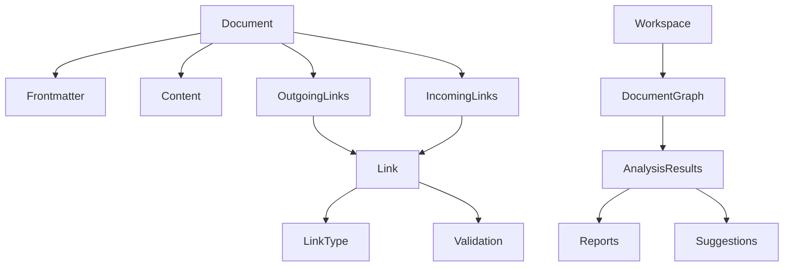

# DocGraph Future - 完整愿景

> **定位**：完整的文档关系分析工具生态系统  
> **状态**：愿景规划，远期目标  
> **参考**：基于原始完整设计，为v0.1提供设计灵感

## 愿景概述

### 终极目标
构建完整的文档智能分析平台，支持：
- 深度文档关系分析
- 智能链接管理和修复
- 多维度文档健康度评估
- 自动化文档维护工作流

### 与v0.1的关系
- **v0.1**：简化版，聚焦frontmatter解析和汇总
- **future**：完整版，包含所有高级功能
- **演进路径**：v0.1 → v1.0 → v2.0 → future愿景

## 文档结构

### 核心设计文档
1. **[api.md](api.md)** - 完整API设计
   - 5个核心接口定义
   - 完整的数据模型
   - 错误处理体系

2. **[spec.md](spec.md)** - 完整规范
   - 25条规范性条款
   - 详细的约束和验收标准
   - 错误处理SSOT

### 规划文档
3. **[roadmap.md](roadmap.md)** - 演进路线图（待创建）
4. **vision.md** - 技术愿景（待创建）
5. **research/** - 技术调研（待创建）

## 功能架构

### 核心模块（完整版）
1. **文档解析器**：完整的Markdown解析，包含正文分析
2. **链接追踪器**：文档链接提取、分类和验证
3. **双向链接检查器**：智能双向链接检测和修复建议
4. **索引生成器**：灵活的表格生成和格式化
5. **工作区扫描器**：增量扫描和文件监听

### 高级功能
6. **语义分析**：文档内容理解和分类
7. **依赖分析**：文档间依赖关系可视化
8. **健康度评估**：文档质量评分和建议
9. **自动化修复**：智能修复常见文档问题
10. **集成扩展**：与IDE、CI/CD等工具集成

## 技术架构

### 核心技术栈
- **Markdown解析**：Markdig（完整CommonMark支持）
- **图算法**：文档关系图分析和遍历
- **机器学习**：文档内容分类和摘要（可选）
- **增量处理**：文件系统监听和增量更新
- **分布式处理**：大规模文档集并行处理（可选）

### 数据模型


## 使用场景（完整版）

### 场景1：智能文档关系管理
```bash
# 分析文档关系图
docgraph analyze ./docs --graph --output ./docs/relationship.png

# 检测文档孤岛
docgraph analyze ./docs --find-isolates

# 建议链接优化
docgraph suggest ./docs --optimize-links
```

### 场景2：自动化文档维护
```bash
# 自动修复断裂链接
docgraph fix ./docs --broken-links

# 同步双向链接
docgraph sync ./docs --bidirectional

# 生成文档健康报告
docgraph health ./docs --report
```

### 场景3：团队协作增强
```bash
# 检测文档冲突
docgraph detect ./docs --conflicts

# 分配文档维护任务
docgraph assign ./docs --by-owner

# 跟踪文档演进历史
docgraph history ./docs --timeline
```

## 设计原则（完整版）

### 1. 智能性原则
- 理解文档语义而不仅是语法
- 提供智能建议而非简单报告
- 学习团队模式并自适应

### 2. 自动化原则
- 自动化重复性文档维护任务
- 提供一键修复常见问题
- 集成到开发工作流中

### 3. 协作性原则
- 支持团队协作和权限管理
- 提供变更建议和评审流程
- 集成到代码评审流程

### 4. 可扩展性原则
- 插件化架构支持功能扩展
- API优先设计支持集成
- 配置驱动适应不同场景

## 演进路线

### 阶段1：基础能力（v0.1-v1.0）
- frontmatter解析和汇总
- 基本链接提取
- 简单表格生成

### 阶段2：智能分析（v1.0-v2.0）
- 完整Markdown解析
- 双向链接检测
- 文档健康度评估

### 阶段3：自动化（v2.0-v3.0）
- 智能修复建议
- 自动化工作流
- 团队协作功能

### 阶段4：生态系统（v3.0+）
- 插件生态系统
- 云服务和API
- AI增强功能

## 参考价值

### 对v0.1的指导意义
1. **接口设计参考**：api.md中的接口设计理念
2. **错误处理参考**：spec.md中的错误处理SSOT设计
3. **扩展点预留**：为未来功能预留接口扩展点
4. **设计模式参考**：完整版中的设计模式和最佳实践

### 使用建议
- v0.1开发时参考future中的设计理念
- 但严格遵循v0.1的简化范围和约束
- 未来演进时基于future愿景规划

## 贡献指南

### 愿景讨论
- future版本是愿景规划，欢迎提出创新想法
- 所有建议需有具体使用场景和价值分析
- 讨论时明确标注"future愿景建议"

### 技术调研
- 欢迎提交技术调研报告
- 需要评估技术可行性和实现成本
- 提供原型或概念验证

---

**注意**：future版本是远期规划，当前团队焦点是v0.1 MVP开发。所有future相关讨论不应影响v0.1的开发进度。