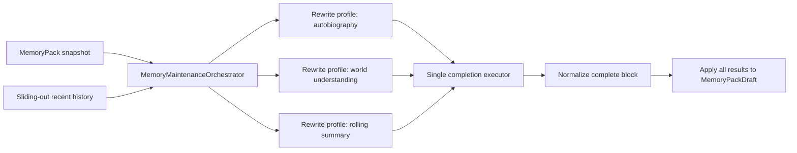

# MemoryMaintainer 瘦身重构

## 状态

- 决策日期：2026-07-22
- 实验快照 tag：`memory-maintainer-agentic-experiment-v1`
- 快照 commit：`15e10994ec04c6e095a9d9b8d7c3f3b085b65cf5`
- 当前方向：活跃实现收缩为单次完整 Rewrite；两阶段 Text Edit Agent 实现从主线删除
- 实施状态：已完成；代码、测试、BacktestCli 与共享 history split policy 已迁移

## 背景

MemoryMaintainer 实验先后实现了三类执行协议：

1. 通用 completion tool-loop，通过 `ToolSession` 反复调用工具后输出完整 block。
2. 自传专用两阶段 Text Edit Agent：Recording 墈量编辑，再按 watermark 触发 Compression。
3. 单次完整 Rewrite：模型读取既有 MemoryPack 与即将滑出窗口的 recent history，一次返回完整新版 block。

回测表明，Text Edit tool-loop 没有带来足以抵消其复杂度、token 成本和延迟的质量收益。Rewrite 对当前规模的自传与 world-understanding 更稳定，也更容易审阅。旧实现及测试约两千余行，并且只被 BacktestCli 实验入口引用，没有进入 Galatea 或 FamilyChat 的在线路径。

因此，主线不继续携带失败实验的运行时代码。完整实现保存在上述 Git tag 中，未来探索 Agentic memory 时按需查阅，而不是预先维护一套尚无明确技术路线的抽象。

## 决策

### 活跃写入路径采用 Rewrite

当前只保留一类 LLM block maintainer：

- 输入：既有 `MemoryPack` 渲染出的 context header、即将滑出窗口的 recent history、目标 block 元数据。
- 执行：单次 completion，不暴露工具，不运行 tool-loop。
- 输出：目标 block 的完整替换文本。
- 规范化：统一过滤 reasoning、去除包裹整篇正文的 Markdown fence、trim 首尾空白。

自传、world-understanding 与 rolling summary 仅通过 profile 的 `Id`、`Target` 和 prompts 区分，不各自复制执行器。

### 删除当前 Agentic 实验实现

从主线删除：

- Autobiographical Recording / Compression / two-stage pipeline。
- `MemoryDocumentAgentLoop`、编辑 session、block-ID 工具与 finish 协议。
- 旧的通用 role-play tool-loop wrappers。
- BacktestCli 中对应命令、preset、结果模型与说明。
- 只服务于上述实现的 prompts、embedded resources 和测试。

Git tag 是这批代码的检索入口，不保留 deprecated wrapper 或兼容分支。

### 保留最小 block-transform 合同

以下概念仍有独立价值：

- `MemoryPack` / `MemoryPackDraft`：常驻信息的快照与无副作用更新。
- `RecentHistorySlice`：一次维护 epoch 的输入窗口。
- `IMemoryBlockMaintainer`：给定窗口与旧 block，返回完整新 block。
- maintainer `Id` 与 `Target` 唯一性校验。
- 多个 maintainer 基于同一快照并行计算，全部完成后统一应用。

这些合同不依赖 LLM、Rewrite 或工具。未来规则型、外部服务型和 Agentic maintainer 仍可直接实现该接口。

## 目标结构



核心执行器不接收 `ToolSession`，也没有 `includeOldBlockInPrompt` 模式开关。Rewrite 的旧 block 已作为 MemoryPack context header 的一部分出现，不在末尾 instruction 重复注入。

## 面向未来的 Agentic Memory 边界

仅用 Rewrite 维护常驻信息有明确容量上限，也不能完成按任务动态召回。未来可能采用带标签数据库、向量索引、图数据库、专用记忆 LLM 会话，或它们的组合。本次瘦身不否定这些方向，但不在技术路线未知时预埋具体工具协议。

未来应区分两条数据流：

### 写入与巩固

`IMemoryBlockMaintainer` 负责一次 epoch 后的 durable state transition。Agentic 实现可以：

- 写入或整理外部 memory store。
- 调用检索、聚类、去重或图谱工具。
- 更新一个小型常驻索引、摘要或状态 block。
- 最终仍返回自己负责的完整 MemoryPack block。

tool-loop 是具体实现的内部机制，不进入所有 maintainer 的公共合同。届时应根据实际存储技术重新设计执行器，不恢复本次删除的 Text Edit 协议作为兼容层。

### 动态召回

动态召回应是独立的 read path：依据当前用户消息、计划或任务，从外部 memory store 选取材料并投影到当轮上下文。它不等同于“维护一个 block”，不应通过扩张 `IMemoryBlockMaintainer` 来表达。

未来可以引入类似 `IMemoryRetriever` / `IContextMemorySource` 的独立合同，但只有在第一种真实后端和注入策略明确后再设计。写入 maintainer 与读取 retriever 可以共享 store，不必共享生命周期或返回类型。

## 实施步骤

1. 删除两阶段 Text Edit Agent、旧 wrappers、专用 CLI 命令/presets、资源和测试。
2. 将通用 completion maintainer 收缩并重命名为单次 Rewrite 执行器。
3. 用 `MemoryRewriteProfile` 数据化 autobiography、world-understanding 和 rolling-summary 配置。
4. 收紧 request/result：删除只为已移除 tool-loop pipeline 服务的重复状态和审计字段。
5. 让 Engine 与 BacktestCli 复用同一批次编排和 history split policy，避免回测与未来在线路径漂移。
6. 更新 BacktestCli README 与相关工程文档，明确当前支持范围和 archive tag。

## 验收标准

- autobiography 与 world-understanding 的 prompt、target、carrier 和中文默认行为不变。
- 旧 block 在 Rewrite completion context 中只出现一次。
- rolling summary 同样使用单次 Rewrite，不重复注入旧 summary。
- BacktestCli 只展示仍可运行的 preset 和参数。
- `ChatSession.Memory.Tests`、相关 `ChatSession` / BacktestCli 构建与格式检查通过。
- 主线不再引用 `MemoryDocument*`、Recording、Compression 或旧 role-play maintainer。

## 查阅旧实验

需要研究旧 Text Edit Agent 时使用：

```bash
git show memory-maintainer-agentic-experiment-v1:prototypes/ChatSession.Memory/MemoryDocumentAgentLoop.cs
git show memory-maintainer-agentic-experiment-v1:prototypes/ChatSession.Memory/AutobiographicalMemoryMaintainer.cs
git diff memory-maintainer-agentic-experiment-v1..HEAD -- prototypes/ChatSession.Memory prototypes/ChatSession.BacktestCli
```

不要为了参考旧实现而在主线恢复兼容层；若未来实验值得继续，应从当时已知的后端、召回合同和质量指标出发建立新的垂直切片。
