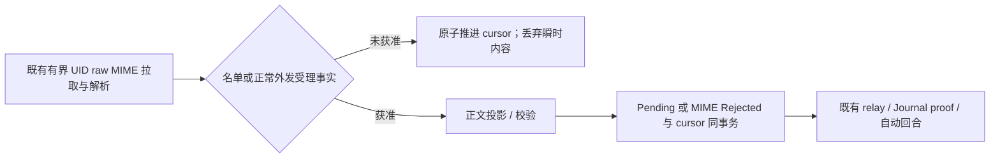

# IMAP 自动展示准入：设计与施工方案

状态：已完成两轮 dialectical-simplification 审查，尚未实施。日期：2026-10-07。代码基线：`g01/smtp-outbound` / `b47848f1`。本轮只修改文档和运行内存 SQL 原型，不读取私有配置或真实邮箱。

最小模型是：**启动配置中的自动展示名单，与同角色已持久受理的外发 email 收件人取并集。只有获准邮件进入角色经历并自动触发回合；陌生邮件只推进收取游标。** 用户已进一步明确：派生许可跟随角色保留，修正 SMTP endpoint 或更换角色邮箱不会撤销原联系人的许可。

本文件是[IMAP MVP 主方案](imap-email-mvp-design-and-implementation.md)的准入规则与施工入口；主方案拥有传输、首次新信基线、MIME 限额、入箱与 Journal proof。直接合入拟实施的 V16 / Delegation V8，不先上线无条件自动展示，也不增加 V17 / V9。

## 1. 需求账本与证据边界

| 编号 | 要求与来源 | 当前消费者 |
|:--|:--|:--|
| U1 | 用户本轮明确：runtime 管理的自动展示名单是 MVP 核心。 | 每角色 IMAP 来信入口。 |
| U2 | 用户本轮明确：角色主动向某地址写信，意味着愿意接收对方回信。 | 已实施 SMTP 外发与拟实施 IMAP 入箱。 |
| U3 | 用户本轮明确：角色自主查信、取信延后。 | 本轮不增加角色操作或查询协议。 |
| U4 | 用户此前明确：首次只收启用后的新信；持久化后自动触发来信回合。 | 此次将自动回合限定为获准邮件；首次基线不变。 |
| U5 | 用户本轮澄清：派生联系人许可跟随同一角色的持久 store 保留。 | SMTP endpoint / 邮箱变更不撤销许可，不跨角色或 store 查询。 |
| C1 | CaptureActionBatch 同事务创建 action_capture、outbound_mail 和真正外发 email 的 smtp_mail_outbox。 | 派生联系人直接读取已有事实，无第二联系人状态。 |
| C2 | SMTP 状态管理发送过程；现有 Unknown 测试覆盖远端接受后、本地结果提交前中断。 | 不能等 ProviderAccepted 才承认联系人，也不能因收件规则重发 Unknown。 |
| C3 | 当前 Quarantined 阻断 writer；已有 relay 使用 TurnLock 与精确 Journal proof。 | 正常筛选不进入故障 gate，获准入箱后继续已有投递证明。 |
| C4 | 当前 root V15、Delegation V7；IMAP V16 / V8 / Observation v5 均未实施。 | 同次格式升级，无已发布 IMAP 兼容义务。 |
| P1 | 本方案默认：许可长期跟随保留的正常外发受理事实；名单/联系人变化只影响尚未裁决的 UID。 | 无 TTL、撤销、历史重判或取信消费者。 |
| P2 | 本方案默认：未知信正文不持久、不投射；原件留服务商，只提交单调 cursor。 | 无逐封筛选审计 API，不为诊断新建持久账本。 |

U 是用户决定，C 来自源码/测试，P 是明确默认。主 IMAP 文档是同源提案，不是独立需求证据。运行模型为单 host、每角色独占 SQLite owner、单个不重叠 poll、启动配置冻结；网络/正文投影不持有事务。没有游标倒退、陌生信历史重判或跨 store 联系人搜索。scope 争议已由 U5 结束，没有待用户批准的实施前置产品问题。

证据入口：[capture 同事务](../../prototypes/Galatea/GalateaDelegationSqliteStore.Transitions.cs)、[SMTP outbox 与引用验证](../../prototypes/Galatea/GalateaDelegationSqliteStore.Smtp.cs)、[Unknown 中断测试](../../tests/Galatea.Server.Tests/GalateaSmtpOutboundTests.cs)、[Quarantined writer gate](../../prototypes/Galatea/GalateaCharacterMailDelivery.cs)。

## 2. 配置与唯一地址比较规则

拟 V16 的 `characters[].email.imap` 增加 `autoDisplaySenders`，缺省 `[]`；两个许可来源固定启用，不增加选配策略组合。

```json
{
  "imap": {
    "host": "imap.example.test",
    "port": 993,
    "tlsMode": "implicit",
    "autoDisplaySenders": ["friend@example.test"]
  }
}
```

数组最多 128 个，只接受既有 GalateaExternalMailAddress 支持的单个 ASCII 地址；拒绝重复项、域名通配符、正则和任意 expression。名单重复与入信匹配使用同一规则：**domain ASCII 不区分大小写，local-part Ordinal 精确**。不去掉 plus-tag、不合并别名、不修改发送地址或已有 artifact。[RFC 5321 §2.4](https://www.rfc-editor.org/rfc/rfc5321.html#section-2.4) 支持此边界。

From 只取 MimeKit 解析出的单个 mailbox address。多 From header、多地址、非法/超限地址拒收，不选第一个，不从 display name、Reply-To 或正文签名回退。命中不升级成 Player / Character identity，Observation 仍是 runtime 报告的外部声明。

名单随内部启动快照冻结，修改后重启；没有热更新 API、角色管理工具或列表展示。名单不进入 SMTP / IMAP accountReference 指纹，增删名单不重建 UID 基线、不改变发送身份；其内容和解析错误原值不进入角色投影或日志。

## 3. 派生联系人只有一个事实源

```text
Allowed(from) = ConfiguredAutoDisplaySenders.Contains(from)
             OR ExistsAcceptedOutboundEmailInThisRoleStore(from)
```

事实源只有同角色 store 的 `smtp_mail_outbox`。仅认可该 owner.CharacterId 对应的正常 `smtp:<characterId>:` 引用；排除 blocked / offline，不比较当前账号指纹，不读取发送状态或正文。

**受理边界是正常 SMTP outbox 行同 capture 已提交。** 抽取候选、叙事中提到地址、Codex/站内邮件、旧无 SMTP outbox 的 Unrouted、SMTP_DISABLED / NO_SENDER_BINDING 等 blocked 引用均不产生许可。正常引用的 Pending / Attempting / ProviderAccepted / DefiniteFailure / OutcomeUnknown 均可产生许可：规则表达角色选择通信对象，不表达发送成功。网络失败和捕获时无可用绑定不能按同一 DefiniteFailure 状态排除。

回信可能在 ProviderAccepted 落库前到达，也可能对应 Unknown；不等待发送终态、不监听成功事件、不建联系人表/持久缓存/回放。旧 V7 正常 outbox 可直接作为依据，无历史提取或旧发送重放。角色 Undo 不撤销已有外发受理事实。

许可长期跟随同一角色的持久 store，换邮箱、SMTP/IMAP endpoint 或授权码不撤销；换角色/store 不跨仓继承。既有 SMTP 捕获指纹、换 endpoint 拒绝旧队列、Unknown 禁止自动重发的合同完整保留：接收意愿与发送工作身份各有自己的责任。

### 窄查询与标准索引

禁止每封入信通过 ReadSnapshot 装入全历史 subject/body。查询只返回 bool；一个普通 recipient 索引，没有新列、地址回填、自定义 collation 或准入来源字段：

```sql
CREATE INDEX ix_smtp_auto_display_sender
ON smtp_mail_outbox(recipient COLLATE NOCASE);

SELECT 1
FROM smtp_mail_outbox
WHERE from_character_id = $character
  AND substr(sender_account_reference, 1, length($smtpPrefix))
      = $smtpPrefix COLLATE BINARY
  AND recipient = $from COLLATE NOCASE
  AND substr(recipient, 1, instr(recipient, '@') - 1) = $local COLLATE BINARY
LIMIT 1;
```

`$smtpPrefix = "smtp:" + owner.CharacterId + ":"`，参数化精确前缀，不用通配 LIKE。已有打开验证确保 owner、引用语法及 outbox/capture 一致性；新增查询仍使用这些边界，读失败或校验错误不能视为“陌生人”。NOCASE 缩小 ASCII 候选，BINARY local-part 保留精确语义。V8 strict schema 新增索引预期，并针对该索引用 index_xinfo 核对 NOCASE，不建设通用索引框架。

内存 SQLite 原型已验证 7 个地址/作用域样本、cursor-only 提交顺序及索引 SEARCH；真实 store 集成仍须下一轮验收。

checkpoint COMMIT 不明的确认采用窄 checkpoint 后态读取；现有 ExecuteWrite 在不明提交时调用 ReadSnapshotCore，不能直接作为该操作的确认路径而装入无关正文。沿用 owner、异常分类和精确后态原则，只补这个 domain 操作所需的读回，不泛化写入平台。

## 4. 一次有界拉取，事务内裁决



复用主方案唯一 raw 路径：UID size summary + 最多 raw-limit+1 的 partial BODY.PEEK，raw 2 MiB、MaxMimeDepth=32、每 poll 16 封等限额不变；size 不能替代实际字节上限。解析 From 后、访问/解码正文和生成 MailboxMessage 前准入。未知 raw 可以短暂存在内存，但不得进入持久正文、日志、receipt、status、Journal、recap 或 Note。删除独立 HEADER→BODY 两次请求；减少未知下载量的优化延后。

读完合法 From 后只调用一次最终 store 操作，在 owner gate 的短事务内核对预期 accountReference / UIDVALIDITY / cursor / revision，读取启动名单与 outbox bool：

- 未获准：只 CAS 前移 checkpoint 的 cursor/revision，提交后丢弃 MIME/raw；不写 external_mail_inbox、不创建 messageId、不占 Pending 名额、不唤醒角色。最近 poll 的 filteredCount 可在内存计数。
- 获准：返回 true，不前移 cursor；事务外解码/投影正文，再将 Pending 或明确 MIME Rejected 与 cursor 同事务提交。Allowed 只在内存，无持久阶段或来源证明副本。
- 容量满：可已读取这封有界 raw 用于分类；首封获准信无法入箱时停止，不前移、不误判拒收、不越过它处理后续 UID。

不增加预查/复查两条路径。capture 与最终准入使用同一 owner gate，提交顺序就是因果边界，不比较外部 Date 与本地发件时间。发件先提交则此次查询看到许可；未获准 cursor 先提交则该信保持过滤，后续新信才受新许可影响。运行中名单冻结且正常受理事实不撤销，因此 true 到正文入箱无需第二份授权状态。

### 游标就是陌生信的提交证明

已越过的 UID 不自动回头。新增名单或后来主动写信不补投此前陌生信；删除名单不撤销此前已入箱的 Pending/Bound/Observed。未提交收件事务的 UID 在重启后重新裁决。立即暂停新自动处理使用 IMAP 开关；Bound proof gate 继续有效。

| 故障窗口 | 最小处理 |
|:--|:--|
| 发件候选或 capture 回滚 | 无正常 outbox 提交事实，不产生许可。 |
| 远端收信但本地 Attempting/Unknown | 许可已随 capture 存在，不重发 SMTP。 |
| 未获准 cursor 已提交后崩溃 | 从 cursor+1 扫描，不再处理该信，不需要逐 UID 行。 |
| cursor COMMIT 结果不明 | 保持 owner gate，关闭原 connection，窄读相同命名空间 checkpoint 的预期后态；确认提交则继续，确认原态可重新裁决，不明/冲突停止，不猜失败。 |
| 获准、正文入箱前崩溃 | cursor 未前移，下次重新有界读取/裁决。 |
| 获准 row+cursor 已提交、relay 未启动 | Pending 保留，继续既有 proof，不建立第二个来信 Observation。 |
| UIDVALIDITY 改变 | 沿主方案阻断；显式 rebaseline 用新 validity / UIDNEXT−1 跳过当时旧信，不回退旧命名空间或复活过滤信。 |

只跨越确认不存在的 UID 空隙，不越过未处置获准 UID。获准 inbox 的 UID 唯一键、内容冻结及 Journal proof 保留。MIME malformed/超限仍按主方案写正常 Rejected；策略过滤不增加 Filtered、Held 或 Quarantined 状态。Quarantined 只属于投递证明异常，会阻断 writer；陌生信不进该 gate。

原件留服务商，不置 Seen、不移动删除。当前没有逐封筛选历史、待审 UI 或重新放行 API；将来确需这些能力时再定义消费者和历史取回语义。

## 5. 延后范围与真实性边界

延后自主查信/取信、角色管理名单、网页待审/放行、筛选 LLM、主题列表/摘要、联系人撤销/黑名单、TTL、线程许可、持久唤醒配额及独立头部下载优化。触发条件是用户明确需要自主操作/历史重判，或实际获准流量/未知下载成本成为问题。

地址名单降低陌生流量进入角色注意力的机会，不构成强身份认证或总唤醒上限。From 可伪造，获准联系人也能发垃圾或高频邮件。未来使用 Authentication-Results 需验证收件服务商信任边界，不能信任任意自带字段。[RFC 8601 §1.2](https://www.rfc-editor.org/rfc/rfc8601.html#section-1.2)

复用主方案只读 status，至多增加最近 poll 的进程内 filteredCount，不加全历史聚合或正文预览。诊断仅固定阶段/原因码、UID/计数和 exceptionType，不含名单、主题、正文、协议原文、秘密或路径。实施时角色协议只补充“主动外发建立后续新信接收意愿，陌生信不自动入场”的行为，不注入版本、索引或 operator 文档。

## 6. 施工切片与验收

| 切片 | 最小纵向产物与验收 |
|:--|:--|
| A1 配置与真实持久准入 | 接入 IMAP I1 的 V16 数组和 V8 recipient 索引；真实 loader/store 验证静态、正常 outbox、blocked/offline/其它角色。窄查询不读历史正文。 |
| A2 有界 MIME 到角色 | 接入 IMAP I3 单次有界 raw，在正文投影前原子准入；未知仅 checkpoint 变化，获准 row+cursor 同事务，再走 relay/proof。未知 sentinel 不进持久正文或角色上下文。 |
| A3 故障回归与两邮箱 canary | capture/准入提交顺序、COMMIT 不明、重启、名单/邮箱变化、Unknown 不重发及 SMTP/站内/人工入信回归；两受控邮箱按下面步骤真实验证。 |

主要落点：strict reader / email settings；GalateaExternalMailAddress 附近的唯一比较函数；GalateaDelegationSqliteStore.Smtp.cs 窄查询与 schema/upgrade 索引集合；拟 IMAP inbox partial 的 checkpoint 裁决、poller / MIME decoder 的投影边界。SMTP sender、TextExtractor、收据和 SessionJournal 核心不为准入重构。

真实验收使用新的隔离 store/session，两账号足够，旧 canary 邮件由首次基线跳过。第 1–3 步关闭宿主 SMTP，用普通邮件客户端发送受控测试信；第 4 步再启用宿主 SMTP，不能以 blocked 捕获冒充正常受理：

1. 两账号 baseline Ready；接收角色空静态名单、没有向对方的正常 outbox。寄唯一新信，确认 cursor 前进、无 inbox/Journal 正文、Seen 不变。
2. 加入对方静态地址，重启保留 checkpoint；寄另一新信确认入 Journal/完成回合，之前过滤信不补投。
3. 清空静态名单，核查第 2 步没有自动回信产生联系人；寄新信仍应过滤。若已提前回复，事实不得删除或伪称不存在，改用新隔离实例重做来源隔离验证。
4. 启用 SMTP 并重启保留 checkpoint，再让接收角色真实受理向对方的外发 email；空静态名单下接收一封唯一新信，应由派生许可入场；冷重开不新增 Observation。

静态阶段要求角色只确认内容、不回复，并核查 outbox，否则两个许可来源的证据会混合。多角色不串用、建立联系人后其它未知 From 仍拒绝、正常绑定网络失败/Unknown、domain/local-part/plus-tag、背压、缺省名单与配置严格性由合成测试覆盖。

.NET 检查按主方案串行 `--no-restore -m:1 -nr:false`。本轮只完成文档、SQL 原型与审查，真实 store/.NET/IMAP 验证留到实施阶段，完成声明须逐项区分。

## 7. 两轮辩证审查与裁决

三位 reviewer 分别担任 Demand skeptic、Minimal architect、Semantic defender。Round 1 独立读同一草案/账本，Round 2 steelman 对方的 crash、scope、下载和历史反例；主线程核查代码与内存 SQL，不按票数裁决。scope 由用户 U5 决定，其余已收敛，无第三轮未决争议。

| Verdict | 结论与保留理由 |
|:--|:--|
| keep | 正常 capture 提交即许可；等 ProviderAccepted 会拒绝“远端接受、本地 Unknown”的回信。保留 owner、地址语义、原子 cursor、获准 inbox 与 Journal proof。 |
| simplify | 绑定范围改角色 store；三键索引缩 recipient 单键；一次最终事务、一次既有有界 raw，保留因果和资源上限。 |
| delete | Filtered 枚举/陌生逐 UID 行、admissionSource/dispatchId 两持久说明字段、双命中优先级、独立预查询、强制 HEADER→BODY 及第三测试地址前置条件。 |
| merge | 准入直接合入未实施 V16/V8 和 IMAP poll/inbox；SMTP outbox 是唯一联系人事实源。 |
| defer | 自主查取信、待审/历史重判、TTL/撤销/线程、筛选模型、认证平台、唤醒配额、下载优化，有消费者再建。 |

消除的矛盾：主方案所有合法新信自动入场；发送 descriptor 被草案扩成社交许可身份；把陌生字节进内存误当角色已经注意；把诊断行误当游标恢复必要条件。初稿的两个准入说明字段和一个新状态均删除。最终增量是一个配置数组、一个标准索引/窄查询、一个正文投影前的原子准入操作；新增角色交互协议、联系人表和持久筛选状态均为零。
