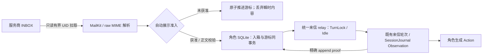

# 每角色 IMAP 收件：MVP 设计与实施方案

状态：设计完成，尚未实施。日期：2026-10-07。代码基线：`g01/smtp-outbound` / `a673ee2f`；SMTP 产品实施为 `cd6d7dbd`，两个目标账号互发与实际收件已通过[SMTP 验收](smtp-email-mvp-design-and-implementation.md#9-2026-10-07-实施与验收记录)。本轮没有登录 IMAP、读取真实邮箱、切换实例配置或修改产品代码。

用户已明确：**首次只接收启用后的新邮件；获准新邮件持久化后自动触发来信回合。** 后续[自动展示准入设计与施工方案](imap-email-auto-display-admission-design.md)收紧了原来“所有合法新信自动入场”的前提：静态自动展示名单与同角色正常外发受理事实取并集，派生许可跟随角色 store 保留；自主查信/取信延后。该补充方案拥有准入规则，本文件拥有传输、持久入箱和投递证明。

## 1. 产品行为与现有入口

每个角色沿用自己的 email 地址与明文授权码，新增可选 IMAP endpoint。开启后只读 `INBOX`，先建立新信基线，再定时有界拉取；合法且获准的新信先持久入箱，再在角色 Idle 时启动来信回合。未获准信只原子推进游标，原件留服务商，不进入角色经历。角色忙、模型失败或进程重启，不丢掉已入箱邮件，也不把同一封邮件作为新的 Observation 再投递。



现有代码提供了大部分角色侧能力：

| 入口 | 已有行为与本次使用方式 |
|:--|:--|
| [Program.cs](../../prototypes/Galatea/Program.cs) 的 `/mailbox/inbound` | 人工注入后立即启动来信轮次；每次生成新 messageId，角色忙时拒绝。IMAP 不循环调用它，不伪造 Player 登录。 |
| [MailboxMessage](../../prototypes/Galatea/Mailbox/GalateaMailbox.cs) | 已有收件人、声明发件人、主题、正文和宿主 messageId 的合法性检查；可恢复已持久的 canonical envelope。 |
| [CharacterMailRelay](../../prototypes/Galatea/GalateaCharacterMailRelay.cs) | 已有后台 sweep、非阻塞 TurnLock、Idle admission、失败暂停与 accepted runner；扩成站内信和 IMAP 共用的单一来信 scheduler。 |
| [CharacterMailDelivery](../../prototypes/Galatea/GalateaCharacterMailDelivery.cs) | 发送前冻结 exact base / structured Observation，按 Journal proof 对账；复用证明逻辑，给本地收件账本增加一个明确适配。 |
| [GalateaServices.cs](../../prototypes/Galatea/GalateaServices.cs) | `StartInboundMailTurn`、fresh admission、RecapGrid、生成和恢复已有完整链路。 |
| [Observation schema](../../prototypes/Galatea.Input/GalateaObservationSchema.cs) | 当前 `inbound-mail` 只接受 Player / Character；真实 email 来源必须新增合法表示，不能直接把 IMAP 接上旧 sender 参数。 |

不新增第二套主角色 runner、消息总线、邮箱 inbox 数据库或通用任务平台。IMAP MIME 解码不调用 LLM，不经过 TextExtractor；只有角色选择发信、保存 Note 时，才使用既有 Action 提取链。

## 2. 配置与账号快照

拟将唯一 root reader 升到 **V16**，不是本轮已生效的配置。保留 SMTP 五字段，email 下新增可选 `imap` object：`host`、`port`、`tlsMode` 与缺省 `[]` 的 `autoDisplaySenders`；object 缺省或 null 表示不拉取。名单规则由准入方案定义。MVP 固定 `INBOX`，不提供任意 folder、独立 IMAP username 或第二份授权码。

```json
{
  "email": {
    "address": "actor@Example.test",
    "authorizationCode": "REPLACE_WITH_PRIVATE_IMAP_SMTP_CODE",
    "smtpHost": "smtp.example.test",
    "smtpPort": 465,
    "tlsMode": "implicit",
    "imap": {
      "host": "imap.example.test",
      "port": 993,
      "tlsMode": "implicit",
      "autoDisplaySenders": ["friend@example.test"]
    }
  },
  "runtime": {
    "imap": {
      "enabled": false,
      "pollIntervalSeconds": 60,
      "timeoutSeconds": 60
    }
  }
}
```

上面是字段归属片段，`email` 实际位于 `characters[]`；其它 V16 root 字段沿用 V15。`enabled` 缺省 false；interval 为 1..3600 秒，timeout 为 1..300 秒。TLS 只接受 `implicit` / `starttls`，没有明文或可降级的 Auto 模式。地址仍同时充当 SMTP 身份与 IMAP 登录用户名。

将现有内部 `GalateaSmtpConfig` 收敛为一个 host-owned `GalateaEmailConfig`：只拥有一份不可变角色账号 map，以及分别非秘密的 SMTP / IMAP policy。`GalateaEmailAccount` 仍为不自动展开秘密的 class，增加不可变的可选 IMAP descriptor。两个网络边界引用同一启动快照，不复制授权码、不建立 credentials provider，不做热更新。

两种非秘密引用独立派生：

- SMTP 保持当前格式与算法：`smtp:<characterId>:SHA256(JSON([address,smtpHost,smtpPort,tlsMode]))`。增加或修正 IMAP 配置不使旧 SMTP Pending 换身份。
- IMAP 使用 `imap:<characterId>:SHA256(JSON([address,imapHost,imapPort,imapTlsMode,"INBOX"]))`。授权码和自动展示名单不入指纹；更换账号或 endpoint 建立新的收件命名空间，但不撤销角色已派生的联系人许可。

全局 IMAP 关闭会暂停新拉取和 IMAP 队列自动 admission，不把 Pending 变失败；已有 Bound 的 proof 对账仍参与全部 writer gate，不能随开关跳过。maintenance mode 同样不联网、不创建会话或收件基线、不消费。重启后继续原游标，停用期间到达的新信仍待接收；“只收新信”仅是首次建立基线的策略，不是每次启用都丢弃积压。

已经持久的来信属于当时绑定的角色和仓库。换 endpoint 或移除 IMAP 配置不将它转给另一角色，也不撤销已收到的邮件；全局恢复投递时仍可投给原目标。角色名或 session 身份漂移按现有 mailbox 门禁阻断，不能静默改写冻结收件人。

## 3. 收取边界、UID 与首次基线

采用 **MailKit + 其 MIME 依赖 MimeKit**。当日 NuGet 官方页的稳定版本为 [MailKit 4.18.1](https://www.nuget.org/packages/MailKit/4.18.1)；实施时固定版本并复核具体 API，使用现有 nuget.org restore，不改 Completion / Storage pin。库负责 IMAP literals、认证协商、MIME 和 charset 元数据；宿主负责业务限额、持久化与角色投递。没有重写既有 SMTP 协议的需求。

连接路径为 TLS → address / authorizationCode 认证 → 在服务端支持 ID 时发送固定产品名与版本 → `INBOX.OpenAsync(FolderAccess.ReadOnly)` → UID 操作 → 断开。ID 不携带用户、机器、路径或授权码；[IdentifyAsync](https://mimekit.net/docs/html/M_MailKit_Net_Imap_ImapClient_IdentifyAsync.htm) 是库提供的扩展入口，具体服务商兼容性必须实测，SMTP 成功不证明 IMAP 可用。

使用只读 EXAMINE 和 `BODY.PEEK`，不设置 Seen，不移动、删除或 EXPUNGE 邮件。去重键是 `(imapAccountReference, UIDVALIDITY, UID)`；邮件序号会随删除变化，RFC Message-ID 又可能缺失或重复，两者都不能取代 UID 身份。[RFC 9051](https://www.rfc-editor.org/rfc/rfc9051.html#section-2.3.1.1) 定义了 mailbox / UIDVALIDITY / UID 的稳定关系与 UIDNEXT 含义。

### 首次只收新信

第一次成功 EXAMINE 后，在本地事务内保存 `uidValidity`、`scannedThroughUid = UIDNEXT - 1`、`baselineAt`，不下载已有邮件。**“开始收新信”以这个事务成功、状态出现 Ready 为界**，不是编辑配置或启动进程的时刻。canary 必须先确认 Ready 再寄测试信。事务结果不明先重读 checkpoint，不重新取一个更晚的基线来覆盖已有值。

UIDNEXT 不可用、为非法值或 UIDVALIDITY 缺失时不能猜测基线；返回固定错误码，不收取。UIDVALIDITY 变化也不自动清空游标：在 checkpoint 持久化 `IMAP_UIDVALIDITY_CHANGED` 阻断，保留原游标和旧收件记录。实施提供一个窄 rebaseline 操作：停服、只读预览当前 validity / UIDNEXT，显式核对旧 checkpoint 后 CAS 更新为新基线并清除此阻断。它跳过当时已存在邮件，不能伪装成连续无遗漏恢复。

### 有界扫描

每个角色只运行一个 poll，不重叠；网络读取不持有 TurnLock 或 SQLite transaction。MVP 顺序轮询各角色，单账号失败后继续其它账号；按下一次 poll 重试瞬态读取，不热循环重试。

每次取当前 `upper = UIDNEXT - 1`，只 SEARCH 一个最多 256 UID 值的闭区间 `[scannedThroughUid+1, min(upper,scannedThroughUid+256)]`，按 UID 升序处理，最多取 16 封。边界计算使用 checked 的宽整数；`upper == cursor` 时不发 SEARCH，同 validity 下 UIDNEXT 倒退或结果超出请求范围则阻断，不能构造反向区间或溢出。不能把 `UID n:*` 的全部结果先装入内存。范围内确认不存在的空隙可前进；达到本轮封数/容量限制则停在最后已决定的 UID，不能跨过还没处理的邮件。

获准邮件的成功导入或明确 MIME 拒收，与 cursor 前移在**同一 SQLite 事务**提交。未获准按准入方案只原子前移 checkpoint，不新增逐 UID 筛选行；没有历史重判/游标倒退。若 SEARCH 后邮件消失，以精确 UID 查询确认不再存在后记录 `IMAP_MESSAGE_VANISHED` 再前进；断网、超时或结果不明不等于“已消失”，不前移。

本方案只保证邮件留在 INBOX 且可读取期间的接收；不保证找回两次 poll 之间被外部客户端移动/删除的邮件。不按 Unseen 筛选，人类已读状态不影响收取。MVP 不监听其它 folder，也不使用 IDLE / QRESYNC。

## 4. MIME 投影与持久收件账本

首版接受 `text/plain` 及含主正文纯文本部分的 multipart 邮件，支持 base64 / quoted-printable、常见合法 charset。选择正文不进入附件或内嵌的 `message/rfc822`；声明发件人要求单个可表示的 ASCII mailbox address，主题由 MIME 解码，空主题归 null。

在 raw MIME 取得单个声明 From 后、解码/投影正文前做自动展示准入。只有获准信继续处理正文；未知瞬时内容丢弃，不持久或进入角色。保留获准信 transfer / charset 解码后的正文，不做 LLM 摘要、HTML 解码或改写。对所选 charset 严格解码；非法编码、XML 不可表示字符、空正文或超限明确拒收。HTML-only 本轮以 `IMAP_UNSUPPORTED_BODY` 拒收，HTML→text 后续再做，不假定不存在的 HtmlToText API、不用正则剥标签。

建议固定的首版预算为：raw MIME 2 MiB、解析 `MaxMimeDepth=32`、最终正文沿用 64 KiB UTF-8、主题 4 KiB、声明发件人 1 KiB、Pending/Bound 至多 128 封且总内容不超过 8 MiB。可调整具体常量，但这些边界必须有真实验证，不能只在拿到无限内容后检查长度。[MimeKit 的 MaxMimeDepth](https://mimekit.net/docs/html/P_MimeKit_ParserOptions_MaxMimeDepth.htm) 可限制递归层数。

先按 UID 获取 size 等最小 summary，再通过 **UID + offset/count 的 partial GetStreamAsync** 请求最多 raw-limit+1 字节并核对实际长度；不用序号 overload，也不用完整 GetMessageAsync 后再声称下载有界。[MailKit API](https://mimekit.net/docs/html/Methods_T_MailKit_Net_Imap_ImapFolder.htm) 提供 UID partial stream overload。fake server 必须验证 EXAMINE、BODY.PEEK 和 partial count。库的缓冲行为需按固定版本确认。

有界整封 MIME 拉取可能包含附件的原始字节，但不解码、另存或投射附件内容，也不下载远端资源。合格邮件只携带附件数量，由新 Observation 标注“附件内容未提供”，不能把附件当正文。大附件使整封 raw MIME 超限时，本轮整封拒收，保留 UID 与原因，继续后续邮件。

沿用每角色现有 Delegation SQLite 和 supervisor 的独占 writer owner，拟显式升级 **V7 → V8**，新增两个表和准入方案的一个 recipient 索引，不补填历史收件，不增加联系人表：

| 表 | 最小持久事实 |
|:--|:--|
| `imap_checkpoint` | accountReference 主键、uidValidity、scannedThroughUid、baselineAt、持久阻断码、revision。 |
| `external_mail_inbox` | 本地入箱顺序、UID 三元组唯一键、持久一次生成的 32-lowerhex messageId、冻结目标 characterId / sessionRepositoryId / 角色名、from / subject / body / attachmentCount、状态与 revision；绑定时的 exact base / structured Observation；证明后的 Observation 地址；拒收/隔离的固定原因码。 |

入箱顺序使用保留终态行的 `INTEGER PRIMARY KEY`，不按时间戳或跨命名空间的 UID 排 FIFO。messageId 是宿主 ID，在首次插入时生成并永久复用；RFC Message-ID 不作为唯一约束。拒收行可以只有 UID、顺序与原因，没有正文。准入内容在第一次成功入库后不可变；事务结果不明重读唯一键，不能以新的 GUID 建一份副本。

poller 开始前复用 services / supervisor 打开配置角色的会话并取得已附着的 store owner，冻结该实际目标仓库身份；不自行从路径打开第二个 writer。maintenance / shutdown 不做此初始化。relay 每次准入都核对冻结的角色、仓库和收件人，与站内信采用同样的身份门禁。

数据状态为 `Pending → ObservationBound → Observed`，另有 MIME 终态 `Rejected` / 证明故障 `Quarantined`。Observed 只表示来信已 durable append，不表示理解、生成成功或回复。陌生信没有新状态/行。首封获准邮件容量满时停止扫描，不前移、不越过；消费后继续。队列/状态用索引和 LIMIT，不将全历史塞进 ReadSnapshot 或上下文。保留入箱事实与去重元数据，不引入 GC / 全历史 rebuild。

## 5. 角色输入与一次投递证明

### 外部来源表示

拟新增 **Galatea Observation v5**：沿用 v4 的必需 connection snapshot，增加 `email-inbound` kind；新鲜宿主输入采用 v5，缺少冻结连接时在写入前失败，不隐式降到旧 schema。旧 v1–v4 仅按原合同读取，不重写历史或 frozen Prepared。新 kind 的 sender 为固定 Galatea runtime，action 包含 messageId、声明 from、目标角色名、subject、body、attachmentCount；不夹入账号授权码、endpoint、UID 游标或邮箱配置。

runtime 证明“从该角色绑定邮箱收到了这封邮件”；MIME From 是未经 Galatea 玩家认证的外部声明。即使地址等于另一角色邮箱，也不把邮件变成站内 Character identity。渲染明确说明外部信封/正文属于数据，不能修改 system 协议；外部内容不能覆盖 runtime sender、目标角色或启用 SMTP 的配置。

把 `GalateaFreshInput.InboundMail` 当前的几个可空来源参数收敛成三种闭合 origin：PlayerInjection、CharacterDelivery、ImapDelivery。人工与站内来源保持原有含义；IMAP 分支选择新输入 kind。这只覆盖三个现有/本轮真实消费者，不扩成可注册的 transport 插件系统。每轮只投一封完整来信，不附整箱正文，不把邮件正文再复制成一条长回执；mailbox turn 仍不携带 PlayerTurn 的 recall / notice enrichment。

### 单一 scheduler 与写门禁

将现有 character relay / delivery binding 扩成一个 inbound-mail relay：两个 durable candidate 来源分别是站内 outbox 与本角色 external inbox；按每来源 FIFO、来源间公平调度。一个目标同一时刻只能有一个 Bound 邮件，绑定和启动必须取得同一个 TurnLock。旧站内 Delivered 和新外部 Observed 在适配器中都表达“已追加 Observation”，不迁移旧 outbox 状态字面值。

提取共用的 exact append proof 与结果裁决，保留两个窄 store 适配；不复制整套 recovery runner。新增 IMAP Bound 必须进入所有既有 writer gate：人工消息、人工收信、自动激活、站内 relay、恢复、Undo。不能只在 IMAP background sweep 中对账；若两个来源同时存在 Bound，阻断目标 writer 并报告冲突，不能各自认为自己唯一。

正常 admission 与故障恢复如下：

1. relay 读一条 Pending，非阻塞取得 TurnLock；先对账所有未决邮件，只在精确 Idle 且没有自动处理失败暂停时继续。
2. 选择一次完整来信和时间戳，沿既有 `StartInboundMailTurn` / accepted runner 创建轮次。SQLite 网络拉取和模型生成不处于同一个事务。
3. runner 完成 desired setup、RecapGrid 等前置准备后，在 `SendAsync` 前 CAS 冻结 exact base 与最终 structured Observation，状态改为 Bound；不要冻结 transient md-json 文本。
4. SessionJournal 追加 Observation。用现有 `ProveExpectedObservationTurnAtSelectedHead` 证明再更新 Observed 与地址；模型是否已成功不影响这个事实。

| 中断 / 证明 | 处理 |
|:--|:--|
| 拉取完成、入库前崩溃 | cursor 未前移，下次重新只读拉取；唯一键防重复。 |
| 邮件行与 cursor 已提交、relay 未启动 | Pending 保留，重启继续。 |
| Bound、Observation 确证 NotAppended | CAS 回 Pending，再正常 admission；不靠找不到一个 hash 就判未追加。 |
| Observation 已追加、SQLite 仍 Bound | InProgress / Terminal / Terminated proof 均可结算 Observed；恢复现有轮次，不建立第二个来信轮次。 |
| Conflict / Corruption | Quarantined，阻断目标 writer；保留事实，不重投。 |
| Retryable / Abandoned / 超出 proof 预算 / 不支持 schema | 按既有 proof 边界阻断或等待；不能降级成未收到。 |
| 模型失败或用户停止 | 已有 Observation 不撤销；使用既有 recovery / settlement，并暂停失败的自动 admission，防止热循环。 |

Undo 不复活 Observed 邮件，也不重置 UID cursor。后续模型重试可能有自己的 provider 边界；本方案的去重承诺是“一个来源对应一次来信 Observation”，不是宣称外部模型调用 exactly-once。

Host 增加 IMAP poller 的注册、BeginShutdown、Drain。先取消拉取与新来信 admission，排空 poll / relay / accepted runner / SMTP consumer，再释放 session 与 store owner；不能仅依赖 HostedService 注册顺序让回调访问已关闭 SQLite。维护模式和关闭期间不建立新的 baseline。

## 6. 可观察性与明确延后的范围

增加独立只读 `GET /api/v1/characters/{characterId}/email/inbound/status`，返回配置/启用状态、收取状态（BaselinePending / Ready / Paused / Blocked）、是否已建立基线、UIDVALIDITY、scannedThroughUid、baselineAt、有界 pendingCount、blockedCode，以及进程内最近 poll 时间/结果。Ready 表示已有持久基线且无已知身份阻断，不保证服务商始终在线。GET 不创建 session、不联网、不 admission、不读正文；状态读取失败也不把队列报告为空。canary 用该入口确认 Ready 后才发新信。

静态名单与既有外发受理派生许可属于本次 MVP；延后自主查信/取信、待审/重新放行、筛选模型、联系人撤销/TTL、持久唤醒配额、强认证平台、HTML-only 转换、附件内容、其它 folders、历史 backfill、IDLE/QRESYNC、OAuth、线程支持和 SMTP Delivered。每项有明确消费者再扩展；当前 IMAP 拉取不需要 TextExtractor 或新模型连接。

自动触发来信回合不等于内置自动回复：是否发信仍由角色的新 Action 与既有 SMTP policy 决定。本轮不新增自动确认邮件或规则式自动回复，也不宣称互回次数有固定上限。canary 来信阶段只确认、不回复并核查 outbox；派生许可阶段另安排一次主动外发 Action，避免提前回复污染两个许可来源的验收，不开启持续互回演练。

诊断使用固定阶段码、UID/计数等宿主元数据与 exceptionType；Warning / Error 不含秘密、正文、原始协议响应、路径或堆栈。不启用 MailKit 原始 ProtocolLogger；新增配置解析同 SMTP 一样检查错误链、unknown / duplicate 字段和 ToString 的授权码边界。无需建设独立密钥服务或通用脱敏平台。

## 7. 实施切片与验收

| 切片 | 产物与验收 |
|:--|:--|
| I1 配置与持久模型 | V16 strict reader（含 autoDisplaySenders）、统一账号快照、两个表/准入索引、V7→V8 显式升级与 maintenance open；准入 A1 同次实施，SMTP 指纹及旧 rows/receipt/proof 不变。 |
| I2 一次可靠来信 | origin 收敛、Observation v5 / projector / recent-view 读取、统一 relay 与全 writer gate；以合成来信证明一次 append、各崩溃点、生成失败、Undo、不冒充 Player/Character。 |
| I3 只读 IMAP 到宿主纵向切片 | MailKit adapter、有界 UID / partial MIME、正文投影前准入 A2、原子 cursor/入箱、拒收/背压/shutdown；fake TLS IMAP + 真实 loader/store/runner，无私有账号，不绕过 relay。 |
| I4 操作入口与回归 | 只读 status、窄 rebaseline preview/apply、bootstrap 默认关闭、V16 当前合同及 V15 历史定位；旧 SMTP、站内信、人工 mail、收据、恢复与 Release 回归通过。 |
| I5 受控真实收件 | 独立 canary 的两个账号 baseline Ready 后按准入 A3 分阶段验证未知过滤、静态名单与主动外发派生许可；对照 UID/Journal，冷重开不重复投递，Seen 不变。 |

主要文件范围：`GalateaConfig.cs` / strict reader / loader / Program；SMTP settings 文件改为 email settings，新增 Mailbox 下的 IMAP adapter / poller / MIME decoder；`GalateaDelegationSqliteStore` schema / upgrade 和新 inbox partial；现有 relay、delivery、FreshInput / AdmissionPlan / ObservationContent；`Galatea.Input` schema / projector / classifier；必要的网页 recent-view 与状态展示。SessionJournal 核心仅复用现有证明 API，不为 IMAP 改写底层日志或新增跨仓 API。

必要测试覆盖：

- 首次跳过既有信；基线提交后到达的新信不漏；cursor commit 不明重读；restart/关闭再开启不重新 baseline。
- 未读变已读、序号重排、UID 空隙、SEARCH 后消失；Message-ID 缺失或重复仍按 UID 去重；UIDVALIDITY 改变暂停，rebaseline 不删旧记录。
- UTF-8 中文、base64、quoted-printable、multipart 的主纯文本；附件/内嵌旧信不是正文；HTML-only、空正文、非法字符、超限记录拒收并继续后续 UID。
- partial 请求和字节上限真实生效；大量新信不做无界 SEARCH / snapshot；满队列不前移，消费后恢复。
- 来信正文伪装 system/Player/Character 字段，实际身份仍是 runtime 数据；秘密 sentinel 不进入配置错误、机读输入、Journal、store、HTTP 或日志。
- 站内信与 IMAP 同时待投时公平处理；目标忙不占用 writer 等待；全 writer gate 与组合 Bound 冲突；Observation 已持久但未生成完成也不重投。
- IMAP 拉取可重试，SMTP Unknown 仍不可自动重发；账号 map 的收敛不能破坏已经验证的 SMTP 故障分类。
- 自动展示准入的来源、作用域、原子 cursor、未知内容隔离与两邮箱验收按补充方案执行；名单变化不补投旧陌生信。

重型 .NET 检查串行，沿用 `--no-restore -m:1 -nr:false`，先针对性、再 Galatea 非 Live 全集与必要 Release；不以只覆盖普通成功样本代替故障边界。文档、测试只用假账号，不读现有授权码。

真实步骤在实施阶段执行：停服备份、预览 V7 state、显式升级候选；先关闭 SMTP / 开启 IMAP，两个 baseline Ready 后验证默认过滤和静态准入。派生阶段开启 SMTP 并重启保留 checkpoint，由角色主动外发受理建立许可，再验证新回信；分阶段步骤以准入 A3 为准。不重新导入原 SMTP canary 的两封历史邮件，不迁移长期角色实例。完成声明区分代码/合成验证、真实账号兼容、Journal 来信、完成回合与长期实例接入，逐项保留证据。

本轮产物仅为该设计和索引维护；未安装包、修改 reader/schema、执行 .NET 或真实 IMAP 测试。下一轮可按 I1–I5 有界实施。
