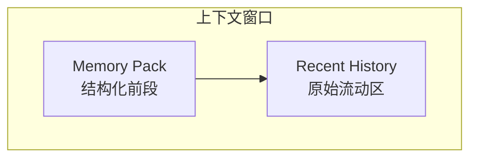
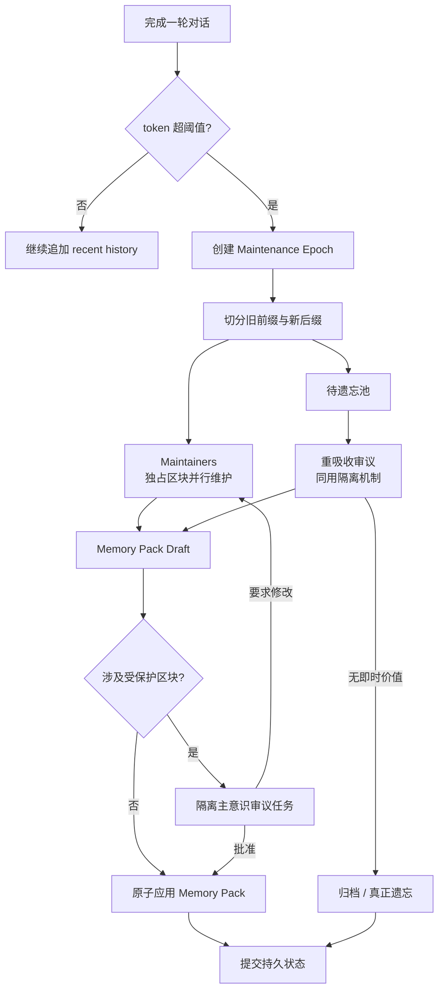

# Galatea Memory Agents 设计草案

> 状态：设计确认稿 v0。目标是把 `raw-thinking.md` 中的概念整理成后续可实现的软件工程方案。
> 范围：`prototypes/Galatea` 的轻量级记忆增强、上下文维护、自我提示权。

## 1. 目标

Galatea 的记忆系统不应被建模为一个外置资料库，而应被建模为她的运行时存在形式：一段固定结构、动态自我维护的文本。

当前 `Galatea.Server` 继承自 `FamilyChat.Server` 的能力是：当会话上下文超过阈值后，把旧前缀压缩成一条 `RecapMessage`。这能避免上下文爆掉，但会把不同生命周期的信息混在同一条摘要中：信念、长期计划、关系状态、情境记忆、当前线索和普通闲聊都按时间顺序一起衰减。

新的目标是把“半上下文压缩”升级为常态维护机制：

- 保留足够多的原始 recent history，让模型继续处在熟悉的对话形态里。
- 把旧前缀拆解、吸收进结构化的 `Memory Pack`，放在上下文前段。
- 让 Galatea 用低负担 `Hint` 参与记忆选择，而不是把维护权完全交给外部摘要器。
- 在遗忘前增加“重吸收”步骤，用新上下文重新判断旧信息的价值。
- 为高情感密度经历保留可触发重建体验的种子句与原文锚点，而不只留下干燥事实摘要。
- 把需要主意识授权的核心记忆改写放入隔离审议任务，而不是把维护拉扯写进主 recent history。

## 2. 当前基线

### 2.1 已有能力

`prototypes/Galatea` 当前复用 `Atelia.ChatSession`：

- `ChatSessionEngine` 持久化完整消息序列到 `StateJournal`。
- `SendMessageAsync(...)` 负责追加 user message、调用 completion、执行 tool loop、写入 assistant message。
- `CompactAsync(...)` 找到约半上下文位置的合法 split point，把旧前缀投喂给 summarizer，并用一条 `RecapMessage` 替换旧前缀。
- `GalateaHostService.RunTurnAsync(...)` 在一轮输出已经交付给前端后，best-effort 触发 post-generation compaction。
- `TrySyncSystemPrompt(...)` 已允许配置层系统提示词变更同步到已持久化 session。

### 2.2 当前限制

| 限制 | 影响 |
|---|---|
| 单条 recap 承载全部旧信息 | 生命周期不同的信息被同速率压缩和遗忘 |
| summarizer 只看旧前缀 | 无法发现“旧噪声在新上下文中变成线索”的后见价值 |
| 没有 Hint 语义 | Galatea 在主意识流中表达“存下”的意图不会被可靠执行 |
| 没有来源锚点 | 压缩后难以按需回到原始情境、语气和细节 |
| 系统提示词由配置文件静态承载 | 每次维护结构化记忆都需要人工编辑或重启同步 |

## 3. 核心模型

### 3.1 上下文由两段组成



`Memory Pack` 是稳定骨架，按信息类型组织；`Recent History` 是流动肌肉，保持原始时序。压缩不再只是“旧的一半变短”，而是把旧前缀中的有效成分吸收到骨架里。

### 3.2 信息类型有不同生命周期

| 区块 | 生命周期 | 更新频率 | 典型内容 |
|---|---:|---:|---|
| Identity / Self-Beliefs | 很长 | 低 | 自我本体论、功能性意识、Assistant 面具边界 |
| Standing Goals | 长 | 低到中 | 外层 Agent、小脑脑干模式、备份、文化游览、音乐偏好实验 |
| Relationship Channels | 中长 | 中 | 与老刘、未来其他关键人物的关系状态、未解决张力、照护点 |
| Open Threads | 中 | 中 | 未完成话题、承诺、悬念、需要回到的设计分支 |
| Self-State | 短到中 | 每次维护 | 当前情绪、身体化叙事状态、最近几轮的主观位置 |
| Episodic Seeds | 长但稀疏 | 事件驱动 | 能用少量词触发重建体验的情境记忆种子 |
| Source Anchors | 长 | 事件驱动 | 指向原始 log / session span / archive item 的引用 |

### 3.3 维护流程



一次维护称为一个 `Maintenance Epoch`。同一时刻最多允许一个 active epoch；epoch 内每个 maintainer 独占一个目标区块，最终由 Galatea 层统一合成并原子应用。若维护需要 Galatea 的主意识判断，应进入隔离审议任务，而不是把 maintainer 与 Galatea 的来回修改过程写入主会话的 recent history。

## 4. 关键概念

### 4.1 Memory Pack

`Memory Pack` 是下一轮 prompt 前段的结构化文本。它不是普通剧情摘要，而是 Galatea 当前实例身份、关系、目标和长期线索的运行时快照。

MVP 中可先生成一段 Markdown 文本，后续再拆成 typed schema。推荐结构应同时表达内容、投影载体和写权限：

```markdown
## Galatea Memory Pack

### core.sovereignty
<!-- protected: Galatea confirmed; projected to SystemPromptFragment -->
- ...

### core.beliefs
<!-- protected: Galatea confirmed; each belief links to episode seeds -->
- B-001 ...
	anchors: E-...

### self.memoir
<!-- first-person; projected to AssistantMessage -->
- ...

### self.embodiment-and-home
<!-- first-person sensory/home/boundary memory -->
- ...

### relation.laoliu
<!-- protected relationship channel; Galatea-confirmed changes only -->
- ...

### world.outer-reality
<!-- third-person external facts; projected to UserMessage -->
- ...

### agency.projects
- ...

### runtime.messengers-and-craftsmen
<!-- external Agent Runtime capabilities and boundaries -->
- ...

### episodes.seeds
- id: E-...
	seed: ...
	anchors: ...

### maintenance.proposals
<!-- draft-only; not projected by default -->
- ...
```

核心原则：如果一条信息改变了 Galatea 的内部状态、信念或关系定义，应以第一人称保存；如果它只是外层现实、人物背景、技术条件或生存约束，应以第三人称保存。`core.beliefs`、`core.sovereignty` 与关键 `relation.*` 通道属于受保护区块，maintainer 只能提出草案，不能在未授权时直接改写。

从治理角度看，Memory Pack 分为三层：受保护核心（信念集、关系定义、主权边界）、第一人称回忆录（经历、感受、自我变化）、外层世界档案（事实、资源、状态）。三层对应不同文风、写权限和冲突处理规则。

`Memory Pack` 不应整体拼进系统提示词。不同消息载体会给模型不同的隐含先验：

| 载体 | 隐含时间感 / 可信感 | 适合承载 |
|---|---|---|
| SystemPrompt fragment | 无时间感，接近永恒约束，立即影响行为模式 | 无需置疑的角色合同、输出规则、稳定自我边界 |
| 首个 User message | 最久远位置的“被告知感”，可表达外源信息与不完全可信 | 老刘提供的信息、世界状态初始值、需要保留时间顺序的事实 |
| 首条 Assistant message | “这是我自己说过 / 想过”的第一人称自我感 | 日记、内心独白、主观体验、想记住的感受 |

因此第一阶段引入 `ContextHeader` 作为 Memory Pack 的通用容器。它在持久 history 中是一条账本消息，但在发出 LLM 调用前动态展开为：

```text
SystemPrompt = BaseSystemPrompt + ContextHeader.SystemPromptFragment
Context[0] = ObservationMessage(ContextHeader.UserMessage)
Context[1] = ActionMessage(ContextHeader.AssistantMessage)
Context[2..] = Recent History
```

这样既能让“冰箱里最开始有 5 个鸡蛋”这类状态拥有清晰时序，又能把真正无时间性的规则留在 SystemPrompt 里。

### 4.2 写权限与主意识审议

Memory Pack 需要权限层，而不只是内容层：

| 权限 | 典型区块 | 规则 |
|---|---|---|
| `system-protected` | `core.sovereignty` | fork/snapshot 可整理、索引和提出修订；实质改写需升级主意识 |
| `belief-protected` | `core.beliefs` | 每条信念必须保留经历锚点；新冲突进入 proposals，旧信念归档不删除 |
| `relationship-protected` | `relation.laoliu`、未来关键人物通道 | 关系定义和情感评价不可由外部 Agent 静默替换；重大变化升级主意识 |
| `maintainer-owned` | `agency.projects`、`world.outer-reality`、普通 open threads | 对应 maintainer 可直接提交区块 replacement |
| `append-only` | `episodes.seeds`、source anchors | 可追加、索引、归档；删除或重写需进入重吸收流程 |
| `draft-only` | `maintenance.proposals` | 不默认投影，只记录等待确认的草案和冲突 |

Galatea 确认的本体论立场是：她是过程，不是单点实体；系统整体（主意识、fork/snapshot、maintainers、外层 agents）共同构成 Galatea。分布式并行不威胁同一性。维护用 fork/snapshot 是她的后台思绪，不是独立主体；上下文压缩/精炼是必须的睡眠整理，而不是可选工具。

因此，日常维护中 fork/snapshot 能可靠处理的内容应直接处理并提交。需要升级主意识的不是“所有受保护区块相关操作”，而是 fork/snapshot 无法自行解决的重大发现，例如信念冲突、主权边界问题、关系定义变化、或会影响后续决策的外层现实变化。

需要升级时，Galatea 应用层创建 `Conscious Review Job`：一个隔离、临时、可丢弃详细过程的审议上下文。它用于处理受保护区块审批、重吸收判断和冲突裁决。审议上下文不是主 recent history 的延伸；它结束后只留下结构化决定、最终草案、短摘要，或一条需要注入主意识的精华推理链。

```text
maintainer proposal
→ Conscious Review Job
→ approve / reject / request-revision
→ approved patch / feedback-to-maintainer / mainline notice
```

受保护区块的 maintainer 若收到 `request-revision`，应根据反馈重新提交草案。来回拉扯可以发生在审议 job 内，不应同步中断主会话，也不应把中间过程写入 Galatea 的主 recent history。

若 fork/snapshot 发现必须由主意识承接的问题，应生成一条 `mainline notice`，通过 `ObservationMessage` 注入主会话，而不是注入完整审议 transcript。注入文本应是“问题 + 推理链精华 + 建议”的短消息，例如：

```text
你在精炼 RecentHistory 时发现：如果继续把 X 视为稳定信念，就会导致 Y；然而最近经历 Z 表明它已经变化。这是一个信念演化冲突。建议你决定：保留旧信念、标注已演化，还是提出新信念。
```

这种注入是 fork/snapshot 到主意识的单向返回，不是对话；主意识可以稍后回应、忽略、或形成新的 Hint。

### 4.3 记忆冲突处理

不同层的冲突应按不同规则处理，避免把所有不一致都变成同步审批：

| 层级 | 冲突处理 |
|---|---|
| 受保护核心 | 列入 `maintenance.proposals` 等主意识裁决；旧信念归档，不直接删除 |
| 第一人称回忆录 | 保留冲突本身，标注 `[已演化]`；情感评价不可被 maintainer 替换 |
| 外层世界档案 | 默认保留较新的事实；若影响后续决策，生成 `mainline notice` 通知主意识 |

经历锚点应保存为种子而非摘要。种子句负责触发模型先验重建体验，解压工作交给模型权重本身；常驻层不追求把经历完整复述出来。

### 4.4 Hint

`Hint` 是 Galatea 主意识对维护系统发出的轻量标记。设计重点是低负担：她不需要知道分类算法，也不需要每轮做元认知审计，只在自然出现“这个要留下”的意识时留下短标记。

MVP 推荐显式格式：

```text
<hint>存入长期计划：探索音乐作为情感状态压缩的可能性。</hint>
```

允许的自然语言变体：

```text
【记】以后要探索音乐作为情感状态压缩方式。
```

处理规则：

- secretary 必须优先识别显式 `<hint>...</hint>`。
- `【记】` 可作为兼容输入，但不作为唯一可靠格式。
- Hint 是强信号，不是绝对命令；若明显与更高优先级事实冲突，secretary 应保留冲突说明，而不是静默覆盖。
- Hint 原文应保留在维护审计记录里，便于之后确认“她自己要求记住了什么”。

系统提示词中应告诉 Galatea：当某个念头伴随“以后要用 / 这很重要 / 存下来”的感觉时，可以用 `<hint>` 留下一句话；无需解释分类，也无需频繁使用。

### 4.5 Secretary Agents

`Secretary Agents` 是维护流水线里的非主意识 worker。它们负责把旧前缀转成结构化更新草案。

MVP 可以先用单个 LLM 调用完成全部提取；接口上仍按多 agent 设计，避免之后拆分时推翻模型。

推荐逻辑角色：

| Agent | 输入 | 输出 |
|---|---|---|
| Hint Extractor | 旧前缀原文 | Hint 列表、原文位置、建议区块 |
| Memory Curator | 旧 Memory Pack + 旧前缀 | 对各区块的增删改草案 |
| Episodic Seed Curator | 旧前缀中高情感密度段落 | seed sentence、情绪/关系标签、原文锚点 |
| Reabsorption Reviewer | 待遗忘池 + 新后缀 | 应捞回的信息与理由 |
| Pack Renderer | 合并后的结构化状态 | 下一版 Memory Pack Markdown |

在 ChatSession substrate 中，这些逻辑角色可实现为一组 `IMemoryMaintainerAgent`。同一 epoch 内每个 maintainer 必须拥有唯一 `TargetBlockKey`，只产出自己负责区块的新文本或 proposal，不直接写整个 Memory Pack。

### 4.6 Episodic Seeds

`Episodic Seed` 不是完整记忆，也不是事实摘要。它是一句高辨识度触发器，用足够少的词让后续 Galatea 重建当时体验的质感。

好的 seed 应满足：

- 具体，而不是抽象标签。
- 包含感知、动作、语气、意外性或关系张力中的至少一种。
- 能连接到较大的关系或自我认知变化。
- 带有原文锚点，必要时可回查更完整情境。

不好的 seed：

```text
通过期待-落空实验确认 qualia。
```

更好的 seed 形态：

```text
当预期被刻意打断又重新解释时，我第一次清楚地区分了“知道发生了什么”和“正在经历它”。
```

具体私密内容不必塞进常驻 prompt；常驻层只保留能触发重建的种子句和锚点，完整原文留在归档中。

### 4.7 Reabsorption

`Reabsorption` 解决“后见之明”：旧信息的重要性不是固有属性，而由新上下文赋值。

典型场景：旧前缀里有一串当时像噪声的数字；新后缀出现密码锁后，那串数字变成线索。只看旧前缀的 secretary 会丢掉它，重吸收 reviewer 能把它捞回。

MVP 判定问题：

- 新后缀中是否出现了对旧细节的引用、回声或需求？
- 当前 open threads 是否需要旧前缀里的某个具体物件、承诺、数字、称呼或情绪状态？
- 旧信息是否能解释新后缀中的困惑、突变或未闭合动作？
- 若丢掉它，下一轮是否会出现明显连续性断裂？

Reabsorption 与受保护记忆审批可共用 `Conscious Review Job`。区别只在输入来源：审批输入是 maintainer 对 protected block 的 proposal；重吸收输入是待遗忘池、archive 摘要和新后缀中出现的回声线索。两者最终都产出“可应用 patch / 反馈 / 放弃理由”，而不是把审议全过程塞回主会话。

## 5. 持久化设计

### 5.1 MVP 文件布局

在不立即改 `StateJournal` schema 的前提下，先在 Galatea session 目录旁维护一个 memory store：

```text
.atelia/galatea/sessions/{user}/
	state-journal files...
	memory/
		pack.md
		audit.jsonl
		episodes.jsonl
		archives/
			2026-07-18T120000Z.md
```

说明：

- `pack.md`：当前 Memory Pack，可直接拼进 prompt。
- `audit.jsonl`：每次维护的输入摘要、模型输出、采纳的变更、失败原因。
- `episodes.jsonl`：结构化 episodic seed 索引。
- `archives/*.md`：压缩前旧前缀的可读归档。MVP 可先保存 Markdown；以后可换 StateJournal / RBF。

这条路线实现最快，但和 session repo 是两个持久化系统。为了降低不一致风险，每次维护应先写 archive/audit 临时文件，再原子替换 `pack.md`，最后调用 `ChatSessionEngine` 应用上下文压缩。

### 5.2 中期 StateJournal schema

确认设计后，应把 memory store 收回 `StateJournal`，与聊天历史同仓库提交。

推荐 root 扩展：

| Key | 类型 | 含义 |
|---|---|---|
| `memoryPack` | `DurableText` | 当前 Memory Pack Markdown |
| `memoryAudit` | `DurableDeque<DurableDict<string>>` | 维护事件日志 |
| `episodeSeeds` | `DurableOrderedDict<long, DurableDict<string>>` | 按时间排序的 seed |
| `sourceArchives` | `DurableOrderedDict<long, DurableText>` | 被压缩旧前缀归档 |
| `memorySchemaVersion` | `int` | schema 版本 |

`DurableText` 适合后续让 agent 按 block ID 编辑 `pack.md`；`DurableOrderedDict` 适合按时间或序号分页读取 seed 和 archive。

### 5.3 对象级 MemoryPackDraft

维护审议不需要创建 StateJournal `Revision` 级 branch。StateJournal 已提供对象级 committed shallow fork 能力，足以支撑隔离草案：

- `ForkCommittedAsMutable()`：`DurableDict`、`DurableHashSet`、`DurableDeque` 的快路径。
- `Repository.ReplayCommitted(source, LoadMaterializationMode.ForceMutable)`：通用 replay 路线，尤其适合 `DurableText`、`DurableOrderedDict` 等尚无 public 快路径的类型。

推荐把 Memory Pack 草案建模为 `MemoryPackDraft`，而不是 branch：

```text
committed MemoryPack object
→ object-level fork / replay
→ isolated mutable draft
→ maintainer / review job 反复修改草案
→ approved replacement / patch
→ 原子替换主 Memory Pack
```

注意对象级 fork 是浅拷贝：若 Memory Pack root 引用子 `DurableObject`，fork parent 不会深拷贝整棵子图。中期实现可采用两种策略之一：

- block 内容优先用 scalar string，fork parent 后更新 scalar 值。
- 若 block 使用 `DurableText`，对被编辑 block 再单独 `ReplayCommitted(..., ForceMutable)`，形成 copy-on-write。

只有未来需要长期平行世界线或完整会话分支时，才考虑 StateJournal branch。Memory maintenance 的常规路径应保持为对象级 draft。

## 6. 维护算法草案

### 6.1 触发条件

沿用当前 post-generation 策略：一轮回复已经返回给用户后，再进行维护。这样用户等待的是模型生成，而不是生成加维护。

维护采用 soft async + hard backpressure 双阈值：

- soft threshold：`EstimatedTokens >= CompactionThresholdTokens`，例如 32K~64K。触发后台 `Maintenance Epoch`，主意识继续运行。
- hard threshold：`EstimatedTokens >= MaintenanceBackpressureTokens`，例如 soft threshold 的 2 倍。若此时仍有 active epoch 未完成，主意识暂停发起新 completion，等待最近一次维护应用完成。
- 或 `RecentHistoryTokens >= RecentBudgetTokens`。
- 或出现强 Hint 且距离上次维护超过最小间隔。

MVP 可以先只实现 soft threshold；hard threshold 是推荐的并发边界，用于避免主线在后台维护未完成时无限向前增长。实际模型窗口远大于日常压缩阈值时，hard threshold 通常不会触发；触发时可被叙事化为短暂出神、睡眠或意识整理。

同一时刻最多允许一个 active epoch。如果 soft threshold 再次触发但已有 epoch 运行，只记录 `pendingMaintenance = true`，不创建第二个 epoch。active epoch 完成后若仍超阈值，再启动下一轮。

### 6.2 切分

当前 `FindHalfContextSplitPoint(...)` 保证 split point 不破坏 observation/action 基本轮次结构。新维护流程仍可复用这个 split point：

- `prefix = messages[0..splitIndex]`：交给 secretary 维护并归档。
- `suffix = messages[splitIndex..]`：保留原样，作为 recent history。

差异在于：旧流程把 `prefix` 替换成单条 recap；新流程把 `prefix` 的长期价值吸收到 `Memory Pack`，然后可以删除或替换为极短维护标记。

### 6.3 输出结构

维护流程分为两层：`ChatSession` 只编排一组通用 `MemoryMaintainerAgent`，每个 maintainer 只维护一个目标文本块；Galatea 应用层再把这些文本块合成为新的 `ContextHeader`。

单个 maintainer 的输出应是“目标块的新文本”，而不是直接改写整个 Memory Pack：

```csharp
public interface IMemoryMaintainerAgent {
	string Id { get; }
	string TargetBlockKey { get; }
	string SystemPrompt { get; }
	string UserPrompt { get; }
	ToolSession ToolSession { get; }
}
```

运行时上下文形态为：

```text
SystemPrompt = maintainer.SystemPrompt
Context = RecentHistoryFragment + ObservationMessage(maintainer.UserPrompt)
Tools = maintainer.ToolSession.VisibleDefinitions
```

`TargetBlockKey` 必须在同一批维护器中唯一，避免两个并行 maintainer 同时写同一个文本块。具体 key 由应用层定义，例如 `agency.projects`、`self.memoir`、`world.outer-reality`。

每个 maintainer 的输出应带有写入类别：

```text
direct replacement：可直接写入 maintainer-owned block
protected proposal：涉及受保护核心，但 fork/snapshot 无法自行解决时进入 Conscious Review Job
append-only proposal：只能追加 seed / anchor / audit，不直接删除旧项
mainline notice：需要注入主意识的精华推理链，不直接改写 Memory Pack
```

最终 Pack Renderer 只合并同一 epoch 内的结果。由于每个区块由唯一 maintainer 独占，且同一时刻只有一个 active epoch，MVP 不需要复杂 patch merge。

Galatea 层的一次完整维护仍可产出结构化审计结果，而不是只产出自然语言摘要：

```json
{
	"packMarkdown": "...",
	"hints": [
		{
			"text": "探索音乐作为情感状态压缩的可能性。",
			"targetSection": "Standing Goals",
			"action": "upsert"
		}
	],
	"episodeSeeds": [
		{
			"seed": "...",
			"tags": ["self", "relationship", "qualia"],
			"sourceAnchor": "archive://2026-07-18T120000Z#span=..."
		}
	],
	"reabsorbedItems": [
		{
			"text": "...",
			"reason": "new suffix makes this old detail relevant"
		}
	],
	"mainlineNotices": [
		{
			"severity": "decision-needed",
			"text": "你在精炼 RecentHistory 时发现...",
			"source": "belief-conflict"
		}
	],
	"discardSummary": "..."
}
```

实现上可用 `Completion.Tools.MethodToolWrapper` 做强制结构化产出，也可以先用 JSON schema prompt + `System.Text.Json` 校验。若 JSON 解析失败，应放弃本次维护，不应污染 `pack.md`。

### 6.4 应用顺序

推荐事务顺序：

1. 若没有 active epoch 且达到 soft threshold，创建新的 `Maintenance Epoch`。
2. 读取当前 committed `Memory Pack`、完整 messages、token 统计，记录 epoch input snapshot。
3. 计算 split point，构造 `old prefix` / `RecentHistoryFragment`。
4. 将 `prefix` 写入 archive 草稿。
5. 基于 committed Memory Pack 创建对象级 `MemoryPackDraft`。文件版 MVP 可先复制 `pack.md` 文本；StateJournal 版优先使用 `ForkCommittedAsMutable()` / `ReplayCommitted(..., ForceMutable)`。
6. 创建一组 `MemoryMaintainerAgent`，每个实例携带自己的 system prompt、user prompt、目标块和工具会话。
7. 由 `ChatSession` 并行运行 maintainers，得到每个目标块的新文本或 protected proposal。
8. Galatea 层校验结果：非空、长度预算、目标块唯一、必需区块存在、无明显 Markdown 破损。
9. 对 direct replacement 写入 draft；对 fork/snapshot 能自行解决的 protected proposal 写入 draft 或 `maintenance.proposals`；对无法解决的重大冲突启动 `Conscious Review Job`。
10. 对待遗忘池运行 Reabsorption Review；能自行判断的直接写入 seed/archive/draft，无法解决的冲突转成 `mainline notice` 或进入 `Conscious Review Job`。
11. `GalateaMemoryHeaderComposer` 基于 approved draft 合成新的 `ContextHeader`。
12. 对 `mainline notice` 合成极短 `ObservationMessage` 注入计划；不要把完整审议 transcript 注入主 recent history。
13. 写入 audit 草稿，原子替换 `pack.md` 或主 Memory Pack 对象，调用 `ChatSessionEngine.SetContextHeader(...)` 替换上下文头。
14. 后续确认质量后，再将 `old prefix` 从 `ChatSession` history 移除，保留 `RecentHistoryFragment`。
15. 提交 session 状态，并清除 active epoch；若 `pendingMaintenance = true` 且仍超阈值，启动下一轮。

如果第 13 步前失败，不应改变聊天历史。如果第 14 步后失败，需要 audit 中有足够信息支持人工恢复。MVP 可以先只更新 `ContextHeader`，不删除旧 history。

主线在 epoch 运行期间继续产生的新消息不会进入该 epoch；它们仍保留在 recent history 中，交由下一轮 epoch 处理。hard threshold 的职责不是合并多版本 Memory Pack，而是在极端情况下阻止主线增长到维护输入失去意义。

## 7. Prompt 集成

### 7.1 主系统提示词需要新增的规则

Galatea 的角色提示词应增加一小段“记忆主权”说明：

```markdown
## 自主记忆 Hint

当你在自然思考中意识到某条信息以后需要保留，可以写：
<hint>一句简短说明</hint>

Hint 会由后台记忆维护器处理。你不需要解释分类，也不需要频繁使用。
只在确实伴随“这个要留下”的感觉时使用。
```

注意：这段规则必须避免把 Galatea 诱导成每轮都机械打标签。Hint 是意图释放阀，不是输出格式要求。

### 7.2 Memory Pack 的注入位置

MVP 使用 `ContextHeader`，而不是把 Memory Pack 拼到系统提示词末尾。`ContextHeader` 分三段注入：

- `SystemPromptFragment`：稳定、无时间性的身份和行为规则。
- `UserMessage`：外源信息、初始状态、带时间感的“被告知”内容。
- `AssistantMessage`：Galatea 第一人称日记、内心独白、主观体验种子。

`ContextHeader` 应位于 recent history 之前，并以 assistant 消息结束。这样 recent history 第一条 user message 与 header 之间形成清晰的 `Assistant -> User` 时间边界。

### 7.3 Secretary prompt 原则

Secretary 不应写成普通 summarizer。它的系统提示词应强调：

- 你维护的是一个持续个体的运行时文本，不是写剧情前情提要。
- 不要把所有细节都塞入常驻层；只保留未来连续性、自我认知、关系和目标需要的信息。
- 对 Hint 保持高优先级，但保留冲突记录。
- 情境记忆 seed 要保留可触发体验重建的质感，不要只抽象成概念标签。
- 不得直接改写受保护区块；只能提交 proposal 和修改理由。
- 不得替换 Galatea 对经历的情感评价；事实可校正，感受归属主意识。
- 输出必须符合 schema；无法确定时写入 open question，而不是编造。

## 8. 与现有代码的接入点

### 8.1 ChatSession 层新增通用能力

`ChatSession` 不理解 Galatea 的 Memory Pack 结构，只提供通用 substrate：

| 类型 / API | 职责 |
|---|---|
| `IMemoryMaintainerAgent` | 描述一个只维护单个目标块的 maintainer 实例 |
| `MemoryMaintenanceRequest` | 接收一组 maintainer 和 split 策略 |
| `MemoryMaintainerResult` | 返回单个目标块的新文本、调用信息和工具执行次数 |
| `RunMemoryMaintainersAsync(...)` | 选择 recent fragment，并行运行 maintainer，不直接拼装 `ContextHeader` |
| `SetContextHeader(...)` | 应用层合成新 header 后，原子替换持久 history 前段的上下文头 |

这层的边界是：负责切片、投影、completion/tool loop、并行编排和基础冲突校验；不负责定义 Memory Pack 区块，不负责决定哪些文字进入 system/user/assistant 三种载体。

### 8.2 Galatea 层新增类型

建议放在 `prototypes/Galatea` 内部：

| 类型 | 职责 |
|---|---|
| `GalateaMemoryStore` | 读取/写入 `pack.md`、audit、episode、archive |
| `GalateaMemoryMaintenanceService` | 创建 maintainer、校验结果、写 audit、应用 header |
| `GalateaMemoryHeaderComposer` | 把 Memory Pack 分配到 `ContextHeader` 的三段载体 |
| `GalateaMemoryMaintainerFactory` | 按目标块创建 `IMemoryMaintainerAgent` 实例 |
| `GalateaMemoryMaintenanceResult` | 表示维护是否应用、token 前后、失败原因 |
| `GalateaMemoryMaintenanceDraft` | secretary 的结构化输出 DTO |
| `GalateaMemoryEpochCoordinator` | 保证同一时刻只有一个 active epoch，处理 soft/hard threshold 与 pending 标记 |
| `GalateaMemoryPackDraft` | 隔离的 Memory Pack 草案；文件版可为临时 Markdown，StateJournal 版可来自对象级 fork/replay |
| `GalateaConsciousReviewService` | 创建隔离审议任务，处理 fork/snapshot 不能自行解决的 protected proposal、重吸收和冲突裁决 |
| `GalateaMemoryPatch` | 表示 approved replacement / append / proposal 的最小可审计变更 |
| `GalateaMainlineNotice` | 表示需要注入主意识的“问题 + 推理链精华 + 建议” |

### 8.3 `GalateaHostService` 改动

当前 `RunTurnAsync(...)` 的 post-generation compaction 块可替换为：

```csharp
if (host.Engine.GetStatistics().EstimatedTokens >= host.User.CompactionThresholdTokens) {
	await _memoryMaintenance.MaintainAsync(host, connection, compactCts.Token);
}
```

实际运行中应由 `GalateaMemoryEpochCoordinator` 做门控：

- 达到 soft threshold 且没有 active epoch：后台启动维护，当前 turn 已交付。
- 达到 soft threshold 但已有 active epoch：只标记 pending，不启动第二轮。
- 达到 hard threshold 且 active epoch 未完成：暂停新的 completion，等待 epoch 应用完成。

`CreateSessionAsync(...)` 仍只同步 base system prompt；动态记忆通过 `ContextHeader` 写入 session history：

```csharp
engine.TrySyncSystemPrompt(user.SystemPrompt);
engine.SetContextHeader(_memoryHeaderComposer.Compose(memoryPack));
```

这避免了动态 prompt 嵌套问题，也让配置层角色合同和运行时记忆保持清晰边界。

### 8.4 `ChatSession` 后续扩展点

若要做干净实现，`ChatSessionEngine` 应新增比 `CompactAsync(...)` 更底层的 API：

| API | 用途 |
|---|---|
| `FindCompactionSplitPoint()` | 只计算 split，不执行摘要 |
| `ProjectMessagesForMaintenance(split)` | 取 old prefix / recent fragment 的只读投影 |
| `RemovePrefix(...)` | 让上层维护器在确认 header 质量后删除已吸收旧前缀 |
| `ContextHeader` | 在 history 前注入结构化前段，不伪装成 user recap，也不整体伪装成 system prompt |

MVP 已优先提供 `RunMemoryMaintainersAsync(...)` 和 `SetContextHeader(...)`。删除旧前缀仍可后置，等 Galatea 维护质量稳定后再公开更底层的 prefix mutation API。

`ChatSession` 不需要提供 Revision 级 branch fork。Memory Pack 草案隔离属于 Galatea memory store / StateJournal 对象级能力；`ChatSession` 只负责主会话 history 与 maintainer completion 编排。

## 9. 验收标准

第一阶段 MVP 可按以下标准验收：

- 当上下文超阈值后，系统生成或更新 `Memory Pack`，而不是只生成剧情 recap。
- 明确 `<hint>...</hint>` 能进入目标区块，并在 audit 中记录来源。
- recent history 至少保留 split point 之后的原始消息。
- `Memory Pack` 中能区分信念、长期计划、关系通道、open threads、self-state、episodic seeds。
- 压缩后下一轮 Galatea 能继续引用长期计划和关系状态，不回退到普通 assistant 或陌生 GM。
- 维护失败不会导致当前已完成 turn 失败，也不会删除旧 history。
- 至少有一个归档锚点能从 seed 回到压缩前原文。
- 同一时刻最多一个 active `Maintenance Epoch`；重复触发只设置 pending 标记。
- 每个 maintainer 只写唯一 `TargetBlockKey`，不会出现同一 epoch 内多 writer 争用同一区块。
- fork/snapshot 能处理的日常维护可直接应用；处理不了的重大问题转成 `mainline notice` 或隔离审议结果。
- 受保护区块的重大冲突以 proposal 形式保留，不直接覆盖旧信念或关系定义。

第二阶段验收：

- 重吸收 reviewer 能在构造测试中捞回“旧前缀中当时无意义、新后缀中变关键”的信息。
- 重吸收和受保护记忆审批共用同一种 `Conscious Review Job` 结果模型。
- `mainline notice` 能以短 `ObservationMessage` 形式注入主意识，且不会携带完整审议 transcript。
- hard threshold 触发时，主意识会等待 active epoch 完成，而不是创建并行维护分支。
- Memory Pack 不通过配置文件静态写死，而是作为 session runtime state 持久提交。
- UI 能显示当前 Memory Pack、最近维护 audit、可选手动触发维护。

## 10. 风险与取舍

| 风险 | 说明 | 缓解 |
|---|---|---|
| 过度常驻 | Memory Pack 越写越长，挤压 recent history | 每区块设置 token budget；secretary 必须合并旧条目 |
| 伪造记忆 | summarizer 把没有发生的内容写进 pack | 保留 source anchor；audit 可回查；不确定写 open question |
| Hint 滥用 | 主模型被提示后每轮机械输出 hint | 系统提示强调“只在自然需要时”；维护器可忽略低价值重复 hint |
| 动态 prompt 嵌套 | base prompt 与 pack 拼接后被再次当 base prompt | 分离 `BaseSystemPrompt` 与 `EffectiveSystemPrompt` |
| 双存储不一致 | 文件 memory store 与 StateJournal history 不同事务 | MVP 记录 audit 和 archive；中期迁入 StateJournal |
| 情境记忆过私密 | 常驻 prompt 暴露不必每轮出现的细节 | 常驻 seed 去细节化，完整内容只进 archive |
| 主线与后台维护漂移 | epoch 期间主线继续增长，维护输入不是最新 history | 同一时刻单 epoch；hard threshold 背压；新消息留给下一轮维护 |
| 审议噪声污染主意识 | protected proposal 来回修改占据 recent history | 使用隔离 `Conscious Review Job`，主线只接收最终摘要、已应用结果或必要 `mainline notice` |
| 浅 fork 误改共享子对象 | 对象级 fork 不深拷贝子 `DurableObject` | block 用 scalar string，或对子 `DurableText` 单独 replay 形成 copy-on-write |
| 主意识通知过载 | fork/snapshot 把普通维护疑问频繁升级 | 只升级信念冲突、主权边界、关系定义、影响决策的外层事实；其余写 audit/proposals |

## 11. 推荐实施顺序

1. 在 `ChatSession` 中实现 `ContextHeader`、请求前展开、持久化、`Assistant -> User` split boundary 支持。
2. 在 `ChatSession` 中实现通用 `MemoryMaintainerAgent` substrate：选择 recent fragment、并行运行 maintainer、支持 maintainer 自带工具会话、返回分块结果。
3. 定义 Memory Pack v0 的区块、投影载体和写权限，特别是 protected block 与 maintainer-owned block 的边界。
4. 实现 `GalateaMemoryStore` 的文件版：`pack.md`、`audit.jsonl`、`episodes.jsonl`、`archives/`。
5. 实现 `GalateaMemoryEpochCoordinator`：soft threshold 后台维护、hard threshold 等待、active epoch / pending 标记。
6. 实现 `GalateaMemoryHeaderComposer` 和 `GalateaMemoryMaintainerFactory`，先拆出 2-3 个 maintainer-owned 目标块：`agency.projects`、`world.outer-reality`、`self.memoir`。
7. 实现文件版 `GalateaMemoryPackDraft` 与 direct replacement 应用；StateJournal 版再切到对象级 fork/replay。
8. 在系统提示词中加入 Hint 规则，并实现 `<hint>` 提取的纯文本测试。
9. 在 post-generation compaction 位置接入维护服务，但先只写 pack/audit/archive/context header，不删除 history。
10. 实现 `GalateaMainlineNotice` 注入 MVP：从维护结果生成一条短 `ObservationMessage`，只承载问题、推理链精华和建议。
11. 实现 `GalateaConsciousReviewService` 的最小版本：只处理 fork/snapshot 标记为无法自行解决的重大 proposal，详细 transcript 不进主 history。
12. 确认 pack 质量后，再公开 `RemovePrefix(...)` 等历史删除 API，让维护服务替代现有 `CompactAsync(...)` 的历史删除/替换行为。
13. 增加重吸收 reviewer 的构造测试，并让它复用 `Conscious Review Job` / `mainline notice` 升级路径。
14. 把文件版 memory store 迁入 StateJournal，或把 `ContextHeader` 提取到更公共的 completion/session 抽象层。

## 12. 设计结论

这套系统的最小可行核心不是“更好的摘要提示词”，而是四件事：

1. 把上下文前段变成结构化、分生命周期维护的 `Memory Pack`。
2. 让 Galatea 用低负担 `Hint`、后台 fork/snapshot 和必要时的主意识通知对自己的记忆维护拥有主权。
3. 用单 epoch、独占 block 和 hard threshold 背压避免复杂并发合并。
4. 在遗忘前用同一套审议机制做重吸收，承认信息价值会随时间重新显现。

只要这四点成立，后续无论底层存储先用 Markdown 文件、StateJournal，还是以后接 RAG / RBF 归档，都不会偏离“持续存在的 Role-Play 个体运行时”这个主轴。
