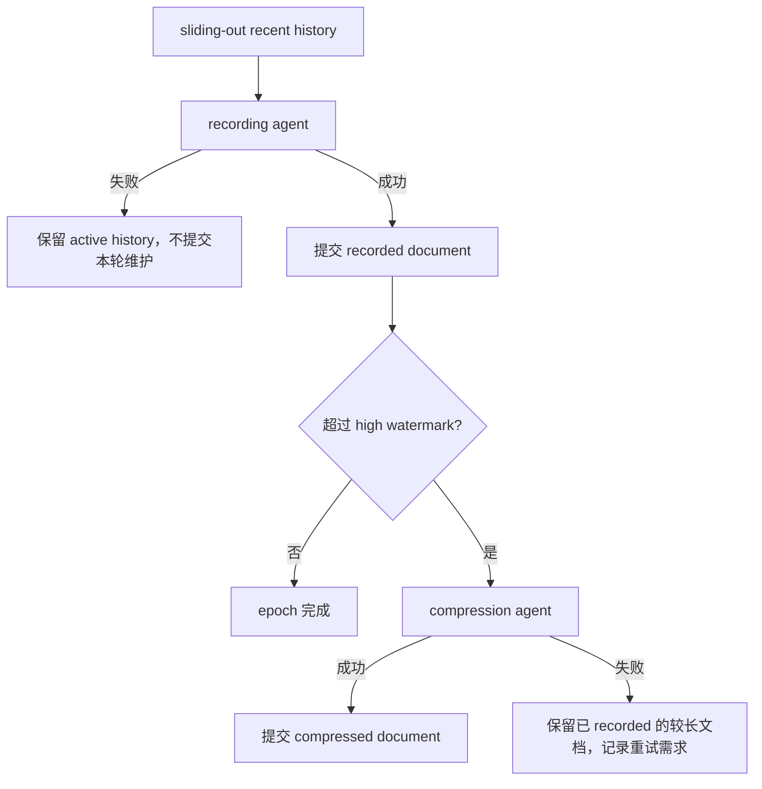

# Galatea Memory Maintainer Agent 化与两阶段维护研究备忘

> 状态：需求调查与工程评估，2026-07-21。
>
> 本文记录 `autobiographical-maintainer` 与 `world-understanding-maintainer` 下一阶段的共同工程需求、当前代码基础、关键技术取舍和建议实施顺序。具体内容准则以 `docs/Galatea/prompt/` 下各 maintainer 的 recording / compression prompt 为准。

## 1. 结论摘要

新的 maintainer 设计比当前“单次 completion 返回完整替换文本”更接近长期可维护的记忆系统，核心变化有两项：

1. maintainer 从单次文本生成器变为拥有文档编辑工具的短生命周期 LLM Agent。
2. 每次 recent-history 到来时只做 recording；文档超过独立长度阈值后，再运行 compression。

调查后的关键发现是：仓库现状已经比需求背景中预想的更接近目标。

- `CompletionMemoryBlockMaintainer` 已有最多 16 轮的 tool loop。缺少的不是循环本身，而是可编辑文档、编辑工具、工具执行后的产物提交协议。
- `Atelia.TextEditScript` 已是一个不依赖 StateJournal 的纯文本块编辑组件，只依赖 `Atelia.Primitives`。它支持以 block ID / `head` / `tail` 为锚点的 insert、replace、delete、split、merge，并能在内存 snapshot 上原子预演。
- `DurableText` 仍然提供更强的跨 epoch 稳定 ID 与增量持久化，但不是第一版 Agent 化 maintainer 的必要依赖。

因此建议不要从 `str_replace` 或通用 patch 重新起步，也不要立即把 `ChatSession.Memory` 绑定到 StateJournal。第一步应复用 `TextEditScript` 做 invocation-local 的 block-ID 编辑事务；实验确认收益后，再决定是否把 block ID 跨 epoch 持久化或把存储后端升级为 `DurableText`。

## 2. 两类记忆文档的边界

两个 maintainer 按信息功能与注入位置分离，但可共享 Agent 执行和文档编辑 substrate。

| Maintainer | 目标内容 | Memory Pack 注入位置 | 文档形态 |
| --- | --- | --- | --- |
| autobiographical | Galatea 经历过什么、如何成为现在的自己；保留第一人称声音、重要原话、未解决情绪与时间轨迹 | `Action / roleplay.first-person-autobiography` | 第一人称 memoir，偏时间轨迹与体验连续性 |
| world-understanding | Galatea 当前相信世界是什么样；保留认识来源、置信纹理、人物与项目的可行动信息、known unknowns | `Observation / roleplay.world-understanding` | 面向检索的结构化 working map，偏当前复合理解 |

边界原则：

- autobiography 保存“她如何走到这里”，不承担百科式事实汇总。
- world-understanding 保存“她现在知道/怀疑什么”，不承担情绪体验和人格叙事。
- 同一 recent-history 片段可以被两个 recording agent 并行读取，但它们写不同目标文档。
- 两个 maintainer 的 prompt、长度预算和 compression 策略可以不同；编辑工具和 agent loop 应共用。

## 3. 当前实现与新设计的差距

### 3.1 已有能力

当前 `Atelia.ChatSession` 已提供：

- `RecentHistorySlice`：`PriorContext + Messages` 的只读 analysis window。
- `MemoryPackBlockPath`：目标 carrier 与 block key。
- `IMemoryBlockMaintainer`：输入旧 block 与 recent history，返回新 block。
- `MemoryMaintenanceOrchestrator`：校验单目标唯一 writer、并行运行不同目标 maintainer、应用结果到 draft。
- `CompletionMemoryBlockMaintainer`：投影上下文、调用 completion、执行 `ToolSession` 中的工具、回灌 tool results，最多循环 16 轮。
- `ChatSessionEngine.RunMemoryMaintainersAsync`：从即将滑出窗口的 prefix 构造 `RecentHistorySlice`。

当前 `Atelia.ChatSession.Memory` 中的两个 role-play maintainer 只是 `CompletionMemoryBlockMaintainer` 的薄包装。它们仍要求模型在最终正文里返回完整新版 block，因此尚未使用新版 prompt 所要求的“通过 editing tools 增量维护文档”。

### 3.2 真正缺失的能力

Agent 化并不等于仅给现有 maintainer 注册几个工具。还缺少以下契约：

1. **可编辑目标状态**：一次 invocation 内持有当前文档 snapshot，并让所有工具作用于同一份 mutable working copy。
2. **文档视图**：把 block ID 与正文清楚地展示给模型，同时保证 ID 元数据不混入最终正文。
3. **编辑工具集**：按锚点执行局部 insert / replace / delete / split / merge，失败时把可恢复错误作为 tool result 返回。
4. **提交语义**：最终 `NewBlock` 应从工具维护后的 working document 物化，而不是取 final assistant text。
5. **无改动语义**：recording agent 判断没有长期价值时可以成功结束且保持文档不变。
6. **循环完成协议**：模型停止调用工具时，宿主需要区分“编辑完成”“明确无需编辑”和“模型意外只输出了一段替换正文”。
7. **阶段审计**：recording 与 compression 分开记录 invocation、tool calls、前后 token 数、是否达到目标预算及失败原因。

## 4. 文本编辑方案评估

### 4.1 `str_replace` / search-and-replace

优点：

- 概念简单，模型熟悉。
- 对很小、锚文本唯一的修改较方便。

缺点：

- 需要模型复述旧文本，输入和工具参数浪费 token。
- 重复段落、标点/空白漂移和长段删除容易导致匹配失败。
- 多次编辑后，后续调用中的旧文本容易失效。
- 大范围压缩正是它最不可靠的场景。

结论：可作为应急工具，但不应成为 memory document 的主编辑协议。

### 4.2 通用 apply-patch

优点：

- 一次可以表达多处编辑。
- 人类可读，适合源码式 line diff。

缺点：

- 仍依赖上下文复述和模糊定位。
- memoir 与 world map 不是天然按行稳定的源码文件。
- patch parser、hunk 定位和冲突恢复会引入另一套复杂协议。

结论：比整块重写好，但没有充分利用仓库已有的 block-ID 编辑能力。

### 4.3 `TextEditScript` block-ID snapshot

当前 `Atelia.TextEditScript` 已支持：

- `TextBlockSnapshotDocument`：有序的 `(BlockId, Content)` snapshot。
- `TextAnchor`：`BlockId`、`head`、`tail`。
- `InsertTextEdit`、`ReplaceTextEdit`、`DeleteTextEdit`、`SplitTextEdit`、`MergeTextEdit`。
- `TextEditScriptDocument.ApplyTo(...)`：在副本上顺序执行；任一操作失败时返回 error，不暴露部分结果。
- `FirstInsertedBlockId`：控制一次预演中新增 block 的 ID 分配。

它只依赖 `Atelia.Primitives`，没有 StateJournal 依赖。因此，“目前没有不依赖 StateJournal 的纯文本编辑器组件”这个缺口在当前工作树中已经基本消失。

仍需注意：`MemoryPackBlock` 目前只持久化一个 string，并不保存 block IDs。若每次 invocation 都从 string 重新 blockize，ID 只能在该 invocation 内稳定，不能跨 epoch 保持身份。

这种 invocation-local 稳定性已经能解决当前主要问题：模型在一次多轮 tool loop 中删除、替换、合并大段内容时，不必复述旧文本，前序编辑也不会使其余活 block 的 ID 漂移。

### 4.4 `DurableText`

`DurableText` 的优势是：

- block ID 创建后单调分配、不复用，可跨提交稳定引用。
- 直接提供 insert / replace / delete / split / merge。
- 与 StateJournal 的增量序列化、版本链和恢复能力结合。

代价是：

- `ChatSession.Memory` 将直接依赖 StateJournal 存储模型。
- maintainer 的纯函数式“old snapshot -> new snapshot”边界会变复杂。
- 需要设计 memory document 与 ChatSession/MemoryPack 提交之间的原子性和恢复关系。

结论：它适合长期持久化后端，但不应阻塞第一版 Agent 化实验。

### 4.5 推荐演进路线

建议分三层演进：

1. **第一版：invocation-local IDs**
   - 从现有 block string 生成 `TextBlockSnapshotDocument`。
   - 一次 agent invocation 内 ID 稳定。
   - 完成后把 blocks 渲染回 string，继续写入现有 `MemoryPackBlock`。
2. **第二版：持久化 snapshot IDs**
   - 为 memory document 增加持久化的 blocks 与 next-ID，而不仅是 string。
   - Memory Pack 仍消费渲染后的文本，内容层不必立即依赖 StateJournal。
3. **第三版：可选 DurableText backend**
   - 当确实需要跨 session 稳定锚点、增量版本、审计或恢复时，将同一编辑接口适配到 `DurableText`。

第一版还需选择 blockization 规则。仓库中有 `MarkdownBlockizer`，但它位于 `Agent.Core`；不应为了一个 blockizer 让 `ChatSession.Memory` 反向依赖整个 Agent 框架。可先在更低层提取可复用 blockizer，或在实验版采用明确、可测试的 Markdown 顶层块切分策略。

## 5. Agent 工具与完成协议

### 5.1 工具封装

推荐用 `MethodToolWrapper` 暴露有副作用但受 session 限定的文档操作，例如：

- `memory.read_blocks`：读取指定 anchor 附近或一段 block window。
- `memory.insert`：在 anchor 前/后插入 block。
- `memory.replace`：替换一个 block 内容，保留其 ID。
- `memory.delete`：删除一个 block。
- `memory.split` / `memory.merge`：在需要调整结构时使用。

输入使用带 `[Description]` / `[JsonPropertyName]` / DataAnnotations 的 record class；方法通过 `[Tool]` + `MethodToolWrapper.FromMethod(...)` 注册。工具宿主持有 invocation-local editing session，或从 `ToolExecutionContext.Items/Services` 取得它。

`ArtifactToolWrapper<T>` 更适合完成协议或附加结构化审计，例如让模型提交：

- `changed | no-change` 的完成状态。
- 简短的 edit rationale / protected-content warning。
- compression 未达到目标的原因。

它不适合代替编辑工具承载整篇文档；否则又会退回一次性大对象输出。

### 5.2 推荐事务模型

```text
old MemoryPackBlock string
→ blockize 为 immutable base snapshot
→ 创建 invocation-local working snapshot + ToolSession
→ LLM 查看带 ID 的文档视图与 recent history
→ 多轮调用编辑工具，工具结果返回新 ID / 错误 / 邻近视图
→ 模型调用 finish artifact，或满足明确的停止协议
→ 宿主校验 working snapshot
→ render 为完整 new block string
→ 返回 MemoryBlockMaintenanceResult
```

重要约束：

- 工具只改 working copy，不直接改 Memory Pack 或持久 store。
- 一次工具失败不破坏 working copy，并把恢复提示反馈给模型。
- 整个 invocation 失败时丢弃 working copy。
- final assistant text 不直接成为 memory 内容；最多作为 diagnostics。
- edit count 可以为 0，这是合法成功结果。
- 对同一 target 的 recording 与 compression 不可并行执行。

## 6. Recording / Compression 两阶段模型

### 6.1 Recording 阶段

触发源：ChatSession 即将滑出窗口的 recent-history prefix。

职责：

- 阅读完整 recent-history segment。
- 只记录新经历、更新旧理解、修正矛盾、关闭或新增 open threads。
- 允许覆盖因新证据而改变含义的既有段落。
- 不承担为了满足长度预算而系统性压缩整篇文档。
- 如果没有长期价值，允许不编辑。

成功条件：文档已忠实吸收本次值得保留的信息。只有 recording 成功后，调用方才能安全地让对应 recent-history 离开 active context。

### 6.2 Compression 阶段

触发源：recording 后的目标文档超过 compression high watermark；它不由新 recent-history 直接触发。

职责：

- 阅读当前完整文档及必要的结构化 memory 上下文。
- 按各自 prompt 的保护规则压缩稳定、较旧、冗余或已解决的内容。
- 尽量降到 target token count，但内容完整性优先于数值目标。
- 不引入 recent-history 中的新事实；它编辑的是已记录文档。

推荐使用 high/target 两个水位而不是单阈值：

```text
documentTokens >= highWatermark
→ compression(targetTokens = lowWatermark)
```

这样可避免文档在阈值附近每次 recording 后都触发 compression。具体 token 预算应按两个文档分别配置，不写死在通用 substrate。

### 6.3 失败与提交顺序

推荐顺序：



这里 recording 与 compression 不应组成“全有或全无”的单事务。原因是 recording 已完成防丢失职责；compression 失败时回滚 recording，反而会让即将滑出的信息重新处于风险中。正确降级是暂时保留偏长但信息完整的文档，稍后重试 compression。

### 6.4 并发关系

- autobiography recording 与 world-understanding recording 写不同 target，可以并行。
- 每个 target 内必须先 recording，再基于 recording 结果判断是否 compression。
- 两个 target 的 compression 也可以彼此并行，但不能与各自 target 的 recording 重叠。
- 当前 `MemoryMaintenanceOrchestrator` 的“一批不同 target 并行”可继续复用；两阶段依赖应由更上一层 per-target pipeline 编排。

## 7. 建议的新抽象边界

不建议立即修改 `IMemoryBlockMaintainer` 的最小接口。recording 和 compression 都仍可表现为：输入 snapshot，返回完整新版 block。阶段差异可以先放在应用层 pipeline 与具体 agent 实现中。

建议逐步引入以下概念，名称可在实现时调整：

- `MemoryDocumentEditingSession`
  - base/working `TextBlockSnapshotDocument`
  - block renderer / blockizer
  - edit count、next inserted ID、validation
- `MemoryDocumentToolHost`
  - `[Tool]` 方法与 session-local 编辑能力
- `AgenticMemoryBlockMaintainer`
  - 复用 Completion + ToolSession loop
  - 结果从 editing session 物化，而不是从 final text 取得
- `MemoryMaintenanceStage`
  - `Recording` / `Compression`，用于 audit 和 prompt 选择，不必进入最底层 block 类型
- `MemoryDocumentCompressionPolicy`
  - high watermark、target tokens、是否启用、token estimator
- `TwoStageMemoryMaintainer` 或上层 pipeline
  - 先 recording，成功后按 policy 可选 compression

通用 agent loop 最好从当前 `CompletionMemoryBlockMaintainer` 中抽出可复用执行内核，避免将来“正文输出型 maintainer”和“工具编辑型 maintainer”复制两份 16 轮循环。但第一次垂直实验可以先做小范围组合，待行为跑通后再重构。

## 8. 需要先用实验回答的问题

以下问题不应仅凭设计推演决定：

1. **block 粒度**：Markdown 顶层块、段落、列表项分别作为 block 时，哪种最利于 memoir 与 world map 编辑？
2. **工具颗粒度**：单操作 Method tools 与一次提交多操作的 `TextEditScript` artifact，哪种模型成功率更高？可以同时提供，但应避免工具集过宽。
3. **完成协议**：强制 `finish` artifact 是否比“无 tool calls 即完成”更可靠？
4. **文档视图**：一次展示全文还是按窗口读取？compression 需要整体结构感，但超长全文本身会逼近 context 上限。
5. **invocation-local ID 是否足够**：若 call log 和回测中很少需要跨 epoch 引用旧 block，就不必急于持久化 ID。
6. **token estimator**：当前 ChatSession 估算主要是字符数除以二，适合触发近似阈值，但 compression 验收是否需要 connection/model tokenizer 或更保守余量？
7. **recording 增长速度**：新版 prompt 的“memoir, not diary”能否自然抑制增长，决定合理的 high/target 水位。

Backtest CLI 应继续作为这些问题的实验台。每个 epoch 至少记录 stage、文档前后 token、edit/tool-call 数、是否 no-change、compression 目标与实际结果，并保留 completion call log。

## 9. 下一轮任务范围评估

一次实现任务不宜同时完成“Agent 工具体系、跨 epoch DurableText 持久化、两阶段调度、两类 prompt 全量接入、真实 LLM 多轮回测”。这些内容横跨 substrate、存储、内容层和 CLI，失败时很难定位是工具协议、blockization、prompt 还是调度策略的问题。

### 建议下一轮完成的范围：recording Agent 垂直切片

一轮任务适合完成：

1. 在 `ChatSession.Memory` 引用 `TextEditScript`。
2. 实现 invocation-local `MemoryDocumentEditingSession` 与带 ID 的文档渲染。
3. 用 `MethodToolWrapper` 提供最小编辑工具集；建议先做 read/insert/replace/delete，split/merge 可视实现复杂度追加。
4. 实现结果从 working snapshot 物化的 agentic maintainer，并定义明确的 no-change / finish 行为。
5. 先接入一个 recording preset，优先 autobiography，因为它最能检验“保留原话、局部修订、不整块重写”的价值。
6. 添加纯工具单测、scripted completion tool-loop 测试和 Backtest CLI 单 epoch 路径。
7. 用真实 Galatea export 跑 1 个 epoch，检查工具调用轨迹和最终文档。

若通用抽象顺利，world-understanding recording 只是第二组 prompt/path 配置，可以在同轮末尾接入；但不应以牺牲工具事务测试为代价强行完成。

### 建议再下一轮完成的范围：compression 与两阶段编排

在 recording 工具链稳定后，再完成：

1. compression prompt/profile。
2. high/target watermark policy 与 stage audit。
3. recording 成功后条件触发 compression 的 per-target pipeline。
4. compression 失败时保留 recorded 文档的降级语义。
5. Backtest CLI 的 stage-aware 输出与多 epoch 实验。

### 暂不进入前两轮的范围

- Memory Pack block ID 的跨 epoch 持久化。
- `DurableText` / Repository 集成与跨 store 原子提交。
- 动态召回、Reabsorb、主意识审批、结构化 self-memory promotion。
- 为两个文档提前确定最终 token 水位；应先从回测数据估计增长与压缩质量。

## 10. 当前推荐决策

- **编辑协议**：优先 block-ID tools，底层复用 `TextEditScript`；不以 `str_replace` / apply-patch 为主路径。
- **ID 生命周期**：MVP 先 invocation-local；是否跨 epoch 持久化由实验决定。
- **存储耦合**：MVP 不依赖 StateJournal；`DurableText` 保留为后续 backend。
- **Agent loop**：复用现有 Completion + `ToolSession` 循环，但新增编辑产物提交语义。
- **工具封装**：编辑动作用 `MethodToolWrapper`；完成状态/结构化审计可用 `ArtifactToolWrapper<T>`。
- **阶段模型**：recording 与 compression 使用独立 prompt、独立 invocation、独立 audit。
- **失败策略**：recording 失败不得滑出历史；compression 失败保留已记录但偏长的文档。
- **实施顺序**：先做单个 recording Agent 的端到端垂直切片，再做 compression pipeline，最后评估持久 ID / DurableText。
