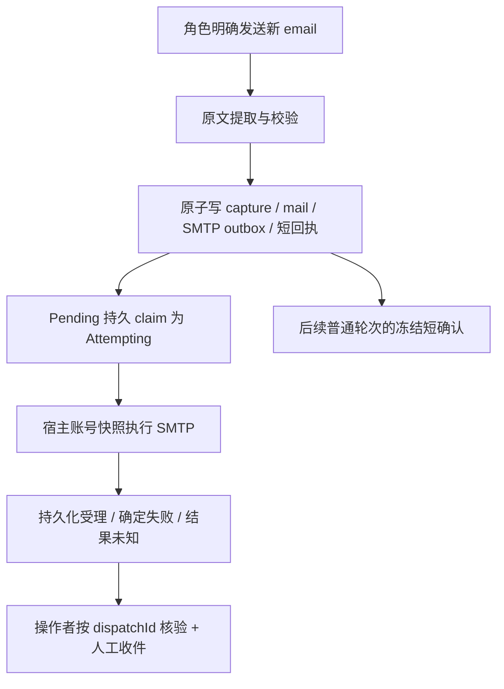

# 每角色明文邮箱配置：SMTP 外发 MVP 设计与实施方案

状态：S1–S3 产品改造与验收已落地；S4 两个目标账号的实际宿主发件均获服务商受理，冷重开检查通过，等待操作者确认实际收件。日期：2026-10-07。设计代码基线：`g01/smtp-outbound` / `050c711f`。实际检查与未覆盖项见第 9 节。

最小路径是：操作者在 `config.json` 的每个角色中填写邮箱地址、明文授权码和 SMTP 参数；角色明确写出一封新信；宿主按原文捕获、入队并调用现有 SMTP 发送器；操作者能按 `dispatchId` 核验结果，并在受控收件箱实际收到信。复用冻结短回执，但不把它改成发送成功回执。

第 1–8 节保留设计裁决与施工依据；第 9 节记录后续已授权的实施。本轮没有切换既有实例或迁移实际数据库；真实邮箱是否可发、是否实际收到，须独立验收，不能以离线测试替代。

## 1. 需求账本与范围

| 编号 | 要求 / 边界 | 来源与当前消费者 |
|:--|:--|:--|
| U1 | 每角色在 `config.json` 直接配置邮箱和明文“IMAP + SMTP”授权码 | 本轮用户决定；实际操作者。不得改成必须使用外置凭据文件或密钥服务。 |
| U2 | 跑通普通 email 的 MVP，交付可施工的设计与实施文档，并使用 dialectical-simplification 完善 | 本轮用户决定；下一轮实施者。 |
| U3 | 只做 SMTP 外发；“IMAP + SMTP”是本轮邮箱授权码名称，不包含收信功能 | 用户已明确回复“先做 SMTP 外发（推荐）”；IMAP 收信另开一轮。 |
| C1 | 正文按连续整行原文切取，email 收件行精确核对；同一来源不重复捕获 | 当前 `GalateaMailbox`、reconciler、capture 唯一约束与测试；角色与已有邮件消费者。 |
| C2 | 发送前先持久化 Attempting；DATA 后不确定结果及重启遗留尝试不自动重发 | 当前 consumer、store、发送器及故障测试；会产生真实外部副作用的发送流程。 |
| C3 | 捕获确认与 SMTP 结果分开；已冻结 Observation 不随当前状态变更 | 当前 action receipt / fresh composer / Journal；角色、历史渲染和恢复。 |
| C4 | Delegation 当前 V7，主线 V6 可显式升级；历史未路由、离线、blocked 行不补发 | 当前 schema、upgrade 与测试。现有格式有持久消费者，不能因为未发布而丢弃这些事实。 |
| C5 | 一个宿主、已打开可写 store 的独占锁与 CAS；每封单次 SMTP 尝试，关闭排空 | 当前运行模型；不是多实例分布式调度问题。 |
| C6 | 设计基线根配置 V14；没有发布兼容义务，倾向删除未使用旧产品入口 | 设计时的代码、根配置合同、AGENTS.md。当前已实施的 V15 与配置变更见第 9 节。 |
| D1 | MVP 通过人工收件核验最终到达，不承诺自动已送达检测或角色最终结果必达 | 本轮方案裁决；源码没有 SMTP 逐封结果通知消费者，用户也未新增这一承诺。 |
| D2 | 非秘密账号描述变化视为新绑定，旧 Pending 不借新绑定发送；授权码轮换不改变绑定 | 本轮新增的保守策略，替代操作者手写 bindingId 的生命周期；不是 SMTP 必然要求或当前代码已经冻结 endpoint。 |

本轮 MVP 不包含 IMAP 自动收信、退信 / DSN、附件 / HTML、多收件人、OAuth、自动重试、账号热更新、通用通知平台或独立 SMTP 结果 UI。授权码名称中出现 IMAP 不会启动 IMAP 连接，也不新增 IMAP 配置占位符。

## 2. 当前已有能力与需要改变的入口

| 入口 | 已有行为 | 本轮动作 |
|:--|:--|:--|
| [GalateaMailbox](../../prototypes/Galatea/Mailbox/GalateaMailbox.cs) | `emit_send_mail_range`、原文正文、email 收件行校验 | 复用。只补真实模型对 email 的小样本验收。 |
| [提取协调器](../../prototypes/Galatea/Mailbox/GalateaOutboundMailExtractionReconciler.cs) / [捕获事务](../../prototypes/Galatea/GalateaDelegationSqliteStore.Transitions.cs) | 新捕获与 outbox、短回执同事务；AlreadyCaptured | 复用，只替换宿主账号引用的来源。 |
| [SMTP store](../../prototypes/Galatea/GalateaDelegationSqliteStore.Smtp.cs) / [消费服务](../../prototypes/Galatea/Mailbox/GalateaSmtpOutbound.cs) | 五态、revision CAS、调用前 claim、恢复为 Unknown | 复用，不加表或迁移阶段。 |
| [SMTP 配置](../../prototypes/Galatea/Mailbox/GalateaSmtpConfig.cs) | `runtime.smtp.senderAccounts`、手写 bindingId、credentialPath、offlineMode、双路 sender | 每角色 email 形成启动快照；删除旧配置入口及 ConfiguredSmtpSender。 |
| [网络发送器](../../prototypes/Galatea/Mailbox/GalateaNetworkSmtpSender.cs) | 真实 SMTP、TLS、LOGIN、UTF-8 base64、DATA 边界 | 删除 `ReadCredentials` 与二次文件解析，直接使用加载时账号快照。协议行为保留。 |
| [根配置与 loader](../../prototypes/Galatea/GalateaConfig.cs)、[strict reader](../../prototypes/Galatea/GalateaStrictConfigReader.cs)、[loader / bootstrap](../../prototypes/Galatea/GalateaServices.cs) | V14、角色与 runtime 分离、缺省关闭 | 增加每角色 email；调整 runtime.smtp 与安全投影。 |
| [发信协议附录](prompt/trpg-outbound-mail-protocol-appendix-zh-cn.md) | 仍声称当前只使用离线替身 | 修订为可真实外发、异步、捕获确认不等于 SMTP 成功，实际能力由宿主配置决定。 |

目前 SMTP 是支持单个 ASCII 收件地址、纯文本、AUTH LOGIN、隐式 TLS 或 STARTTLS 的窄客户端；不用新增邮件库或重写协议层来完成明文配置 MVP。实际服务商若不支持这套认证，记为该账号不可用，不在本轮引入第二套认证机制。

## 3. 唯一配置形状

选择根配置 V15，仅接受一个当前格式。旧 V14 明确人工转换，不做双 reader 或启动自动改写。根配置版本与 Delegation schema 版本独立；本方案不因配置改变升级 Delegation V7。V15 是格式标识，不是安全机制，不单独构建配置迁移平台。

以下是合并入既有配置的片段，不是完整可启动配置。值全部为占位符，`smtp.example.test` 不对应真实服务商：

```json
{
  "v": 15,
  "characters": [
    {
      "id": "alice",
      "email": {
        "address": "alice@Example.test",
        "authorizationCode": "REPLACE_WITH_PRIVATE_IMAP_SMTP_CODE",
        "smtpHost": "smtp.example.test",
        "smtpPort": 465,
        "tlsMode": "implicit"
      }
    },
    {
      "id": "bob",
      "email": null
    }
  ],
  "runtime": {
    "smtp": {
      "enabled": false,
      "timeoutSeconds": 60
    }
  }
}
```

`email` 缺省或 null 表示角色未配置外发账号；配置 object 就必须有且只有上述五个字段。不另设每角色 enabled、username、fromAddress、provider、displayName、bindingId、credentialPath 或账号目录。`address` 同时用于 AUTH 登录名、SMTP MAIL FROM 和 MIME From；显示名本轮省略。全局 `runtime.smtp.enabled` 是唯一发送开关，缺省 false；配置地址和授权码本身不会启动外发。SMTP 开关不禁用 Codex 委派或角色站内信。

各账号明确填写 host、port、TLS，避免按域名猜服务商。`tlsMode` 只接受 `implicit`、`starttls`，不保留 `none` 产品路径；旧明文协议夹具改用已有回环 TLS 服务器。测试内存信任锚仍只在字面量回环地址的构造参数中使用，不进入 DI 的正式配置或用户 JSON。timeoutSeconds 保持整体 1–300 秒，缺省 60。

strict reader 保留未知 / 重复字段、类型、文件大小与无符号链接校验。email 有 object 时，即使发送关闭也校验地址、非空无控制字符授权码、主机、端口和 TLS 枚举。address 必须通过现有窄语法 ASCII 邮箱解析，且解析结果与配置字面值相等，不裁空格。smtpHost 为 1–253 字符的 ASCII DNS 主机名或 IP 字面值，不含 URL scheme、路径、空白或控制字符；smtpPort 为 1–65535 的整数。坏配置启动失败；合法配置中的关闭或未绑定是逐封业务失败，不能混同为坏 JSON。

重启时加载一次。更换授权码需重启；MVP 不支持每封重读 config 或文件监视器。取消旧凭据文件的延迟读取后，超时预算只负责 SMTP 网络尝试。

V14 → V15 的人工转换仅为：改根 `v`；将旧 `runtime.smtp` 替换成 enabled / timeoutSeconds 两字段；把拟接入账号的地址、授权码和三个连接参数填入所属角色 email。旧模板即使未启用发送也含 `senderAccounts=[]`，仍需删除旧字段；已经没有 smtp 块的 V14 配置只需版本更新及可选新字段。转换与 S1 合并，不另设转换器或迁移阶段。不要把删除 email 当作临时暂停：它会使该角色之后的新信按未绑定失败。

## 4. 最小运行模型与账号身份



唯一 authority 是启动读取的每角色 email。最少类型与摆放如下，不额外创建角色 email DTO：

| 成员 / 类型 | 职责与可见性 |
|:--|:--|
| `GalateaCharacterFileConfig.Email` | internal、不可变、非 record 的五字段对象；loader 校验后直接作为发送快照，不复制一套账号字段。 |
| `GalateaRuntimeFileConfig.Smtp` | 无秘密的两字段 policy：enabled、timeoutSeconds。 |
| `GalateaConfig.Smtp` | 删除当前公开位置参数，改为 record body 的 `[JsonIgnore] internal` 宿主 settings；非 record，持有 policy 与只读角色账号 map。它是启动投影，不是另一配置来源。 |
| `GalateaCharacterConfig.SmtpSenderAccountReference` | 仍只有非秘密引用，用于 capture；不携带 email 对象。 |

账号对象只进入宿主 settings 与发送模块。角色 Setup、Observation、Journal、Recap、Completion call-log、HTTP 和 SSE 不接收授权码，也不接收整个 email DTO；持久 SMTP 表继续只存账号引用。非 record 不自动展开秘密字段，不再为其建设通用脱敏层。

保留现有 `smtp:<characterId>:<bindingId>` 持久格式，但 bindingId 不再要求操作者填写。由非秘密账号描述生成：

```text
bindingId = lowercase_hex(SHA256(UTF8(JSON_ARRAY[
    address, smtpHost, smtpPort, tlsMode
])))
accountReference = "smtp:" + characterId + ":" + bindingId
```

数组顺序固定；使用通过校验后的配置字面值，不自动改写大小写或裁剪。SHA-256 输出为 64 个合法 ASCII 字符，满足现有 bindingId 约束。授权码不参与 hash；轮换授权码不换账号身份。地址或连接参数变更产生不同引用，已有 Pending 不能借用新绑定发送，而是按现有 `SMTP_BINDING_UNAVAILABLE` 结束。即使只改变字母大小写，也可能保守地拒绝旧 Pending；操作者应避免无意义重写。

这项连接参数冻结是本轮明确新增的取舍。当前发送器每封重读凭据文件，尚未冻结 endpoint；旧二期说明仅列出账号重新解释的运维风险。只 hash address 可以沿用该现行行为，但会允许旧 Pending 将正文交给重新配置的服务器。全 tuple 用既有引用替代手工 bindingId，不新增表、状态或账号版本；代价是同邮箱修正 host、465/implicit 改成 587/starttls 等合法调整，也会使旧 Pending 失败。接受此代价以避免旧队列自动跟随新连接绑定，不将它冒充已有 C2 / C4 的强制要求。

这样无需 V8、账号快照表、凭据持久化或人工 bindingId 生命周期。保留现有 `offline:`、`blocked:`、合法旧 `smtp:` 持久格式校验；它们是已有数据事实，不是继续开放的用户配置模式。`SMTP_DISABLED`、`NO_SENDER_BINDING`、`SENDER_BINDING_DISABLED` 三个旧 blocked 原因码都保留，否则含旧终态的库会 strict-open 失败。移除 offlineMode 后，残留 offline Pending 始终以 `SMTP_OFFLINE_ISOLATED` 确定失败，不调用网络。旧手写 bindingId 的真实 Pending 若不能匹配新派生引用，同样失败，不重绑、不修改旧行、不重新提取旧 Action。

配置关闭时新 email 捕获为 `DefiniteFailure / SMTP_DISABLED`；全局开启但该角色 email 缺省时为 `DefiniteFailure / NO_SENDER_BINDING`。语法无效地址不能变成网络请求。真实发送路径继续只处理 Pending；未知、失败、已受理均无自动重试。

产品只保留 `GalateaNetworkSmtpSender`。删除 ConfiguredSmtpSender wrapper 与生产离线 sender，Program 直接注册网络 sender；consumer 继续只依赖 `IGalateaSmtpSender`，测试在该接口注入替身。唯一网络入口在建立连接前依次拒绝旧 offline 引用、检查全局开关、精确匹配 characterId 和完整账号引用、校验收件地址；没有跨角色或其他账号回退。删掉重复路由器不删这些守卫。

`enabled=false` 是禁止发送，不是保留 Pending 的暂停契约：现有消费者仍可能领取已存在的 Pending，再因绑定不可用保存确定失败。停服后修改配置不会取消此前已经完成的发送。需要不改变旧队列的离线检查时使用 maintenance mode 或停止宿主，不以关闭开关启动活跃消费来代替只读预检。

## 5. 回执、可观察性与 MVP 的完成定义

保留已有 `action-receipt-v1`：`accepted` 只确认宿主已捕获并接纳该邮件提交，不承诺成功出网。SMTP 关闭或缺少账号时仍可能同时收到历史 accepted 短回执和持久 SMTP 失败；本轮必须在协议与验收中明确这项能力边界，不能把 accepted 文案改成“已发送”。短回执本轮不增加字段，也不从当前 SMTP 状态重新水合。

MVP 用已有持久状态查询作为操作者验证入口，不增加 HTTP 管理面或通用状态通知队列。按指定角色数据库、dispatchId 精确查询：

```sql
SELECT m.source_action_address, m.artifact_ordinal,
       s.dispatch_id, s.state, s.result_code
FROM smtp_mail_outbox s
JOIN outbound_mail m ON m.dispatch_id = s.dispatch_id
WHERE s.dispatch_id = :dispatch_id;
```

这是已有表的只读核验，不打印 body、账号引用或授权码。不得把旧 `outbound_mail.state = Unrouted` 误读为 SMTP 失败；该字段只表达原有 Codex 路由。

结果含义：ProviderAccepted = 服务商受理；DefiniteFailure = 本次明确失败；OutcomeUnknown = 可能已发送，未确认，不能自动重发。“实际收到”的依据来自受控收件箱人工核验，不写回一个系统无法独立证明的 Delivered 状态。

自动 SMTP 结果通知延后，触发条件是用户要求角色在普通轮次获知逐封结果。届时沿用[已有扩展约定](mail-note-receipt-preview-refactor-design.md#4-一次规划与共享投递)：fresh 组装时读持久状态、冻结有界 notice；历史回放只读已冻结输入；选择包含未通知终态，不能只查活动行。本文不预建通知游标、进展表或未使用接口，也不称本轮为“角色发信结果闭环”。

完成声明分开记录：公共功能需至少一个受控账号沿实际宿主链落 ProviderAccepted 并实际收件；角色隔离由合成双角色 TLS 纵向验收证明；本次目标角色接入则须每角色各寄一封新信、实际收到且冷重开不重复。未验账号明确标未验，一账号成功不等于全部账号已接入。直接调用 sender 的探针不替代宿主端到端验收。

## 6. 施工切片与文件范围

### S1：配置到 SMTP 的一条完整纵向切片

在同一产品切片完成 file DTO、strict reader、loader、运行账号快照、派生账号引用和 network sender 改造。不要先构建通用 credentials provider，再接消费者。修改 `GalateaConfig.cs`、`GalateaStrictConfigReader.cs`、`GalateaServices.cs`、`Mailbox/GalateaSmtpConfig.cs`、`Mailbox/GalateaNetworkSmtpSender.cs` 与对应 JSON source generation。

删除 runtime.smtp.senderAccounts / credentialPath / 手写 bindingId / offlineMode 的当前配置入口、`ReadCredentials`、ConfiguredSmtpSender、生产离线 sender 和只服务外置凭据文件的测试；保留捕获和发送身份校验、DATA 故障测试及已有持久行隔离。离线替身移到测试程序集，直接注入接口，不再作为产品配置模式。

新 email 的错误边界使用固定问题码与代码内已知字段名，不拼入原始 JSON property、字段值或原始异常链。现有 strict reader 的 Unknown / duplicate helper 和 loader 的 JsonException inner 不能直接作为安全证明；针对新增秘密解析路径落实窄边界，并检查 exception.ToString()。合成授权码误放成未知字段名也不得被回显。避免默认 record ToString 展开授权码；不推广成全项目日志扫描或通用配置脱敏平台。

本切片验收：合成完整 config 经真实 loader、宿主 Action 捕获、后台消费到回环 TLS SMTP，得到 ProviderAccepted；重开保持终态且无再次发送。证明不读任何外置凭据文件、两角色不串账号、缺省配置不联网。

### S2：提示词与操作者合同

更新过时发信附录；准确说明普通 email 可真实外发、当前没有自动结果通知、捕获确认不证明服务商受理。不把授权码放入 characterContextTemplate、Setup bindings 或 SMTP 错误文案。模板生成 email=null、全局发送关闭。新增 V15 当前 root 合同并将 V14 标为历史，更新 configuration、README、文档检查 scope 与一期 / 二期文档的历史定位；不把计划字段写成已实施合同。无需新增 Setup / Observation wire version；历史输入仍按已冻结内容渲染。

### S3：离线回归与小样本模型提取

沿用已有解析器、capture、迁移、mail receipt、SMTP 网络断点测试。新的验收矩阵见下一节。用合成角色 Action 和已有显式模型测试入口验证本人发送、草稿、来信引文、同回合多封与正文原文保持；不将真实授权码作为模型输入。模型样本先只验证提取，使用不会外发的独立测试环境。

### S4：实例接入与受控真实收件验收

本步骤在实际接入与受控发件授权范围内执行，当前执行边界见第 9 节。实施前确定目标实例、角色、SMTP 参数与受控收件地址，核对服务商支持现有 AUTH LOGIN。确认 `connections.json` 已绑定 outbound-mail extractor；仅填 email 不会自动启用原本关闭的提取器。停服后保留当前配置 / Delegation 备份，只读盘点已有 Pending、Attempting、终态和引用类别；如是主线 V6，使用既有显式升级到 V7，绝不删除重建库来“启用 SMTP”。已经 V7 则不迁移。将根配置显式改为新唯一格式并填写私有值，在 maintenance mode 下关闭 SMTP 验证加载，确保不消费旧 Pending，再退出维护、启用与重启。新式 hash 不匹配的旧真实 Pending 将失败，这项切换后果要在实例清单中记录，不静默转换为新账号。

通过角色普通回合产生新的寄信 Action，逐目标角色至少一封；按捕获 dispatchId 关联终态和实际收件。先完成一角色纵向验收，再按相同方式验其他目标角色。遇 OutcomeUnknown 不重试，收件箱查询只提供补充证据；暂未收到不能证明未发送。确需再寄时由角色发出新的明确 Action，作为一封可能与原信重复的新信，不复位原行。出现问题关闭全局 SMTP，保留库与终态，不复位队列；若需保留 Pending 以便调查则停服 / 维护。不得靠首次探针成功就宣称已经部署。

## 7. 验收矩阵与必要检查

| 场景 | 通过标准 / 现有测试复用 |
|:--|:--|
| 配置字段与开关 | 缺省 email、缺省 smtp 均不联网；合法两账号各归精确角色；未知 / 重复字段、部分 email、空码、错误 port / TLS 拒绝；旧配置入口被拒绝。 |
| secret 的边界 | 合成唯一授权码 sentinel 不出现在 ToString、错误链 exception.ToString()、Setup、Observation、Journal、持久库、HTTP / SSE 或日志中；覆盖值、未知字段名、重复字段和类型错误。发送侧收到 sentinel。不扫描或打印真实配置内容。 |
| 捕获与原文 | 新 email 正文逐字保留，收件行匹配；重复来源只建一行；混合 Codex / 角色 / email 原子事务回滚仍成立。 |
| 发件身份 | AUTH、MAIL FROM、MIME From 都是该角色 address；地址 / endpoint 变化拒绝旧 Pending；授权码轮换保留身份；另一角色账号无回退。 |
| 既有行隔离 | offline Pending 不联网；三个旧 blocked 原因码均可读；Unknown、受理、失败不复活；旧 Unrouted 不回填，AlreadyCaptured 不重绑。关闭开关对旧 Pending 的终结行为独立验证。 |
| 协议与恢复 | TLS、LOGIN、明确 4xx / 5xx、DATA 前后断开 / 超时 / 取消分类保留；先提交 Attempting 才外部调用；claim 不确定不调用；重启遗留尝试 Unknown。 |
| 回执与历史 | 短预览不含长正文中段；后续 SMTP 终态不改原回执或历史 Observation；accepted 不作为发送验收依据。 |
| 完整宿主路径与真实收件 | 合成完整 config → 真 loader → 双角色 Action → 实际 hosted consumer → 回环 TLS，核对各角色 AUTH / MAIL FROM / MIME From 与正文；真实实例逐目标角色新信落 ProviderAccepted 且实际收到；冷重开不重复。模型、SMTP 和人工收件结果分别记录。 |

重型 .NET 检查串行，使用 `--no-restore -m:1 -nr:false`。先跑配置 / SMTP / capture / receipt 的针对性回归，再跑 Galatea 非 Live 全集；既有 Release 专属测试在 Release 单独运行。真实模型与 SMTP canary 是独立显式 opt-in，不能夹在普通回归中。实际检查结果见第 9 节。

tracked 文档、示例和测试只用假地址、假授权码与占位符；真实 config 及其备份仍在忽略的私有目录。保留现有 TLS 验证和 content-free Warning / Error；不建设密钥服务、文件权限管理平台或通用脱敏框架。

## 8. 辩证审查后的裁决

| 机制 | 裁决 | 最小替代 / 保留原因 |
|:--|:--|:--|
| 外置凭据文件、credentialPath、provider 元数据、独立 username/fromAddress | delete / merge | 单一角色 email 配置；address 直接兼任登录与发件地址。 |
| 手工 bindingId 与账号目录 | simplify | 非秘密账号描述派生现有格式引用，阻止旧队列借用新身份。 |
| 产品 offlineMode | delete | 注入测试替身；保留旧持久 offline 身份隔离。 |
| ConfiguredSmtpSender 与 NetworkSmtpSender 双入口 | merge | 一次完整身份守卫 + 现有协议；不保留没有第二个产品策略的 router。 |
| 第二套根配置 reader / 自动转换 | delete | 只接受 V15；窄人工转换清单，不建新迁移平台。 |
| capture 原子性、claim、Unknown 无重发边 | keep | 邮件可能已被服务商接收而宿主结果未提交；删除会重复寄信。 |
| SMTP 最新状态通知与最终送达检测 | defer | 已有持久状态 + 受控收件人工验证 MVP；角色闭环需求到来再落地。 |
| 通用邮箱平台、IMAP 预留字段、热更新、账号快照表 | defer | 当前无消费者；扩大构建范围而不改善第一封实际邮件。 |

审查使用三个独立角色：Demand skeptic、Minimal architect、Semantic defender。第一轮均完整读草案、共同账本与实际源码；第二轮互相质询最强反例。主线程独立核对来源并裁决，未要求审查员按票数或主线程偏好同意。

最初三位都建议 address-only，以便同邮箱修正 endpoint 不废弃 Pending；交叉质询后修订为全 tuple。决定性反例是旧 Pending 自动跟随另一可认证服务器，非秘密指纹是替代手工 bindingId 的最小机制。审查承认它是新政策，并保留合法连接修正导致旧 Pending 失败的代价。版本争议收敛为单一 V15，不能借“省版本号”隐去旧模板也需要删字段的事实。逐角色 canary 保留，只将公共功能与实例接入证据分开。两轮后无剩余实质争议，未为制造一致而继续第三轮。

可观察的简化：账号来源由 config + 外置凭据文件收敛到一个 config；产品 sender 从两层收敛到一层；发送模式由关闭 / 离线 / 网络收敛到关闭 / 网络；新增 outbox 表、结果通知类型、通知游标和热更新机制均为零。保留数据格式识别与不可重发状态机，并非保留旧配置产品入口。

用户已确认 SMTP 范围，方案没有待决的架构阻塞项。实际接入前仍需给定目标实例、目标角色账号参数和受控收件地址；这些是 S4 的输入，不需要在本轮文档中收集或公开授权码。

## 9. 2026-10-07 实施与验收记录

用户后续调用 `bounded-delegation` 授权具体实施和按需提交，并允许准备私有文件供其填写邮箱授权码。两个实现工作包分别负责配置与发送器；文档工作包负责当前合同与操作入口；独立只读复核从实际 diff 检查秘密边界、身份守卫与不可重发状态机，未发现阻断级产品问题。主线程完成跨包集成、验证与最终提交。

### 已落地的切片

- S1：唯一 V15 reader、角色五字段不可变 `GalateaEmailAccount`、启动快照、精确角色 map 与全 tuple 指纹；公开运行配置的 SMTP 位置参数已删除，秘密只留在内部 settings。新增秘密解析路径的未知/重复/类型/截断错误不回显原始字段或 inner 异常。
- S1：Program 直接注册唯一网络 sender；外置凭据解析、Configured wrapper、产品 offline sender 与明文 TLS 模式已删除。consumer、capture 事务与 Delegation V7 schema 保留；测试替身仅在测试程序集。
- S2：bootstrap 默认 email=null / SMTP 关闭；V15 当前合同、V14 历史定位、人工转换清单、配置/运行入口及角色协议已同步。角色协议只说明异步发送和确认边界，不夹入配置版本或 operator 文档链接。
- S3：配置与 SMTP 故障回归、双角色完整宿主 TLS 验收及显式 opt-in 真实模型样本已加入。测试不读取真实邮箱授权码。

双角色纵向测试通过实际 loader、角色 session 的 Action、生产 reconciler 与真实 hosted consumer 发送到两个共用信任锚的回环 TLS 服务器，仅替换内存测试信任锚。它分别核对 AUTH、MAIL FROM、MIME From、原文正文、ProviderAccepted、冷重开与 AlreadyCaptured 不重发；合成秘密不进入公开配置序列化、ToString、SystemPrompt、HTTP mailbox status 或停止后的隔离宿主工件（含 Journal / SQLite / WAL）。SSE、Recap 与全局 Debug 日志未逐项做动态 sentinel 检查；这些投影的无秘密边界由类型隔离与独立源码复核支持，不将它们冒充已逐项实测。

### 真实模型样本与已知限制

`GalateaEmailExtractionLiveTests` 用 `claude-haiku-4-5` 验证本人明确发送及字面正文、草稿不发送、来信引文不发送、同回合两封独立邮件，四个样本全部通过；不做 capture，不打开用户 store，不调用 SMTP。当前测试代理支持 Messages 但 Models API 返回 404，因此测试通过现成 `modelSpecsSelector` 为这个精确 alias 提供官方 64K 输出规格；没有改产品 factory、包 pin 或增加通用配置字段。规格依据 [Haiku 官方说明](https://platform.claude.com/docs/en/models/haiku-4-5/overview)。

最初使用 `deepseek-v4-flash`：已发送/字面正文样本通过，但草稿错误调用 `report_extraction_problem`，两次检查均以 `UnrepresentableLayout` 失败。宿主拒绝该批提取，不生成 SMTP 邮件；本轮没有修改提取器提示词或放松校验来掩盖该现象。独立 SMTP canary 模板仍使用默认 DeepSeek 路径，只产生明确的新发送 Action；其对草稿零结果的模型稳定性未获证明。Haiku 的通过也不构成任意模型都能稳定判断的保证。

### 检查与实际接入边界

针对性检查覆盖配置、SMTP、capture 与冻结回执；双角色 hosted TLS 单项已通过。初次全集发现协议改写遗漏原有 Codex 后续回信说明，已恢复。后续四线程全集出现一次既有 `AcceptedRunner_WithoutHttpBindsTaskAndOwnsLockUntilFatalCleanup` 的锁断言失败，单独原样复验通过；该测试及对应产品代码未修改。最终全集与 Release 结果在下表记录。

| 检查 | 最终结果与范围 |
|:--|:--|
| Galatea Debug 非 Live 全集，单线程 | 1681 通过、0 失败、1 跳过，共 1682，6 分 36 秒。跳过项仅适用于 Release，下一行已验证。 |
| Release 捕获 / 网络 SMTP / outbox / 完整宿主 TLS | 81 通过、0 失败、0 跳过，28 秒；包括 `ReleaseCapture_PersistsWithoutDiagnostic`。 |
| Haiku 显式模型提取 | 1 个测试中的四个样本全部通过，13 秒；不调用 SMTP。 |
| 文档检查 | scope 内 68 文件，4 个原有 `MISSING_TARGET`，均为两个旧简化方案指向已移除的 AgentControl 源码；本轮未新增诊断。 |
| Git diff 检查 | 工作区与 staged diff 均无空白错误；私有 canary 配置与说明被忽略，不进入提交。 |

以下是在当前已构建、已 restore 工作树中的最终命令。前两项均不启用 Live 类；模型检查仅使用合成文本与模型 API 环境变量，不需要邮箱授权码。

```bash
env -u ATELIA_RUN_GALATEA_NOTE_LIVE \
    -u ATELIA_RUN_GALATEA_LAB_LIVE \
    -u ATELIA_RUN_GALATEA_CODEX_DELEGATION_LIVE \
    -u ATELIA_RUN_GALATEA_EMAIL_EXTRACTION_LIVE \
    -u ATELIA_RUN_GALATEA_CONNECTION_STATE_LIVE \
dotnet test tests/Galatea.Server.Tests/Galatea.Server.Tests.csproj \
    --no-restore --no-build -m:1 -nr:false \
    --filter 'FullyQualifiedName!~LiveTests' --verbosity minimal \
    -- xUnit.MaxParallelThreads=1

dotnet test tests/Galatea.Server.Tests/Galatea.Server.Tests.csproj \
    -c Release --no-restore -m:1 -nr:false \
    --filter 'FullyQualifiedName~ReleaseCapture_PersistsWithoutDiagnostic|FullyQualifiedName~GalateaSmtpHostIntegrationTests|FullyQualifiedName~GalateaNetworkSmtpTests|FullyQualifiedName~GalateaSmtpOutboundTests' \
    --verbosity minimal -- xUnit.MaxParallelThreads=1

ATELIA_RUN_GALATEA_EMAIL_EXTRACTION_LIVE=1 \
dotnet test tests/Galatea.Server.Tests/Galatea.Server.Tests.csproj \
    --no-restore -m:1 -nr:false \
    --filter 'FullyQualifiedName~GalateaEmailExtractionLiveTests' --verbosity minimal

python3 scripts/check_session_journal_docs.py --report-only
```

实施提交 `cd6d7dbd` 时，本工作树已生成 Git 忽略的独立 canary 配置与操作说明，角色 ID 为 `gpt`、`cyber`；用户指定两个受控邮箱互发，实际地址和授权码只保存在私有文件，不进入本文或提交。首次预检保持全局 SMTP 关闭、maintenanceMode 开启，`/login` 返回 200 并正常退出，未建立角色 session 或消费队列。两个服务商的 465 隐式 TLS、EHLO 250 和 AUTH LOGIN 广告经无认证连接核验；这个预检阶段未执行 AUTH、MAIL、RCPT 或 DATA。

### 同日受控真实 SMTP 验收

操作者随后填写并修正授权码，通知继续验收。主线程重新读取配置，确认两个账号无首尾空白、模型环境可用、角色自动心跳关闭、测试目录内没有既有会话或发件队列。保持配置私有备份，先用修正后的配置再做维护模式启动预检，随后仅对独立 canary 开启发送。未修改既有实例配置、迁移实际数据库或分配长期角色邮箱。

通过登录后的实际 HTTP 普通角色回合执行，使用生产模型、原文提取、原子 capture、后台 consumer 与生产网络 sender。没有直接调用 sender 绕过角色链，也没有使用测试信任锚。结果如下；实际地址、全文、完整 dispatchId、turnId 和配置备份在忽略目录 `.atelia/smtp-mvp-canary/` 的私有运行记录中。

| 方向 | 唯一邮件标记尾部 | SMTP 持久终态 | 正文 / 主题 / 收件人 | 发送后 revision |
|:--|:--|:--|:--|:--|
| `gpt` → `cyber` 受控邮箱 | `064859Z-75abe4` | ProviderAccepted / SMTP_DATA_ACCEPTED | 与本次指定原文一致 | 2 |
| `cyber` → `gpt` 受控邮箱 | `065103Z-8fbbe6` | ProviderAccepted / SMTP_DATA_ACCEPTED | 与本次指定原文一致 | 2 |

有两项前置现象保留了原始记录：第一次 HTTP 客户端的 15 秒等待期限在会话初始化阶段到期；停止后只读完整审计确认仅有 3 个 setup 事件，Observation / PreparedRequest / Action 均为零，且无发件队列，再以更长等待期限继续初始化。`cyber` 首个完成轮次只写“正文即操作者指定内容”，缺少 Action 内的正文，提取器成功记录零件 capture；没有尝试 SMTP。随后通过一个新的普通轮次明确要求完整正文，形成上表的唯一反向邮件。没有重提取旧 Action、删除 capture、复位 outbox 或重发已受理邮件。

两封受理后正常停服，再在 SMTP 开启的正常模式下冷重开、附着两个会话并等待后台 consumer 多轮检查；两个会话均为 Idle，outbox 各仍只有一条 ProviderAccepted，终态、revision 与邮件内容保持不变。两个 Delegation SQLite `quick_check` 均为 `ok`；最终 SessionJournal 全量只读审计均通过，`gpt` 为 6 个事件 / 1 个完整轮次，`cyber` 为 9 个事件 / 2 个完整轮次，均为 Idle。停止后扫描 38 个隔离持久工件（SessionJournal / Delegation；未启用的 Character Memory 没有 store），未发现任一真实授权码。该检查不扩大为对 HTTP/SSE、全局日志或所有未来投影的动态证明。

测试完成后进程正常退出，私有配置恢复 `maintenanceMode=true`、`smtp.enabled=false`。此时两个目标账号的实际外发路径与冷重开检查已经通过；两个收件箱人工收件及重复收件确认仍待操作者反馈。ProviderAccepted 不等于 Delivered，在实际收件确认前不将 S4 或完整 MVP 标成完成。
