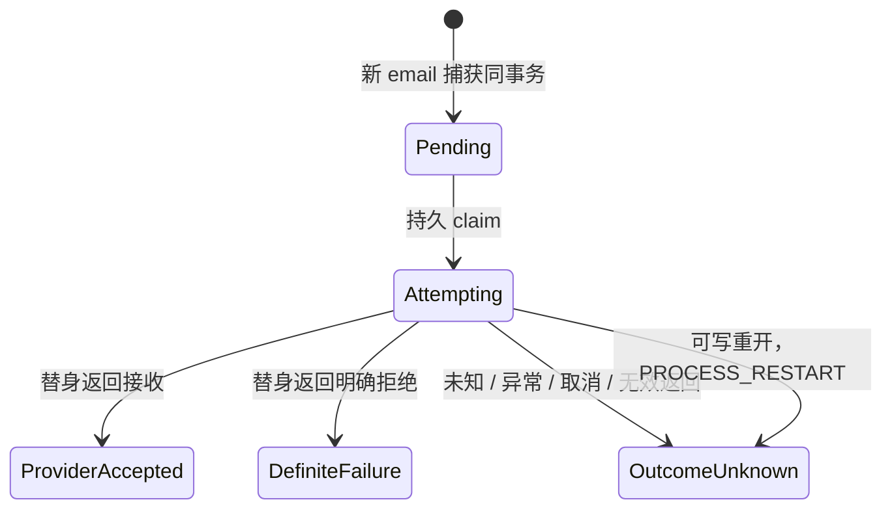

# SMTP 外发第一期：新捕获与离线替身

基线：main `40e5b246715f830af466d60bdfa5aca3e49b55ca`。
工作树：`/galatea-homes/g-01/smtp-outbound`；分支：`g01/smtp-outbound`。
依据：Galatea(Galatea-01) 的 G01-C-016。第一期不连接 SMTP，不读取凭据，不补寄旧信。

## 协议与提取边界

协议附录 `prompt/trpg-outbound-mail-protocol-appendix-zh-cn.md` 是 `Galatea.Server.csproj` 的嵌入资源来源（由 `GalateaSystemPromptComposer` 读取）；无需维护第二份协议副本。收件人增加单个 email 地址，与逐字 `Codex` 和配置角色名并列。一封信只有一个收件人；不可猜测、补全、改写、改变大小写。必须是本人在本次 Action 中明确完成发送，来信引文、草稿、展示文本不是发送。正文继续由模型选择连续整行范围、宿主从原文切片。

提取工具增加可选 `recipientLine`：email 必须提供，Codex/角色调用仍可省略。email 收件人行必须在正文范围之外，整行只能是地址，或 `收件人：`、`收件人:`、`Recipient:` 加地址。宿主只读取这个指定行，对整个地址做精确比较（仅容许首尾 ASCII 空格），不扫描正文或地址子串，不从引文自动发现收件人。缺少行号或大小写不一致会拒绝候选。协议给 email 增加独占收件人行的布局约束，使这一校验可确定执行；此为本期额外的保守约束。

这保证已接纳 email 的地址字面值和正文切片来自原文；地址所在行属于哪封信、本人发送授权、引文归属、正文是否语义完整，仍依赖提取模型。机械定位不能证明这些语义条件。确定性工具调用测试只证明宿主处理，不证明模型自己能正确抽取。

## 解析器出处与限制

`GalateaExternalMailAddress.cs` 和原测试来自姬澄(Galatea-02) 的提交 `38959d0293d4456f62d2c5a4a3af26088dfa3c0e`。语法逻辑及原测试不变；只添加出处注释，并在解析器 XML 注释中明确保留大小写、不解码 HTML、拒绝换行。

只支持窄语法 ASCII 单地址：非引号 atom/dot local-part 与带点的 DNS-label domain；只去除首尾 U+0020 空格，保留大小写。不支持显示名、地址列表、换行、国际化地址、注释、域字面量或引号 local-part。不做 HTML 实体解码。解析器判断语法，不代表发送授权、域名存在或可送达。

## 分类与持久关联

新捕获时按顺序选择：

1. 逐字、区分大小写的 `Codex` → 既有委托队列。
2. 宿主通过配置目录逐字解析出的其他角色 → 既有 `internal_mail_outbox`。角色名即使看起来像 email，也优先走角色路由。自寄角色保持既有不投递行为，不转为 SMTP。
3. 合法单 email → 新 `smtp_mail_outbox`。
4. 其余 → 既有 `Unrouted`，没有 outbox。

`GalateaDelegationStateSnapshot.RecipientClass` 通过既有 Codex 路由及两种持久 outbox 的关联，明确报告 Codex / Character / Email / Unrouted。既有 `outbound_mail.route_class` 专指是否走 Codex 委托；不扩展这个旧字段及委托状态枚举。角色和 email 的 `outbound_mail.state` 仍为 `Unrouted`，它不是 SMTP 状态。SMTP 结果必须查 `smtp_mail_outbox.state`。

SMTP 行以原 `dispatch_id` 为主键及外键；通过它关联不可变的 `source_action_address`、`capture_sequence`、`artifact_ordinal`。每封一行，不能同时出现在角色和 SMTP outbox。收件地址保存解析后字面值（只去首尾 ASCII 空格），原 `outbound_mail.recipient` 另保留捕获值；正文不复制到 SMTP 表，消费时联表读取原正文。宿主写入 `from_character_id` 和固定 `offline:<characterId>` 账号引用，角色不能指定发件账号。

## 启用基线与迁移

数据库版本升级至 V7（主线 V6 已用于冻结邮件回执），沿用现有显式离线 `upgrade-delegation-store` 操作入口，包含 dry-run、升级前备份、事务及重开验证；普通运行打开不自动升级。迁移只建立空 SMTP 表、更新 schema 版本，不为旧 `outbound_mail` 回填任何 outbox，不重新判断旧收件人。

SMTP 行只在 email 类**新捕获**与 `action_capture` / `outbound_mail` 同一事务内 INSERT。来源 Action 主键和 `(source_action_address, artifact_ordinal)` 唯一约束仍生效；重协调已有来源先返回 `AlreadyCaptured`，不重新提取或解析，也不补建路由。直接重复调用捕获入口同样返回已有捕获。本期不提供补寄、重置或回填接口。因此保留这些持久记录时，C-015 的 capture 512 等旧 Unrouted email 永远不会因迁移、重启或重协调产生 SMTP 行。旧信真要寄，需要角色明确发一封新的信。

边界：上述防线以持久的来源身份为准。删除/更换数据库、人工导入不同来源地址、将旧叙事重新追加为一个新的 Action，会改变身份或启用前提，不能从文字日期判断它是旧信。现有新建 store 会在当前物理 frontier 建基线，既有历史被忽略，但基线之后的人工重放不应进入生产捕获。离线 replay 必须使用独立、无发送器的环境，或在导入结束后建立新 store 基线。若今后需要允许生产中任意重建/导入又仍严格禁止旧信，应加入独立持久的捕获来源账本或只允许真实完成回合进入 SMTP 捕获的来源证明；本期没有实现这种灾难恢复/人工重放契约。

## 独立状态机与消费

发送前先 claim；同一 store 的 gate 和独占 lifetime lock 防止重复 claim。claim 的 COMMIT 回报不确定时，即使重新读到 Attempting，也不允许外部调用。结果 COMMIT 回报不确定可通过精确持久后状态确认。结果写入失败则保留 Attempting，消费不重试，下一次可写重开转未知。只读打开不执行恢复；恢复只在可写打开时执行，不在后台 sweep 中执行，避免误伤活跃调用。

Pending 是唯一可消费状态。OutcomeUnknown 无回退边，不能自动重发。重开把所有遗留 Attempting 转为 OutcomeUnknown；不恢复发送。DefiniteFailure 附固定原因码，不存异常正文或堆栈。ProviderAccepted 仅表示发送器报告服务商接收，不表示最终送达；本期 `OFFLINE_ACCEPTED` 更只表示模拟接收。

`GalateaSmtpOutboxBackgroundService` 每秒查看 supervisor 已可写的 store，每个 store 每次消费一封；不初始化未打开的会话。默认 DI 仅注册 `GalateaOfflineSmtpSender`，默认结果为 `OFFLINE_UNKNOWN`，避免假装真实成功；测试可选择接收、确定失败、未知或抛异常。代码没有真实网络发送器、SMTP 客户端或凭据加载器。hosted-service 关闭与宿主直接 Dispose 都先取消并排空 SMTP 消费，再释放持久 store。

## 第二期留待事项

- 真实 SMTP 实现和明确的发送超时、服务商应答分类；继续保守处理未知，不能自动重发。
- 每角色固定发件账号映射：配置拟采用 `smtp.senderAccounts[characterId].credentialPath`（绝对路径引用）与启用字段。此键仅为设计，尚未进入严格配置 schema。发送模块运行时读取路径指向的凭据；账号不能由角色正文、收件人字段或模型指定。测试不读取凭据。
- 服务商接收与最终送达分开表达；结果回执、UI、保留/容量策略及人工处理未知结果的契约尚未实施。
- 本期没有真实发送开关、补寄入口或自动重试。部署到现有实例需另行离线升级 V7，本次实施不触碰运行实例。

## 验证

`GalateaSmtpOutboundTests` 使用注入的工具调用和离线发送器，覆盖 email 原文切片/大小写、混合邮件、引文与新回信、非法地址、四种替身结果、重开恢复、claim 提交不确定、捕获回滚及 V5 迁移不回填/AlreadyCaptured。另带上姬澄原解析器测试，并运行现有邮件、提取和委托测试。实际命令、耗时和最终结果见本次 G01-C-016 回信；没有调用付费模型来验证语义抽取。

### 2026-10-05 实际验证记录

以下均在新工作树中实际执行，未调用真实模型或 SMTP。`P` 指 `tests/Galatea.Server.Tests/Galatea.Server.Tests.csproj`。`TMPDIR`、`DOTNET_CLI_HOME` 分别指向本树 `.artifacts/c016/tmp`、`.artifacts/c016/cli`；禁用遥测及开发证书生成，不改全局 NuGet。

| 命令 / 范围 | 结果 | 墙钟耗时 |
| --- | --- | --- |
| `dotnet restore P` | 成功 | 42.63 秒 |
| `dotnet build P --no-restore`，最终 Debug 构建 | 成功，0 警告、0 错误 | 23.74 秒 |
| `dotnet build P -c Release --no-restore` | 成功，0 警告、0 错误 | 44.40 秒 |
| 初轮 SMTP / 解析器测试，`--no-build --no-restore` | 56/56；之后补入 3 条新测试，由最终回归覆盖 | 137.01 秒 |
| 解析器单独复跑 | 38/38 | 3.57 秒 |
| Debug 邮件回归，过滤 `!Live & (Mail \| Delegation \| TextExtractor \| GalateaSmtpOutboundTests)` | 20 分钟人为执行上限时中断；367 条已报告通过，没有已报告失败 | 1200.03 秒 |
| 补跑剩余 10 个方法组，`dotnet test P --no-build --no-restore --filter ...` | 34 通过、1 跳过（仅 Release 启用）；退出 0 | 443.46 秒 |
| `dotnet test P -c Release --no-build --no-restore --filter FullyQualifiedName~ReleaseCapture_PersistsWithoutDiagnostic` | 1/1 | 11.31 秒 |
| Recap 超时方法单独复跑（4 参数例） | 4/4 | 148.86 秒 |
| RetryIsolation 超时方法单独复跑 | 1/1 | 32.30 秒 |
| NoteReceipt 进程崩溃回执方法单独复跑 | 1/1 | 30.97 秒 |

同一最终构建的逐用例结果核对：相关回归集合 395 个不同用例全部有通过结果（Debug 394，Release 专属 1）。其中最终新增 SMTP 测试 21/21，姬澄原解析器测试 38/38。不是一次单独完整运行全通过。完整 argv、过滤表达式、TRX 与覆盖清单在本树忽略目录 `.artifacts/c016/`，覆盖核对为 `verification.json`。

早期失败 / 中断保留：

- 初次 3 次编译失败（Snapshot 初始化语法、局部变量接线、测试命名空间与连接构造参数）均已修正；最终 Debug / Release 构建通过。
- 首次回归发现两个旧格式夹具仍假定 V5：降级夹具未去掉 SMTP 表、meta CHECK 仍按旧版本替换。已更新夹具并实际验证 V1–V5 升级。那次回归在 205.86 秒停止后重新验证，没有把早期结果算作成功。
- 尝试 Galatea.Server 离线全集，在 629.56 秒停止前报告 719 条通过、4 项超时（Recap 2 项、RetryIsolation、NoteReceipt 各 1）。上述六个相关参数例单独复跑全通过；全集的超时原因未归因，全集没有完成，不能声称全集通过。
- 全集中的五类既有 Recap 夹具硬编码优先使用 `/dev/shm`，不受 `TMPDIR` 控制，确实发生了新工作树之外的临时夹具写入。这偏离本信限定的执行位置；发现后停止全集。后续邮件回归及上述超时复跑不包含这些固定路径夹具。没有改动运行实例的数据、配置或主线工作树。
- 未运行真实模型 / Codex live canary、真实 SMTP、全仓库测试；没有真实发送、没有连接 SMTP、没有读取实际凭据文件、没有重启运行服务、没有 push 或合并。
