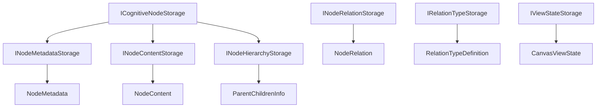

# MemoTree 存储接口定义 (Phase 2)

> **版本**: v1.0  
> **创建时间**: 2025-07-25  
> **依赖**: Phase1_CoreTypes.md, Phase1_Exceptions.md  
> **阶段**: Phase 2 - Storage Layer  

## 概述

本文档定义了MemoTree系统的核心存储接口，提供了数据持久化的抽象层。这些接口将数据访问逻辑与具体的存储实现分离，支持多种存储后端（文件系统、数据库等）。

存储层采用分层设计：
- **基础存储接口**: 元数据、内容、关系、层次结构的独立存储
- **复合存储接口**: 组合多个基础接口，提供统一的数据访问
- **专用存储接口**: 视图状态、关系类型定义等特殊用途存储

## 基础存储接口

### 节点元数据存储接口

```csharp
/// <summary>
/// 节点元数据存储接口
/// </summary>
public interface INodeMetadataStorage
{
    /// <summary>
    /// 获取节点元数据
    /// </summary>
    Task<NodeMetadata?> GetAsync(NodeId nodeId, CancellationToken cancellationToken = default);

    /// <summary>
    /// 保存节点元数据
    /// </summary>
    Task SaveAsync(NodeMetadata metadata, CancellationToken cancellationToken = default);

    /// <summary>
    /// 删除节点元数据
    /// </summary>
    Task DeleteAsync(NodeId nodeId, CancellationToken cancellationToken = default);

    /// <summary>
    /// 批量获取元数据
    /// </summary>
    Task<IReadOnlyDictionary<NodeId, NodeMetadata>> GetBatchAsync(IEnumerable<NodeId> nodeIds, CancellationToken cancellationToken = default);

    /// <summary>
    /// 异步枚举所有元数据
    /// </summary>
    IAsyncEnumerable<NodeMetadata> GetAllAsync(CancellationToken cancellationToken = default);
}
```

### 节点内容存储接口

```csharp
/// <summary>
/// 节点内容存储接口
/// </summary>
public interface INodeContentStorage
{
    /// <summary>
    /// 获取节点内容
    /// </summary>
    Task<NodeContent?> GetAsync(NodeId nodeId, LodLevel level, CancellationToken cancellationToken = default);

    /// <summary>
    /// 保存节点内容
    /// </summary>
    Task SaveAsync(NodeContent content, CancellationToken cancellationToken = default);

    /// <summary>
    /// 删除节点内容
    /// </summary>
    Task DeleteAsync(NodeId nodeId, LodLevel level, CancellationToken cancellationToken = default);

    /// <summary>
    /// 删除节点的所有内容
    /// </summary>
    Task DeleteAllAsync(NodeId nodeId, CancellationToken cancellationToken = default);

    /// <summary>
    /// 获取节点的所有内容级别
    /// </summary>
    Task<IReadOnlyDictionary<LodLevel, NodeContent>> GetAllLevelsAsync(NodeId nodeId, CancellationToken cancellationToken = default);
}
```

## 关系存储接口

### 语义关系存储接口

```csharp
/// <summary>
/// 语义关系存储接口（集中存储版本，不包括父子关系）
/// </summary>
public interface INodeRelationStorage
{
    /// <summary>
    /// 获取节点的所有出向语义关系
    /// </summary>
    Task<IReadOnlyList<NodeRelation>> GetOutgoingRelationsAsync(NodeId nodeId, CancellationToken cancellationToken = default);

    /// <summary>
    /// 获取节点的所有入向语义关系
    /// </summary>
    Task<IReadOnlyList<NodeRelation>> GetIncomingRelationsAsync(NodeId nodeId, CancellationToken cancellationToken = default);

    /// <summary>
    /// 获取节点的所有语义关系（入向+出向）
    /// </summary>
    Task<IReadOnlyList<NodeRelation>> GetAllRelationsAsync(NodeId nodeId, CancellationToken cancellationToken = default);

    /// <summary>
    /// 根据关系ID获取语义关系
    /// </summary>
    Task<NodeRelation?> GetRelationAsync(RelationId relationId, CancellationToken cancellationToken = default);

    /// <summary>
    /// 添加语义关系
    /// </summary>
    Task<RelationId> AddRelationAsync(NodeId sourceId, NodeId targetId, RelationType relationType, string description = "", CancellationToken cancellationToken = default);

    /// <summary>
    /// 更新语义关系
    /// </summary>
    Task UpdateRelationAsync(RelationId relationId, Action<NodeRelation> updateAction, CancellationToken cancellationToken = default);

    /// <summary>
    /// 移除语义关系
    /// </summary>
    Task RemoveRelationAsync(RelationId relationId, CancellationToken cancellationToken = default);

    /// <summary>
    /// 批量获取语义关系
    /// </summary>
    Task<IReadOnlyDictionary<RelationId, NodeRelation>> GetRelationsBatchAsync(IEnumerable<RelationId> relationIds, CancellationToken cancellationToken = default);

    /// <summary>
    /// 查找特定类型的语义关系
    /// </summary>
    Task<IReadOnlyList<NodeRelation>> FindRelationsByTypeAsync(RelationType relationType, CancellationToken cancellationToken = default);

    /// <summary>
    /// 查找两个节点之间的语义关系
    /// </summary>
    Task<IReadOnlyList<NodeRelation>> FindRelationsBetweenAsync(NodeId sourceId, NodeId targetId, CancellationToken cancellationToken = default);

    /// <summary>
    /// 异步枚举所有语义关系
    /// </summary>
    IAsyncEnumerable<NodeRelation> GetAllRelationsAsync(CancellationToken cancellationToken = default);
}
```

### 关系类型定义存储接口

```csharp
/// <summary>
/// 关系类型定义存储接口
/// </summary>
public interface IRelationTypeStorage
{
    /// <summary>
    /// 获取关系类型定义
    /// </summary>
    Task<RelationTypeDefinition?> GetRelationTypeAsync(RelationType relationType, CancellationToken cancellationToken = default);

    /// <summary>
    /// 保存关系类型定义
    /// </summary>
    Task SaveRelationTypeAsync(RelationTypeDefinition definition, CancellationToken cancellationToken = default);

    /// <summary>
    /// 获取所有关系类型定义
    /// </summary>
    Task<IReadOnlyList<RelationTypeDefinition>> GetAllRelationTypesAsync(CancellationToken cancellationToken = default);

    /// <summary>
    /// 删除关系类型定义
    /// </summary>
    Task DeleteRelationTypeAsync(RelationType relationType, CancellationToken cancellationToken = default);
}
```

## 层次结构存储接口

```csharp
/// <summary>
/// 节点层次结构存储接口（基于ParentChildrens文件夹的独立存储）
/// </summary>
public interface INodeHierarchyStorage
{
    /// <summary>
    /// 获取父子关系信息
    /// </summary>
    Task<ParentChildrenInfo?> GetParentChildrenInfoAsync(NodeId parentId, CancellationToken cancellationToken = default);

    /// <summary>
    /// 保存父子关系信息
    /// </summary>
    Task SaveParentChildrenInfoAsync(ParentChildrenInfo parentChildrenInfo, CancellationToken cancellationToken = default);

    /// <summary>
    /// 获取子节点ID列表（有序）
    /// </summary>
    Task<IReadOnlyList<NodeId>> GetChildrenAsync(NodeId parentId, CancellationToken cancellationToken = default);

    /// <summary>
    /// 获取父节点ID（通过运行时索引）
    /// </summary>
    Task<NodeId?> GetParentAsync(NodeId nodeId, CancellationToken cancellationToken = default);

    /// <summary>
    /// 添加子节点
    /// </summary>
    Task AddChildAsync(NodeId parentId, NodeId childId, int? order = null, CancellationToken cancellationToken = default);

    /// <summary>
    /// 移除子节点
    /// </summary>
    Task RemoveChildAsync(NodeId parentId, NodeId childId, CancellationToken cancellationToken = default);

    /// <summary>
    /// 移动节点到新父节点
    /// </summary>
    Task MoveNodeAsync(NodeId nodeId, NodeId? newParentId, int? newOrder = null, CancellationToken cancellationToken = default);

    /// <summary>
    /// 重新排序子节点
    /// </summary>
    Task ReorderChildrenAsync(NodeId parentId, IReadOnlyList<NodeId> orderedChildIds, CancellationToken cancellationToken = default);

    /// <summary>
    /// 获取节点路径（从根到节点）
    /// </summary>
    Task<IReadOnlyList<NodeId>> GetPathAsync(NodeId nodeId, CancellationToken cancellationToken = default);

    /// <summary>
    /// 获取子树中的所有节点ID
    /// </summary>
    IAsyncEnumerable<NodeId> GetDescendantsAsync(NodeId rootId, CancellationToken cancellationToken = default);

    /// <summary>
    /// 构建运行时反向索引（子节点到父节点的映射）
    /// </summary>
    Task<IReadOnlyDictionary<NodeId, NodeId>> BuildParentIndexAsync(CancellationToken cancellationToken = default);

    /// <summary>
    /// 检查节点是否有子节点
    /// </summary>
    Task<bool> HasChildrenAsync(NodeId nodeId, CancellationToken cancellationToken = default);

    /// <summary>
    /// 获取节点的层级深度
    /// </summary>
    Task<int> GetDepthAsync(NodeId nodeId, CancellationToken cancellationToken = default);
}
```

## 复合存储接口

### 认知节点复合存储接口

```csharp
/// <summary>
/// 复合存储接口（组合所有存储功能）
/// </summary>
public interface ICognitiveNodeStorage : INodeMetadataStorage, INodeContentStorage, INodeHierarchyStorage
{
    /// <summary>
    /// 获取完整节点
    /// </summary>
    Task<CognitiveNode?> GetCompleteNodeAsync(NodeId nodeId, CancellationToken cancellationToken = default);

    /// <summary>
    /// 保存完整节点
    /// </summary>
    Task SaveCompleteNodeAsync(CognitiveNode node, CancellationToken cancellationToken = default);

    /// <summary>
    /// 事务性操作
    /// </summary>
    Task<T> ExecuteInTransactionAsync<T>(Func<ICognitiveNodeStorage, CancellationToken, Task<T>> operation, CancellationToken cancellationToken = default);
}
```

## 专用存储接口

### 视图状态存储接口

```csharp
/// <summary>
/// 视图状态存储接口
/// </summary>
public interface IViewStateStorage
{
    /// <summary>
    /// 获取视图状态
    /// </summary>
    Task<CanvasViewState?> GetViewStateAsync(string viewName, CancellationToken cancellationToken = default);

    /// <summary>
    /// 保存视图状态
    /// </summary>
    Task SaveViewStateAsync(CanvasViewState viewState, CancellationToken cancellationToken = default);

    /// <summary>
    /// 获取所有视图名称
    /// </summary>
    Task<IReadOnlyList<string>> GetViewNamesAsync(CancellationToken cancellationToken = default);

    /// <summary>
    /// 删除视图状态
    /// </summary>
    Task DeleteViewStateAsync(string viewName, CancellationToken cancellationToken = default);
}
```

## 存储接口设计原则

### 1. 分离关注点
- **元数据存储**: 专注于节点基本信息的持久化
- **内容存储**: 处理多级别内容的存储和检索
- **关系存储**: 管理语义关系的独立存储
- **层次存储**: 专门处理父子关系和树形结构

### 2. 异步优先
所有存储操作都采用异步模式，支持：
- 高并发访问
- 非阻塞I/O操作
- 取消令牌支持
- 异步枚举大数据集

### 3. 批量操作支持
提供批量操作接口以提高性能：
- 批量获取元数据
- 批量获取关系
- 异步枚举大数据集

### 4. 事务性支持
复合存储接口提供事务性操作，确保数据一致性。

## 存储接口依赖关系



## 实施优先级

### 高优先级 (Phase 2.1)
1. **INodeMetadataStorage** - 基础元数据存储
2. **INodeContentStorage** - 内容存储核心功能
3. **ICognitiveNodeStorage** - 复合存储接口

### 中优先级 (Phase 2.2)
1. **INodeHierarchyStorage** - 层次结构管理
2. **INodeRelationStorage** - 语义关系存储

### 低优先级 (Phase 2.3)
1. **IRelationTypeStorage** - 关系类型定义
2. **IViewStateStorage** - 视图状态持久化

## 最佳实践

### 1. 错误处理
- 使用适当的异常类型（参考 Phase1_Exceptions.md）
- 提供详细的错误上下文信息
- 支持重试机制

### 2. 性能优化
- 实现适当的缓存策略
- 使用连接池管理数据库连接
- 支持分页查询大数据集

### 3. 数据一致性
- 使用事务确保复合操作的原子性
- 实现乐观锁防止并发冲突
- 提供数据验证机制

---

**下一阶段**: [Phase2_RelationStorage.md](Phase2_RelationStorage.md) - 关系存储实现
