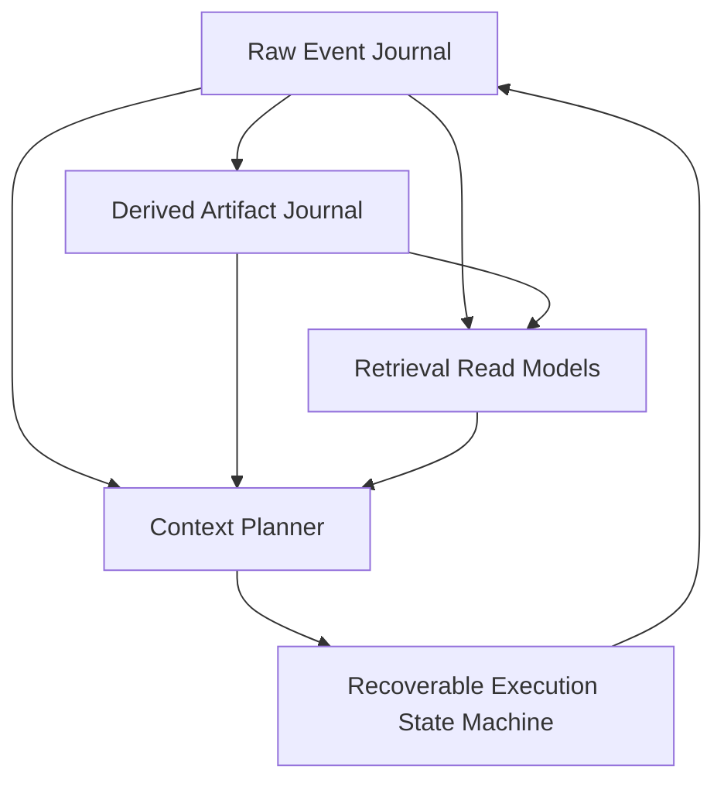
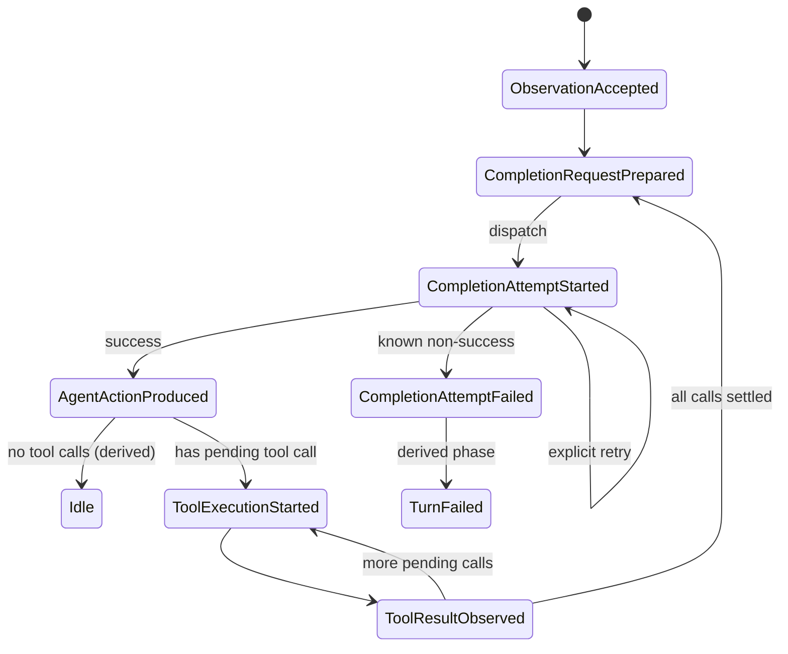

# SessionJournal 事件源会话与长期上下文架构路线图

> **状态**：Architecture Roadmap / current baseline CS-3D7 / active plan DM-0～DM-8
> **日期**：2026-07-28
> **底层依赖**：[EventJournal 功能需求与粗粒度设计基线](../EventJournal/event-journal-requirements-and-design.md)
> **相关既有研究**：[Dynamic Logical Context Store for Long-Running Role-Play Agents](../Galatea/backlog/idea/dynamic-logical-context-store-for-long-running-role-play-agents.md)
> **后续实施计划**：
> [DerivedMemory 可替换子系统与 Shared Epoch 实施方案](derived-memory-subsystem-implementation-plan.md)

## 1. 文档定位

本文记录如何建立以 `Atelia.SessionJournal` 为 raw correctness core 的新一代会话系统：
不可变事件源、可重建派生记忆、精确上下文规划与可恢复执行。它是
`Atelia.SessionJournal` 及其 companion projects 的现行架构路线图，而不是旧
`Atelia.ChatSession` 的升级计划。

旧 ChatSession 已冻结，只承担三种角色：

- 作为早期“StateJournal 当前工作态 + 定期压缩”方案的历史背景；
- 作为一次性、只读的数据迁移源，由 `ChatSession.LegacyExportCli` 导出；
- 在完成迁移验证后归档。

新功能、新 wire contract 和新架构只在 SessionJournal family 及其附属项目中实施。两代系统之间
不双写、不共享 mutable state，也不把新功能回流到旧项目；迁移方向始终是
`ChatSession -> legacy JSON -> SessionJournal`。

它回答：

- 哪些数据是长期事实源。
- Recap、Autobiography、World Understanding 等内容应如何建模。
- 每次 completion 的上下文如何动态选择并精确复现。
- tool-loop 如何逐步持久化并在崩溃后恢复。
- 全文、向量和图召回应放在哪一层。
- SessionJournal family 中各程序集分别拥有哪一层能力。
- 如何分阶段完成 current interim 到 target architecture 的切换。

本文不是每种 payload 的最终 wire spec，也不要求单个后续会话建成完整 Memory OS。后续会话应从本文的阶段列表领取一个垂直切片，产出更窄的 Decision/Spec/实现与测试。

## 2. 建立新系统所解决的问题

旧 ChatSession 曾以 StateJournal root 和 durable deque 表达会话工作态：

- 普通 turn 完成后整体 commit。
- compaction 用 Recap 替换旧消息前缀。
- ContextHeader / MemoryPack 表示当前应注入的压缩信息。
- StateJournal commit history 可以追溯旧状态，但它不是领域事件源。

这条路径已经验证了会话、回放、legacy recovery 与 Rewrite maintainer，但对长期自主 Agent 有四个结构性限制：

1. 原始体验与当前投影混在同一工作态中；compaction 的自然操作是改写当前 deque。
2. tool-loop 只在整轮结束后提交，中途崩溃无法精确判断 completion 或工具执行到了哪一步。
3. Recap、自传、世界理解等派生解释被当作“当前文本块”，缺少统一 provenance 与版本 lineage。
4. 上下文主要由固定 recent window 构造，难以在不同 artifact anchor、raw suffix 和动态召回之间做预算化选择。

SessionJournal 不在旧 deque 旁边补 raw log，而是从新的 storage/wire boundary 建立事实源、解释层、
投影层和执行状态。旧实现只帮助识别需求和提供迁移样本，不约束新系统的领域模型。

## 3. 核心决策

### decision [S-SJ-LEGACY-FROZEN] 旧 ChatSession 冻结

旧 ChatSession 不接受 SessionJournal 新能力、不参与双写，也不作为新 host 的依赖。允许的维护仅限于
保持 legacy export 可用和修复阻断迁移的缺陷；迁移完成后整体归档。

### decision [S-SJ-NEW-WORK-OWNERSHIP] 新工作归属 SessionJournal family

raw event、recovery contract 与 request execution 属于 `Atelia.SessionJournal`；concrete
MemoryMaintainer 属于 `Atelia.SessionJournal.Maintainers`；派生存储、epoch、artifact/set publication
和 retrieval 属于未来独立 DerivedMemory；CLI/Agent Host 作为 composition root 组合这些能力。

### decision [S-SJ-MIGRATION-ONE-WAY] Legacy migration 单向且经中立交换格式

`ChatSession.LegacyExportCli` 只读取旧 repo 并导出 JSON/Markdown。`SessionJournal.Cli` 通过自身的
anti-corruption DTO 导入 JSON，不引用 ChatSession 产品程序集。导入不会建立两代 repo 之间的运行时
同步关系。

### decision [S-SJ-RAW-EVENTS-AUTHORITATIVE] Raw Events 是长期事实源

Agent 实际接收、生成和执行过的内容，以不可变 raw events 保存。compaction、摘要更新或上下文切换不得删除或改写 raw events。

### decision [S-SJ-ARTIFACTS-DERIVED] Memory Artifacts 是派生解释

Recap、Autobiography、World Understanding、关系状态、开放线索等都是由 raw events 和既有 artifacts 推导出的版本化产物。它们可以被替换、废弃或重算，但不能冒充原始体验。

### decision [S-SJ-PROJECTION-NOT-SSOT] MemoryPack 是 Context Projection

现有 `MemoryPack` 继续作为“本轮上下文需要的有序文本块投影”是有价值的，但它不再是长期记忆的唯一事实源。它应由选定的 artifact set 和其他固定配置 materialize。

### decision [S-SJ-CONTEXT-PLAN-PERSISTED] 实际上下文选择必须持久化

每次 completion 前，系统必须保存精确 `ContextPlan` 和 canonical request manifest。崩溃恢复不能仅凭“当前配置 + 当前 head”重新运行 planner，因为配置、索引和 token estimator 可能已经变化。

这条 decision 描述 target contract。canonical request manifest 对 raw facts 采用 exact
address/range/setup refs，对实际进入 provider
request 的 derived memory contribution 则保存 exact context snapshot 或 canonical request bytes。
Prepared 不引用 derived artifact/set id，也不要求 derived store 在 reopen 时仍存在；planner/renderer
版本变化不能改写已经 Prepared 的外部调用事实。若要审计 derived selection，可在可重建 usage index 中
记录 `preparedAddress -> derivedSetId`。current Prepared v3 仍含 raw activation/artifact identity，
属于 §6.2、§7.3 记录的待拆 interim。

### decision [S-SJ-EXECUTION-INCREMENTAL] 执行状态逐步事件化

Observation、completion request、agent action、tool intent 和 tool result 必须在各自边界逐步持久化。
turn completion 若可由这些 raw facts 唯一确定，则保持为派生状态；只有出现不可推导的额外领域承诺时
才增加显式事件。不能继续把整个 tool-loop 当成一个只在末尾 commit 的内存事务。

### decision [S-SJ-INDEXES-REBUILDABLE] Retrieval Index 不进入正确性核心

全文、向量、实体图、时间索引和统计 read model 必须能从 raw events / artifacts 重建。索引损坏或丢失会降低召回能力，但不得改变历史事实或使 session 无法恢复。

## 4. 五层架构



五层职责如下：

| 层 | Canonical Data | 主要职责 |
|:---|:---------------|:---------|
| Raw Event Journal | 不可变 session events | 保存发生过什么、维持版本树与回放顺序 |
| Derived Artifact Journal | config snapshots、coverage epochs、artifacts、ArtifactSets | 保存系统如何分块、解释和压缩历史 |
| Retrieval Read Models | 可重建索引 | 按语义、实体、时间、关键词发现候选材料 |
| Context Planner | 持久化 ContextPlan | 在 token/cost/latency 预算内选择 exact context |
| Execution State Machine | 逐步执行事件 | 驱动 completion/tool-loop，并从任意持久边界恢复 |

DerivedMemory repository 可以物理附着在 SessionJournal repo 下，也可以使用独立 store，但不能把
derived plans/artifacts/sets 写入 raw Parent sequence；逻辑上的权威边界不能因为物理共置而消失。

### 4.1 Ownership 与依赖方向

| 项目 / 程序集 | Ownership | 依赖约束 |
|:---------------|:----------|:---------|
| `Atelia.SessionJournal` | raw event codec、reducer、tail recovery、request preparation/execution，以及 store-neutral derived-context contracts | raw core 不引用 concrete maintainer 或未来 DerivedMemory |
| `Atelia.SessionJournal.Maintainers` | concrete MemoryMaintainer、profiles、prompts、target paths 与窄职责 helpers | 作为 companion assembly 单向依赖 SessionJournal contracts |
| `Atelia.SessionJournal.DerivedMemory`（暂名、未来） | epochs、artifacts、ArtifactSets、lineage/indexes、selection 与 publication | 单向依赖 SessionJournal 的 neutral contracts；其记录只向 raw address 建立引用 |
| `SessionJournal.Cli` / Agent Host | composition root、迁移导入、离线开发运行、provider/tool 注入 | 可以同时引用上述项目，但不把应用 policy 推回 raw core |
| `ChatSession.LegacyExportCli` | 旧 ChatSession 数据的 JSON/Markdown 出口 | 只依赖旧 ChatSession；不依赖 SessionJournal，也不承担新功能 |

目标依赖图如下：

```text
SessionJournal.Cli / Agent Host
├── Atelia.SessionJournal
├── Atelia.SessionJournal.Maintainers ──> Atelia.SessionJournal
└── Atelia.SessionJournal.DerivedMemory ─> Atelia.SessionJournal

ChatSession.LegacyExportCli ──> Atelia.ChatSession   # frozen migration island
```

current trunk 尚未完全达到这张图：`DerivedRecapStore` 与 raw `ArtifactSetCommitted` 仍位于
SessionJournal core。它们是明确的 interim bridge，将按 DerivedMemory 实施计划依序拆除，不能反过来
被解释为 target ownership。

## 5. Raw Event Journal

### 5.1 角色

Raw Event Journal 保存“Agent 生命周期中确实发生过的事情”，包括外部输入、模型输出、工具交互和控制状态。它是审计、回放、迁移和所有派生分析的根。

EventJournal 负责 frame、`Parent` 与 opaque kind；`Atelia.SessionJournal` 解释
`EventJournal` header 中的 numeric kind，并以 canonical JSON `{ "v": ..., "body": ... }`
编码每种 kind 自己的 versioned payload。`EventAddress` 提供 store 内身份和 Parent 顺序，不以时间戳
或另造 ordinal 冒充因果顺序。

### 5.2 Current wire baseline

current trunk 的 schema 是 `atelia.session-journal.trunk.v1`。已实现的
`SessionEventKind` 如下；名称是 C# contract，持久化判别器是 EventJournal header 中的整数值：

| Kind | 值 | Current 语义 |
|:-----|---:|:-------------|
| `RuntimeConfigSetup` | 1 | model、completion surface 与 session schema 从此边界起生效 |
| `SystemPromptSetup` | 2 | system prompt snapshot 从此边界起生效 |
| `SessionCreated` | 3 | session 初始化完成 marker |
| `ObservationAccepted` | 4 | 外部 observation 已持久化 |
| `AgentActionProduced` | 5 | online completion response 已规范化并持久化 |
| `ToolExecutionStarted` | 6 | tool side effect 前的 durable intent / execution identity |
| `ToolResultObserved` | 7 | 与 execution 对应的 tool result 已持久化 |
| `CompletionRequestPrepared` | 8 | canonical request manifest 与 durable request origin 已持久化 |
| `CompletionAttemptFailed` | 9 | 已知 provider/host failure 已持久化 |
| `ImportedAgentAction` | 10 | 迁移导入的 action；不伪装成 online provider completion |
| — | 11 | 已退役；曾用于 opaque `CompletionAttemptRestarted`，不得复用 |
| `ArtifactSetCommitted` | 12 | interim coherent artifact-set activation；target 将移出 raw |
| `CompletionAttemptStarted` | 13 | provider dispatch claim；event address 是 attempt identity |

每种 payload 版本独立推进；不能把上表的 header kind 数值、payload `v` 和 repository schema 混为一个
版本号。codec 只接受它明确支持的 kind/version，未知 kind 和不受支持的 payload version 必须失败，
不得静默降级。

### 5.3 Future semantic boundaries

下列边界仍是路线图语义，不应被描述为已实现的 event kind：

- `ToolExecutionUncertain`：无法证明副作用是否发生，需要查询、人工处理或 capability-specific recovery。
- 显式 `TurnCompleted`、`TurnFailed`、`TurnPaused`：当仅靠 current tail phase 不足以表达产品语义时再引入。
- 独立 `ContextPlanCommitted`：只有需要把 planning 与 Prepared 分成两个 durable boundary 时才引入；
  current 将 selection plan 包含在 `CompletionRequestPrepared` 中。
- provider retry / rejection 的更细分类：应由明确 recovery contract 驱动，不提前枚举空事件。

### 5.4 Raw 与 operational event 的边界

“Raw”不是只指用户和 assistant 可见文本。为了恢复真实执行过程，以下内容也属于事实：

- 模型返回了哪些 tool calls。
- 哪个调用已开始执行。
- 工具返回了什么，或为何状态不确定。
- 哪次 completion attempt 失败、重试或被放弃。

provider-native 临时字段不应未经筛选整包回写。Canonical event schema 只保存后续回放、审计和恢复真正需要的信息；需要 HTTP 法证时可另存 provider call log。

### 5.5 分支、rewind 与替代未来

EventJournal 的 Parent lineage 和 repository/branch primitives 为未来 rewind、reroll 与替代未来提供
底层能力，但 current SessionJournal 尚未交付完整 branch UX。目标语义是：

- 正常会话沿选定 branch/ref 追加；
- rewind 不删除 event，而是移动 ref 或从历史 event 创建新 branch；
- reroll 从同一 durable boundary 附近产生替代 action 分支；
- 被放弃的未来仍可通过明确的 retention/reflog policy 查阅；
- 上层 UI 区分“当前有效父链”和“曾发生但当前不可达的旁支”。

这些语义需要后续单独定义 branch identity、ref ownership、retention 和 UI contract；不能仅因底层已有
EventJournal branch primitive 就宣称产品能力已经实现。

## 6. Derived Artifact Journal

### 6.1 Target 概念

以下内容统一称为 `DerivedContextArtifact`：

- Recap / rolling summary。
- First-Person Autobiography。
- World Understanding。
- Scene / episode summary。
- Relationship state。
- World facts / known unknowns。
- Open threads / promises / unresolved hooks。
- Continuity、style 或 identity constraints。

这些 artifact 的内容形状可以是 Markdown、JSON、图节点或其他二进制格式。统一的是 provenance 与生命周期，不是正文 schema。

它们不是 raw experience，也不属于旧 ChatSession。目标 ownership 是独立、可替换的
`Atelia.SessionJournal.DerivedMemory`（暂名）；该 subsystem 可以删除并由 raw SessionJournal 重建。

### 6.2 Current interim baseline

CS-5-lite 已完成，不再是待验证建议。current trunk 已具备：

- `DerivedRecapStore`：位于 `Atelia.SessionJournal` core 内，使用 session repo 下的
  `derived/recaps/v1/` sidecar 保存可删除、可重建的 recap artifacts/indexes；
- addressed replay：MemoryMaintainer runner 从 `ReplayHistory()` 取得 raw provenance，以实际吸收
  fragment 的末事件形成 `anchorRawEvent`；
- `Atelia.SessionJournal.Maintainers`：保存 concrete `RewriteMemoryBlockMaintainer` profiles，不被
  raw core 反向引用；
- `SessionJournal.Cli run-memory-maintainer`：离线运行 maintainer 并发布 derived artifact；
- `SessionJournal.Cli checkpoint-artifact-set`：由开发者手动选择 exact members，在 raw chain
  追加 interim `ArtifactSetCommitted`；
- coherent request/recovery：current `CompletionRequestPrepared` v3 引用 exact
  `ArtifactSetCommitted`，并内联 selected artifact context snapshots，使 sidecar 删除后仍可重建
  canonical request。

这条路径证明了 artifact persistence、provenance anchor、tail-only projection、coherent request 和
Prepared/attempt recovery，但它不是最终程序集或 authority 边界。尤其是 `DerivedRecapStore` 位于
core、raw `ArtifactSetCommitted` 引用 derived ids、manual checkpoint，以及 Prepared 仍引用 raw
activation，都是已知 interim coupling。

### 6.3 Target Artifact 最小字段

未来 DerivedMemory schema 至少包含：

| 字段 | 含义 |
|:-----|:-----|
| `ArtifactKind` | 稳定 kind，例如 `autobiography` |
| `ProfileId` | 具体维护 profile / policy id |
| `Producer` | analyzer / model / code version |
| `ProducerFingerprint` | prompt、model、关键配置与 codec 的稳定 fingerprint |
| `SourceRawHead` | 生成时观察到的 raw branch head |
| `SourceRanges` | 实际吸收的 raw EventAddress 区间或集合 |
| `AnchorRawEvent` | 可作为后续 raw suffix 起点的边界事件；CS-5-lite 可先用 rolling summary 覆盖到的最后一个 raw event |
| `GoverningRuntimeConfigSetup` | 生成时按 `SourceRawHead` 解析到的 runtime-config-setup 地址 |
| `GoverningSystemPromptSetup` | 生成时按 `SourceRawHead` 解析到的 system-prompt-setup 地址 |
| `InputArtifacts` | 本次读取的旧 artifact 地址 |
| `PreviousArtifact` | 同 lineage 的上一版，可空 |
| `Content` | 不透明 artifact body |
| `Invocation` | 可选 completion / analyzer audit 摘要 |
| `Status` | produced / rejected / superseded 等领域状态 |

Artifact 本身 append-only。所谓“最新版”由 lineage、ArtifactSet 或可重建索引确定，不通过原地更新 `EventAddress -> mutable value` 字典实现。

### 6.4 Provenance 不变量

任何进入长期上下文的 artifact 都应能回答：

1. 它由哪个 profile 和 producer 生成。
2. 它读取了哪个 raw head、哪些 raw ranges。
3. 它基于哪一版旧 artifact。
4. prompt/model/config 是否与当前版本相同。
5. 它是否已被后续 artifact 取代。

这使 analyzer 升级后可以重建，并允许人工比较“同一原始经历的不同解释”。

### 6.5 Target Coherent Artifact Set

Autobiography 与 World Understanding 可能并行生成，但一次上下文不应偶然混用不同 source head 的半套结果。

ArtifactSet 应作为 derived subsystem 内的 immutable record：

- 引用一组完整 exact artifact members；
- 引用一个在 producer 调用前已持久化的 shared coverage epoch；同一 coherence group 的 required
  members 必须共享 exact `epochId` 与 raw range；
- 记录 common anchor、source raw provenance、coverage setup refs、set policy/producer fingerprint；
- 维护自身 previous-set lineage 与可重建 latest/default indexes；
- 只有 derived publication 成功后，Context Planner 才把整组作为候选。

若其中一个 maintainer 失败，旧 active set 保持可用；已成功写出的单个 artifact 可以留作诊断或未来复用，但不自动进入当前 coherent set。

history 分块是 maintainer 之前的公共 planning 结果。未来 DerivedMemory subsystem 应保存 versioned split
config 和 immutable epoch ledger：config 记录 token estimator、最小 recent suffix、触发阈值与
dependency-safe boundary policy；epoch record 固定实际 raw range/anchor/setup/config fingerprint。
日常运行并行启动同 epoch 的 maintainers，prompt-tuning 则可独立重跑其中一个 role，但不能重新计算
split。同步来自 shared epoch identity，而不是进程启动时间或恰好相同的 `--threshold-tokens`。

### 6.6 从 interim 切换到 target

最终边界与 current 的差异必须显式迁移：

| 关注点 | Current interim | Target |
|:-------|:----------------|:-------|
| Derived store | `DerivedRecapStore` 在 SessionJournal core，repo-local sidecar | 独立 DerivedMemory assembly/repository |
| Coverage 协调 | 每个 runner 独立 split，人工组合 | shared immutable epoch 先于 maintainers 持久化 |
| Set publication | CLI 手动 checkpoint；raw kind 12 `ArtifactSetCommitted` 激活 | DerivedMemory 内 immutable ArtifactSet publication/index |
| 引用方向 | raw activation 和 Prepared 仍含 artifact/set identity | 只允许 derived -> raw address/range/setup refs |
| Prepared recovery | v3 内联 contribution snapshot，但仍引用 raw activation | Prepared self-contained：exact context/canonical request + raw provenance，不读取 DerivedMemory |
| Composition | SessionJournal engine 直接打开 sidecar | Host/CLI 注入 store-neutral candidate provider |

目标 raw SessionJournal 不追加 `ArtifactSetCommitted` 或其他 derived-set activation，也不引用
artifact/set/epoch id。某次 completion 实际使用的 derived memory 必须在
`CompletionRequestPrepared` 中以 exact context snapshot 或 canonical request bytes 提升为 execution
fact；exact reopen 不打开 DerivedMemory，也不重新运行 planner。用于审计 selection 的
`preparedAddress -> derivedSetId/epochId` 记录属于可重建 derived usage index。

迁移按专门实施计划的依赖顺序进行：先建立 cross-assembly neutral contracts 和 neutral request
materialization，再切换 self-contained Prepared，之后才移动 concrete store、删除 raw
`ArtifactSetCommitted`，最后引入 shared epoch、并行 orchestration 与 online selection。不能先搬
`DerivedRecapStore.cs`，否则 raw core 会被迫反向依赖 concrete DerivedMemory。

`SessionExecutionTailResolver` 始终 raw-only；DerivedMemory 缺失只阻止尚未 Prepared 的 context
planning，不应破坏已 Prepared request 的恢复。

### 6.7 MemoryPack 的新角色

`MemoryPack` 变为 materialized context view：

```text
selected ArtifactSet
+ pinned/manual context blocks
+ rendering profile
-> MemoryPack
-> ContextHeader projection
```

`RewriteMemoryBlockMaintainer` 已作为首批 artifact producer 使用：输入旧 artifact + raw range，输出
完整新 artifact。CS-5-lite 与后续 current trunk 已验证 recap 可以 materialize 为
`ContextHeader` 形态的 observation/action header，并以真实 anchor 之后的 raw suffix 保留近期细节。
朴素 raw suffix/full replay 只用于 offline bootstrap、maintainer 输入与显式审计；current online
没有 coherent candidate 时保持 not-ready，不允许静默 fallback。后续工作是在保持这一
raw/artifact 语义的前提下，把 persistence、shared epoch、set publication 和 selection 移到正确的
DerivedMemory ownership，而不是把能力回迁到 ChatSession。

## 7. Context Planner（Target Architecture）

### 7.1 Current 边界：coherent-only，不是通用预算规划器

current online request path 只接受已经激活的 exact coherent ArtifactSet，并把它与
dependency-closed raw suffix 物化为 request。若当前 lineage 没有可用 coherent set，或任一 member
缺失、内容不匹配，系统返回明确的 not-ready；不会静默退回 full raw。这条窄路径已经验证
tail-only request/recovery，但它还不是会比较多个候选、分配 token budget 或执行 retrieval 的通用
Context Planner。

current 内部虽有 `SessionContextPlan`，它只描述 Prepared v3 的固定
`coherent-artifact-tail` recipe：raw start、raw range hash、内联 artifact inputs，以及 raw
`ActiveArtifactSet` exact reference。它不是已冻结的 planner 公共 contract，也不表示 §7.2 的完整
target 已经实现。

### 7.2 Target：在预算内选择上下文

真正要优化的不是“最近保留多少条”，而是：在固定预算下，哪组 artifact anchor、raw suffix 和召回
材料最能支持下一次行动。tail-only projection 的边界优先来自 recap / artifact anchor，而不是临时
固定的 turn 截断。对长寿命 autonomous / role-play Agent，长期连续性主要由 rolling summary、自传、
world understanding 等 derived context 承担；raw suffix 只保留 anchor 之后仍需逐事件呈现的近期
细节。

target planner 可以比较：

1. 最新 coherent artifact set + 最短 raw suffix。
2. 更早 artifact set + 更长 raw suffix。
3. coherent artifact set + 当前任务相关的 recalled artifacts / raw ranges。
4. 无可用 derived candidate 时的明确 not-ready 或显式 offline/bootstrap 路径。

比较维度包括信息完整性、token、费用、延迟和 staleness。online 是否允许某种降级由届时明确的
readiness policy 决定，不能把 current coherent-only 规则悄悄改成 full-raw fallback。

下面的 record 只是用于讨论 target 信息形状的概念草图，不是 current API，也不冻结字段：

```csharp
public sealed record ContextPlan(
    EventAddress RawHead,
    EventAddress? RawStartExclusive,
    EventAddress RawEndInclusive,
    ContextHeaderSnapshot DerivedContext,
    IReadOnlyList<EventAddress> RecalledRawItems,
    string RenderingProfileId,
    string ModelProfileId,
    string PlannerFingerprint,
    ulong EstimatedTokens,
    ContextBudgetBreakdown Budget,
    string SelectionReason
);
```

无论最终类型如何，selection audit 至少要说明：

- planner 基于哪个 raw head 作出决定。
- 哪些 materialized derived contributions 与 raw range 实际进入 request。
- 哪些动态召回项实际进入 request。
- 使用哪版 planner、rendering、model、token、retriever 与 ranker policy。

### 7.3 Prepared v3 基线与 self-contained Prepared v4 目标

current `CompletionRequestPrepared` v3 已内联 artifact contribution snapshots、governing setup
references、tool definitions/runtime identity、request target 与 canonical request commitment，能够在
derived sidecar 删除后重建已 Prepared request。但 `SessionContextPlan.ArtifactInputs` 仍带 exact
artifact ids，并保存 raw `ActiveArtifactSet` reference；reconstructor 仍需沿 raw activation 验证
coherence。这是 current interim wire，不是最终依赖方向。

DM-2 的 target 是 self-contained Prepared v4：

- 固定可逐字节重建 canonical `CompletionRequest` 的 exact context / manifest。
- 保存必要的 raw range、setup、tool schema/config provenance 与 hash。
- 固定 renderer、serializer、prompt template、tool rendering、model/connection identity 和 request
  commitment。
- 保存 durable request origin；attempt identity 继续由后续 `CompletionAttemptStarted` event address
  表达。
- 不保存 derived artifact/set/epoch id，不以 DerivedMemory 或 raw activation 作为 reopen 依赖。

raw suffix 可用 exact address/range/hash 与 deterministic fold 重建；derived contribution 则必须在
Prepared 中提升为 exact snapshot 或 canonical bytes。恢复时不得重新打开 DerivedMemory、重新运行
planner，或用“当前最新配置”替换已经 Prepared 的内容。

canonical request manifest 是崩溃恢复和重发的 Canonical Source。ContextPlan/selection record 只负责
解释“为何选择这些材料”；需要关联具体 derived candidate 时，由可重建的 derived usage index 以
`preparedAddress -> derivedSetId/epochId` 单向引用 raw Prepared。

### 7.4 Target Token Budget

未来 planner 至少区分：

- fixed system / identity budget。
- artifact budget。
- recent raw suffix budget。
- dynamic recall budget。
- tool schema budget。
- expected completion output reserve。

`SessionJournal.Cli run-memory-maintainer --threshold-tokens` 只是 maintainer runner-local 的开发参数，
控制本次离线 synthetic split；它既不是 online Context Planner budget，也不是 shared maintenance
epoch 配置。长期的 DerivedMemory epoch planner 才会统一决定：

- `minimumRecentTokens`：始终保留的最新 dependency-closed suffix。
- `epochTriggerTokens`：eligible prefix 达到多少后创建新 epoch。
- token estimator、dependency boundary policy、headroom 与 hard limit。
- immutable epoch plan 的实际 raw range；boundary alignment 可使每个 epoch 大小不同。

同一 coherence group 的 maintainers 应消费同一 epoch plan。针对某个 role 做 prompt tuning 时，只替换
该 epoch 的 producer candidate，不重新切分 history。

### 7.5 选择结果也是事实

Retrieval index 可以重建，查询结果却可能随模型、索引版本或时间变化。未来凡实际进入 completion
request 的 recalled item，都必须被 Prepared 的 exact request materialization 固定，并由
ContextPlan/selection record 留下解释。这样既不把可删索引升级为事实源，也能回答模型当时实际看到了
什么。

## 8. 可恢复 Execution State Machine

### 8.1 Current 已实施骨架

current raw protocol 已包含：

- `CompletionRequestPrepared` v3：保存 durable request origin 与可重建的 canonical request。
- `CompletionAttemptStarted`：严格空 body，event address 是物理 provider attempt identity。
- `CompletionAttemptFailed`：记录 provider 明确 non-success 或 host-known rejection。
- `AgentActionProduced` / `ImportedAgentAction`：区分 live completion 与 legacy/manual import。
- `ToolExecutionStarted` / `ToolResultObserved`：在外部工具调用前固定 intent，调用后记录观察结果。

在线恢复走 `SessionExecutionTailResolver` 的 tail-only 路径，不默认 full replay；完整
`SessionReducer` 继续作为 reference oracle，并以 differential tests 校验 tail resolver 的语义。current
状态流可概括为：



图中的 `Idle`、`TurnFailed` 是 reducer/tail resolver 推导的 phase，不是同名 raw event。current turn
completion 同样是隐式派生状态：只有 continuation completion 最终产生不含 tool call 的 Action 才进入
Idle；某个 Action 的全部 tool calls 已结算只形成下一次 completion 的 continuation boundary。
不存在 `TurnCompleted` event。

### 8.2 Current Completion 恢复语义

崩溃窗口按 Prepared 与 Started 分开：

- Prepared 前崩溃：尚无 committed request，可重新进入 planning。
- Prepared 已提交、Started 前崩溃：phase 为 `AwaitingCompletionDispatch`；显式 Resume 从 Prepared
  重建并验证同一 request，先追加 Started，再调用 provider。
- Started 已提交、Action/Failed 前崩溃：phase 为 `AwaitingCompletion`，物理调用 outcome uncertain。

Started 以 Parent 串联 source Prepared 与后续 retry；Prepared 始终是 request 唯一真源。current 默认
`Refuse` 不会在 uncertain Started 上发起新的外部调用。只有调用方显式选择
`RestartWithNewAttempt`，系统才追加新的 Started 并执行 at-least-once retry；新 completion 不会被
伪装成旧 attempt 的响应。显式 retry 当前还要求调用方独占 branch driver；CAS 只能保护 journal
attachment，不能撤回并发发出的 provider request。

current 尚未实现 provider capability discovery、按 provider handle/result lookup、reconcile 或
跨进程 lease/single-flight。因此“支持幂等 key 的 provider 可自动安全恢复”仍是 future hardening，
不能据现有 Started 链宣称已经具备。

### 8.3 Current Tool 协议与 identity

current 工具路径已经采用 started/result 两阶段协议：

1. `ToolExecutionStarted` 在外部调用前保存 tool call、validated arguments、reserved
   execution sequence、deterministic operation id 和固定的 tool runtime identity。
2. host 使用同一 operation id / execution sequence 执行工具。
3. 已知结果写成 `ToolResultObserved`；多个结果按原 Action 中 tool-call 声明顺序投影。

completion correlation、attempt address、tool-call identity、reserved sequence 与 operation id 都是
durable/deterministic identity，恢复不能重新随机生成。它们解决的是“这次 intent 和观察结果属于谁”，
并不单独提供外部世界 exactly-once。

current `ResumeAsync` 遇到已提交但尚无 result 的 `ToolExecutionStarted` 时，会复用 durable
operation id / sequence 直接重执行工具并补写 `ToolResultObserved`。因此 current 自动恢复只对幂等
工具，或能按该 operation id 自行去重的工具安全；非幂等且不可查询的工具目前不得接入这条自动恢复
路径。

### 8.4 Future hardening：uncertain 与 capability-aware recovery

Journal 只能保证 intent 和观察结果可恢复，不能单独保证外部副作用 exactly-once。完整协议仍需按工具
能力补齐：

| Tool 能力 | Future 恢复策略 |
|:----------|:----------------|
| 原生 idempotency key | 复用同一 deterministic operation id 安全重试 |
| 可按 operation id 查询状态 | 先 lookup/reconcile，再补写结果或决定重试 |
| 事务性本地工具 | journal 与本地事务按专门协议协调 |
| 非幂等且不可查询 | 写入 uncertain/paused 事实，停止自动推进并请求人工或领域补偿 |

`ToolExecutionUncertain`、`TurnPaused` 及其 reducer/driver 语义目前尚未实现；provider lookup/reconcile
也尚未接入。current runtime 无法自动识别或安全处置付款、发送消息、删除资源等非幂等且不可查询的
工具；Host 必须不将其接入自动恢复路径。不能把 started/result 骨架描述成完整恢复协议，更不能在
crash 后盲目重试。

### 8.5 Turn completion 的 current 语义

current 不需要也不存在 `TurnCompleted` event。只有不含 tool call 的最终 Action 表示隐式 turn
completion；tool results 全部结算后仍需 continuation completion，不能提前判定 turn done。raw
Action、Started、Result 等事实仍逐条保留。未来只有当产品需要表达无法从 raw tail 推导的额外领域
承诺时，才应另行设计显式 completion/paused event，而不是预先把派生摘要写成第二真源。

## 9. Dynamic Retrieval（Future DerivedMemory Read Model）

### 9.1 尚未实现的独立 Read Path

Dynamic Retrieval 当前尚未实现，也没有冻结 `IMemoryRetriever`、`IContextMemorySource` 等公共接口。
它属于未来 DerivedMemory/read-model 层：maintainer/producer 在写入与巩固路径生成 artifacts，
retriever 在尚未 Prepared 的 request planning 阶段选择候选材料。它不属于
`IMemoryBlockMaintainer`，也不参与已 Prepared request 的 reopen。

应先完成一个真实 backend 的端到端切片，再从使用证据中提炼公共 contract，避免先围绕假想的向量库
冻结接口。

### 9.2 候选索引方向

长期 Role-Play / Agent memory 不应押注单一索引：

- 全文 / FTS：专有名词、代码、原话、路径和精确事实。
- 向量：语义相似的经历与主题。
- 时间索引：最近、某一时期、事件区间。
- Entity / relation graph：人物、关系、承诺、项目、地点。
- Artifact lineage index：查同 kind 最新版本、source head 与 supersession。
- Open-thread index：尚未闭合的问题、计划和承诺。

未来可由多个 retriever 汇合候选，再由 ranker/planner 在预算内选择。索引只保存 raw/derived address
和可重建特征，不复制成为新的事实源；具体组合、打分与 contract 仍是开放设计。

### 9.3 Rebuild、版本与降级

未来每个 index 至少应记录：

- index schema/version。
- source raw/artifact high-watermark。
- embedding/model/tokenizer fingerprint（若适用）。
- rebuild 状态与错误。

索引缺失或落后不应破坏 raw replay、Prepared recovery 或基本审计。尚未 Prepared 的 online request
如何降级，则必须服从当时明确的 readiness policy；在 current coherent-only 基线上，最多是不使用
dynamic recall，不能借“索引降级”静默绕过 coherent ArtifactSet 要求。

## 10. Artifact Maintenance 调度

### 10.1 Current gap：单 profile 离线 runner

current `SessionJournal.Cli run-memory-maintainer` 是面向 maintainer 开发的离线 runner，而不是
DerivedMemory scheduler：

- 每次只运行一个显式 `--profile`。
- 从 SessionJournal root 做一次 full `ReplayHistory()`，不是从 durable cursor 增量恢复。
- maintainer 输入使用 empty `MemoryPack`，尚未加载上一版 role artifact 形成 lineage update。
- 使用 CLI 自有 `MemoryMaintainerHistorySplitPolicy` 与 `--threshold-tokens` 做 runner-local synthetic
  half-context split。
- 生成结果可以写入 derived recap store，但不会自动建立 shared epoch、并行调度多个 role 或发布
  coherent active set。

这条路径的价值是验证 concrete `MemoryMaintainer`、raw provenance、artifact writing 与重复实验；不能
把它描述成已经落地的 provisioning/planner。

### 10.2 Future：shared epoch 与 cursor

未来 DerivedMemory scheduler 应先持久化 shared immutable coverage epoch，再让同一 coherence group
的 maintainers 消费同一 exact raw range。每个 profile/role 的 lineage 需要说明：

- 上一版 artifact 吸收到哪个 raw Event。
- 本轮 epoch 计划吸收哪个 raw range。
- 生成结果基于哪个 `SourceRawHead`、哪个旧 artifact 与哪版 producer。

cursor 必须在 source branch/raw Parent lineage 中解释，不是 store 级全局 ordinal。发生 rewind、
reroll 或从历史 Event 分叉后，新 branch 只能从该 lineage 可达的 artifact/cursor 起步，不能借用另
一 branch 更靠后的 cursor 跳过 raw events。

“即将滑出上下文”仍可作为触发信号，但维护完成后不删除 raw prefix，只推进 derived lineage 与
candidate publication。

### 10.3 Future 触发、并行与结算

scheduler 可以组合 context token pressure、未吸收 raw token/event 数、artifact age、scene/episode
边界、turn idle、人工请求与 profile-specific high watermark。不同 artifact kind 可以有不同成本与
更新频率，但 coherent roles 必须共享 coverage epoch。

producer 可基于同一 `SourceRawHead` 并行运行。完成时：

- 结果作为带 provenance 的 candidate 保存。
- 只有满足 coherence/publication policy 的组合才能发布为 immutable ArtifactSet。
- partial failure 不破坏上一版可用 set。
- raw branch 已前进不篡改 candidate 的 source head；planner 只需在使用时追加更长 raw suffix。
- prompt-tuning 可以针对既有 epoch 重跑单个 role，不产生新的 role-local split。

通用 provisioning/planner 仍缺少 role catalog、增量 lineage recovery、shared coverage epoch
config/ledger、partial-success 结算和自动 coherent publication。后续实施入口见
[`memory-maintainer-provisioning-planner-gap.md`](memory-maintainer-provisioning-planner-gap.md)。

## 11. 项目边界与 Legacy 迁移

### 11.1 两个独立系统，不升级旧 ChatSession

新的 SessionJournal 从建立之初就是独立的 raw-event authority，不是把旧 ChatSession 的内部
StateJournal 原地改造成 EventJournal。边界原则是：

- 旧 `prototypes/ChatSession` 与其 StateJournal message deque 保持 frozen，只承担归档读取与迁移
  数据导出；不继续加入 SessionJournal execution、memory 或 planner 新功能。
- 新功能和新架构只进入 `prototypes/SessionJournal` 及
  `SessionJournal.Maintainers`、`SessionJournal.Cli`、未来 DerivedMemory 等附属新项目。
- 新 SessionJournal 不读写旧 deque，不与旧 StateJournal 双写，也不把旧 store 当作自己的
  projection/cache。
- StateJournal 在其他领域仍可继续使用；这里冻结的是旧 ChatSession storage 模型，不是否定
  StateJournal 本身。

因此这里不存在“先双写、再把旧 ChatSession 的 SSOT 切到 EventJournal”的迁移期。新 session 直接在
SessionJournal 创建；旧 session 如需延续，则经过一次性、可审计的数据迁移。

### 11.2 当前 Legacy 迁移管线

当前迁移边界是显式文件协议：

```text
ChatSession.LegacyExportCli
    -> versioned legacy JSON
    -> SessionJournal.Cli anti-corruption DTO
    -> new SessionJournal repository
```

[`ChatSession.LegacyExportCli`](../../prototypes/ChatSession.LegacyExportCli/README.md) 是唯一理解旧
ChatSession storage/types 的 exporter；[`SessionJournal.Cli`](../../prototypes/SessionJournal.Cli/README.md)
只解析自己的 anti-corruption DTO，不引用 ChatSession 产品程序集。旧 repo 始终只读，导入结果写入
新的 SessionJournal repo，因而迁移失败不会把旧数据改成半升级状态。

current importer 只迁移能诚实映射为新 raw facts 的基本 observation/action/setup 历史。旧
compaction/recap 属于 derived 信息，会被跳过；包含 tool execution 或 revert-turn 的历史因缺少足够
correlation、operation/checkpoint 或 branch 语义而 fail-fast，不能伪造为新的 SessionJournal
事实。迁移是有损边界时必须显式报错的 upgrade/import，不是持续同步或兼容读取层。

### 11.3 Memory 代码归属与 split policy

旧 ChatSession 中曾经实现一半的 memory substrate 已拆除。新 contracts 位于 SessionJournal，
concrete `MemoryMaintainer` 位于 companion assembly `Atelia.SessionJournal.Maintainers`；能力不会回迁
到旧 ChatSession，也不以引用旧类型的方式“复用”。

旧 `HistoryWindowSplitPolicy` 属于旧 ChatSession/backtest 语境，不是新架构的可复用资产。current
`SessionJournal.Cli` 自有的 `MemoryMaintainerHistorySplitPolicy` 只是为了独立开发 maintainer 而提供的
synthetic half-context split，同样不是未来 Context Planner 或 shared epoch policy。长期切分责任属于
DerivedMemory scheduler/epoch planner。

### 11.4 Compaction 的新语义

旧 ChatSession compaction 的语义近似：

```text
messages = recap + recent suffix
```

新 SessionJournal 不执行这种 destructive history mutation。新架构中的对应能力是：

```text
raw SessionJournal events 保持不变
DerivedMemory producer 生成带 provenance 的 recap/artifacts
Context Planner 选择 materialized artifacts + dependency-closed raw suffix
```

因此新系统中的“compaction”只能是可删除、可重建的 derived projection/maintenance，不是 raw
SessionJournal core 的写前缀、删前缀或旧 deque 升级逻辑。这一边界也使 §12 后续阶段应被理解为在新
SessionJournal 项目族中建立能力，而不是改造旧 ChatSession。

## 12. 分阶段路线图

`CS-*` 是早期实施过程中形成的阶段标识。为保持代码、测试和既有设计文档的引用连续性，本文继续
使用这些编号；它们不表示新功能属于 ChatSession，也不构成“升级旧 ChatSession”的计划。

### 12.1 已建立的 SessionJournal 基线

以下能力已经在新的 SessionJournal family 中建立，后续工作应把它们当作 current baseline，而不是
重新领取的待办：

- **CS-0 / CS-1：raw core 与 replay。** SessionJournal 已具备领域 event schema、canonical
  codec、append-only parent chain、基础 reducer/replay，以及 observation/action/setup 和
  completion/tool execution identity。EventJournal branch primitives 已存在，但完整 SessionJournal
  branch UX 仍属于后续能力。具体 current wire 以
  [SessionJournal 主干设计基线](session-journal-trunk-design.md)和代码为准。
- **CS-2：单向 legacy import。** `ChatSession.LegacyExportCli` 可把旧 repo 导出为 versioned
  JSON/Markdown，`SessionJournal.Cli import-legacy-json` 通过自身 anti-corruption DTO 创建新的
  SessionJournal repo。普通 observation/action/setup 历史可映射；旧 compaction/recap 被视为
  derived 信息而跳过，tool execution 与 `revert-turn` 因无法无损表达 current correlation、
  checkpoint 或 branch 语义而 fail-fast。该管线不修改旧 repo、不双写，详见
  [CLI 拆分与迁移边界](../ChatSession/legacy-export-and-sessionjournal-cli-split.md)。
- **CS-2.5 / CS-5-lite：derived recap 试验基线。** 已建立可删除、可重建的 sidecar recap store，
  addressed replay provenance，以及由 `SessionJournal.Cli run-memory-maintainer` 驱动 concrete
  `MemoryMaintainer` 的开发入口。它证明了 raw authority、artifact lineage 和 tail anchor，但当前
  store/split/runner 仍是通向独立 DerivedMemory 的 interim implementation，详见
  [CS-5-lite 完成记录](done/cs-5-lite-sessionjournal-derived-recap-store.md)。
- **CS-3 / CS-3D0～D7：coherent-only request 与 tail recovery。** current trunk 已实现
  `CompletionRequestPrepared` v3、Prepared/Started attempt 对称性、exact reopen、raw-only
  `SessionExecutionTailResolver`、durable tool identity/checkpoint，以及不随冷历史线性增长的 online
  recovery。current request 仍通过 raw `ArtifactSetCommitted` 激活 coherent context；这是下一阶段
  要拆除的过渡边界，不是长期设计。实施事实和历史决策分别见
  [Tail-only Execution Recovery Design](tail-execution-recovery-design.md)、
  [Coherent-only Manifest 完成计划](done/coherent-request-manifest-simplification-plan.md)与
  [Prepared / Provider Attempt 对称化](done/prepared-provider-attempt-symmetry-design.md)。

这些完成记录保留历史 wire 与阶段名，用于解释 current code 为什么如此；它们不覆盖下节已经批准的
长期依赖方向。

### 12.2 当前主路线：DM-0～DM-8

当前实施权威是
[DerivedMemory 可替换子系统与 Shared Epoch 实施方案](derived-memory-subsystem-implementation-plan.md)。
应按其中的依赖顺序逐片实施、审阅和提交；本文只保留路线级摘要，避免复制 exact contract 或 migration
细节。

1. **DM-0 — Cross-assembly contracts**：在 SessionJournal contracts 中定义 store-neutral
   candidate、selection 与 materialization 边界，先固定正确的依赖方向。
2. **DM-1 — Neutral request materialization**：让 raw core 从中立 candidate/materialized input
   构造 request，不再认识 concrete recap store shape。
3. **DM-2 — Self-contained Prepared v4**：把 exact canonical context 与 raw-start setup
   provenance 固定在 Prepared 中，使 exact reopen 不依赖可删除的 derived repository。
4. **DM-3 — 独立 DerivedMemory assembly 与 provider cutover**：建立单向依赖 SessionJournal
   contracts 的 concrete derived store/provider，并由 CLI/Host composition root 注入。
5. **DM-4 — 删除 raw activation**：移除 raw `ArtifactSetCommitted` 及其 activation
   validators；raw chain 不再引用 derived artifact/set identity。
6. **DM-5 — Shared epoch planner**：在 DerivedMemory 中持久化统一的 history epoch、计划配置和
   ledger，使多个 roles 消费同一 exact coverage boundary。
7. **DM-6 — Epoch-bound maintainer runner**：maintainer 只执行既定 epoch；split/threshold
   ownership 从 runner 收回 planner，支持独立 prompt-tuning 与重试。
8. **DM-7 — Orchestration 与 publication**：协调多个 producer、partial settlement 和原子
   ArtifactSet publication；只有完整 coherent set 才成为候选。
9. **DM-8 — Online lifecycle 与 selection**：由 Host 组合 planning、maintenance 与 provider；
   首先支持 latest/Nth，再推进 budgeted、branch-aware 的可解释选择。

这条路线的关键不是把文件机械搬到新项目，而是先解除 raw materialization 和 Prepared 对 concrete
derived shape 的依赖，再建立独立 DerivedMemory，最后删除 raw activation。不得为了缩短过渡期让
SessionJournal raw core 反向引用 Maintainers/DerivedMemory，也不得把 concrete derived identity
重新写进 raw wire。

### 12.3 后续能力

DM-0～DM-8 建立正确的 authority、ownership 与 online composition 后，再推进以下能力：

- **CS-4 后续：tool capability 与 uncertain hardening。** current trunk 已有在幂等/operation-id
  去重假设下可恢复的 tool loop，以及 reserved sequence/operation identity、Started/Result 和 tail
  recovery；后续不是从零重建，而是扩展 capability declaration、provider/result lookup、reconcile
  policy，以及非幂等且不可查询工具的 paused/uncertain 人工处置。
- **Budgeted Context Planner。** 在 Prepared exact-reopen contract 之上，对 coherent set、raw
  dependency-closed suffix 和 retrieval candidates 做分项预算、质量/成本比较与可解释选择；planning
  只能发生在尚未 Prepared 的阶段。
- **Retrieval read models。** 先落一个可从 raw/derived provenance 重建的真实 backend，再评估
  full-text、entity/open-thread、vector 与 graph 的组合。索引失效不得破坏基本 session recovery。
- **Branch UX 与 derived reuse。** 明确 rewind/fork 的用户模型、branch-aware candidate selection、
  跨 branch artifact reuse 与多 Parent/merge 的取舍；branch 仍由 raw parent relation 表达，而非删除
  或改写旧历史。
- **持续性的 legacy interop / 归档。** 维持旧 exporter 和迁移验证，记录 unsupported history 的
  显式限制，并在迁移完成后归档旧 ChatSession。不会把旧 ChatSession 切换为 SessionJournal 权威源，
  不建立双写，也不让新 Host 依赖旧项目。

## 13. 每个后续会话的交付模板

为避免多会话递归推进时重新扩大范围，每个任务应说明：

1. **所属阶段**：例如 `DM-2` 或后续 `CS-4` hardening。
2. **输入文档**：引用本文与更窄的 Decision/Spec。
3. **唯一核心假设**：本次改动试图验证什么。
4. **持久化边界**：哪些 bytes/events 成为新的 Canonical Source。
5. **失败矩阵**：至少覆盖写入前、写入后、flush 前、flush 后。
6. **兼容策略**：新项目早期优先彻底重构，不默认保留兼容 wrapper。
7. **可执行验收**：focused tests、reopen、replay、failpoint 或 backtest。
8. **未解决问题**：只记录，不在任务外顺手扩张。
9. **Ownership**：本次变更属于 raw core、Maintainers、DerivedMemory，还是 CLI/Host composition；
   若跨层，说明最小 contract 和依赖方向。
10. **Legacy guard**：确认是否误改旧 ChatSession、引入 SessionJournal → ChatSession 产品依赖，
    或建立任何双写/持续同步路径；除修复迁移阻断缺陷外，三者都应为“否”。

推荐一次会话只闭合一个可运行垂直切片。例如
“Observation → RequestPrepared → AttemptStarted → Action → reopen replay”优于一次性创建十几个空接口。

## 14. 已解决边界与开放问题

### 14.1 已解决的边界

- SessionJournal 已拥有自己的 event schema、per-kind codec 与 canonical persistence contract；它不是
  ChatSession envelope 的新版本。
- 基础 reducer、completion attempt topology、tool sequence/operation/correlation identity 和
  tail execution recovery 已落地。
- 普通 legacy observation/action/setup 已有单向 JSON 映射；无法诚实迁移的 tool/revert history
  fail-fast，不再以“以后补 metadata”掩盖语义缺口。
- raw SessionJournal events 是唯一 correctness source；derived sidecar、indexes、recap，以及 target
  DerivedMemory 中的 ArtifactSet 可删除、可重建。current raw `ArtifactSetCommitted` 在 DM-4 删除
  该 wire 之前仍是 raw fact，不能当作可删除的 derived record。
- concrete companion 的依赖方向已经确定：`SessionJournal.Maintainers` 已单向依赖 SessionJournal
  contracts；未来 DerivedMemory 必须遵守同一方向，raw core 不得反向引用；CLI/Host 是 composition
  root。

### 14.2 仍开放的问题

1. DM-0 contracts 的 exact shape：candidate enumeration、selection request、materialized context 与
   branch-aware lookup 的最小稳定表面。
2. Prepared v4 自包含 exact canonical bytes 的空间成本、重复数据与敏感内容处理取舍。
3. DerivedMemory repository layout、shared epoch schema、partial-success settlement、ArtifactSet
   publication 和 online selection 的 exact contract。
4. provider-side request/result lookup 与 reconcile 的统一抽象，尤其是 crash window 中 provider
   已完成但 host 未落 durable result 的情况。
5. 非幂等、不可查询工具的最终 uncertain/paused 操作协议与人工介入 UX。
6. 第一个 retrieval backend，以及 provenance、降级、rebuild 和 quality/cost evaluation 的共同
   验收形状。
7. branch UX、跨 branch derived reuse、多 Parent merge，以及 branch-aware budgeted selection。

## 15. 架构成功标准

当路线完成到 Context Planner 与可恢复 tool-loop 时，系统应具备以下性质：

- 任意 compaction 或 maintainer 都不会抹去原始经历。
- 任意 artifact 都能追溯到 raw source 和 producer。
- 任意 completion 都能回答“当时到底看到了什么”。
- 任意 tool-loop 崩溃都能落入明确的可继续、可查询、失败或 uncertain 状态。
- rewind / reroll 通过 branch 表达，不靠删除历史伪造过去。
- retrieval index 全部丢失后，session 仍可从 journals 恢复基本运行。
- 新 maintainer、retriever 或模型版本可以重算解释层，而不改写 raw truth。
- 所有新能力都在 SessionJournal family 及其附属新项目中实现，不要求修改旧 ChatSession。
- SessionJournal 产品依赖图不包含 ChatSession；迁移只经 versioned exchange format 单向发生且不双写。
- SessionJournal raw core 不反向引用 Maintainers 或 DerivedMemory；CLI/Host 通过 contracts 组合
  concrete implementations。
- 删除整个 derived store 不会破坏 raw audit，也不会使已经持久化的 Prepared 无法 exact reopen。

这组性质比“当前 prompt 是否更聪明”更重要：它们构成长期自主 Agent 能持续演化而不失去可追溯性的工程地基。
