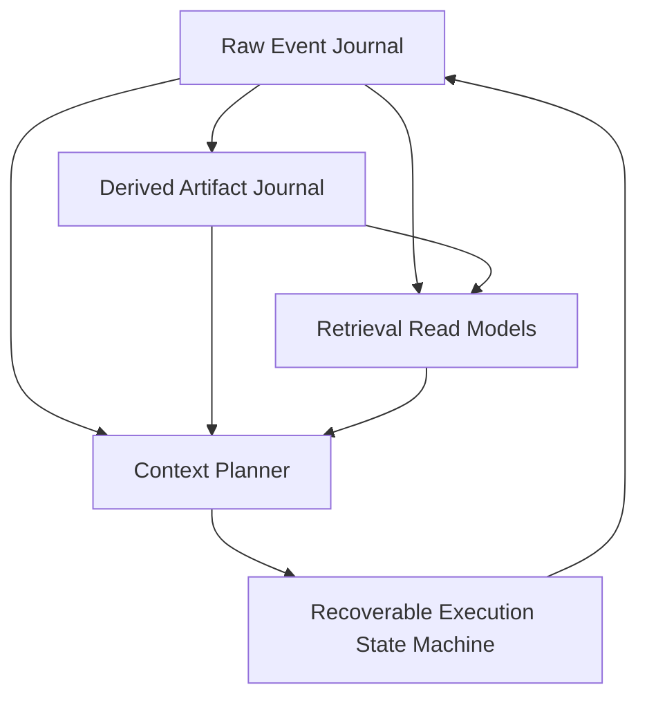
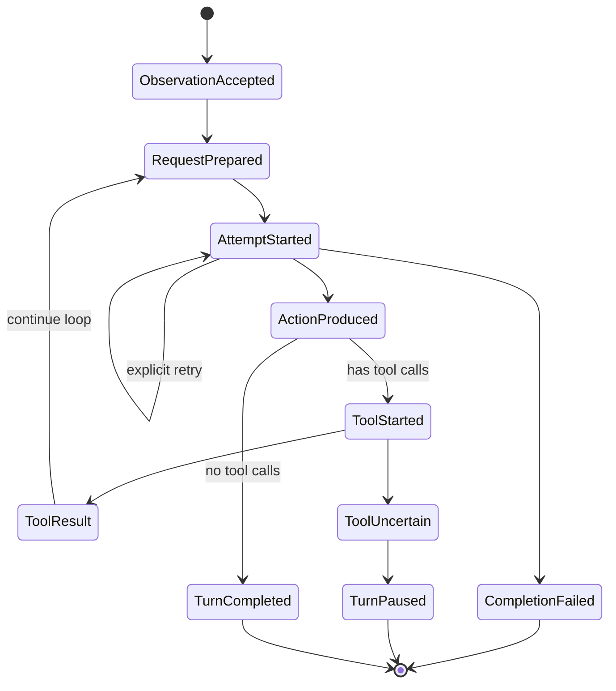

# SessionJournal 事件源会话与长期上下文架构路线图

> **状态**：Architecture Roadmap / `Atelia.SessionJournal` family 现行路线图
> **日期**：2026-07-28（保留下文早期日期作为实施历史）
> **底层依赖**：[EventJournal 功能需求与粗粒度设计基线](../EventJournal/event-journal-requirements-and-design.md)
> **相关既有研究**：[Dynamic Logical Context Store for Long-Running Role-Play Agents](../Galatea/backlog/idea/dynamic-logical-context-store-for-long-running-role-play-agents.md)
> **后续实施计划**：
> [DerivedMemory 可替换子系统与 Shared Epoch 实施方案](../SessionJournal/derived-memory-subsystem-implementation-plan.md)

## 1. 文档定位

本文记录如何建立以 `Atelia.SessionJournal` 为 raw correctness core 的新一代会话系统：
不可变事件源、可重建派生记忆、精确上下文规划与可恢复执行。它是
`Atelia.SessionJournal` 及其 companion projects 的现行架构路线图，而不是旧
`Atelia.ChatSession` 的升级计划。

旧 ChatSession 已冻结，只承担三种角色：

- 作为早期“StateJournal 当前工作态 + 定期压缩”方案的历史背景；
- 作为一次性、只读的数据迁移源，由 `ChatSession.LegacyExportCli` 导出；
- 在完成迁移验证后归档。

新功能、新 wire contract 和新架构只在 SessionJournal family 及其附属项目中实施。两代系统之间
不双写、不共享 mutable state，也不把新功能回流到旧项目；迁移方向始终是
`ChatSession -> legacy JSON -> SessionJournal`。

它回答：

- 哪些数据是长期事实源。
- Recap、Autobiography、World Understanding 等内容应如何建模。
- 每次 completion 的上下文如何动态选择并精确复现。
- tool-loop 如何逐步持久化并在崩溃后恢复。
- 全文、向量和图召回应放在哪一层。
- SessionJournal family 中各程序集分别拥有哪一层能力。
- 如何分阶段完成 current interim 到 target architecture 的切换。

本文不是每种 payload 的最终 wire spec，也不要求首个实现会话建成完整 Memory OS。后续会话应从本文的阶段列表领取一个垂直切片，产出更窄的 Decision/Spec/实现与测试。

## 2. 建立新系统所解决的问题

旧 ChatSession 曾以 StateJournal root 和 durable deque 表达会话工作态：

- 普通 turn 完成后整体 commit。
- compaction 用 Recap 替换旧消息前缀。
- ContextHeader / MemoryPack 表示当前应注入的压缩信息。
- StateJournal commit history 可以追溯旧状态，但它不是领域事件源。

这条路径已经验证了会话、回放、legacy recovery 与 Rewrite maintainer，但对长期自主 Agent 有四个结构性限制：

1. 原始体验与当前投影混在同一工作态中；compaction 的自然操作是改写当前 deque。
2. tool-loop 只在整轮结束后提交，中途崩溃无法精确判断 completion 或工具执行到了哪一步。
3. Recap、自传、世界理解等派生解释被当作“当前文本块”，缺少统一 provenance 与版本 lineage。
4. 上下文主要由固定 recent window 构造，难以在不同 artifact anchor、raw suffix 和动态召回之间做预算化选择。

SessionJournal 不在旧 deque 旁边补 raw log，而是从新的 storage/wire boundary 建立事实源、解释层、
投影层和执行状态。旧实现只帮助识别需求和提供迁移样本，不约束新系统的领域模型。

## 3. 核心决策

### decision [S-SJ-LEGACY-FROZEN] 旧 ChatSession 冻结

旧 ChatSession 不接受 SessionJournal 新能力、不参与双写，也不作为新 host 的依赖。允许的维护仅限于
保持 legacy export 可用和修复阻断迁移的缺陷；迁移完成后整体归档。

### decision [S-SJ-NEW-WORK-OWNERSHIP] 新工作归属 SessionJournal family

raw event、recovery contract 与 request execution 属于 `Atelia.SessionJournal`；concrete
MemoryMaintainer 属于 `Atelia.SessionJournal.Maintainers`；派生存储、epoch、artifact/set publication
和 retrieval 属于未来独立 DerivedMemory；CLI/Agent Host 作为 composition root 组合这些能力。

### decision [S-SJ-MIGRATION-ONE-WAY] Legacy migration 单向且经中立交换格式

`ChatSession.LegacyExportCli` 只读取旧 repo 并导出 JSON/Markdown。`SessionJournal.Cli` 通过自身的
anti-corruption DTO 导入 JSON，不引用 ChatSession 产品程序集。导入不会建立两代 repo 之间的运行时
同步关系。

### decision [S-CS-RAW-EVENTS-AUTHORITATIVE] Raw Events 是长期事实源

Agent 实际接收、生成和执行过的内容，以不可变 raw events 保存。compaction、摘要更新或上下文切换不得删除或改写 raw events。

### decision [S-CS-ARTIFACTS-DERIVED] Memory Artifacts 是派生解释

Recap、Autobiography、World Understanding、关系状态、开放线索等都是由 raw events 和既有 artifacts 推导出的版本化产物。它们可以被替换、废弃或重算，但不能冒充原始体验。

### decision [S-CS-PROJECTION-NOT-SSOT] MemoryPack 是 Context Projection

现有 `MemoryPack` 继续作为“本轮上下文需要的有序文本块投影”是有价值的，但它不再是长期记忆的唯一事实源。它应由选定的 artifact set 和其他固定配置 materialize。

### decision [S-CS-CONTEXT-PLAN-PERSISTED] 实际上下文选择必须持久化

每次 completion 前，系统必须保存精确 `ContextPlan` 和 canonical request manifest。崩溃恢复不能仅凭“当前配置 + 当前 head”重新运行 planner，因为配置、索引和 token estimator 可能已经变化。

canonical request manifest 对 raw facts 采用 exact address/range/setup refs，对实际进入 provider
request 的 derived memory contribution 则保存 exact context snapshot 或 canonical request bytes。
Prepared 不引用 derived artifact/set id，也不要求 derived store 在 reopen 时仍存在；planner/renderer
版本变化不能改写已经 Prepared 的外部调用事实。若要审计 derived selection，可在可重建 usage index 中
记录 `preparedAddress -> derivedSetId`。

### decision [S-CS-EXECUTION-INCREMENTAL] 执行状态逐步事件化

Observation、completion request、agent action、tool intent、tool result 和 turn completion 必须在各自边界逐步持久化。不能继续把整个 tool-loop 当成一个只在末尾 commit 的内存事务。

### decision [S-CS-INDEXES-REBUILDABLE] Retrieval Index 不进入正确性核心

全文、向量、实体图、时间索引和统计 read model 必须能从 raw events / artifacts 重建。索引损坏或丢失会降低召回能力，但不得改变历史事实或使 session 无法恢复。

## 4. 五层架构



五层职责如下：

| 层 | Canonical Data | 主要职责 |
|:---|:---------------|:---------|
| Raw Event Journal | 不可变 session events | 保存发生过什么、维持版本树与回放顺序 |
| Derived Artifact Journal | config snapshots、coverage epochs、artifacts、ArtifactSets | 保存系统如何分块、解释和压缩历史 |
| Retrieval Read Models | 可重建索引 | 按语义、实体、时间、关键词发现候选材料 |
| Context Planner | 持久化 ContextPlan | 在 token/cost/latency 预算内选择 exact context |
| Execution State Machine | 逐步执行事件 | 驱动 completion/tool-loop，并从任意持久边界恢复 |

DerivedMemory repository 可以物理附着在 SessionJournal repo 下，也可以使用独立 store，但不能把
derived plans/artifacts/sets 写入 raw Parent sequence；逻辑上的权威边界不能因为物理共置而消失。

### 4.1 Ownership 与依赖方向

| 项目 / 程序集 | Ownership | 依赖约束 |
|:---------------|:----------|:---------|
| `Atelia.SessionJournal` | raw event codec、reducer、tail recovery、request preparation/execution，以及 store-neutral derived-context contracts | raw core 不引用 concrete maintainer 或未来 DerivedMemory |
| `Atelia.SessionJournal.Maintainers` | concrete MemoryMaintainer、profiles、prompts、target paths 与窄职责 helpers | 作为 companion assembly 单向依赖 SessionJournal contracts |
| `Atelia.SessionJournal.DerivedMemory`（暂名、未来） | epochs、artifacts、ArtifactSets、lineage/indexes、selection 与 publication | 单向依赖 SessionJournal 的 neutral contracts；其记录只向 raw address 建立引用 |
| `SessionJournal.Cli` / Agent Host | composition root、迁移导入、离线开发运行、provider/tool 注入 | 可以同时引用上述项目，但不把应用 policy 推回 raw core |
| `ChatSession.LegacyExportCli` | 旧 ChatSession 数据的 JSON/Markdown 出口 | 只依赖旧 ChatSession；不依赖 SessionJournal，也不承担新功能 |

目标依赖图如下：

```text
SessionJournal.Cli / Agent Host
├── Atelia.SessionJournal
├── Atelia.SessionJournal.Maintainers ──> Atelia.SessionJournal
└── Atelia.SessionJournal.DerivedMemory ─> Atelia.SessionJournal

ChatSession.LegacyExportCli ──> Atelia.ChatSession   # frozen migration island
```

current trunk 尚未完全达到这张图：`DerivedRecapStore` 与 raw `ArtifactSetCommitted` 仍位于
SessionJournal core。它们是明确的 interim bridge，将按 DerivedMemory 实施计划依序拆除，不能反过来
被解释为 target ownership。

## 5. Raw Event Journal

### 5.1 角色

Raw Event Journal 保存“Agent 生命周期中确实发生过的事情”，包括外部输入、模型输出、工具交互和控制状态。它是审计、回放、迁移和所有派生分析的根。

EventJournal 负责 frame、`Parent` 与 opaque kind；`Atelia.SessionJournal` 解释
`EventJournal` header 中的 numeric kind，并以 canonical JSON `{ "v": ..., "body": ... }`
编码每种 kind 自己的 versioned payload。`EventAddress` 提供 store 内身份和 Parent 顺序，不以时间戳
或另造 ordinal 冒充因果顺序。

### 5.2 Current wire baseline

current trunk 的 schema 是 `atelia.session-journal.trunk.v1`。已实现的
`SessionEventKind` 如下；名称是 C# contract，持久化判别器是 EventJournal header 中的整数值：

| Kind | 值 | Current 语义 |
|:-----|---:|:-------------|
| `RuntimeConfigSetup` | 1 | model、completion surface 与 session schema 从此边界起生效 |
| `SystemPromptSetup` | 2 | system prompt snapshot 从此边界起生效 |
| `SessionCreated` | 3 | session 初始化完成 marker |
| `ObservationAccepted` | 4 | 外部 observation 已持久化 |
| `AgentActionProduced` | 5 | online completion response 已规范化并持久化 |
| `ToolExecutionStarted` | 6 | tool side effect 前的 durable intent / execution identity |
| `ToolResultObserved` | 7 | 与 execution 对应的 tool result 已持久化 |
| `CompletionRequestPrepared` | 8 | canonical request manifest 与 durable request origin 已持久化 |
| `CompletionAttemptFailed` | 9 | 已知 provider/host failure 已持久化 |
| `ImportedAgentAction` | 10 | 迁移导入的 action；不伪装成 online provider completion |
| — | 11 | 已退役；曾用于 opaque `CompletionAttemptRestarted`，不得复用 |
| `ArtifactSetCommitted` | 12 | interim coherent artifact-set activation；target 将移出 raw |
| `CompletionAttemptStarted` | 13 | provider dispatch claim；event address 是 attempt identity |

每种 payload 版本独立推进；不能把上表的 header kind 数值、payload `v` 和 repository schema 混为一个
版本号。codec 只接受它明确支持的 kind/version，未知 kind 和不受支持的 payload version 必须失败，
不得静默降级。

### 5.3 Future semantic boundaries

下列边界仍是路线图语义，不应被描述为已实现的 event kind：

- `ToolExecutionUncertain`：无法证明副作用是否发生，需要查询、人工处理或 capability-specific recovery。
- 显式 `TurnCompleted`、`TurnFailed`、`TurnPaused`：当仅靠 current tail phase 不足以表达产品语义时再引入。
- 独立 `ContextPlanCommitted`：只有需要把 planning 与 Prepared 分成两个 durable boundary 时才引入；
  current 将 selection plan 包含在 `CompletionRequestPrepared` 中。
- provider retry / rejection 的更细分类：应由明确 recovery contract 驱动，不提前枚举空事件。

### 5.4 Raw 与 operational event 的边界

“Raw”不是只指用户和 assistant 可见文本。为了恢复真实执行过程，以下内容也属于事实：

- 模型返回了哪些 tool calls。
- 哪个调用已开始执行。
- 工具返回了什么，或为何状态不确定。
- 哪次 completion attempt 失败、重试或被放弃。

provider-native 临时字段不应未经筛选整包回写。Canonical event schema 只保存后续回放、审计和恢复真正需要的信息；需要 HTTP 法证时可另存 provider call log。

### 5.5 分支、rewind 与替代未来

EventJournal 的 Parent lineage 和 repository/branch primitives 为未来 rewind、reroll 与替代未来提供
底层能力，但 current SessionJournal 尚未交付完整 branch UX。目标语义是：

- 正常会话沿选定 branch/ref 追加；
- rewind 不删除 event，而是移动 ref 或从历史 event 创建新 branch；
- reroll 从同一 durable boundary 附近产生替代 action 分支；
- 被放弃的未来仍可通过明确的 retention/reflog policy 查阅；
- 上层 UI 区分“当前有效父链”和“曾发生但当前不可达的旁支”。

这些语义需要后续单独定义 branch identity、ref ownership、retention 和 UI contract；不能仅因底层已有
EventJournal branch primitive 就宣称产品能力已经实现。

## 6. Derived Artifact Journal

### 6.1 Target 概念

以下内容统一称为 `DerivedContextArtifact`：

- Recap / rolling summary。
- First-Person Autobiography。
- World Understanding。
- Scene / episode summary。
- Relationship state。
- World facts / known unknowns。
- Open threads / promises / unresolved hooks。
- Continuity、style 或 identity constraints。

这些 artifact 的内容形状可以是 Markdown、JSON、图节点或其他二进制格式。统一的是 provenance 与生命周期，不是正文 schema。

它们不是 raw experience，也不属于旧 ChatSession。目标 ownership 是独立、可替换的
`Atelia.SessionJournal.DerivedMemory`（暂名）；该 subsystem 可以删除并由 raw SessionJournal 重建。

### 6.2 Current interim baseline

CS-5-lite 已完成，不再是待验证建议。current trunk 已具备：

- `DerivedRecapStore`：位于 `Atelia.SessionJournal` core 内，使用 session repo 下的
  `derived/recaps/v1/` sidecar 保存可删除、可重建的 recap artifacts/indexes；
- addressed replay：MemoryMaintainer runner 从 `ReplayHistory()` 取得 raw provenance，以实际吸收
  fragment 的末事件形成 `anchorRawEvent`；
- `Atelia.SessionJournal.Maintainers`：保存 concrete `RewriteMemoryBlockMaintainer` profiles，不被
  raw core 反向引用；
- `SessionJournal.Cli run-memory-maintainer`：离线运行 maintainer 并发布 derived artifact；
- `SessionJournal.Cli checkpoint-artifact-set`：由开发者手动选择 exact members，在 raw chain
  追加 interim `ArtifactSetCommitted`；
- coherent request/recovery：current `CompletionRequestPrepared` v3 引用 exact
  `ArtifactSetCommitted`，并内联 selected artifact context snapshots，使 sidecar 删除后仍可重建
  canonical request。

这条路径证明了 artifact persistence、provenance anchor、tail-only projection、coherent request 和
Prepared/attempt recovery，但它不是最终程序集或 authority 边界。尤其是 `DerivedRecapStore` 位于
core、raw `ArtifactSetCommitted` 引用 derived ids、manual checkpoint，以及 Prepared 仍引用 raw
activation，都是已知 interim coupling。

### 6.3 Target Artifact 最小字段

未来 DerivedMemory schema 至少包含：

| 字段 | 含义 |
|:-----|:-----|
| `ArtifactKind` | 稳定 kind，例如 `autobiography` |
| `ProfileId` | 具体维护 profile / policy id |
| `Producer` | analyzer / model / code version |
| `ProducerFingerprint` | prompt、model、关键配置与 codec 的稳定 fingerprint |
| `SourceRawHead` | 生成时观察到的 raw branch head |
| `SourceRanges` | 实际吸收的 raw EventAddress 区间或集合 |
| `AnchorRawEvent` | 可作为后续 raw suffix 起点的边界事件；CS-5-lite 可先用 rolling summary 覆盖到的最后一个 raw event |
| `GoverningRuntimeConfigSetup` | 生成时按 `SourceRawHead` 解析到的 runtime-config-setup 地址 |
| `GoverningSystemPromptSetup` | 生成时按 `SourceRawHead` 解析到的 system-prompt-setup 地址 |
| `InputArtifacts` | 本次读取的旧 artifact 地址 |
| `PreviousArtifact` | 同 lineage 的上一版，可空 |
| `Content` | 不透明 artifact body |
| `Invocation` | 可选 completion / analyzer audit 摘要 |
| `Status` | produced / rejected / superseded 等领域状态 |

Artifact 本身 append-only。所谓“最新版”由 lineage、ArtifactSet 或可重建索引确定，不通过原地更新 `EventAddress -> mutable value` 字典实现。

### 6.4 Provenance 不变量

任何进入长期上下文的 artifact 都应能回答：

1. 它由哪个 profile 和 producer 生成。
2. 它读取了哪个 raw head、哪些 raw ranges。
3. 它基于哪一版旧 artifact。
4. prompt/model/config 是否与当前版本相同。
5. 它是否已被后续 artifact 取代。

这使 analyzer 升级后可以重建，并允许人工比较“同一原始经历的不同解释”。

### 6.5 Target Coherent Artifact Set

Autobiography 与 World Understanding 可能并行生成，但一次上下文不应偶然混用不同 source head 的半套结果。

ArtifactSet 应作为 derived subsystem 内的 immutable record：

- 引用一组完整 exact artifact members；
- 引用一个在 producer 调用前已持久化的 shared coverage epoch；同一 coherence group 的 required
  members 必须共享 exact `epochId` 与 raw range；
- 记录 common anchor、source raw provenance、coverage setup refs、set policy/producer fingerprint；
- 维护自身 previous-set lineage 与可重建 latest/default indexes；
- 只有 derived publication 成功后，Context Planner 才把整组作为候选。

若其中一个 maintainer 失败，旧 active set 保持可用；已成功写出的单个 artifact 可以留作诊断或未来复用，但不自动进入当前 coherent set。

history 分块是 maintainer 之前的公共 planning 结果。未来 DerivedMemory subsystem 应保存 versioned split
config 和 immutable epoch ledger：config 记录 token estimator、最小 recent suffix、触发阈值与
dependency-safe boundary policy；epoch record 固定实际 raw range/anchor/setup/config fingerprint。
日常运行并行启动同 epoch 的 maintainers，prompt-tuning 则可独立重跑其中一个 role，但不能重新计算
split。同步来自 shared epoch identity，而不是进程启动时间或恰好相同的 `--threshold-tokens`。

### 6.6 从 interim 切换到 target

最终边界与 current 的差异必须显式迁移：

| 关注点 | Current interim | Target |
|:-------|:----------------|:-------|
| Derived store | `DerivedRecapStore` 在 SessionJournal core，repo-local sidecar | 独立 DerivedMemory assembly/repository |
| Coverage 协调 | 每个 runner 独立 split，人工组合 | shared immutable epoch 先于 maintainers 持久化 |
| Set publication | CLI 手动 checkpoint；raw kind 12 `ArtifactSetCommitted` 激活 | DerivedMemory 内 immutable ArtifactSet publication/index |
| 引用方向 | raw activation 和 Prepared 仍含 artifact/set identity | 只允许 derived -> raw address/range/setup refs |
| Prepared recovery | v3 内联 contribution snapshot，但仍引用 raw activation | Prepared self-contained：exact context/canonical request + raw provenance，不读取 DerivedMemory |
| Composition | SessionJournal engine 直接打开 sidecar | Host/CLI 注入 store-neutral candidate provider |

目标 raw SessionJournal 不追加 `ArtifactSetCommitted` 或其他 derived-set activation，也不引用
artifact/set/epoch id。某次 completion 实际使用的 derived memory 必须在
`CompletionRequestPrepared` 中以 exact context snapshot 或 canonical request bytes 提升为 execution
fact；exact reopen 不打开 DerivedMemory，也不重新运行 planner。用于审计 selection 的
`preparedAddress -> derivedSetId/epochId` 记录属于可重建 derived usage index。

迁移按专门实施计划的依赖顺序进行：先建立 cross-assembly neutral contracts 和 neutral request
materialization，再切换 self-contained Prepared，之后才移动 concrete store、删除 raw
`ArtifactSetCommitted`，最后引入 shared epoch、并行 orchestration 与 online selection。不能先搬
`DerivedRecapStore.cs`，否则 raw core 会被迫反向依赖 concrete DerivedMemory。

`SessionExecutionTailResolver` 始终 raw-only；DerivedMemory 缺失只阻止尚未 Prepared 的 context
planning，不应破坏已 Prepared request 的恢复。

### 6.7 MemoryPack 的新角色

`MemoryPack` 变为 materialized context view：

```text
selected ArtifactSet
+ pinned/manual context blocks
+ rendering profile
-> MemoryPack
-> ContextHeader projection
```

`RewriteMemoryBlockMaintainer` 已作为首批 artifact producer 使用：输入旧 artifact + raw range，输出
完整新 artifact。CS-5-lite 已验证 recap 可 materialize 为 `ContextHeader` 形态的 observation/action
header，并以真实 anchor 之后的 raw suffix 保留近期细节；没有可用 anchor 时使用朴素 raw suffix
fallback。后续工作是在保持这一 raw/artifact 语义的前提下，把 persistence、shared epoch、set
publication 和 selection 移到正确的 DerivedMemory ownership，而不是把能力回迁到 ChatSession。

## 7. Context Planner

### 7.1 Planner 的问题

真正要优化的不是“最近保留多少条”，而是：在固定预算下，哪组 artifact anchor、raw suffix 和召回材料最能支持下一次行动。

tail-only projection 的边界优先来自 recap / artifact anchor，而不是临时的固定 turn 截断。对长寿命 autonomous /
role-play Agent，历史不一定自然分成 user turn；长期连续性主要由 rolling summary、自传、world understanding 等
derived context 承担。raw suffix 只负责保留 anchor 之后仍需逐事件呈现的近期细节。

基础候选策略：

1. 最新 coherent artifact set + 最短 raw suffix。
2. 更早 artifact set + 更长 raw suffix。
3. 最新 artifact set + 当前任务相关 recalled artifacts / raw ranges。
4. 无 artifact 的纯 raw 回放只用于 offline bootstrap/maintainer 输入与显式审计；online completion
   没有 coherent candidate 时应 not-ready，不静默退回 full raw。

Planner 应比较信息完整性、token、费用、延迟和 staleness，而不是永远在固定阈值切“前一半”。

### 7.2 ContextPlan

建议持久化：

```csharp
public sealed record ContextPlan(
    EventAddress RawHead,
    EventAddress? RawStartExclusive,
    EventAddress RawEndInclusive,
    ContextHeaderSnapshot DerivedContext,
    IReadOnlyList<EventAddress> RecalledRawItems,
    string RenderingProfileId,
    string ModelProfileId,
    string PlannerFingerprint,
    ulong EstimatedTokens,
    ContextBudgetBreakdown Budget,
    string SelectionReason
);
```

精确字段后续可调整，但必须固定四类事实：

- planner 基于哪个 raw head 作出决定。
- 选择了哪些 materialized derived contributions 和 raw range。
- 选择了哪些动态召回项。
- 使用哪版 planner、rendering、model、token、retriever 与 ranker policy。

若该 `ContextPlan` 进入 raw Prepared，它不能保存 derived set/artifact id。用于解释“哪个 set 产生了
这些 contribution”的 selection record 位于 derived usage index，并以
`preparedAddress -> derivedSetId/epochId` 单向引用 raw。

### 7.3 Self-contained Canonical Request Manifest

只保存 ContextPlan 仍不足以精确恢复，因为 renderer、prompt template 或 serializer 可能升级。`CompletionRequestPrepared` 应保存：

- 可逐字节重建 canonical `CompletionRequest` 的完整 manifest。
- 被引用 raw event / setup / tool schema / config event 的地址、版本和必要 hash。
- 实际进入 request 的 derived context contribution snapshot 或 canonical bytes；不引用 derived
  artifact/set id 作为 reopen 依赖。
- renderer、serializer、prompt template、tool rendering、model profile 的 fingerprint。
- request hash。
- completion surface / model / connection identity。
- durable request origin（correlation id 与 reason）；attempt identity 不属于 Prepared，而由后续
  `CompletionAttemptStarted` event address 给出。
- 关联 ContextPlan event。

raw suffix 可以继续用 exact address/range/hash 与 deterministic fold 重建；derived memory 则必须在
Prepared 中提升为 exact snapshot/canonical bytes，因为它所在的 sidecar 可删除、实现可替换。恢复时
不得重新打开 DerivedMemory、重新运行 planner，或用“当前最新配置”替换已经 Prepared 的内容。
snapshot-vs-recipe 的 stored-byte 权衡仍可单独 benchmark，但不能重新引入 raw -> derived id 依赖。

权威边界必须单一：

- canonical request manifest 是崩溃恢复和重发的 Canonical Source。
- `ContextPlan` 是选择过程的结构化解释与审计记录，不得替代 request manifest 参与恢复重建。
- `PlannerFingerprint` 应覆盖 planner recipe、token policy、retriever/ranker 配置及其关键版本；它用于解释和复现实验，不改变“恢复直接使用已持久化 manifest”的规则。

### 7.4 Token Budget

Planner 至少区分：

- fixed system / identity budget。
- artifact budget。
- recent raw suffix budget。
- dynamic recall budget。
- tool schema budget。
- expected completion output reserve。

当前 maintainer-local `threshold-tokens = 24000` 只能作为 legacy/backtest 实验参数。长期由
Derived Artifact Epoch Planner 统一配置：

- `minimumRecentTokens`：始终保留的最新 dependency-closed suffix；
- `epochTriggerTokens`：可滑出 eligible prefix 达到多少后创建新 epoch；
- token estimator / dependency boundary policy / headroom 与 hard-limit；
- immutable epoch plan：保存最终实际 raw range，允许因 boundary alignment 而大小不一。

所有同一 coherence group maintainers 消费同一 epoch plan；prompt-tuning 只替换某 role 在该 epoch 的
producer candidate，不重新切分 history。

### 7.5 选择结果也是事实

Retrieval index 可以重建，查询结果却可能因模型、索引版本或时间变化。凡是实际进入 completion request 的 recalled item，都必须写入 ContextPlan / request manifest。这样未来能够解释模型为什么在当时看到了这些材料，并能从 manifest 指向的稳定地址重建同一请求。

## 8. 可恢复 Execution State Machine

### 8.1 状态流



每条箭头都由已持久化 Event 驱动。恢复时读取 branch head 和最近未闭合 correlation id，即可确定下一合法动作。

### 8.2 Completion 恢复

发送请求前先写 `completion-request-prepared`。可能的崩溃窗口：

- prepared 前崩溃：安全地重新规划。
- prepared 后、发送前崩溃：发送已保存 request。
- 发送后、响应持久化前崩溃：响应是否生成可能不确定。

对最后一种情况：

- provider 支持 idempotency / result lookup 时，以 `CompletionAttemptStarted` address 绑定
  provider idempotency key / response handle 后查询或重试。
- provider 不支持时，默认停在 uncertain；只有显式 recovery policy 授权后，才先追加一个以旧
  Started 为 Parent 的新 Started，再发起新的物理调用。
- 不得把新 completion 假装成旧 attempt 的同一响应。

current 无 capability fallback 使用 `completion-attempt-started`：source Prepared manifest
保持 request 唯一真源，Started 以 Parent 串联 active attempt，event address 即内部 attempt identity。
`RestartWithNewAttempt` 是明确的 at-least-once 选择；它保留审计身份，但无法排除旧 attempt 已在 provider
侧成功或产生费用。默认 `Refuse` 不进行外部调用。显式 retry 当前要求调用方独占 branch
driver；CAS 可以保护 journal attachment，但无法撤回已经并发发出的 provider 请求，跨进程
lease / single-flight 留给 provider capability 阶段。

completion 通常没有外部业务副作用，但会产生费用，因此 attempt history 仍应保留。

### 8.3 Tool 执行协议

工具调用至少分三步：

1. 持久化 `tool-execution-started`，包含 tool call、validated arguments、operation id / idempotency key。
2. 执行工具。
3. 持久化 `tool-result-observed` 或 `tool-execution-uncertain`。

operation id 应由 session / turn / tool call identity 确定性产生，不能每次恢复随机生成。

### 8.4 Exactly-Once 边界

Journal 只能保证 intent 和观察结果可恢复，不能单独保证外部世界 exactly-once。

工具应按能力分级：

| Tool 能力 | 恢复策略 |
|:----------|:---------|
| 原生 idempotency key | 使用同一 key 安全重试 |
| 可按 operation id 查询状态 | 先查询，再决定补写结果或重试 |
| 事务性本地工具 | journal 与本地事务按专门协议协调 |
| 非幂等且不可查询 | 标记 `uncertain`，暂停并请求人工/领域补偿 |

系统绝不能在 crash 后盲目重试“付款、发送消息、删除资源”等非幂等工具。

### 8.5 TurnCompleted 的意义

`turn-completed` 是领域完成标记，不是此前所有 events 的聚合存储。它可记录最终 Action 地址、工具结果范围和状态摘要，但 raw event 仍逐条保留。

## 9. Dynamic Retrieval

### 9.1 独立 Read Path

动态召回不属于 `IMemoryBlockMaintainer`。Maintainer/producer 在写入与巩固路径生成 artifacts；Retriever 在每次 ContextPlan 前从 read models 选择候选材料。

未来可根据真实后端定义 `IMemoryRetriever` 或 `IContextMemorySource`，但应先完成一个端到端 backend，再固化公共接口。

### 9.2 可组合索引

长期 Role-Play / Agent memory 不应押注单一向量库：

- 全文 / FTS：专有名词、代码、原话、路径和精确事实。
- 向量：语义相似的经历与主题。
- 时间索引：最近、某一时期、事件区间。
- Entity / relation graph：人物、关系、承诺、项目、地点。
- Artifact lineage index：查同 kind 最新版本、source head 与 supersession。
- Open-thread index：尚未闭合的问题、计划和承诺。

候选可由多个 retriever 汇合，再由 ranker / planner 在预算内选择。索引只保存 address 和派生特征，不复制成为新的事实源。

### 9.3 Rebuild 与版本

每个 index 应记录：

- index schema/version。
- source raw/artifact high-watermark。
- embedding/model/tokenizer fingerprint（若适用）。
- rebuild 状态与错误。

索引落后时系统可以降级到 recent raw + artifacts；不能因向量库不可用而无法恢复基本会话。

## 10. Artifact Maintenance 调度

### 10.1 Cursor，而不是删除前缀

每个 artifact profile 保存自己的 source cursor：

- 上一版吸收到哪个 raw Event。
- 本轮计划吸收哪个范围。
- 生成结果对应哪个 source head。

cursor 必须在 source branch / raw Parent lineage 的作用域内解释，不是 store 级全局 ordinal。发生 rewind、reroll 或从历史 Event 分叉后，新 branch 必须从该 lineage 上可达的 artifact/cursor 起步；另一个 branch 上更“靠后”的 cursor 不能直接跳过当前 branch 尚未吸收的 raw events。

“即将滑出上下文”仍是触发维护的好时机，但维护完成后不删除 raw prefix，只推进 artifact lineage / active set。

### 10.2 触发条件

调度器可以组合：

- context token pressure。
- 未吸收 raw token / event 数量。
- artifact age / staleness。
- scene 或 episode 边界。
- turn idle 时间。
- 显式人工请求。
- profile-specific high watermark。

不同 artifact kind 不必同频更新。World Understanding、自传、开放线索和向量索引可以有独立 cursor 与成本策略。

### 10.3 并行与过期结果

producer 可以基于同一 `SourceRawHead` 并行运行。完成时：

- 结果始终可以作为带 provenance 的 artifact 保存。
- 只有满足 ArtifactSet policy 的组合才能成为 active set。
- raw branch 已前进不自动使结果无效；它只是覆盖到较早 head，Planner 需要追加更长 raw suffix。
- 不得把 artifact 的 source head 偷换成 producer 完成时的最新 head。

## 11. StateJournal 与现有代码的迁移定位

### 11.1 StateJournal 的后续角色

新架构中，StateJournal 不再作为 ChatSession 长期历史的主导 SSOT。它仍可用于：

- 早期迁移期的现有 session 读取。
- 可丢弃、可重建的 materialized projection。
- 适合对象图事务的其他领域状态。

不应长期维持“EventJournal raw history 与 StateJournal message deque 双写且都自称权威”的状态。迁移完成后必须明确唯一事实源。

### 11.2 现有 Memory substrate 的复用

以下资产继续有价值：

- `MemoryPack` / `MemoryPackDraft`：上下文投影。
- `MemoryRewriteProfile`：artifact producer 配置。
- `RewriteMemoryBlockMaintainer`：短文本 artifact 的低成本 producer。
- `MemoryMaintenanceOrchestrator`：同 snapshot 并行生成结果并形成 coherent update 的原型。
- `HistoryWindowSplitPolicy`：迁移期与 backtest 基线，不再是最终 Planner 的唯一策略。
- legacy upgrade export / importer：旧 session 到 raw events 的迁移输入。

通用的上层 provisioning/planner 尚未实现：当前缺少 role catalog、增量 lineage recovery、maintenance
shared coverage epoch config/ledger、partial-success 结算和自动 coherent publication。后续设计入口见
[`memory-maintainer-provisioning-planner-gap.md`](../SessionJournal/memory-maintainer-provisioning-planner-gap.md)。

需要改变的是持久化归属和 provenance，而不是把已验证的 Rewrite 执行器推倒重写。

### 11.3 Compaction 的新语义

现有 compaction 是：

```text
messages = recap + recent suffix
```

新架构中它被拆为：

```text
raw events 保持不变
artifact producer 追加 recap/artifacts
Context Planner 选择 artifact anchor + raw suffix
```

因此“compact”不再是 destructive history mutation，而是生成新解释并改变 context projection。

## 12. 分阶段路线图

### CS-0：领域 Schema 与 Replay Contract

产出：ChatSession event envelope、首批 EventKind、版本演进规则、事件到当前 projection 的纯 replay reducer。

验收：

- 给定 event sequence，可确定性重建当前 messages/config/execution status。
- 未知 schema/version fail-fast 或按明确兼容规则跳过。
- reducer 不访问 LLM、工具或外部索引。

### CS-1：Raw EventJournal 垂直切片

依赖：EventJournal EJ-0 至 EJ-3。

产出：创建 session、追加 observation/action、读取 head、顺序 replay、branch fork。

验收：

- 一个无工具 turn 可写入并 reopen。
- 原始事件不会因投影变化消失。
- 从历史 Event 创建 branch 后可产生替代未来。

### CS-2：Legacy Import 与 Projection 对照

产出：把现有 `chat-session-legacy-upgrade-export.json` 导入 raw events；用 reducer 生成与旧 repo 等价的可见历史。

验收：

- `cyber-copy-upgraded` 的 observation/action/recap 顺序可对照。
- legacy-inferred metadata 继续保留来源标记。
- 导入不修改旧 repo。

### CS-2.5 / CS-5-lite：SessionJournal Derived Recap Store 与 RollingSummary Replay

产出：把 `prototypes/SessionJournal.Cli/MemoryMaintainerRun.cs` 从 legacy event source 迁移到新的
SessionJournal repo forward replay；建立 recap 类 derived artifact 的最小磁盘 / 内存结构；用现有
`RewriteMemoryBlockMaintainer` 生成可加载 rolling summary，并记录 raw source range、anchor、profile、
invocation、`runtime-config-setup` 与 `system-prompt-setup` provenance。

本阶段不实现完整 CS-5 ArtifactSet / retrieval / planner，只为后续 tail-only projection 准备真实 recap anchor。

验收：

- 能从 `import-legacy-json` 生成的 SessionJournal repo 顺序 replay raw observation/action/tool-result。
- Rolling summary 不写回 raw event chain；derived store 可删除、可重建、可加载。
- 每个 recap artifact 能说明覆盖到哪个 raw head / source range，并能追溯所用 profile、上一个 artifact 与 LLM invocation。
- 后续 tail projection 可把最新 recap materialize 为 `ContextHeader` / observation header，并从 anchor 之后 replay raw suffix。

### CS-3：可恢复的无工具 Completion

产出：最小 `ContextPlan` 形状、引用式 canonical request manifest 恢复合同、completion attempt、Action 逐步落盘。turn 完成隐式判定（Action 无 tool call），不落独立 TurnCompleted 事件。若 CS-5-lite 已落地，本阶段可以引用 recap anchor 构造 tail projection；否则只使用 raw suffix fallback。本阶段仍不设计完整 ArtifactSet、retrieval 候选比较或高级预算策略。

> **2026-07-26 历史进度（D6D/D7 前）**：CS-3A 已实现合并式
> `completion-request-prepared` v1、full-raw minimal plan、
> canonical request commitment、exact-head governing setup cursor 与 near-head setup checkpoint。
> CS-3B 已实现调用方指定 exact artifact 的 `explicit-artifact-tail`：验证
> `currentHead -> SourceRawHead -> AnchorRawEvent` Parent ancestry，以 boundary-as-of setup fold
> dependency-closed suffix，并把 materialized artifact header 的有界 snapshot 内联进 manifest，避免
> 可删除 derived store 破坏 prepared request 的恢复合同。该切片只替换 request context
> materialization，并为无工具 observation `SendAsync` / `ResumeAsync` 增加不调用 `Project()` 的
> bounded recent-idle fast path；通用 execution projection 与其他 phase 仍是 full replay。
> CS-3C 已实现单一 `SessionPreparedRequestReconstructor`，在 prepare 前与 reopen 时都从 manifest
> references 重建并核对 exact canonical bytes。此处记录的是 D7 前历史合同；current Prepared-only
> 自动派发，Started 才默认 `Refuse`；显式 `RestartWithNewAttempt` 形成 `P -> S1 -> S2` 地址链。
> explicit-artifact-tail 的 reopen 使用内联 snapshot，不依赖 derived sidecar，也不调用 `Project()`。
> 默认 refusal 与 tail terminal validation 只做近头 attempt topology proof，不会借 reconstructor
> 暗中退化为 full replay；后者同时支持 observation source，以及由 validated full-raw writer 提交的
> tool-continuation source terminal。CS-3D1 已在 manifest 固定 tool implementation/capability runtime
> identity；recovered response 只有在当前 host identity 精确匹配时才能进入 durable tool dispatch。
> provider 已明确返回的 non-success，以及 host 收到 response 后确认其违反已提交 request policy 的
> known rejection，另以 `completion-attempt-failed` 持久化；例如 tail no-tool policy 遇到 tool calls
> 使用 `atelia.host.unsupported-tool-call`。transport/cancellation 仍保持 prepared uncertain。
> legacy/manual Action 使用独立 `imported-agent-action`，不与 live completion Action 混淆。详见
> [SessionJournal Configuration Access Notes](../SessionJournal/session-configuration-access-notes.md)。

验收：

- 在 request 前后、response 前后注入崩溃，reopen 后状态明确。
- 已准备 request 只从 manifest 引用的旧 raw/config/schema/profile 重建，不因当前配置变化被悄悄替换。
- duplicate attempt 有不同 identity 和可审计原因。

### CS-3D：Tail-only Execution Recovery

产出：把在线 execution recovery 与完整 conversation projection 分离；从 ref head 沿 Parent 反向解析
当前 attempt/action/tool dependencies 和近头 execution checkpoint，恢复最小 `SessionExecutionState`。
`Project()` / `ReplayHistory()` 保留完整审计语义，但退出 `Open` / `ResumeAsync` / `SendAsync` /
tool-loop driver 的默认路径。

需要调用 LLM 时，正常长会话不物化 root-to-head conversation，而由 coherent recap/artifact set
（rolling 第一人称自传、world-understanding 等）加 dependency-closed raw suffix 构造 bounded
canonical request。execution resolver 本身不读取 artifact 文本。

本阶段同时把全局 `ToolExecutionSequenceCheckpoint` 改成近头 durable fact：tool execution 在外部调用前
先持久化 reserved sequence/operation id，Started/Result 使用并校验同一 identity。

验收：

- Observation、Prepared/Started、Failure、Action、ToolStarted、ToolResult 和 Idle 恢复均不调用
  `Project()`。
- tail execution state 与 full reducer reference oracle 一致。
- 10k+ 冷历史前缀不增加正常 reopen 的 payload reads；读取量只随当前 operational dependency span
  增长。
- Observation 与 dependency-closed ToolResult 后的下一次 completion 都使用 artifact set + raw suffix，
  不回退到完整 conversation。

详细设计见
[SessionJournal Tail-only Execution Recovery Design](../SessionJournal/tail-execution-recovery-design.md)。

> **2026-07-26 历史进度（D6D/D7 前）**：CS-3D0 已增加统一的 SessionJournal logical-read
> diagnostics 与 full reducer
> reference-oracle phase matrix；CS-3D1 已把 last-issued tool sequence、reserved Started/Result
> sequence 与 implementation/capability runtime identity 变成 Prepared/Action/tool tail 中的 durable
> facts，并用 `ToolSession.ExecuteReservedAsync` 保证外部工具收到已落盘的确切 sequence。CS-3D2
> 已实现纯读取 `SessionExecutionTailResolver`，并把 correlationId 固定进 Action checkpoint，避免
> imported tool continuation 为找 active correlation 回溯到最初 Observation。resolver 已通过 full
> reducer differential、branch/rewind、malformed tail 与 cold-prefix bounded-read 验证。CS-3D3
> 已让 `ResumeAsync`、`SendAsync`、setup/import boundary 与 tool loop 使用 current/exact-head
> recovery，并以 10001-turn fixture 证明 Idle recovery reads 不随冷前缀增长。D6C1 已删除 live
> full-raw writer；online provider request 不再调用 Context `Project()`。Started 的 operation id +
> reserved sequence
> 已贯通到 `ToolExecutionContext`；空 durable tool set 的违规 tool-call response 会落 known failure，
> D7 前 Prepared restart 的合法 tool response 则可在同一次 Resume 中闭环。CS-3D4 已采用新的
> `coherent-artifact-tail` policy：至少两个 exact members 共享 coverage anchor，每个 artifact 只贡献
> 自己的 target block；Observation 与 fully-settled ToolResult 共用 dependency-closed suffix，并把
> visible tools/runtime identity 固定进 committed manifest。D6D 前旧
> `explicit-artifact-tail.v1` 仍保留已提交 request 的 exact reopen 语义。连续两轮 tool
> continuation 的三次 provider request 均保持
> `FullProjectionInvocationCount` 不变；Prepared 后删除所有 selected sidecar members 仍可 exact
> restart。CS-3D5 已新增 raw kind 12 `ArtifactSetCommitted`：原子固定 policy、common anchor、
> coverage/current setup refs 与 canonical role members；coherent Prepared 通过 address/schema/hash
> exact reference 传播 activation。D6C1 后 runtime 不再暴露 request-context selector，online writer
> 仅允许 coherent artifact-tail；旧 full-raw / explicit reader 只过渡保留至 D6D。离线
> `validate` 做 strict full-vs-tail validation，
> `checkpoint-artifact-set` 只 append 一条 activation；`import-legacy-json` 明确为
> legacy export → current wire 的新 repo 迁移。1 vs 10001 cold-turn 的 Observation 和两轮 tool
> continuation 验收中，header/payload/logical bytes/peak-live 均恒定，chronological/full projection
> 均为 0，且三次 provider request 已逐阶段对照。strict validator 使用真正只读的 EventJournal
> open，逐历史 activation/setup/Prepared 证明 provenance；坏 active tail 只报错且 repo bytes 不变。
> 至此 CS-3D0～D5 主线闭合。

> **2026-07-27 current 状态**：CS-3D6 已完成 `CompletionRequestPrepared` v2 coherent-only wire
> cutover。online writer、codec 与 `SessionPreparedRequestReconstructor` 只接受
> `exact ArtifactSetCommitted + dependency-closed suffix` recipe；D6D 前的 full-raw /
> explicit Prepared reader、policy alias 与 compatibility fallback 已删除。reconstructor 从 exact
> activation `coverageSetups` seed suffix fold，并验证 activation `currentSetups` 与 Prepared 最终
> paired setup，避免 Prepared setup 自证循环。`PreparedRequestCount` 取代 policy distribution。
>
> D6E 用新的 real repo
> `gitignore/session-journal/cyber-copy-d6e-20260727-061650` 完成 legacy import（148 events、
> 474439 logical payload bytes、Prepared 0、not-ready）→ `dsv4p` autobiography/world-understanding
> 各一次 → exact two-member checkpoint → strict validate（149 events、475915 bytes、Prepared 0、
> `active-coherent`）。第一次独立 run 在 append 前安全发现 recap setup 错绑 source head；inventory
> 证明零 activation append，`f310f6a2` 将 artifact governing setup 改为 anchor-as-of 后，第二 run
> 成功。真实 CLI 没有 online Send/tool-loop smoke，因此步骤 7/8 继续由 deterministic Engine、
> failpoint 与 1-vs-10001 performance gates 验收；不把非确定的真实 provider tool behavior 混入迁移
> closeout。

> **2026-07-27 CS-3D7**：Prepared/provider attempt 已完成对称化。Prepared 升为 v3 并以
> `origin={correlationId,reason}` 取代 attempt；kind 11 retired，新增 kind 13
> `CompletionAttemptStarted` 严格空 body。Prepared-only head 是
> `AwaitingCompletionDispatch`，显式 Resume 自动重建/验证并先写 Started；Started head 才是 uncertain
> `AwaitingCompletion`，默认 `Refuse`，显式 retry 追加下一个 Started。Action/Failed 只允许直接继承
> 最新 Started。详见
> [D7 设计记录](../SessionJournal/done/prepared-provider-attempt-symmetry-design.md)。

> **2026-07-27 后续目标**：current raw kind 12 是已实施基线，不是长期 ArtifactSet 边界。候选 C
> 将删除 raw `ArtifactSetCommitted`，把具体 derived memory 实现迁入独立可替换程序集，并让 Prepared
> 自包含 exact context 与 raw-start setup provenance。`SessionExecutionTailResolver` 继续 raw-only；
> provider 只参与未 Prepared 的 request planning。详见
> [化简调研 §4](../SessionJournal/tail-execution-recovery-simplification-study.md)。

### CS-4：可恢复 Tool Loop

产出：tool started/result/uncertain 事件、idempotency contract、恢复驱动器。

验收：

- 幂等工具在每个 failpoint 后可安全恢复。
- 可查询工具先 reconcile 再行动。
- 非幂等不可查询工具进入 paused/uncertain，不盲重试。
- 多轮 tool calls 后仍能确定性 replay 到相同 loop state。

### CS-5：Artifact Journal 与现有 Rewrite Profiles

产出：独立 DerivedMemory 子系统、shared history epoch planner/config/ledger、Artifact
schema/lineage、immutable derived ArtifactSet publication 与 store-neutral candidate provider；把
Autobiography 与 World Understanding 写入 artifact store。

验收：

- 每个 artifact 可追溯 raw range、旧 artifact、profile 和 invocation。
- 两个 maintainer 消费同一 exact epoch；只在 coherent set 完成后一起成为可选 candidate。
- 单个 maintainer 可针对既有 epoch 独立 prompt-tuning，不产生 role-local split。
- producer 失败不破坏上一 active set。
- MemoryPack 可由 artifact set materialize。
- raw SessionJournal 不引用 derived artifact/set ids，`SessionJournal.csproj` 不引用 concrete
  DerivedMemory 项目。

### CS-6：Context Planner v1

产出：在 CS-3 已锁定的 `ContextPlan` / request manifest 恢复合同上，增加 artifact anchor、raw suffix、retrieval 候选比较、预算分配与可解释选择。CS-6 不重新定义 canonical request manifest 的恢复权威性。

验收：

- 能在“最新 artifact + 短 suffix”和“旧 artifact + 长 suffix”间做可解释选择。
- token budget 分项可审计。
- 同一已提交 manifest 在软件配置变化后仍可复现原 canonical request。

### CS-7：Retrieval Read Models

产出：先实现一个真实后端，建议从 SQLite FTS 或简单 entity/open-thread index 开始；随后再评估向量与图。

验收：

- 删除索引后可从 journal 重建。
- 索引不可用时 planner 可降级。
- 实际召回地址进入 ContextPlan。
- backtest 能比较无召回与有召回的上下文质量/成本。

### CS-8：切换权威源与清理旧路径

产出：新 session 默认 EventJournal；旧 StateJournal session 只读迁移；删除长期双写和 destructive compaction 主路径。

验收：

- 新 session 生命周期不依赖 StateJournal message deque。
- migration 有校验报告和可回滚输入备份。
- 旧 exporter / diagnostics 仍能读取归档数据。
- 文档明确 StateJournal projection 是否保留及其可重建性。

## 13. 每个后续会话的交付模板

为避免多会话递归推进时重新扩大范围，每个任务应说明：

1. **所属阶段**：例如 `EJ-2` 或 `CS-4`。
2. **输入文档**：引用本文与更窄的 Decision/Spec。
3. **唯一核心假设**：本次改动试图验证什么。
4. **持久化边界**：哪些 bytes/events 成为新的 Canonical Source。
5. **失败矩阵**：至少覆盖写入前、写入后、flush 前、flush 后。
6. **兼容策略**：新项目早期优先彻底重构，不默认保留兼容 wrapper。
7. **可执行验收**：focused tests、reopen、replay、failpoint 或 backtest。
8. **未解决问题**：只记录，不在任务外顺手扩张。

推荐一次会话只闭合一个可运行垂直切片。例如
“Observation → RequestPrepared → AttemptStarted → Action → reopen replay”优于一次性创建十几个空接口。

## 14. 开放问题

### 14.1 近期必须决定

1. ChatSession event envelope 的 exact schema 与 codec。
2. raw event、artifact 和 ref 是共用一个 EventJournal store，还是每 session / 每类 journal 分开。
3. ArtifactSet 的一致性规则与 profile identity。
4. canonical request manifest 的引用粒度、hash 规则及敏感信息处理。
5. tool operation id 的生成规则和工具能力声明。
6. replay reducer 的状态模型，特别是未完成 turn 和并行 tool calls。
7. legacy event source 到新 EventKind 的映射。

### 14.2 有真实负载后再决定

1. 向量数据库、图数据库或混合 retrieval backend。
2. artifact 自动 supersession / confidence 模型。
3. 多 Parent merge 与跨 branch artifact 复用。
4. 多 session 共用 knowledge artifacts。
5. EventJournal GC/repack 与冷存储。
6. planner 学习型 ranking、成本模型和自动评测。
7. provider-side request/result lookup 的统一抽象。

## 15. 架构成功标准

当路线完成到 Context Planner 与可恢复 tool-loop 时，系统应具备以下性质：

- 任意 compaction 或 maintainer 都不会抹去原始经历。
- 任意 artifact 都能追溯到 raw source 和 producer。
- 任意 completion 都能回答“当时到底看到了什么”。
- 任意 tool-loop 崩溃都能落入明确的可继续、可查询、失败或 uncertain 状态。
- rewind / reroll 通过 branch 表达，不靠删除历史伪造过去。
- retrieval index 全部丢失后，session 仍可从 journals 恢复基本运行。
- 新 maintainer、retriever 或模型版本可以重算解释层，而不改写 raw truth。

这组性质比“当前 prompt 是否更聪明”更重要：它们构成长期自主 Agent 能持续演化而不失去可追溯性的工程地基。
