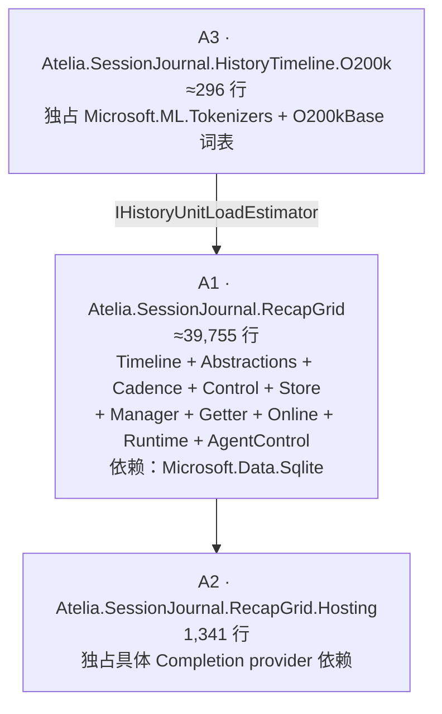

# RecapGrid 程序集合并方案

状态：Proposal（未实施）
作用域：`prototypes/SessionJournal.HistoryTimeline` 与 `prototypes/SessionJournal.RecapGrid.*` 共 11 个生产项目
撰写日期：2026-08-15
基线分支：`feature/derived-recap-grid-rewrite`

## 1. 目的

把「按程序集分隔」的模块边界改为「按命名空间分隔」，使模块间契约类型可以降级为
`internal`，从而缩小需要长期承诺稳定的 public API 表面。

本文只负责**程序集拓扑**这一件事。它不改变任何 wire-format、不改变任何行为、不合并
任何类型、不收敛任何 result 族。那些是后续独立工作。

### 1.1 完成判据

1. 生产程序集数量从 11 降到 3。
2. 所有命名空间保持原样，消费者（Galatea / Galatea.RecapGrid / SessionJournal.Cli）
   的 `using` 与源码**一行不改**。
3. 合并提交本身不含任何 `.cs` 内容变更（除 §9.2 列出的两处必要例外），`git diff` 只
   有文件移动、`.csproj` 与 `.sln`。
4. 合并后存在一个**唯一不持有 `InternalsVisibleTo` 的测试项目**，它编译通过即证明
   public 表面对外部组合是充分的。

## 2. 现状实测

统计口径：排除 `obj/`、`bin/`；「public 声明」含嵌套类型声明，「distinct 名字」按类型
名去重。

| 项目 | 行数 | NuGet 依赖 |
|:--|--:|:--|
| `SessionJournal.HistoryTimeline` | 13,131 | Microsoft.Data.Sqlite、SQLitePCLRaw、Microsoft.Bcl.Memory、**Microsoft.ML.Tokenizers**、**…Data.O200kBase** |
| `SessionJournal.RecapGrid.Abstractions` | 3,148 | — |
| `SessionJournal.RecapGrid.Cadence` | 2,375 | — |
| `SessionJournal.RecapGrid.Control` | 5,036 | — |
| `SessionJournal.RecapGrid.Store` | 4,106 | Microsoft.Data.Sqlite、SQLitePCLRaw |
| `SessionJournal.RecapGrid.Manager` | 3,627 | — |
| `SessionJournal.RecapGrid.Runtime` | 1,957 | — |
| `SessionJournal.RecapGrid.Getter` | 2,666 | — |
| `SessionJournal.RecapGrid.Online` | 2,282 | — |
| `SessionJournal.RecapGrid.Hosting` | 1,341 | — |
| `SessionJournal.RecapGrid.AgentControl` | 1,723 | — |
| **合计** | **41,392** | |

- public 类型声明 **802** 个；distinct 类型名 **478** 个。差额 324 说明约四成公开声明
  是同名嵌套变体（`Opened` / `Busy` / `Absent` / `Invalid` / `UnsupportedSchema` …）。
- 生产消费者只有三个：`Galatea`、`Galatea.RecapGrid`、`SessionJournal.Cli`。
- 命名空间**已经**与项目一一对应，合并不需要改命名空间。

### 2.1 现有边界已经不成立的三条证据

1. **生产程序集之间已经互开 internal**：
   `prototypes/SessionJournal.HistoryTimeline/SessionJournal.HistoryTimeline.csproj:14`
   有 `<InternalsVisibleTo Include="Atelia.SessionJournal.RecapGrid.Cadence" />`。
   Cadence 实际使用了 HistoryTimeline 的 `HistoryRecentReserveAuthorityToken` 与
   `HistoryRecentReservePolicy`。这两个程序集之间不存在真实封装边界。
2. **测试项目跨模块借 internal**：HistoryTimeline 对 `Runtime.Tests` / `Hosting.Tests`
   开放，Manager 对 `Runtime.Tests` / `Hosting.Tests` 开放，Control 对 `Getter.Tests`
   开放。说明模块的可测试单元本来就不是单个程序集。
3. **程序集名与命名空间已经不一致**：`Atelia.SessionJournal.RecapGrid.Abstractions`
   程序集里的命名空间是 `Atelia.SessionJournal.RecapGrid`。「一个程序集一个命名空间根」
   这条隐含约定在本家族里从未成立。

## 3. 什么才算真正的程序集边界

合并方案按以下四条判据决定保留还是取消边界。一个边界只要**一条都不满足**，它就只是
把本该 `internal` 的东西强制变成 `public` 的税。

| # | 判据 | 说明 |
|:--|:--|:--|
| B1 | **依赖闭包不同** | 保留边界能让某些消费者避免拖入重量级依赖 |
| B2 | **发布/版本生命周期不同** | 可以单独发版、单独回滚 |
| B3 | **信任或进程边界** | 插件宿主、沙箱、跨进程加载 |
| B4 | **封装真的在生效** | 不存在跨程序集的 `InternalsVisibleTo` 泄漏 |

对现状逐项检验：

- **B2 / B3：全部 11 个项目都不满足。** 它们同生同死，一起编译一起提交，没有任何
  独立版本或插件加载场景。
- **B4：HistoryTimeline↔Cadence 已破**（§2.1）。其余边界虽未破，但也只是尚未需要。
- **B1：只有三处满足**，见 §4。

结论：**只有依赖闭包这一条判据在本家族里真正成立**，因此目标拓扑应当完全由依赖闭包
决定，而不是由代码分层决定。

## 4. 目标拓扑：11 → 3



| 程序集 | 合并进来的原项目 | 独占依赖 | 判据 |
|:--|:--|:--|:--|
| **A1** `Atelia.SessionJournal.RecapGrid` | HistoryTimeline（除 O200k 估算器）、Abstractions、Cadence、Control、Store、Manager、Getter、Online、Runtime、AgentControl | `Microsoft.Data.Sqlite` | — |
| **A2** `Atelia.SessionJournal.RecapGrid.Hosting` | Hosting | 具体 `Completion`（HTTP/provider 实现） | B1 |
| **A3** `Atelia.SessionJournal.HistoryTimeline.O200k` | `O200kBaseHistoryUnitLoadEstimator.cs` | `Microsoft.ML.Tokenizers` + `…Data.O200kBase` | B1 |

### 4.1 为什么 Runtime 和 AgentControl 归入 A1

Runtime 引用 `Completion.Abstractions`，AgentControl 引用 `Completion.Tools`。这两个包
**已经在 A1 的传递闭包里**（`SessionJournal` 本身就引用它们），所以把 Runtime 和
AgentControl 并入 A1 不新增任何依赖，B1 不成立。

只有 Hosting 引用**具体的** `Completion`（含 HTTP 传输与 provider 实现）。这是唯一一处
「保留边界能让别人少拖东西」的地方，因此 A2 独立。

### 4.2 为什么 O200k 估算器必须拆出去

当前 `Microsoft.ML.Tokenizers` + O200kBase 词表数据挂在 HistoryTimeline 上，意味着**每一个
消费者**（包括只想读 Control 状态的 `Galatea.RecapGrid`）都要拖入分词器与词表。

实际耦合极浅，只有两个文件触及：

- `O200kBaseHistoryUnitLoadEstimator.cs`（296 行）——真正的实现；
- `HistoryTimelineCoordinator.cs:1082`——只用到一个字符串常量
  `O200kBaseHistoryUnitLoadEstimator.EstimatorId`。

核心侧已经有 `IHistoryUnitLoadEstimator` 与 `HistoryTimelineEstimatorRegistry` 的注入
机制，估算器本来就是可插拔的。拆出去是纯收益。

**这是本方案里唯一一处「拆分」而非「合并」，也是唯一新增的边界。**

### 4.3 为什么 HistoryTimeline 不单独保留

它是最大的单个项目（13,131 行），直觉上该独立。但：

- B2/B3 不成立；
- B4 已经被 `InternalsVisibleTo(...Cadence)` 打破；
- B1 在剥离 O200k 之后只剩 `Microsoft.Data.Sqlite`，而 Store 同样需要 Sqlite——两者是
  同一个存储后端上的两个 durable owner，分不开；
- 它是 internal 化收益最大的单点（§6，≥50 个 distinct 类型名无外部消费者）。

保留它只会继续把 50 个内部契约类型钉在 public 表面上。

### 4.4 命名遗留问题

A1 的程序集名是 `Atelia.SessionJournal.RecapGrid`，但内部包含
`Atelia.SessionJournal.HistoryTimeline` 命名空间——后者并不是前者的子命名空间。

**接受这个不一致，不做重命名。** 理由：

- 本家族已有先例（§2.1 第 3 条）；
- 改名要动 Galatea、CLI、全部测试与文档中的 `using`，与 §1.1 判据 2「消费者一行不改」
  直接冲突；
- CLI 命令根、durable identity 字符串、文档目录全部已经叫 `recap-grid`，另起新名
  只会增加术语。

如果将来确实需要，`HistoryTimeline` → `RecapGrid.Timeline` 的命名空间重命名是一次
纯机械 IDE 重构，可以独立于本方案随时执行。

## 5. 目录布局

按原项目名建子目录，`git mv` 整目录移入，历史可追溯：

```text
prototypes/SessionJournal.RecapGrid/
  SessionJournal.RecapGrid.csproj          → Atelia.SessionJournal.RecapGrid
  Properties/AssemblyInfo.cs
  HistoryTimeline/       ← 原 SessionJournal.HistoryTimeline（除 O200k*.cs）
  Abstractions/          ← 原 SessionJournal.RecapGrid.Abstractions
  Cadence/               ← 原 SessionJournal.RecapGrid.Cadence
  Control/               ← 原 SessionJournal.RecapGrid.Control
  Store/                 ← 原 SessionJournal.RecapGrid.Store（含 SchemaV2.sql）
  Manager/               ← 原 SessionJournal.RecapGrid.Manager
  Getter/                ← 原 SessionJournal.RecapGrid.Getter
  Online/                ← 原 SessionJournal.RecapGrid.Online
  Runtime/               ← 原 SessionJournal.RecapGrid.Runtime
  AgentControl/          ← 原 SessionJournal.RecapGrid.AgentControl

prototypes/SessionJournal.RecapGrid.Hosting/   （原样保留，只改 ProjectReference）
prototypes/SessionJournal.HistoryTimeline.O200k/
  O200kBaseHistoryUnitLoadEstimator.cs
```

子目录名不影响命名空间（各文件的 `namespace` 声明保持原值），也不影响
`RootNamespace`——因为项目里没有依赖 `RootNamespace` 推导命名空间的新文件模板需求。

### 5.1 命名空间冲突预检

已实测：11 个项目的**顶层**类型名跨命名空间冲突数为 **0**。合并不会产生歧义或需要
`extern alias`。

## 6. internal 化的收益

判据：一个类型若不被 `Galatea`、`Galatea.RecapGrid`、`SessionJournal.Cli` 中任何一个
引用，则它是 internal 候选。

| 原项目 | distinct 公开名 | 无外部消费者 |
|:--|--:|--:|
| HistoryTimeline | 120 | **50** |
| Abstractions | 48 | **33** |
| Store | 55 | **21** |
| Manager | 59 | **19** |
| Runtime | 15 | **11** |
| Control | 58 | 8 |
| Cadence | 40 | 6 |
| Hosting | 19 | 5 |
| Online | 22 | 4 |
| Getter | 29 | 3 |
| AgentControl | 13 | 1 |
| **合计** | **478** | **161** |

> **测量方法与误差方向**：用类型名在消费者源码中做标识符匹配。像 `Opened`、`Busy`
> 这类通用嵌套变体名极易误判为「被引用」，因此 **161 是下界**。另一方面，嵌套变体会
> 随外层类型一起降级，而上表按 distinct 名统计，所以以**声明数**衡量的实际降幅会明显
> 高于 161/478。

明确可以立刻降级的具体目标（合并后即成立）：

- 四个测试钩子：`HistoryTimelinePersistenceTestHooks`、`CadencePersistenceTestHooks`、
  `ControlPersistenceTestHooks`、`ManagerTestHooks`——它们只应对测试可见，靠
  `InternalsVisibleTo` 即可，不需要 public。
- 各 durable owner 的 `*Paths` / `*DurableFiles` / `*Limits` / `*StorageLimits` 家族。
- `IRecapCellBatchExecutor` 这类只有同家族实现者的接口（Manager 定义、Runtime 实现，
  两者合并后同属 A1）。
- Manager↔Getter↔Online 之间的中间 progress / assignment / mapping 类型。

## 7. 测试项目重组

现状：11 个 `*.Tests` + 11 个 `*.PublicSurface.Tests`（每个 1 文件、22–222 行、共 1,275
行）+ 3 个 `*.CrashHarness`。

| 类别 | 处理 | IVT |
|:--|:--|:--|
| 11 个 `*.Tests` | **保留**，各自改为引用 A1/A2/A3 | A1 在 csproj 中统一列出 |
| 3 个 `*.CrashHarness` | **保留** | 同上 |
| 11 个 `*.PublicSurface.Tests` | **合并为 1 个** `SessionJournal.RecapGrid.PublicSurface.Tests` | **禁止授予**（见下） |

合并 PublicSurface 测试是本方案的关键收益之一：

> 合并后，仓库里存在**恰好一个**不持有 `InternalsVisibleTo` 的测试项目。
> 它编译通过，就是「public 表面对外部组合充分」的编译期证明；
> 它编译失败，就是「有东西被误降级」的即时信号。

这比现在 11 个各自持有 IVT、又各自手写行为断言的项目强得多——今天没有任何机制能
判断某个 public 类型是否真的必须 public。

`Galatea.RecapGrid.PublicSurface.Tests`（22 行）保持独立，因为它验证的是资产层视角。

## 8. 用架构测试替代编译期分层强制

合并会失去一样东西：**项目引用图对分层的编译期强制**。必须补上等价物，否则命名空间
之间会逐渐出现反向依赖。

在合并后的测试项目中增加一个架构测试，对 A1 程序集做元数据扫描，断言命名空间之间只
存在下列有向边（直接照抄合并前的 `ProjectReference` 图）：

| 命名空间 | 允许依赖 |
|:--|:--|
| `…HistoryTimeline` | `Atelia.SessionJournal`、`Atelia.EventJournal` |
| `…RecapGrid`（Abstractions） | `…HistoryTimeline` |
| `…RecapGrid.Cadence` | `…HistoryTimeline` |
| `…RecapGrid.Control` | `…HistoryTimeline`、`…RecapGrid` |
| `…RecapGrid.Store` | `…RecapGrid` |
| `…RecapGrid.Manager` | `…HistoryTimeline`、`…RecapGrid`、`.Control`、`.Store` |
| `…RecapGrid.Runtime` | `…RecapGrid`、`.Manager` |
| `…RecapGrid.Getter` | `…HistoryTimeline`、`…RecapGrid`、`.Cadence`、`.Control`、`.Store` |
| `…RecapGrid.Online` | `…HistoryTimeline`、`.Cadence`、`.Manager`、`.Getter` |
| `…RecapGrid.AgentControl` | `…HistoryTimeline`、`…RecapGrid`、`.Control`、`.Manager` |

实现方式建议用 `System.Reflection.Metadata` 直接读取编译产物的 TypeRef/MemberRef 表，
不引第三方架构测试框架。

**这个测试必须与合并在同一个提交里落地**，否则会出现无人看守的窗口期。

## 9. 迁移步骤

每步单独提交，每步结束时 `dotnet build` + `dotnet test` 必须全绿。

### 9.0 前置清场

删除不在 `Atelia.sln` 中的孤儿测试项目（已确认全部未被解决方案引用）：

```text
tests/SessionJournal.DerivedRecap.Maintainers.Tests
tests/SessionJournal.DerivedRecap.Planner.Tests
tests/SessionJournal.DerivedRecap.Store.Tests
tests/SessionJournal.DerivedRecap.Store.CrashHarness
```

记录一次干净的全量 build/test 基线（耗时与通过数），作为后续每步的对照。

### 9.1 拆出 A3（O200k 估算器）

1. 新建 `prototypes/SessionJournal.HistoryTimeline.O200k/`，`git mv` 估算器源文件；
2. 把 `Microsoft.ML.Tokenizers` 与 `…Data.O200kBase` 两个 `PackageReference` 从
   HistoryTimeline 移到新项目；
3. 把 `EstimatorId` 常量的**定义**移到核心侧（例如与 `IHistoryUnitLoadEstimator` 同处），
   估算器改为引用该常量，`HistoryTimelineCoordinator.cs:1082` 改为引用核心侧常量；
4. 为 Galatea、CLI、相关测试补上对 A3 的 `ProjectReference`（它们才是真正注入估算器的
   组合根）。

> 这一步先做，是因为它是唯一需要改 `.cs` 的一步。先隔离掉，后面的大合并才能保持
> 「零代码变更」。

### 9.2 合并 A1

1. 新建 `prototypes/SessionJournal.RecapGrid/SessionJournal.RecapGrid.csproj`；
2. 对 10 个原项目逐个 `git mv <项目目录> prototypes/SessionJournal.RecapGrid/<子目录名>`，
   然后删除移入的 `.csproj` 与 `Properties/AssemblyInfo.cs`；
3. 新 csproj 取十个原 csproj 的**并集**：`PackageReference`（去重后只剩 Sqlite 两项 +
   `Microsoft.Bcl.Memory`）、`EmbeddedResource`（`Store/SchemaV2.sql`）、
   `ProjectReference`（`Diagnostics`、`EventJournal`、`SessionJournal`、
   `Completion.Abstractions`、`Completion.Tools`）；
4. `InternalsVisibleTo` 合并为一份清单，覆盖 11 个 `*.Tests` + 3 个 `*.CrashHarness` +
   `WalkingSkeleton.Tests`；**删除**指向 `Atelia.SessionJournal.RecapGrid.Cadence` 的
   那一条（同程序集内不再需要）；
5. 更新 `Atelia.sln`、Hosting/CLI/Galatea/Galatea.RecapGrid/全部测试项目的
   `ProjectReference`；
6. 同一提交内加入 §8 的架构测试。

**允许的 `.cs` 变更仅限两处**：删除 10 个 `AssemblyInfo.cs` 中的 `InternalsVisibleTo`
特性行；§9.3 提到的资源名加固。除此之外 `git diff -M --stat` 应只显示重命名。

### 9.3 加固嵌入资源查找

`Store/SqliteRecapGridStore.cs` 的 `ReadSchemaSql()` 用
`GetManifestResourceNames().Single(n => n.EndsWith(".SchemaV2.sql"))` 定位 schema。
合并后 A1 里如果将来出现第二个 `SchemaV2.sql`，`.Single()` 会在运行时抛异常。

改为按合并后的**精确逻辑资源名**匹配（形如
`Atelia.SessionJournal.RecapGrid.Store.SchemaV2.sql`），并保留一条断言。当前只有一个
该名资源，所以这不是阻塞项，但属于合并引入的新风险，应在同一批次消除。

### 9.4 合并 PublicSurface 测试

新建单个项目，把 11 个源文件按原名移入并加命名空间前缀区分，确认它**没有**任何
`InternalsVisibleTo` 授权。此时它编译通过 = public 表面充分性的初始证明。

### 9.5 分批 internal 化

按 §6 的表格，从收益最大的开始，**一个命名空间一个提交**：

`HistoryTimeline` → `Abstractions` → `Store` → `Manager` → `Runtime` → 其余。

每个提交的验收：

- `dotnet build` 全绿（说明同家族内部够用）；
- PublicSurface 测试项目编译通过（说明外部组合仍够用）；
- 架构测试通过（说明没有借降级绕开分层）。

若某个类型降级导致 PublicSurface 测试编译失败，说明它**确实**属于 public 表面——把它
留在 public 并在提交信息里记一笔，这条记录就是将来 API 冻结清单的原始素材。

## 10. 风险与已知陷阱

| 风险 | 评估 | 处置 |
|:--|:--|:--|
| 顶层类型名冲突 | 已实测为 0 | 无需处理 |
| 嵌入资源名后缀匹配失效 | 真实但当前不触发 | §9.3 |
| `EstimatorId` 常量循环引用 | 拆分 A3 时必然遇到 | §9.1 第 3 步 |
| 失去分层的编译期强制 | 真实 | §8 架构测试，同提交落地 |
| Git 历史断裂 | 用 `git mv` 整目录移动可保留 | 提交信息注明 `-M` 可追溯 |
| 单程序集 39,755 行过大 | 增量构建粒度变粗 | 现状下所有项目本就依赖 HistoryTimeline，改动它已经触发全量重建，无实质退化 |
| 测试并行度下降 | 只影响合并后的 PublicSurface 项目（约 1,275 行） | 可忽略 |
| 与在建文档冲突 | `work/active/` 下 WP-00…WP-08 按旧项目名描述路径 | 合并提交后统一更新 `current/architecture-and-code-map.md` 的 ownership 表；`work/active/` 作为历史施工记录不追改 |

## 11. 非目标

以下事项**明确不在本方案内**，不要顺手做：

1. 合并或收敛任何 result / outcome 类型族（那会改变 API 语义，且需要 wire-format 回归网
   先就位）；
2. 抽取四套 durable store 的公共存储原语；
3. 任何 canonical bytes、SQLite schema、digest 预像的变更；
4. 任何命名空间重命名（含 §4.4 讨论的 `HistoryTimeline` → `RecapGrid.Timeline`）；
5. 补 wire-format golden 语料——那是独立且更优先的工作，但与本方案正交，可并行。

保持本方案「零行为变更」是它可以被快速 review 和快速回滚的唯一前提。

## 12. 验收清单

- [ ] 孤儿 `DerivedRecap.*` 测试项目已删除，`Atelia.sln` 与磁盘一致
- [ ] 生产程序集恰好 3 个：A1 / A2 / A3
- [ ] `Microsoft.ML.Tokenizers` 只出现在 A3 的 csproj 中
- [ ] 具体 `Completion` 只出现在 A2 的 csproj 中
- [ ] Galatea / Galatea.RecapGrid / SessionJournal.Cli 的 `.cs` 源码零变更
- [ ] 合并提交的 `git diff -M --stat` 除 csproj/sln 外只有重命名与 §9.2/§9.3 的例外
- [ ] 架构测试存在并覆盖 §8 全部命名空间边
- [ ] 存在且仅存在一个无 `InternalsVisibleTo` 授权的 RecapGrid 测试项目
- [ ] 全量 `dotnet build` + `dotnet test` 与 §9.0 基线同样全绿
- [ ] public 类型声明数相对 802 的降幅已记录在最终提交信息中
