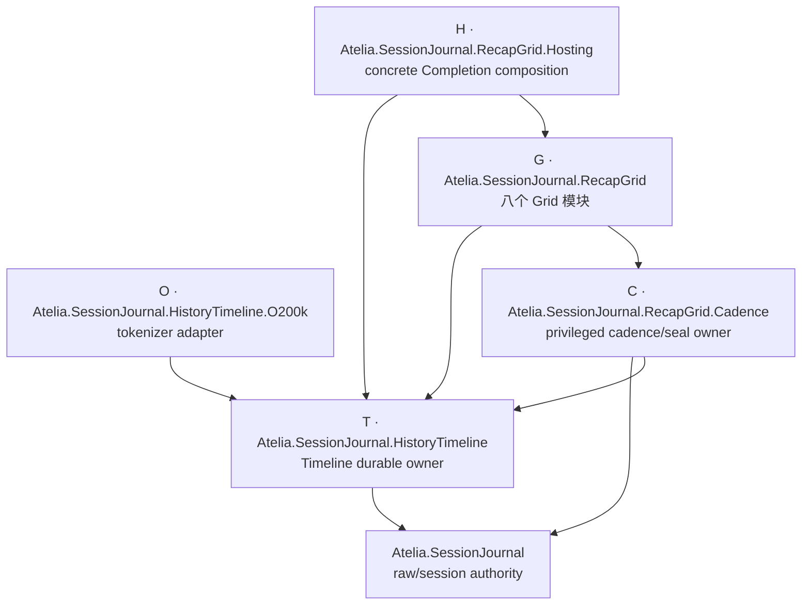

# RecapGrid 程序集收口方案与实施记录

状态：Implemented（M1 已完成；M2 本轮 visibility-only audit 与批次已完成，剩余 public API
不视为冻结）
原始作用域：`prototypes/SessionJournal.HistoryTimeline` 与
`prototypes/SessionJournal.RecapGrid.*` 共 11 个生产项目
方案修订：采用 T/C/G/H/O 的 **11 → 5** 拓扑；未采用 11 → 6 ControlPlane 备选
撰写日期：2026-08-15
审阅修订日期：2026-08-15
实施日期：2026-08-15
实施提交范围：`13bcf7e1..5461373f`
基线分支：`feature/derived-recap-grid-rewrite`

## 1. 目的与结论

目标是缩小需要对普通下游消费者承诺的 public API 表面，同时保留当前真正有价值的
依赖、权限与 composition 边界。

原候选的 `11 → 3` 方向未采用。它会把 HistoryTimeline 与 privileged Cadence 一并
并入约 4 万行的大程序集，并迫使 `SessionJournal` 把只授予 Cadence 的 internal
mutation capability 授给整个 RecapGrid core。实际实现采用 **11 → 5**：

1. 保留 `SessionJournal.HistoryTimeline`；
2. 保留 `SessionJournal.RecapGrid.Cadence`；
3. 把其余八个 RecapGrid 模块合并为 `SessionJournal.RecapGrid`；
4. 保留 `SessionJournal.RecapGrid.Hosting`；
5. 从 HistoryTimeline 拆出 `SessionJournal.HistoryTimeline.O200k`。

这样既能消除大多数“只因跨程序集才被迫 public”的 RecapGrid 内部契约，又不会扩大 raw
SessionJournal / Timeline internal capability 的生产 caller set。

本文只处理程序集拓扑和由此直接产生的可见性收口。它不改变 wire-format、SQLite
schema、canonical bytes、durable identity 或 result/outcome 语义。

### 1.1 两个独立里程碑

“程序集移动成功”与“public 表面按 visibility-only 边界完成本轮收口”分别验收。

**M1：程序集拓扑收口**

- 生产程序集从 11 个收口为 5 个；
- Galatea、Galatea.RecapGrid、SessionJournal.Cli 的生产 `.cs` 源码不因拓扑变化而修改；
- 除 O200k 拆分、资源定位加固与必要测试迁移外，不改变生产行为；
- clean build 后不再产出被替代的旧 RecapGrid 模块 DLL；
- 现有测试语义与架构约束已按新拓扑迁移，而不是通过删除断言获得绿色。

**M2：public → internal 收口**

- 以 symbol/public-signature closure 为依据逐模块降级；
- 所有真实生产消费者和无 friend 权限的 external-consumer tests 继续编译、通过；
- 本轮完成 visibility-only 候选审计和已确认批次；剩余 G 五模块的 64 个 top-level 类型均被
  production consumer 或 public-signature closure 阻塞；
- M1/M2 public API 清单和数量单独记录，不把初始文本匹配统计当作验收事实，也不把剩余
  415 个 G 类型逐 symbol 声明为稳定或冻结。

### 1.2 兼容性承诺

本项目尚未发布、没有已知下游二进制消费者，因此 M1 只承诺 clean rebuild 后的**源码兼容**。
类型从旧程序集移入 `Atelia.SessionJournal.RecapGrid.dll` 会改变 CLR type identity 与
assembly-qualified name；不承诺旧编译产物的 binary compatibility。

实施期源码检索未发现 canonical/wire 数据持久化 assembly-qualified type name；codec/golden、
clean build 与 fresh-output 验收也未发现这类依赖。该结果只描述本次实施证据，不承诺未来
新增路径天然安全。

## 2. 实施前历史快照

统计口径：排除 `obj/`、`bin/`。下表是候选撰写时、M1 实施前的源码规模与直接包依赖快照，
不是当前项目表，也不是 API 稳定性声明。

| 项目 | 行数 | 直接 NuGet 依赖 |
|:--|--:|:--|
| `SessionJournal.HistoryTimeline` | 13,131 | Microsoft.Data.Sqlite、SQLitePCLRaw、Microsoft.Bcl.Memory、Microsoft.ML.Tokenizers、O200kBase data |
| `SessionJournal.RecapGrid.Abstractions` | 3,148 | — |
| `SessionJournal.RecapGrid.Cadence` | 2,375 | — |
| `SessionJournal.RecapGrid.Control` | 5,036 | — |
| `SessionJournal.RecapGrid.Store` | 4,106 | Microsoft.Data.Sqlite、SQLitePCLRaw |
| `SessionJournal.RecapGrid.Manager` | 3,627 | — |
| `SessionJournal.RecapGrid.Runtime` | 1,957 | — |
| `SessionJournal.RecapGrid.Getter` | 2,666 | — |
| `SessionJournal.RecapGrid.Online` | 2,282 | — |
| `SessionJournal.RecapGrid.Hosting` | 1,341 | — |
| `SessionJournal.RecapGrid.AgentControl` | 1,723 | — |
| **合计** | **41,392** | |

实施前已确认：

- 三个生产 composition consumer 是 Galatea、Galatea.RecapGrid、SessionJournal.Cli；
- 有 11 个模块 regular test 项目、10 个模块 `*.PublicSurface.Tests`、3 个 CrashHarness，另有
  `SessionJournal.RecapGrid.WalkingSkeleton.Tests`；
- 10 个模块 PublicSurface test 本来就没有被生产程序集授予 `InternalsVisibleTo`；
- 源码已经按稳定 namespace/module 分组，但 `RecapGrid.Abstractions` 的类型位于根 namespace
  `Atelia.SessionJournal.RecapGrid`，不能表述成“项目名与 namespace 一一对应”。

### 2.1 现有 friend 不是偶然噪声

实施前存在、且实施后保持了两条关键的**单向生产 friend**：

1. `SessionJournal` 向 `Atelia.SessionJournal.RecapGrid.Cadence` 开放 internal；Cadence 由此
   调用 `SessionJournalEngine.ExecuteDerivedSidecarMutation`；
2. `SessionJournal.HistoryTimeline` 向同一个 Cadence 程序集开放 internal；Cadence 由此使用
   `HistoryRecentReserveAuthorityToken` 与 `HistoryRecentReservePolicy`。

这不是“程序集之间互开 internal”，也不说明边界完全失效。它表达的是：Cadence 是被精确
授权的 derived-sidecar / recent-reserve mutation caller，而其他 Grid 模块不是。

因此，若把 Cadence 并入大 Core，再把上述 friend 改授给
`Atelia.SessionJournal.RecapGrid`，Manager、Runtime、Getter、Online、AgentControl 等都会一并
获得 raw/Timeline internals。即使 namespace 架构测试能够事后发现误用，这也已经扩大了
编译器允许的权限集合，不是行为保持型机械迁移。

测试 IVT 仍按测试白盒需求单独评估；它们不自动否定生产边界。

## 3. 程序集边界判据

边界是否保留，按以下五项判断。targeted IVT 是“边界较弱且有特许 caller”的证据，不是
自动删除边界的充分条件。

| # | 判据 | 说明 |
|:--|:--|:--|
| B1 | **依赖闭包** | 保留边界能让某类消费者避免重量级或 concrete 依赖 |
| B2 | **部署/版本生命周期** | 需要独立发布、加载、回滚或替换 |
| B3 | **权限与 capability** | 只有精确 caller 应获得 upstream internals 或 mutation authority |
| B4 | **依赖方向与 owner** | 编译期边界保护独立 authority、单向依赖或可复用上游模块 |
| B5 | **外部支持契约** | 有需要独立验证的消费 profile 或 public extension seam |

应用到当前家族：

- Hosting 满足 B1：它独占 concrete `Completion` provider/HTTP 组合；
- O200k 满足 B1/B5：它独占 tokenizer 与词表，且通过
  `IHistoryUnitLoadEstimator` 注入；
- Cadence 满足 B3/B4：它是 SessionJournal 与 Timeline internals 的精确 privileged caller；
- HistoryTimeline 满足 B4/B5：它拥有独立 ledger/lifecycle，是 RecapGrid 的上游 durable owner，
  当前代码与 WalkingSkeleton gates 明确禁止它反向依赖 Grid/runtime；
- Abstractions、Control、Store、Manager、Runtime、Getter、Online、AgentControl 组成同一个
  RecapGrid 产品闭包，没有额外的 production IVT privilege，适合合并后用 namespace 维持
  语义 owner。

## 4. 已实现拓扑：11 → 5

下图箭头表示“source depends on target”：



`SessionJournal → Cadence` 与 `HistoryTimeline → Cadence` 的 IVT grant 方向与上图的 compile
dependency 方向相反；两条 grant 保持现状的精确 assembly name，不扩大到 G。

| 代号 | 程序集 | 来源 | 关键边界 |
|:--|:--|:--|:--|
| **T** | `Atelia.SessionJournal.HistoryTimeline` | 原项目减去 O200k 实现 | 独立 Timeline owner；SQLite + Bcl.Memory |
| **C** | `Atelia.SessionJournal.RecapGrid.Cadence` | 原样保留 | raw/Timeline privileged friend |
| **G** | `Atelia.SessionJournal.RecapGrid` | Abstractions、Control、Store、Manager、Runtime、Getter、Online、AgentControl | provider-neutral Grid core；SQLite、Completion abstractions/tools |
| **H** | `Atelia.SessionJournal.RecapGrid.Hosting` | 原样保留，改 ProjectReference | concrete Completion/provider composition |
| **O** | `Atelia.SessionJournal.HistoryTimeline.O200k` | O200k estimator 及其 estimator-owned renderer | tokenizer + O200kBase data |

### 4.1 为什么只合并 G 的八个模块

这八个模块形成密集、单向但共同演进的 RecapGrid 产品闭包。Runtime 引用
`Completion.Abstractions`，AgentControl 引用 `Completion.Tools`；这两项已经在
`SessionJournal` 的传递闭包中，合并不会给当前消费者新增依赖族。Store 的 SQLite 也已经
经 HistoryTimeline 出现在当前主要消费闭包中。

合并 G 后，原本只服务 Control↔Store↔Manager↔Runtime↔Getter↔Online↔AgentControl 的
中间 contracts 可以真正成为 internal，而不需要建立 production friend mesh。

### 4.2 为什么保留 Cadence

Cadence 不只是“分层项目”，而是握有两项 upstream internal capability 的精确 caller。保留
它可继续由编译器保证：

- 只有 Cadence 能调用 raw SessionJournal 的 derived-sidecar mutation seam；
- 只有 Cadence 能构造/携带 Timeline recent-reserve authority；
- G 只能通过 Cadence 的 public seal/read contract 参与该流程。

若未来希望把 Cadence 也并入 G，应先设计一个不扩大 caller set 的窄 capability（例如不可
伪造且不暴露 raw engine internals 的 operation object），另立方案并验证；不在本次机械合并
中顺手完成。

### 4.3 为什么保留 HistoryTimeline

HistoryTimeline 是独立 durable owner，不引用 Maintainer catalog、Completion runtime、Grid
Store 或 Context materialization。保留程序集可以继续用项目图强制这一方向，也保留其独立
consumer profile 与增量构建边界。

这不会妨碍 G 内部类型大规模 internal 化。Timeline 类型若出现在 G/H/O 或三个 production
consumer 的公开签名/源码中，本来就是跨程序集 contract；若只被 Timeline 自己使用，则可
直接 internal。不能为了追求类型计数而把 Timeline internals 整体授给 G。

### 4.4 O200k 拆分不是单文件移动

`O200kBaseHistoryUnitLoadEstimator.cs` 除 public estimator 外，还拥有 internal renderer/writer，
并调用 T 中的 internal `HistoryLoadNonFatalException`。现有 HistoryTimeline tests 也直接测试
这些 renderer 类型。因此 O 的拆分必须同时完成：

1. estimator 与 estimator-owned renderer/writer 一起归 O；
2. O 自己拥有等价的 non-fatal exception filter，避免为了一个 catch predicate 给 O 开放全部
   Timeline internals；
3. `O200kBaseHistoryUnitLoadEstimator.EstimatorId` 继续由 O 拥有；T 中当前只为 private test
   helper 使用该常量的路径改成显式接收 estimator ID，或使用独立 test sentinel，避免
   Timeline core 反向拥有具体 extension identity；
4. O 直接引用 T、SessionJournal、Completion.Abstractions，并持有两个 tokenizer package；
5. 把 estimator internals 的测试迁到 O-owned test project，或明确由 O 向现有
   HistoryTimeline.Tests 授予测试 IVT。

O 拆分完成后，T 不得引用 O，Timeline 的普通消费者也不再被迫携带 tokenizer/词表。

### 4.5 Hosting 继续独立

H 独占 concrete `Completion`（HTTP/provider 实现）。H 应直接引用它在源码中使用的 T、G、
`Completion` 与 `Completion.Abstractions`，不要依赖偶然的 transitive compile asset。

### 4.6 Galatea asset layer：11 → 5 已接受的取舍

M1 前 `Galatea.RecapGrid` 只直接引用 Abstractions + Control，资产层架构测试据此断言它没有
Runtime、Manager、Store、AgentControl 或 Completion 的 direct assembly reference。实施后的 G
改变了这条**物理**约束：Galatea.RecapGrid 直接引用 G，源码则由 module-edge gate 限制
为只使用 Abstractions/Control namespace。

实施已接受这一取舍：它不扩大 upstream internal privilege，且依赖闭包已经经
Timeline/SessionJournal 包含 Completion abstractions/tools；旧断言已转换为 source owner gate，
没有静默删除。

未采用的 **11 → 6** ControlPlane 备选曾是：

- 新建独立 ControlPlane assembly，合并 Abstractions + Control；
- G 只合并 Store、Manager、Runtime、Getter、Online、AgentControl 六个模块；
- Galatea.RecapGrid 只引用 ControlPlane。

这是一个可选的更强模块性边界，不是 privilege-safe 的必要条件。M1 实施前已锁定 11 → 5，
本轮没有创建 ControlPlane。

## 5. 目录布局

```text
prototypes/SessionJournal.HistoryTimeline/          # T，原地保留
  SessionJournal.HistoryTimeline.csproj
  ...                                               # 除 O200k estimator-owned 源码

prototypes/SessionJournal.RecapGrid.Cadence/        # C，原地保留

prototypes/SessionJournal.RecapGrid/                # G，新项目
  SessionJournal.RecapGrid.csproj
  Abstractions/
  Control/
  Store/
    SchemaV2.sql
  Manager/
  Runtime/
  Getter/
  Online/
  AgentControl/

prototypes/SessionJournal.RecapGrid.Hosting/        # H，原地保留

prototypes/SessionJournal.HistoryTimeline.O200k/    # O，新项目
  SessionJournal.HistoryTimeline.O200k.csproj
  O200kBaseHistoryUnitLoadEstimator.cs
  ... estimator-owned helpers
```

`git mv` 有助于 Git 的 rename detection，但 Git 不保存“重命名对象”这一独立事实；评审时应
使用 `git diff -M` 辅助追踪，不能把它描述成历史必然无损。

### 5.1 合并预检

M1 合并预检检查了八个来源项目之间是否存在重复的**完整 metadata type identity**
（namespace + containing types + type name + arity），而不是“跨 namespace 的简单类型名是否
重复”。不同 namespace 的同名类型本来就是合法的，也不需要 `extern alias`。

预检还覆盖：

- assembly-level attributes；当前只有 HistoryTimeline 另有手写 `Properties/AssemblyInfo.cs`，
  不能按“删除十份 AssemblyInfo”执行；
- embedded resources 与 logical name；
- 反射、硬编码 DLL 名、`Assembly.LoadFrom`、旧 csproj 路径；
- clean output 中的旧 DLL 残留。

## 6. public → internal 的判据

“类型名没有出现在三个消费者源码里”只能用于发现候选，不能作为可见性判决，更不是候选
数量的下界。它会漏掉：

- public property/method 的推断返回类型；
- public signature closure 中的参数、返回值、base/interface、generic constraint 与 attribute；
- H/O/C/T 等保留程序集对 G 的真实使用；
- reflection、serialization 与 resource-driven activation；
- alias 或同名标识符造成的误判。

例如 `IRecapCellBatchExecutor` 不能按原候选直接 internal：H 的 public host properties 公开返回
该接口，现有 Runtime/Online external-surface tests 也使用它。是否收掉该接口需要先重塑 H 的
public contract，不是机械降级。

四个 `*PersistenceTestHooks` / `ManagerTestHooks` 在当前源码中已经是 internal，也不能计入
未来 public 降幅。

### 6.1 可执行分类规则

对每个 public symbol 依次判断：

1. 是否位于另一个保留生产程序集的源码引用或 public signature closure 中；
2. 是否被 Galatea、Galatea.RecapGrid、SessionJournal.Cli 使用；
3. 是否属于明确保留的 external-consumer scenario 或 extension seam；
4. 是否参与 reflection/serialization/canonical identity；
5. 降级后，T/C/G/H/O、三个 production consumers 与 external-surface tests 是否全部编译。

只有前四项均为否且第五项为真，才可以 internal。编译通过是必要条件，不是对“未来所有用途
充分”的证明。

原候选记录的 802 个 public 声明、478 个 distinct 名与“161 个未命中”可以保留为历史粗筛
快照，但 **161 不作为下界、目标或验收数字**。M2 已由 symbol-aware 工具生成 baseline，
并保存生成命令与结果。

## 7. 测试与架构约束

### 7.1 PublicSurface tests

M1 保留了现有 10 个模块 PublicSurface 项目，并更新它们的 direct ProjectReference。它们本来
就没有 friend 权限，保留降低了一次性迁移风险。

测试源码并非全部机械不变：现有若干断言对“整个原程序集”的 exported types 做正负检查；
G 合并后必须改为按原 module namespace/owner 过滤，否则别的模块中合法的 public 类型会造成
误报。迁移时还应保留各项目当前的 test SDK/xUnit 版本，不能因未来可能合并项目而静默统一
测试运行时。

不要追求“恰好一个无 IVT 的测试项目”：

- IVT 是 producer 对 exact assembly name 的授权，不是 test project “持有”的能力；
- 单个同时引用 T/C/G/H/O 的测试项目无法证明最小依赖 profile；
- 编译通过只证明测试源码覆盖的场景仍可用。

M2 可以在覆盖关系稳定后另行决定是否按消费 profile 合并测试；至少应区分 core-only、
Timeline+O200k、Hosting composition 与端到端组合，不把全部引用堆进一个项目后宣称依赖隔离
已经得到证明。

### 7.2 WalkingSkeleton 的 M1 迁移账本

M1 前 `AssemblyDependencyBoundaryTests.cs` 大量硬编码旧项目目录、csproj 路径、DLL 名、IVT
清单和 assembly closure；Galatea.RecapGrid 的资产层架构测试也锁定旧 direct
ProjectReference。实施没有把这些断言静默删除，而是按下列账本迁移：

- **保留**：raw/Timeline privilege、concrete Completion 隔离、legacy product DLL absence；
- **转换**：旧 module assembly graph 改为 RG0001/RG0002 gates；Galatea asset 的 physical
  assembly 断言改为 source owner gate；
- **退休**：旧八模块 DLL/csproj “必须存在”的拓扑要求。

旧 product DLL absence、RG gates 与 source owner gate 共同覆盖了退休/转换后的边界；测试
`.cs` 修改作为 M1 必要迁移已在提交中显式记录。

### 7.3 namespace/module dependency gate

G 合并后不再由八个项目强制模块间方向，因此实施前先建立并校准了 module-edge gate，合并时
只切换 source root。实现允许的家族内边保持原图：

| G 内模块 | 允许依赖的家族模块 |
|:--|:--|
| Abstractions（根 `…RecapGrid`） | T |
| Control | T、Abstractions |
| Store | Abstractions |
| Manager | T、Abstractions、Control、Store |
| Runtime | Abstractions、Manager |
| Getter | T、C、Abstractions、Control、Store |
| Online | T、C、Abstractions、Manager、Getter |
| AgentControl | T、Abstractions、Control、Manager |

表格只描述家族内 edge；System、SessionJournal、EventJournal、Completion abstractions/tools 等
外部依赖另设 allow/deny 规则。

不能只扫描 `TypeRef/MemberRef` 就声称等价替代项目图。同程序集引用还可能编码为 TypeDef、
signature blob、base/interface、generic constraint、custom attribute 或 IL token。推荐用
Roslyn semantic model 做 source-symbol 分析；若选择 `System.Reflection.Metadata`，则必须完整
解析上述来源，并用“临时注入一条禁止依赖时测试确实失败”的 mutation check 校准。覆盖不全的
实现只能称 regression net，不能称编译期边界的等价物。

实际实现使用同一 analyzer 的 `RG0001` 检查 module dependency、`RG0002` 检查 source path 与
namespace owner 一致性。`9647b929` 进一步 fail-closed：未分类的 consolidated path、namespace
伪装与 ownership bypass 均被拒绝，并以 mutation-style analyzer tests 校准。

T、C、H、O 的关键方向继续由独立 csproj 直接强制，没有降级为 namespace test。

## 8. 已执行迁移步骤

M1 与 M2 按独立提交执行，实施范围为 `13bcf7e1..5461373f`。各步骤运行 focused tests，
里程碑运行 clean/fresh builds、tests 与输出检查。

### 8.0 前置基线与审计（已完成）

1. 记录 clean checkout 的 solution project list、build/test 通过数与耗时；
2. 记录 11 个产品项目的 direct refs、package refs、resources、IVT 与 assembly names；
3. 搜索 assembly-qualified type persistence、反射加载、硬编码 DLL/csproj/path；
4. 列出 WalkingSkeleton 断言的保留/转换/退休账本；
5. 以 clean/fresh output 验证基线，避免旧 `bin/obj` DLL 掩盖依赖错误。

旧 `tests/SessionJournal.DerivedRecap.*` 项目在当前 checkout 已经不存在；本方案不再删除它们，
也不把历史清理混入本次提交。

### 8.1 先建立 module-edge gate（已完成）

在旧项目图仍能提供参照时实现 §7.3 的 checker，并证明它：

- 接受当前合法 edge；
- 能捕获至少一条临时注入的反向 edge；
- 覆盖源码签名和方法体中的依赖；
- 不把同 namespace 的 compiler-generated metadata 误报为业务 edge。

该步骤已先于程序集移动落地，并由 `9647b929` 完成 fail-closed ownership 加固。

### 8.2 拆出 O（已完成）

1. 新建 `SessionJournal.HistoryTimeline.O200k`；
2. 按 §4.4 迁移 estimator、renderer/writer、异常过滤与测试；
3. tokenizer 两个 PackageReference 只归 O；
4. 按 §4.4 消除 T 对具体 O200k identity 的源码引用，T 不得引用 O；
5. 生成并核对所有直接构造/引用 O200k estimator 的 production、test 与 CrashHarness 清单，
   分别增加 direct O reference；不能只以“相关测试”概括；
6. 验证不引用 O 的 Timeline consumer profile 不再携带 tokenizer/词表。

### 8.3 合并 G 的八个项目（已完成）

1. 新建 `prototypes/SessionJournal.RecapGrid/SessionJournal.RecapGrid.csproj`；
2. `git mv` Abstractions、Control、Store、Manager、Runtime、Getter、Online、AgentControl 的源码
   到对应子目录；不移动 T/C/H；
3. 新 csproj 明确列出 direct dependencies：SessionJournal、EventJournal、
   Completion.Abstractions、Completion.Tools、T、C，以及 SQLite packages；保留 Online 当前的
   `TreatWarningsAsErrors=true` 约束；
4. 为 `Store/SchemaV2.sql` 设置精确 `LogicalName`，并把 `ReadSchemaSql()` 改为精确名称查找；
5. 合并八个旧项目的 test/CrashHarness IVT；不把 PublicSurface test 加入 friend；
6. 更新 solution、T/C/G/H/O、三个 production consumers 和测试的 ProjectReference；
7. 保持 `SessionJournal → C`、`T → C` 的 production IVT 不变，不新增
   `SessionJournal/T → G`；
8. 按 §7.2 迁移 WalkingSkeleton 与 Galatea.RecapGrid topology tests，并启用 §7.3 gate；
9. clean build 后断言八个被替代的旧产品 DLL 不存在。

该提交允许：文件移动、csproj/sln、资源定位生产代码、以及 topology/architecture test 代码
变更。除此之外的生产 `.cs` 变化必须逐项解释；不再使用“除两处外零 `.cs` 变更”的不可达
判据。

### 8.4 Retarget external-surface tests（已完成）

保留 10 个现有项目，按实际使用为其添加 T/C/G/H/O 的 direct references。按 §7.1 只修改
那些因 assembly-wide 断言或依赖 profile 变化而必须调整的测试源码，并保留原 module 的断言
语义。所有 producer 都不得向这些 exact assembly names 授予 IVT。

本轮保留了按消费 profile 分开的 PublicSurface test projects，没有把合并测试项目绑定为
程序集收口的正确性证明。

### 8.5 分批 internal 化（本轮 visibility-only 批次已完成）

实际执行顺序：

1. 保存 G 的 M1 symbol-aware inventory；
2. 收窄 Control、Online 的 code-owned limits；
3. 收窄 Store writer/result/read internals；
4. 收窄 C 的 cadence limits 与 T 的 history-load safety limits。

一个 namespace/module 一个提交。每批至少验证：

- T/C/G/H/O 全部编译；
- Galatea、Galatea.RecapGrid、SessionJournal.Cli 编译；
- 对应 regular、PublicSurface、WalkingSkeleton tests 通过；
- public signature closure 没有 inconsistent accessibility；
- module-edge gate 没有因“已经同程序集”而放过反向依赖。

剩余候选已区分“真实支持契约”“H/O/C/T 保留程序集 seam”“测试误用了 internal”与
“public contract 需要先重塑”；需要 contract-shape 变化的表面没有混入本轮。

### 8.6 文档收尾（已完成）

M1 已更新 `docs/SessionJournal/current/architecture-and-code-map.md` 的 assembly ownership
表。`work/active/` 中已经关闭的施工记录保留历史原文；current/router 文档不再把旧八程序集
写成当前事实。

### 8.7 实施结果与 API evidence

| 提交 | 结果 |
|:--|:--|
| `13bcf7e1`、`9647b929` | 建立 RG0001/RG0002 module-edge/ownership gate，并完成 fail-closed 加固 |
| `21f2ef1b` | 从 T 拆出 O200k estimator/renderer/tokenizer adapter |
| `9de3c402` | 八个 RecapGrid 模块原子合并为 G，retarget consumers/tests，迁移架构 gates |
| `53e8fd13` | 建立确定性的 G-only public API inventory，并保存 M1 evidence |
| `570603bf` | internal 化 Control admission limits |
| `04859cbe` | internal 化 Online catch-up limits |
| `08eb7bdc` | internal 化 Store writer/result/read closure |
| `0ec3dbde` | internal 化 C 的 cadence limits |
| `5461373f` | internal 化 T 的 history-load safety limits |

G inventory 由以下命令生成；工具只以 `Atelia.SessionJournal.RecapGrid.dll` 为目标，不把 C/T
统计混入 JSONL：

```bash
dotnet run --project scripts/SessionJournal.RecapGrid.ApiInventory -- \
  docs/SessionJournal/operations/evidence/recap-grid-public-api-m2.jsonl
dotnet run --project scripts/SessionJournal.RecapGrid.ApiInventory -- \
  /tmp/recap-grid-public-api-m2-repeat.jsonl
cmp -s \
  docs/SessionJournal/operations/evidence/recap-grid-public-api-m2.jsonl \
  /tmp/recap-grid-public-api-m2-repeat.jsonl
```

| Evidence | Effective-public types | Declared public/protected members | JSONL 行数 |
|:--|--:|--:|--:|
| [M1](evidence/recap-grid-public-api-m1.jsonl) | 455 | 4,884 | 5,340 |
| [M2](evidence/recap-grid-public-api-m2.jsonl) | 415 | 4,429 | 4,845 |
| **G 降幅** | **-40** | **-455** | **-495** |

M2 文件 SHA-256 为
`1e0aecbc5b653e552c49a91acc488f4e7fe698bf763fb869e3660a4a391e2bd3`；重复生成字节一致。
owner-local reflection/source gates 另记录 C `-1 type/-2 members`、T `-2 types/-2 members`；它们
不在 G-only JSONL 中。三程序集合计 visibility reduction 为 **43 types / 459 members**。

G 剩余 Manager、Runtime、Getter、Online、AgentControl 五模块共 64 个 effective-public
top-level types；source consumer 与 public-signature closure 复核没有找到新的
visibility-only atomic batch。H/O 同样没有此类候选。继续收缩需要重塑 executor、result、
telemetry、provenance/evidence 等 contract shape，应另立方案；M2 的 415 个 G types 是本次
exact-run evidence，不是逐 symbol 稳定性或冻结承诺。

## 9. 风险与处置

| 风险 | 处置 |
|:--|:--|
| Cadence privilege 扩大到整个 G | 保留 C；不新增 `SessionJournal/T → G` production IVT |
| O 单文件移动无法编译 | 迁 estimator-owned helpers；O-local exception filter；迁测试/测试 IVT |
| 旧 WalkingSkeleton hardcode 全面失败 | M1 前建立逐条迁移账本，允许必要测试源码变更 |
| public 候选统计误导 | 使用 symbol + public-signature closure；文本匹配只做候选发现 |
| 合并后分层反向依赖 | 先校准 module-edge gate；T/C/H/O 保留物理边界 |
| Galatea asset 物理边界弱化 | M1 已采用 11→5 source owner gate；未采用 11→6 ControlPlane |
| metadata checker 漏 TypeDef/signature/IL | 优先 Roslyn；否则完整解析并做 mutation check |
| embedded resource 名变化 | csproj 固定 LogicalName，运行时精确匹配并测试 |
| CLR type identity 改变 | 明确仅 source compatibility；全部 consumer clean rebuild |
| 旧 DLL 残留掩盖错误 | clean/fresh output 验收并断言 legacy DLL absence |
| Git rename detection 不稳定 | 使用 `git mv` + `git diff -M` 辅助 review，不宣称绝对保史 |
| 单程序集 G 增量构建变粗 | 记录 M1 前后 clean/incremental build 数据，超出可接受范围则复评 |

## 10. 非目标

1. 合并或收敛 result/outcome 类型族；
2. 抽取多个 durable owner 的公共存储原语；
3. 改动 canonical bytes、SQLite schema、digest 预像或 wire format；
4. 重命名 namespace；
5. 让 G 直接获得 raw SessionJournal 或 Timeline internal mutation capability；
6. 把 Cadence 并入 G，或在本方案内设计新的 capability object；
7. 用 assembly consolidation 代替 wire-format golden、crash/recovery 与 authority tests。

## 11. 验收清单

### M1：拓扑

- [x] M1 拓扑锁定并实现为 5 个 T/C/G/H/O；未创建 ControlPlane
- [x] G 只包含八个计划内模块；T/C/H 均未被并入
- [x] `Microsoft.ML.Tokenizers` 与 O200kBase data 只出现在 O
- [x] concrete `Completion` 只出现在 H，不进入 T/C/G/O
- [x] `SessionJournal → C` 与 `T → C` production IVT 保持精确；不存在指向 G 的新增 production IVT
- [x] T 不引用 C/G/H/O；C 不引用 G/H/O；O 不被 T 引用
- [x] Galatea / Galatea.RecapGrid / SessionJournal.Cli 的生产 `.cs` 源码未因拓扑迁移修改
- [x] 10 个现有模块 PublicSurface projects 均未获得 IVT 且通过
- [x] WalkingSkeleton 的每条旧 topology assertion 都有保留、转换或退休记录
- [x] Galatea asset layer 锁定 11→5 source owner gate，相关测试没有静默降级
- [x] module-edge gate 已由 mutation check 证明能抓到禁止 edge
- [x] clean output 不含八个被替代的旧 RecapGrid product DLL
- [x] clean full build/test 与基线的通过集合一致
- [x] current architecture/code map 已更新，历史施工记录未被伪装成当前事实

### M2：API 表面

- [x] 保存 symbol-aware public API baseline、本轮最终清单与可复现命令
- [ ] 每个保留 public symbol 都有 contract/profile 归因（本轮只完成候选与 closure audit；剩余
  415 个 G types 未逐一形成 symbol ledger，因此不宣称 surface 冻结）
- [x] 每个 internal 化提交通过对应 production consumer、PublicSurface 与 architecture gates
- [x] 没有 public signature 暴露 internal type
- [x] 没有 reflection/serialization/canonical identity 因 assembly move 或可见性变化失效
- [x] 最终 public 声明数相对 baseline 的变化已记录，但不以预设降幅替代设计审阅
