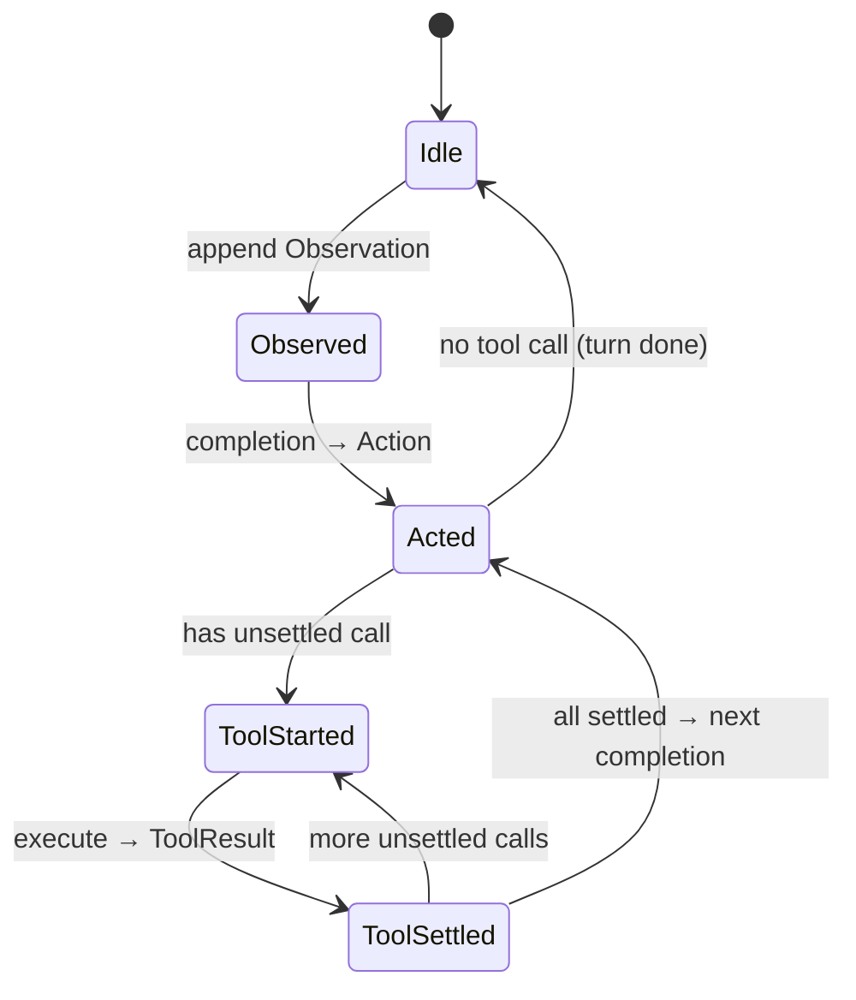

# SessionJournal 主干设计基线

> **状态**：Trunk Design Baseline（主干设计，已与用户共同拍板）
> **日期**：2026-07-24
> **底层依赖**：[EventJournal 使用指南](../../src/EventJournal/README.md)、[EventJournal 功能需求与粗粒度设计基线](../EventJournal/event-journal-requirements-and-design.md)
> **上层路线图**：[ChatSession 事件源与长期上下文架构路线图](../ChatSession/event-sourced-session-architecture-roadmap.md)
> **替代对象**：`prototypes/ChatSession`（StateJournal deque + 整轮末尾 commit）

## 0. 定位与边界

`Atelia.SessionJournal`（落地在 `prototypes/SessionJournal`）是长寿命 LLM-Agent 的
**append-only 落盘上下文 + 可恢复 tool-loop 状态机**。它是 roadmap 五层架构里最底下两件事的具体实现：
Raw Event Journal（事实源）+ Recoverable Execution State Machine（执行机）。

它只做这两件核心事，其余全部推到后续：

| 主干内（本文覆盖） | 主干外（后续垂直切片） |
|:---|:---|
| 单 store = 单 session、`main` branch | 多 session、跨 session 知识 artifact |
| 领域事件 envelope + EventKind | ContextPlanner / 预算化上下文选择 |
| 逐事件落盘的 tool-loop 状态机 | DerivedArtifact / recap / 自传 / 世界理解 |
| 纯 replay reducer（events → 投影） | Retrieval read models（FTS/向量/图） |
| full-replay 构造 `CompletionRequest` | 引用式 canonical request manifest（留给 CS-3/CS-6） |
| reopen 恢复、failpoint 测试 | exactly-once 补偿、非幂等工具暂停协议 |

主干与 roadmap 阶段对应：本文 = **CS-0（reducer/replay contract）+ CS-1（raw 垂直切片）+ CS-3/CS-4 的执行机骨架**的收敛实现基线。

### 已拍板的三个分叉点

1. **项目位置**：`prototypes/SessionJournal`，命名空间 `Atelia.SessionJournal`。老 `ChatSession` 原地不动，留作对照与迁移源。
2. **工具粒度**：每次工具调用落 **两个事件**（`tool-execution-started` + `tool-result-observed`）。崩溃点精确到"哪个调用在途"。
3. **请求持久化**：主干阶段**暂不持久化** canonical completion request；靠确定性 replay 恢复。后续 CS-3/CS-6 的持久化形状已定为**引用式 request manifest**：记录所需 raw/artifact/tool schema/config 的稳定地址与版本，而不是把超大 request body 值拷贝进一个自包含事件。

## 1. 核心洞察：链头决定恢复入口，replay 补全执行状态

老 `ChatSessionEngine` 的结构缺陷是整轮 tool-loop 只在末尾一次 `PersistTurnMessages` + `Commit`
（`prototypes/ChatSession/ChatSessionEngine.cs:96-97`）：mid-loop 崩溃无法判断 completion / 工具执行到了哪一步。

主干根治办法：**不额外维护 mutable "当前状态" 字段**。每个 EventJournal 事件都是 `CommitToRef` 一次 CAS 推进，落盘即 durable flush。

恢复流程是：

```text
reopen → 读取 main 链头 kind → replay 当前链得到 SessionProjection → 根据 ExecutionState 继续
```

链头 kind 给出恢复入口；完整 `ExecutionState` 由 reducer 从当前有效父链重建。例如 `ToolResult` 后是否还有未结算 call，必须 replay 最近的 `Action` 和已观察到的 tool results，不能只看一个 kind。

```
链头 kind                     下一合法动作
──────────────────────────────────────────────────
∅ / SessionCreated / ConfigChanged  等 observation
Observation                          跑 completion → append Action
Action(含 tool call)                 取首个未结算 call → append ToolStarted
Action(无 tool call)                 turn 结束 → 等 observation
ToolStarted                          执行该工具 → append ToolResult
ToolResult                           还有未结算 call? → 下一个 ToolStarted
                                     否则 → 跑 completion → append Action（续环）
```

崩溃窗口天然编码在链头 + replay projection：
- `Observation` 后崩 → 重跑 completion（确定性 replay 保证输入一致）。
- `ToolStarted` 后、`ToolResult` 前崩 → 该工具**可能已执行**。主干默认工具幂等（见 §6），安全重跑；非幂等工具的 uncertain/paused 协议留给 CS-4 完整版。
- `Action` 后崩 → 按 kind 继续结算工具或续环。



## 2. 事件信封

EventJournal 对 payload 不透明，只解释 header。SessionJournal 用两个层面表达领域语义：

- **`OpaqueEventKind`（header uint）**= 领域判别器。`ReadEventHeaderPreview` 零 payload 即可路由 / 恢复 / 快速 replay，不必读 body。
- **payload = 版本化 envelope** `{ "v": <bodySchemaVersion>, "body": <kind-specific> }`。`v` 是**当前 `OpaqueEventKind` 对应 body schema 的版本**，不是全局 session 版本；EventJournal header 的 `FormatVersion` 管更底层 frame 格式，两者不混。任一 kind 的 body 演进只 bump 该 kind 的 `v`。

### 2.1 Canonical 编码契约（落盘只读，必须现在钉死）

落盘数据 append-once、永久只读，且 CS-3 的 request manifest 会对 event bytes 做 hash。因此同一 logical event 在任意进程/版本下必须编码成**逐字节相同**的 bytes。envelope 编码契约：

- UTF-8，无 BOM，无多余空白（紧凑输出）。
- property order 固定；dictionary key 按 ordinal 排序。
- 数字用 invariant 格式；不产生 `-0`、指数抖动。
- null/default 字段策略固定（推荐省略 null，由 body schema 显式声明可选字段）。
- 字符串 escaping 策略固定。
- Action body 复用 `ActionMessageSerialization`（camelCase）；SessionJournal 的 canonical writer 必须在其之上强制上述键序/空白纪律，不依赖默认 serializer 的偶然行为。

> 对已落盘事件做 hash 时直接 hash 其 bytes，不重新 canonicalize；canonical writer 的作用是保证「同一 logical event 首次写出时 bytes 就唯一」。

### 2.2 header/body 去重不变量

body **禁止**复述 EventJournal header 已有的字段（`EventFrameHeader.cs:7-14`）：

- `OpaqueEventKind`、`UtcUnixTimeMilliseconds`、`SequenceNumber`、`Parent`、`PayloadLength` 只存在于 header，body 不得重复，避免双真源。
- `EventAddress.Hint` 与 `OpaqueEventKind` 功能重叠。主干统一 `hint = 0`，领域判别只走 `OpaqueEventKind`；Hint 保留给 EventAddress 校验辅助，不做第二 kind channel。

### 2.3 首批 EventKind

沿用 roadmap §5.3，按"实际发生的边界"建模。主干实现下列 kind（uint 值稳定，禁止复用/重编号）：

| uint | EventKind | body 关键字段 |
|-----:|:----------|:--------------|
| 1 | `session-created` | modelId, systemPrompt, completionSurfaceId, schema |
| 2 | `session-configuration-changed` | 变更后的 model/systemPrompt/surface 子集 |
| 3 | `observation-accepted` | content（外部输入文本；未来可扩展块） |
| 4 | `assistant-action-produced` | **raw（未消毒）** `ActionMessage`（adapter-normalized，含 ReasoningBlock；复用 `ActionMessageSerialization`）、invocation 摘要 |
| 5 | `tool-execution-started` | toolCallId, toolName, rawArgumentsJson, operationId |
| 6 | `tool-result-observed` | toolCallId, status, blocks |

`turn` 完成是**隐式判定**（Action 无 tool call、或最近 Action 的全部 tool call 均已结算），不落独立事件——它可由 replay 确定性推出，属派生状态而非 raw fact。主干**不实现**：`tool-execution-uncertain`、`turn-failed`、`turn-paused`、`completion-request-prepared`、`context-plan-committed`。这些记录执行机的**非正常控制决策**，不可由 replay 推出，是真实事实，留作 CS-3/CS-4/CS-6 的显式扩展点；uint=7 起的命名空间为它们保留，本文不写空实现。

> raw Action 存 provider adapter 规范化后的完整 `ActionMessage`，**不做** persistence/context sanitization（对比老 `ChatSessionEngine.SanitizeForPersistence`，`ChatSessionEngine.cs:107-126`，那是落盘前剥 inline-think/丢空块）。是否剥 reasoning/think/空块、能否跨 provider 回灌，由 **projection/request renderer** 在构造 `CompletionRequest` 时决定。raw fact 与 provider-native wire log 不是同一层——后者（HTTP headers、临时字段、敏感内容）若需要另存 provider call forensic log，不进 raw session event。

### 2.4 配置也是事件

model / systemPrompt / completionSurfaceId **不再塞 StateJournal root dict**（老 `ChatSessionStorageSchema`）。
它们是 `session-created` / `session-configuration-changed` 事件，投影取链上最新值。这样"配置变化"本身可审计、可 replay，且消灭了 StateJournal 双真源。

**config 按事件位置 as-of 解析**：重建某次历史 completion 的上下文时，config 取该事件位置**之前**的最新值；只有构造**当前**新请求才取链尾最新。审计旧 action 不能用今天的 systemPrompt 解释昨天的模型输入。

## 3. Reducer（roadmap CS-0）

纯函数，无 I/O、无 LLM、无外部索引：

```
Reduce(chronological events) -> SessionProjection {
    Config          { ModelId, SystemPrompt, CompletionSurfaceId },
    Context         List<IHistoryMessage>,   // Observation / Action / ToolResults
    ExecutionState  { Phase, PendingCall?, ... }   // 链头 kind 分派 + replay 补全
}
```

- `Context` 直接投影成 provider-facing `IHistoryMessage`（复用 `Completion.Abstractions`：`ObservationMessage` / `ActionMessage` / `ToolResultsMessage`）。
- **结算顺序不变量**：一条 `Action` 触发的多个 `tool-result-observed` 合并成一条 `ToolResultsMessage` 时，block 顺序 = 该 `Action` 中 tool call 的**声明顺序**，用 `toolCallId` join 匹配——**不是** result 事件的 append 顺序，也不是工具执行完成顺序。这对 provider 对齐是硬要求；未来并行工具执行时 observed order 可乱，但投影顺序必须稳定。
- `ExecutionState` 供状态机恢复；它不落盘，每次由 replay 重建。
- reducer 是状态机正确性的核心。实现时允许用链头 kind 快速分派，但不得跳过 replay 所需的当前 turn / tool-call settlement 信息。`turn` 完成由此隐式判定，无独立事件。
- config 按事件位置 as-of 解析（见 §2.4）：投影历史 Action 用其位置之前的最新 config，构造当前请求才用链尾最新。
- 未知 schema/version → fail-fast（主干阶段无兼容需求，符合 AGENTS.md「及时重构优于兼容层」）。

reducer 同时喂两条路：**completion 请求投影**（构造 `CompletionRequest.Context`）与**状态机恢复**（决定下一动作）。二者共用同一 replay，杜绝"配置 + 当前 head 重跑 planner"的漂移。

## 4. 与 EventJournal 的映射

每个领域事件 = 一次 `CommitToRef`：

```csharp
var outcome = journal.CommitToRef(
    branchName: "main",
    expectedHead: currentHead,          // CAS：链头必须匹配
    payload: envelopeBytes,             // { v, body }
    opaqueEventKind: (uint)kind          // 领域判别器
).Unwrap();
// outcome.EventAddress 成为新链头；CAS 失败会留下 orphan（可接受的派生产物）
```

- 恢复读头：`journal.OpenBranch("main")` → `journal.GetHead(refId)` → `ReadEventHeaderPreview(head)` 取 kind。
- 上下文重建：`journal.ReadChronologicalChain(head)` → 逐个 `ReadEvent` 解 envelope → reducer。
- rewind / reroll：EventJournal 原生支持（`MoveRef` / `ForkBranch` / reflog）。主干不主动做 UI，但状态机不假设线性——从历史事件 fork 出替代未来是近主干的快速跟进项，不需要重构。

## 5. 主干 API 形状（待实现，非最终 spec）

```csharp
public sealed class SessionJournalEngine : IDisposable {
    public static SessionJournalEngine Create(string path, SessionCreateOptions opts, SessionRuntime rt);
    public static SessionJournalEngine Open(string path, SessionRuntime rt);

    // 提交一条 observation 并把 tool-loop 推进到下一个静止点（无未结算 tool call）。
    public Task<TurnResult> SendAsync(string observation, CancellationToken ct = default);

    // reopen 后若链头处于非静止状态，把未完成的 loop 推进到静止点。
    public Task<ResumeOutcome> ResumeAsync(CancellationToken ct = default);

    public SessionProjection Project();   // = Reduce(ReadChronologicalChain(head))
}

public sealed record SessionRuntime(ICompletionClient CompletionClient, string CompletionSurfaceId, ToolSession ToolSession);
```

- `SendAsync` / `ResumeAsync` 共享同一个内部驱动循环：**每一步都是"读链头 → 决定动作 → 执行 → CommitToRef 落盘"**，而不是老代码的"内存跑完整轮再一次 commit"。
- `SendAsync` 幂等前提：调用前链头必须是静止态（`Idle`）；否则先 `ResumeAsync`。

## 6. 工具执行协议（started + result 双事件）

对齐拍板决策与 roadmap §8.3：

1. 从链头 `Action` 取首个未结算 tool call，生成确定性 `operationId`（由 session/turn/toolCallId 派生），append `tool-execution-started`。`operationId` 一旦写入即为**持久化幂等键**：恢复旧 `started` 事件时**永远用事件里已有的值**，绝不因派生公式将来升级而重映射旧操作（与引用式 manifest 同一哲学——恢复读已落盘事实，不重新发明过去）。
2. 执行工具（`ToolSession.ExecuteAsync`）。
3. append `tool-result-observed`（status + blocks）。
4. 回到状态机：还有未结算 call 继续，否则续 completion。

**主干幂等假设**：MVP 工具视为幂等或可安全重跑。`ToolStarted` 后崩溃 → `ResumeAsync` 直接重执行该工具并补 `ToolResult`。非幂等/不可查询工具的 `uncertain`/`paused` 分级（roadmap §8.4）是 CS-4 完整版的显式扩展点，主干保留 `operationId` 字段与状态插槽，但不在本阶段实现补偿逻辑——届时按能力分级接入，不改事件格式。`operationId` 在切片 A/B（无工具）不出现，切片 C 引入 `tool-execution-started` 时必须持久化。

## 7. 第一个可运行垂直切片（建议实现顺序）

一次闭合一个可运行切片，不铺空接口：

- **切片 A（CS-0/CS-1 骨架）**：envelope codec + EventKind 1/3/4 + reducer + `Create/Open/Project`。验收：写 `session-created` → `observation` → `action`（mock client，无工具），reopen 后 `Project().Context` 完整重建，配置来自链上而非 runtime。
- **切片 B（无工具可恢复 completion）**：`SendAsync` 驱动 Observation→completion→Action 逐事件落盘（turn 完成隐式判定，无独立事件）；在 observation 后 / action 前注入崩溃，reopen + `ResumeAsync` 状态明确。验收：failpoint 矩阵（写前/写后）+ 确定性 replay 一致。
- **切片 C（可恢复 tool-loop）**：EventKind 5/6 + 双事件工具协议 + 多轮 loop。验收：每个 failpoint 后 `ResumeAsync` 安全恢复；多轮 tool call 后 replay 到相同 loop state。
- **切片 D（迁移对照）**：把 `chat-session-legacy-upgrade-export.json` 导入 raw events，reducer 产出与老 repo 等价的可见历史（roadmap CS-2）。

每个切片产出独立 commit + focused test（reopen / replay / failpoint），smoke test 用 mock `ICompletionClient` 跑真实驱动循环，不只跑单测文件。

## 8. 复用资产清单

- `Completion.Abstractions`：`IHistoryMessage` 家族、`ActionBlock`、`ActionMessageSerialization`、`RawToolCall`/`ToolResult`。**直接复用**，不重造消息模型。
- `Completion.Tools`：`ToolSession.ExecuteAsync` → `ToolCallExecutionResult.ToToolResult()`。工具执行壳直接接。
- `src/EventJournal`：全部落盘/遍历/branch/恢复原语。**零改动**接入。
- memory rewrite profiles（`prototypes/ChatSession.Memory`）：主干**不接**，留给后续 DerivedArtifact 切片（CS-5）。

## 9. 明确不做（防止范围蔓延）

- 不双写 StateJournal；不保留老 `ChatSession` 兼容 wrapper。
- 不在主干实现 planner / 预算 / retrieval / artifact。
- 不持久化 canonical request manifest；主干靠 replay 构造请求。后续 manifest 走引用式设计，不值拷贝超大 request body。
- 不实现非幂等工具补偿（保留插槽）。
- 不做多 Parent merge、GC/repack（EventJournal 本身也不做）。
