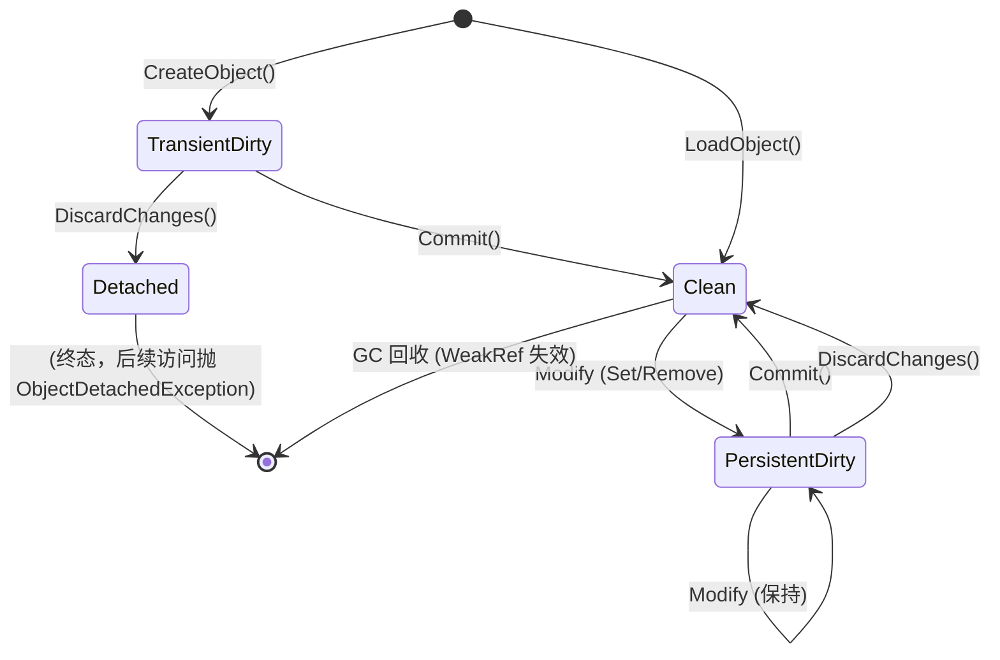
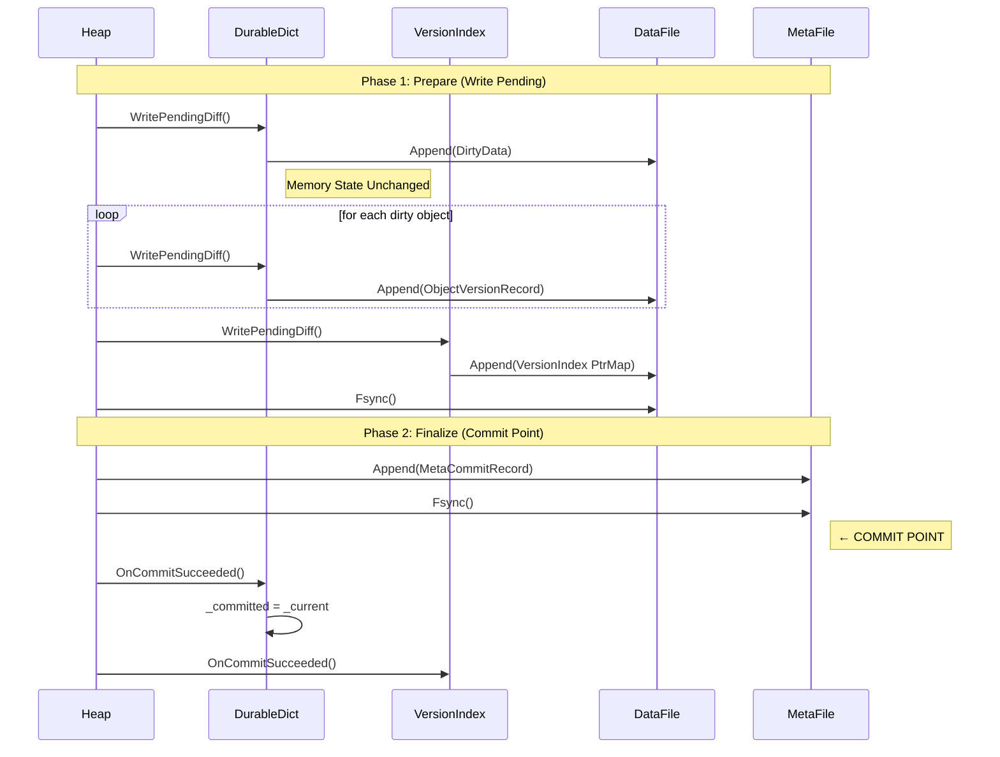

# StateJournal MVP 设计 v3（Working Draft）

> **版本**：v3.9 (2025-12-28)
> **状态**：Draft

## 文档层次与依赖

本文档是 StateJournal 的 **Layer 1 设计规范**，专注于：
- Record 语义（ObjectVersionRecord, MetaCommitRecord）
- 对象模型（ObjectId, TypeId, Version）
- Two-phase commit 与恢复语义

**依赖文档**：
- [rbf-interface.md](rbf-interface.md) — RBF 层接口契约（**必读**）
- [rbf-format.md](rbf-format.md) — RBF 二进制格式规范（可选深入）

**不包含**（已提取到 rbf-format.md）：
- Frame 二进制格式（HeadLen/TailLen/FrameStatus/CRC32C/Fence）
- Genesis Header 结构
- 逆向扫描算法
- Resync 机制

---

> 日期：2025-12-18（术语修订：2025-12-19；畅谈会修订：2025-12-20；一致性审阅修订：2025-12-20；最终审阅修订：2025-12-20；**FrameTag 位段编码：2025-12-24**）
>
> 目标：围绕"稳定 ObjectId + 变化 ObjectVersion + VersionIndex"的路线，形成可开工的 MVP 规格。
>
> 设计要点：In-place API 体验、引用指向 ObjectId（非 version）、Shallow Materialization、ChangeSet 增量跟踪。详见术语表。

---

## 规范语言

> 本文档遵循 [Atelia 规范约定](../spec-conventions.md)。
> 关键词 MUST, SHOULD, MAY 的定义见该文档。

---

## 术语表（Glossary）

> 本术语表依据 2025-12-19 畅谈会共识制定，作为全文术语的规范化参照（SSOT）。

### 状态与差分

| 术语 | 定义 | 实现映射 |
|------|------|---------|
| **Working State** | 当前进程内对外可读、可枚举的对象语义状态 | `_current` |
| **Committed State** | 上次成功 Commit 后的对象语义状态快照 | `_committed` |
| **ChangeSet** | 自上次 Commit 以来的累积变更（逻辑概念，可为隐式） | 双字典策略: `ComputeDiff()` + `_dirtyKeys` |
| **DiffPayload** | ChangeSet 的二进制编码形式 | ObjectVersionRecord 字段 |

### 版本链

| 术语 | 定义 | 实现映射 |
|------|------|---------|
| **Version Chain** | 由 PrevVersionPtr 串起的版本记录链 | `PrevVersionPtr` 字段 |
| **Base Version** | `PrevVersionPtr=0` 的版本记录（上位术语），表示版本链起点 | `PrevVersionPtr=0` |
| **Genesis Base** | 新建对象的首个版本（Base Version），表示"从空开始" | 首版本 `PrevVersionPtr=0` |
| **Checkpoint Base** | 为截断回放成本而写入的全量状态版本（Base Version） | 周期性 `PrevVersionPtr=0` |
| **from-empty diff** | Genesis Base 的 DiffPayload 语义：所有 key-value 都是 Upserts | 新建对象首版本的 payload |
| **VersionIndex** | 每个 Epoch 的 ObjectId → ObjectVersionPtr 映射表。详见 §3.2.4 | `Dictionary<ObjectId, Ptr64>` |

### 标识与指针

| 术语 | 定义 | 实现映射 |
|------|------|---------|
| **ObjectId** | 对象的稳定身份。参见 **Well-Known ObjectId** 条目了解保留区规则 | `uint64` / `varuint` |
| **Ptr64** / **<deleted-place-holder>** | 8 字节文件偏移量。详见 [rbf-interface.md](rbf-interface.md) §2.2 | `ulong` |
| **ObjectVersionPtr** | 指向对象版本记录的 <deleted-place-holder> | `Ptr64` 编码值 |
| **EpochSeq** | Commit 的单调递增序号，用于判定 HEAD 新旧 | `varuint` |

### 提交与 HEAD

| 术语 | 定义 | 实现映射 |
|------|------|---------|
| **Commit** | Heap 级 API，对外可见的版本点（事务边界） | data → meta 刷盘 |
| **Commit Point** | 对外可见的版本持久化边界；在 meta file 方案中，等于 `MetaCommitRecord` 成功落盘的时刻 | meta fsync 完成 |
| **HEAD** | 最后一条有效 Commit Record | `MetaCommitRecord` |
| **Commit Record** | 物理上承载 Commit 的元数据记录 | `MetaCommitRecord` |

### 载入与缓存

| 术语 | 定义 | 实现映射 |
|------|------|---------|
| **Shallow Materialization** | Materialize 只构建当前对象的 Committed State，不递归加载引用对象。详见 §3.1.0 | §3.1.0 阶段定义、§3.1.3 引用与级联 |
| **Identity Map** | ObjectId → instance 去重缓存，保证同一 ObjectId 在存活期间只对应一个内存对象实例 | `WeakReference` 映射 |
| **Dirty Set** | Workspace 级别的 dirty 对象**强引用**集合，持有所有具有未提交修改的对象实例，防止 dirty 对象被 GC 回收导致修改丢失 | `Dictionary<ObjectId, IDurableObject>` |
| **Dirty-Key Set** | 对象内部追踪已变更 key 的集合（用于 DurableDict 等容器对象） | `_dirtyKeys: ISet<ulong>` |
| **LoadObject** | 按 HEAD 取版本指针并 materialize，返回 `AteliaResult<IDurableObject>`。详见 §3.3.2 和 `[A-LOADOBJECT-RETURN-RESULT]` | identity map → lookup → materialize |

### 编码层

| 术语 | 定义 | 实现映射 |
|------|------|---------|
| **FrameTag** | RBF Frame 的顶层类型标识（位于 HeadLen 之后），是 StateJournal Record 的**唯一判别器**。采用 4 字节整数，16/16 位段编码：低 16 位为 RecordType，高 16 位为 SubType（当 RecordType=ObjectVersion 时解释为 ObjectKind）。详见 [rbf-interface.md](rbf-interface.md) `[F-FRAMETAG-DEFINITION]` 和本文档 `[F-FRAMETAG-STATEJOURNAL-BITLAYOUT]` | `uint`（4 字节）|
| **RecordType** | FrameTag 低 16 位，区分 Record 顶层类型（ObjectVersionRecord / MetaCommitRecord） | `ushort` |
| **ObjectKind** | 当 RecordType=ObjectVersion 时，FrameTag 高 16 位的语义，决定 diff 解码器 | `ushort` 枚举 |
| **ValueType** | Dict DiffPayload 中的值类型标识 | `byte` 低 4 bit |

### 对象基类

| 术语 | 定义 | 实现映射 |
|------|------|----------|
| **DurableObject** | 可持久化的对象基类/接口，所有可被 StateJournal 管理的对象必须实现 | `IDurableObject` 接口 |

### 对象级 API（二阶段提交）

| 术语 | 定义 | 实现映射 |
|------|------|----------|
| **WritePendingDiff** | Prepare 阶段：计算 diff 并序列化到 writer；不更新内存状态 | `DurableDict.WritePendingDiff(writer)` |
| **OnCommitSucceeded** | Finalize 阶段：追平内存状态（`_committed = _current`，`_dirtyKeys.Clear()`） | `DurableDict.OnCommitSucceeded()` |

### Well-Known ObjectId（保留区）

> **[S-OBJECTID-RESERVED-RANGE]** 规范条款定义了 ObjectId 保留区的 MUST 约束。本节为 SSOT（单一真相来源）。

| ObjectId 范围 | 用途 | 状态 |
|---------------|------|------|
| `0` | **VersionIndex** — 系统级索引对象，指针直接存储在 MetaCommitRecord 中 | MVP 固定 |
| `1..15` | 保留给未来 Well-Known 对象（如 StringPool、SchemaRegistry 等） | Reserved |
| `16..` | 用户对象分配区（`NextObjectId` 初始值为 `16`） | 可分配 |

**关键约束**：
- Allocator MUST NOT 分配 `ObjectId` in `0..15`（参见 [S-OBJECTID-RESERVED-RANGE]）
- Reader 遇到保留区 ObjectId 且不理解其语义时，MUST 视为格式错误（fail-fast）

### 命名约定

1. **概念术语**：统一 Title Case，全文一致
2. **实现标识符**：仅在 Implementation Mapping 出现，用代码格式
3. **缩写大写**：`HEAD`、`CRC32C` 全文同形
4. **Ptr64 / <deleted-place-holder>**：详见 [rbf-interface.md](rbf-interface.md) §2.2

### 枚举值速查表

> 以下枚举值定义集中于此，便于实现者查阅。详细语义参见对应章节。

#### FrameTag 位段编码（§3.2.1, §3.2.2, §3.2.5）

**`[F-FRAMETAG-STATEJOURNAL-BITLAYOUT]`** FrameTag 是一个 `uint`（4 字节整数），StateJournal MUST 按以下位段解释：

| 位范围 | 字段名 | 类型 | 语义 |
|--------|--------|------|------|
| 31..16 | SubType | `u16` | 当 RecordType=ObjectVersion 时解释为 ObjectKind |
| 15..0 | RecordType | `u16` | Record 顶层类型（ObjectVersion / MetaCommit） |

> **端序**：Little-Endian (LE)，即低位字节在前（字节 0-1 = RecordType，字节 2-3 = SubType）。

##### Packing/Unpacking 逻辑

应用层将 FrameTag（`uint`）解释为两个独立枚举：

- **Unpacking（解包）**：从 `uint` 提取 `RecordType`（低 16 位）和 `SubType`（高 16 位）
  - `RecordType = (ushort)(frameTag & 0xFFFF)`
  - `SubType = (ushort)(frameTag >> 16)`
- **Interpretation（解释）**：`RecordType` 决定如何解释 `SubType`
  - 当 `RecordType == ObjectVersion` 时，`SubType` 解释为 `ObjectKind`
  - 当 `RecordType != ObjectVersion` 时，`SubType` MUST 为 0（参见 `[F-FRAMETAG-SUBTYPE-ZERO-WHEN-NOT-OBJVER]`）
- **Packing（打包）**：从两个枚举组合回 `uint`
  - `frameTag = ((uint)subType << 16) | (uint)recordType`

##### RecordType（低 16 位）

| 值 | 名称 | 说明 |
|------|------|------|
| `0x0000` | Reserved | 保留，MUST NOT 使用 |
| `0x0001` | ObjectVersionRecord | 对象版本记录（data payload）|
| `0x0002` | MetaCommitRecord | 提交元数据记录（meta payload）|
| `0x0003..0x7FFF` | — | 未来标准扩展 |
| `0x8000..0xFFFF` | — | 实验/私有扩展 |

##### SubType（高 16 位）

**`[F-FRAMETAG-SUBTYPE-ZERO-WHEN-NOT-OBJVER]`** 当 `RecordType != ObjectVersionRecord` 时，`SubType` MUST 为 `0x0000`；Reader 遇到非零 SubType MUST 视为格式错误。

**`[F-OBJVER-OBJECTKIND-FROM-TAG]`** 当 `RecordType == ObjectVersionRecord` 时，`SubType` MUST 解释为 `ObjectKind`，Payload 内 MUST NOT 再包含 ObjectKind 字节。

##### FrameTag 完整取值表（MVP）

| FrameTag 值 | RecordType | ObjectKind | 说明 | 字节序列（LE）|
|-------------|------------|------------|------|---------------|
| `0x00010001` | ObjectVersion | Dict | DurableDict 版本记录 | `01 00 01 00` |
| `0x00020001` | ObjectVersion | Array | DurableArray 版本记录（未来）| `01 00 02 00` |
| `0x00000002` | MetaCommit | — | 提交元数据记录 | `02 00 00 00` |

> **FrameTag 是唯一判别器**：StateJournal 通过 `FrameTag`（独立 4B 字段）区分 Record 类型和对象类型。详见 [rbf-format.md](rbf-format.md) `[F-FRAMETAG-WIRE-ENCODING]`。
> 
> **`[S-STATEJOURNAL-TOMBSTONE-SKIP]`** 墓碑帧通过 `FrameStatus.Tombstone` 标识，与 FrameTag 无关。StateJournal Reader MUST 先检查 `FrameStatus`，遇到 `Tombstone` 状态 MUST 跳过该帧，再解释 `FrameTag`。
>
> **`[F-UNKNOWN-FRAMETAG-REJECT]`** Reader 遇到未知 RecordType MUST fail-fast（不得静默跳过）。

#### ObjectKind（FrameTag SubType，当 RecordType=ObjectVersion）

> ObjectKind 现在编码在 FrameTag 高 16 位，扩展为 `u16`。

| 值 | 名称 | 说明 |
|------|------|------|
| `0x0000` | Reserved | 保留，MUST NOT 使用 |
| `0x0001` | Dict | DurableDict（MVP 唯一实现） |
| `0x0002..0x007F` | Standard | 标准类型（未来扩展） |
| `0x0080..0x00FF` | Variant | 版本变体（如 `DictV2`），兼容原 byte 约定 |
| `0x0100..0x7FFF` | Extended | 扩展标准类型 |
| `0x8000..0xFFFF` | Experimental | 实验/私有类型 |

**`[F-UNKNOWN-OBJECTKIND-REJECT]`** 当 `RecordType == ObjectVersionRecord` 时，Reader 遇到未知 `ObjectKind` MUST fail-fast（不得静默跳过）。

#### ValueType（§3.4.2，低 4 bit）

| 值 | 名称 | Payload |
|------|------|---------|
| `0x0` | Val_Null | 无 |
| `0x1` | Val_Tombstone | 无（表示删除） |
| `0x2` | Val_ObjRef | `ObjectId`（varuint） |
| `0x3` | Val_VarInt | `varint`（ZigZag） |
| `0x4` | Val_Ptr64 | `u64 LE` |

---

## 1. MVP 目标与非目标

MVP 目标：
- 崩溃可恢复（crash-safe）：commit 的“可见点”清晰且可验证。
- 基本对象图（含引用）可读可写，可多次 commit 形成 epoch 序列。
- 读路径能够在“加载时 materialize 最新状态”。
- 写路径能够从 ChangeSet 生成增量版本，避免全量重写。

MVP 非目标（默认不做，后续版本再议）：
- 对象回收/GC/Compaction。
- 高并发事务、读写隔离、多 writer。
- 跨文件/分段映射的大规模数据集。

> 澄清：本文后续提到的 "Checkpoint Base"（写入 `PrevVersionPtr=0` 的全量 state 版本）不属于上述非目标中的 GC/Compaction（它不回收空间、不搬迁旧记录）。

---

## 2. 设计决策 (Chosen Decisions Index)

> **完整决策记录**：决策选项（单选题）与决策表已移至 [decisions/mvp-v2-decisions.md](decisions/mvp-v2-decisions.md)。本文档落实了其中的所有关键决策。

---

## 3. 设计正文

本节基于第 2 节决策索引及 [完整决策记录](decisions/mvp-v2-decisions.md) 写成“可开工规格”。如与实现细节冲突，以本节为准。

### 3.1 概念模型

#### 3.1.0 术语与读取阶段（MVP 固定）

为避免“materialize/deserialize/resolve”混用，本 MVP 将一次读取/加载拆成四个概念阶段：

1) **Deserialize（解码）**：从文件读取 bytes，并按 framing + varint 规则解码为内存中的“版本记录/差量操作”的中间表示（例如：一段 dict diff 的 pairs）。
	- 输入：`ObjectVersionPtr`（或其对应的 record bytes）。
	- 输出：一组按 `PrevVersionPtr` 串联的版本中间表示（Checkpoint Base + overlay diffs）。
	- 说明：此阶段只负责“读懂字节码”，不创建可对外使用的 durable object，也不做引用对象的创建。

2) **Materialize（合成状态）**：将 Checkpoint Base 状态与若干 overlay diff 合并为当前可读的 **Committed State**。
	- 输入：版本链的中间表示。
	- 输出：一个内存对象的 Committed State（例如一个内存 dict）。
	- 说明：**Materialize is shallow**（MVP 固定，参见术语表 **Shallow Materialization**）——只合成"本对象自身"的状态；遇到 `Val_ObjRef(ObjectId)` 时只保留 `ObjectId`，不创建/加载被引用对象。

3) **LoadObject（加载对象 / Lazy 创建对象）**：在 workspace 语义下，用 `ObjectId` 获取（或创建）对应的内存 durable object。
	- LoadObject 的完整流程 = 查 Identity Map →（miss 时）按 HEAD 从 VersionIndex 找 `ObjectVersionPtr` → Deserialize → Materialize → 创建内存对象并挂接 ChangeSet → 放入 Identity Map。
	- 说明：LoadObject 发生在"需要一个对象实例"时；它不是版本链合成本身。
	- 备注：内部仍可使用 `Resolve` 描述"解析版本指针"的子步骤。

4) **ChangeSet（写入跟踪 / Write-Tracking）**：为 in-place 可写 API 记录未提交的变更。
	- Committed State（materialize 的结果）作为读取基底；ChangeSet 只记录"自上次 commit 后的修改"。
	- MVP 对外只提供带 ChangeSet 的可变对象视图；未来如需只读快照视图，可在不改变磁盘格式的前提下引入无 ChangeSet 的只读对象。
	- 说明：ChangeSet 可为隐式（如双字典策略的 Write-Tracking 机制），不要求显式的数据结构。

#### 3.1.0.1 对象状态管理（Object Lifecycle）

为明确 Identity Map 与 Dirty Set 的生命周期，本节定义对象的状态转换规则（MVP 固定）：

**对象状态**：
- **Clean**：对象已加载，`HasChanges == false`，仅存在于 Identity Map（WeakReference）
- **Dirty**：对象有未提交修改，`HasChanges == true`，同时存在于 Identity Map 和 Dirty Set

**状态转换规则**（完整）：

| 事件 | 转换 | Identity Map | Dirty Set | 备注 |
|------|------|--------------|-----------|------|
| `CreateObject<T>()` 新建 | → TransientDirty | 加入（WeakRef） | 加入（强引用） | 新建对象从未有 Committed 版本 |
| `LoadObject` 首次加载 | → Clean | 加入（WeakRef） | 不加入 | 从磁盘加载已提交对象 |
| 首次写入（Set/Remove） | Clean → PersistentDirty | 保持 | 加入（强引用） | 修改已提交对象 |
| 继续写入 | PersistentDirty → PersistentDirty | 保持 | 保持 | 状态不变 |
| `Commit` 成功 | *Dirty → Clean | 保持 | 移除 | TransientDirty 或 PersistentDirty 均变为 Clean |
| `DiscardChanges`（PersistentDirty） | PersistentDirty → Clean | 保持 | 移除 | 重置为 `_committed` 状态 |
| `DiscardChanges`（TransientDirty） | TransientDirty → Detached | 移除 | 移除 | 参见 [S-TRANSIENT-DISCARD-DETACH] |
| GC 回收 | Clean → 移除 | 自动清理（WeakRef 失效） | N/A | 仅 Clean 对象可能被 GC |
| Commit 前 Crash（TransientDirty） | 对象丢失 | N/A | N/A | 符合预期——从未 Commit |
| Commit 前 Crash（PersistentDirty） | 回滚到 Committed | — | — | 自动恢复到上次提交状态 |

> **脚注**：
> - 表中未列出的事件（如 Commit 失败）不引起状态转换——对象保持原状态
> - `*Dirty` 表示 TransientDirty 或 PersistentDirty
> - Detached 是终态，后续访问抛 `ObjectDetachedException`

**对象状态枚举（建议 API）**：

为避免使用多个 `bool` 属性（如 `IsDetached`、`IsDirty`、`IsTransient`），建议 `IDurableObject` 暴露单一状态枚举：

```csharp
public enum DurableObjectState
{
    Clean,            // 已加载，无未提交修改
    PersistentDirty,  // 有未提交修改，已有 Committed 版本（Crash 后回滚到 Committed）
    TransientDirty,   // 新建对象，尚未有 Committed 版本（Crash 后对象丢失）
    Detached          // 已分离（终态，访问抛 ObjectDetachedException）
}

// IDurableObject 属性
DurableObjectState State { get; }
```

**对象状态 API 条款（MUST）**：

- **[A-OBJECT-STATE-PROPERTY]**：`IDurableObject` MUST 暴露 `State` 属性，返回 `DurableObjectState` 枚举；读取 MUST NOT 抛异常（含 Detached 状态）；复杂度 MUST 为 O(1)
- **[A-OBJECT-STATE-CLOSED-SET]**：`DurableObjectState` MUST 仅包含 `Clean`, `PersistentDirty`, `TransientDirty`, `Detached` 四个值
- **[A-HASCHANGES-O1-COMPLEXITY]**：`HasChanges` 属性 MUST 存在且复杂度为 O(1)
- **[S-STATE-TRANSITION-MATRIX]**：对象状态转换 MUST 遵循状态转换矩阵（参见上方状态转换规则表格）

**关键约束（MUST）**：
- **[S-DIRTYSET-OBJECT-PINNING]** Dirty Set MUST 持有对象实例的强引用，直到该对象的变更被 Commit Point 确认成功或被显式 `DiscardChanges`
- **[S-IDENTITY-MAP-KEY-COHERENCE]** Identity Map 与 Dirty Set 的 key 必须等于对象自身 `ObjectId`
- **[S-DIRTY-OBJECT-GC-PROHIBIT]** Dirty 对象不得被 GC 回收（由 Dirty Set 的强引用保证）
- **[S-NEW-OBJECT-AUTO-DIRTY]** 新建对象 MUST 在创建时立即加入 Dirty Set（强引用），以防止在首次 Commit 前被 GC 回收

**状态机可视化**：



> **⚠️ 僵尸对象警告 (Zombie Object Warning)**：
> 对 Transient Dirty 对象调用 `DiscardChanges()` 后，该对象变为 **Detached** 状态。
> 此时对象实例仍存在于调用方的变量中，但任何访问都会抛出 `ObjectDetachedException`。
> 
> **风险**：Detached 对象的 `ObjectId` 可能在后续 `CreateObject()` 时被重新分配给新对象。
> 调用方应避免在 Discard 后仍持有对 Transient 对象的引用。
> 
> **建议**：使用 `State` 属性（`DurableObjectState` 枚举）判断对象是否可用，而非捕获异常。

**DiscardChanges 行为（MVP 固定）**：
- 对 **Persistent Dirty** 对象：重置为 `_committed` 状态，从 Dirty Set 移除，对象变为 Clean。
- 对 **Transient Dirty** 对象：**Detach（分离）**。即从 Dirty Set 和 Identity Map 中移除，后续**语义数据访问** MUST 抛出 `ObjectDetachedException`。

> **[S-TRANSIENT-DISCARD-DETACH] Transient Dirty 对象的 DiscardChanges 行为（MUST）**：
> - 对 Transient Dirty 对象调用 `DiscardChanges()` 后：
>   - 对象 MUST 从 Dirty Set 移除
>   - 对象 MUST 从 Identity Map 移除
>   - 后续**语义数据访问** MUST 抛出 `ObjectDetachedException`
> - 异常消息 SHOULD 提供恢复指引，例如："Object was never committed. Call CreateObject() to create a new object."
>
> **[S-DETACHED-ACCESS-TIERING] Detached 对象的访问分层（MUST）**：
> 
> 为避免条款冲突（`State` 属性 MUST NOT throw vs "任何访问 MUST throw"），将访问分为两层：
> 
> | 访问类型 | 示例 API | Detached 行为 |
> |----------|----------|---------------|
> | **元信息访问** | `State`, `Id`, `ObjectId` | MUST NOT throw（O(1) 复杂度） |
> | **语义数据访问** | `TryGetValue`, `Set`, `Remove`, `Count`, `Enumerate`, `HasChanges` | MUST throw `ObjectDetachedException` |
> 
> **设计理由**：元信息访问用于"先检查再操作"模式（Look-before-you-leap），避免 try-catch 的性能开销和代码污染。
>
> **ObjectId 回收语义（MVP 固定）**：
> - **[S-TRANSIENT-DISCARD-OBJECTID-QUARANTINE]**：Detached 对象的 ObjectId 在同一进程生命周期内 MUST NOT 被重新分配；进程重启后 MAY 重用（因为 Transient 对象从未进入 VersionIndex，其 ObjectId 未被 `NextObjectId` 持久化）

> **[S-NEW-OBJECT-AUTO-DIRTY]** **关键约束（MUST）**：新建对象 MUST 在创建时立即加入 Dirty Set（强引用），以防止在首次 Commit 前被 GC 回收。

#### 3.1.1 三个核心标识

- **ObjectId (`uint64`)**：对象的稳定身份。文件中任何“对象引用”仅存储 `ObjectId`。
- **ObjectVersionPtr (<deleted-place-holder>)**：对象某个版本在文件中的位置指针（指向一条 ObjectVersionRecord）。定义遵循 [rbf-interface.md](rbf-interface.md) 的 <deleted-place-holder>。
- **EpochSeq（`varuint`）**：epoch 的单调递增序号；在 meta file 方案下，它就是 MVP 的 epoch 身份与新旧判定依据。

ObjectId 分配（第二批决策补充）：

- ObjectId 采用**单调递增计数器**分配，避免碰撞处理。
- 为保证崩溃恢复与跨进程一致性，`NextObjectId`（下一个可分配 id）在 meta commit record 中持久化。

> **[S-OBJECTID-MONOTONIC-BOUNDARY] ObjectId 单调性边界（MUST）**：
> - ObjectId 对"已提交对象集合"MUST 单调递增（即：已提交的 ObjectId 不会被重新分配）
> - 对"进程内未提交分配"不保证跨崩溃单调性——允许未提交的 ObjectId 在崩溃后被重用
> - 唯一性保证：任意时刻同一 workspace 内，MUST NOT 出现两个存活对象共享同一 ObjectId
>
> **设计理由**：`NextObjectId` 仅在 Commit Point 持久化。若进程分配了一批 ObjectId 但在 commit 前崩溃，重启后 allocator 从 HEAD 的 `NextObjectId` 恢复，这些未提交的 ID 会被"重用"。这不违反"稳定身份"语义，因为这些对象从未进入 VersionIndex / HEAD，从未对外存在。

> **[S-CREATEOBJECT-IMMEDIATE-ALLOC] CreateObject 分配行为（MUST）**：
> - `CreateObject<T>()` MUST 立即分配 ObjectId（从 `NextObjectId` 计数器获取并递增）
> - 分配后 MUST 将对象加入 Identity Map（WeakRef）与 Dirty Set（强引用）
> - 对象的 `Id` 属性在创建后 MUST 立即可用，不依赖于后续的 Commit 操作
>
> **设计理由**：立即分配支持自然的"Create → Link → Commit"事务流程，避免引入"临时引用"的概念复杂度。

> 备注：在 meta file 方案下，HEAD 由最后一条 `MetaCommitRecord` 给出；superblock 相关表述仅适用于备选方案。

#### 3.1.2 LoadObject 语义的精确定义

MVP 将一次进程内的 `StateJournal` 视为唯一的 **workspace（Git working tree 类比）**：

- **HEAD 的定义**：通过 meta 文件尾部回扫得到最后一条有效 `MetaCommitRecord`；该记录就是 `HEAD`。
- **第一次 LoadObject 某个 ObjectId**：按 `HEAD` 指定的 `VersionIndexPtr` 解析 `ObjectId -> ObjectVersionPtr`，再对版本链做 Deserialize + Materialize，成功则返回 `AteliaResult.Success(带 ChangeSet 的内存对象)`；若对象不存在则返回 `AteliaResult.Failure`。
- **Identity Map**：用于在对象仍存活期间去重（`ObjectId -> WeakReference<DurableObject>`）。
- **已 materialize 的对象不会因为 `HEAD` 变化而被自动 refresh/rollback**：它就是 workspace 中那份对象（类似 working tree 上的未提交修改不会被 `HEAD` 自动覆盖）。

其可观察效果是：

- 对尚未 materialize 的对象：LoadObject 总是按当前 `HEAD` 解析并 materialize（成功返回 Success，失败返回 Failure）。
- 对已 materialize 的对象：LoadObject 固定返回 `AteliaResult.Success(同一内存实例)`，不从磁盘覆盖 Working State（`_current`）。

MVP 限制（保证语义自洽）：

- **单进程单 writer**（MVP 不考虑外部进程更新文件后本进程自动感知）。
- MVP 不提供"打开旧 epoch 快照 / checkout 旧 HEAD"的 API；后续版本可引入 readonly session（类似 `git checkout <commit>` 的只读视图）。

#### 3.1.2.1 Workspace 绑定机制（增补）

> **前置文档**：详细设计见 [workspace-binding-spec.md](workspace-binding-spec.md)

**[S-WORKSPACE-OWNING-EXACTLY-ONE]（MUST）**

每个对外可见的 `IDurableObject` 实例 MUST 绑定到且仅绑定到一个 Workspace（*Owning Workspace*）。

**[S-WORKSPACE-OWNING-IMMUTABLE]（MUST）**

Owning Workspace 在对象生命周期内 MUST NOT 改变。

**[S-WORKSPACE-CTOR-REQUIRES-WORKSPACE]（MUST）**

`DurableObjectBase` 的构造函数 MUST 接收 `Workspace` 参数：
- 参数为 `null` 时 MUST 抛出 `ArgumentNullException`
- 构造函数 SHOULD 为 `internal` 或 `protected internal`，禁止用户直接调用

**[S-LAZYLOAD-DISPATCH-BY-OWNER]（MUST）**

当触发透明 Lazy Load（`[A-OBJREF-TRANSPARENT-LAZY-LOAD]`）时，MUST 使用对象的 Owning Workspace 调用 `LoadObject`，MUST NOT 使用调用点的 Ambient Workspace。

**[A-WORKSPACE-FACTORY-CREATE]（MUST）**

`Workspace.CreateObject<T>()` MUST：
1. 分配 ObjectId
2. 创建对象实例并传入 `this`（Workspace）
3. 注册到 Identity Map 和 Dirty Set
4. 返回对象实例

**[A-WORKSPACE-FACTORY-LOAD]（MUST）**

`Workspace.LoadObject<T>(ObjectId)` MUST：
1. 先查 Identity Map
2. 未命中则从磁盘 Materialize
3. 创建对象实例并传入 `this`（Workspace）
4. 注册到 Identity Map
5. 返回 `AteliaResult<T>`

**[A-WORKSPACE-AMBIENT-OPTIONAL]（MAY）**

实现 MAY 提供 `StateJournalContext.Current` 和 `WorkspaceScope` 作为便利层，但核心 API MUST NOT 依赖 Ambient Context。

#### 3.1.3 引用与级联 materialize

- 任何对象属性/容器 value 若为"对象引用"，其序列化只写 `ObjectId`。
- materialize 一个对象时，不会递归 materialize 其引用对象。
- **进程内对象实例表示（MVP 固定）**：对 `Val_ObjRef(ObjectId)`，materialize 的 Committed State（`_committed`）中只存 `ObjectId`（而不是 `DurableObject` 实例）。

**Lazy Loading 透明性（MVP 固定）**：

为解决"读写类型不对称"问题（Set 存对象实例，Materialize 恢复 ObjectId），DurableDict 的读取 API MUST 实现透明 Lazy Loading：

- **[A-OBJREF-TRANSPARENT-LAZY-LOAD]**：当 `TryGetValue`/索引器/枚举读取 value 且内部存储为 `ObjectId` 时，MUST 自动调用 `LoadObject(ObjectId)` 并返回 `IDurableObject` 实例。
- **[A-OBJREF-BACKFILL-CURRENT]**：Lazy Load 成功后，SHOULD 将实例回填到 `_current`（替换 `ObjectId`），避免重复触发 LoadObject。回填不改变 dirty 状态（因为语义值未变）。
- **Lazy Load 触发 API**：`TryGetValue(key)`, `this[key]`（索引器）, `Enumerate()`——任何返回 value 的读取 API。
- **返回值类型一致性**：无论对象是刚创建（内存中存 instance）还是从磁盘加载（内存中存 ObjectId），读取 API 返回的都是 `IDurableObject` 实例。

> **设计理由**：保证 API 契约的一致性——用户永远不会看到 `ObjectId` 作为 value（除非显式请求），避免重启前后行为分歧导致的 `InvalidCastException`。

**LazyRef<T> 封装（建议实现）**：

建议实现一个可复用的 `LazyRef<T>` 类型封装 Lazy Load 逻辑，因为 `DurableArray` 等后续容器类型也需要相同机制：

```csharp
// 示意性伪代码
internal struct LazyRef<T> where T : IDurableObject
{
    private object _storage;  // ObjectId 或 T 实例
    private readonly IWorkspace _workspace;
    
    public T Value => _storage switch
    {
        T instance => instance,
        ObjectId id => LoadAndCache(id),
        _ => throw new InvalidOperationException()
    };
    
    private T LoadAndCache(ObjectId id)
    {
        var result = _workspace.LoadObject<T>(id);
        if (result.IsFailure)
        {
            // Lazy Load 失败：引用的对象不存在或已损坏
            throw new InvalidOperationException(
                $"Failed to load referenced object {id}: {result.Error!.Message}");
        }
        _storage = result.Value;  // 回填
        return result.Value;
    }
}
```


#### 3.1.4 类型约束（Type Constraints）

StateJournal **不是通用序列化库**，而是有明确类型边界的持久化框架。

**支持的类型（MVP）**：

| 类别 | MVP 支持 | MVP 不支持 |
|------|----------|------------|
| **值类型** | `null`, `varint`（有符号整数：`int`, `long`）, `ObjRef(ObjectId)`, `Ptr64` | `ulong`（作为独立值类型）, `float`, `double`, `bool`, 任意 struct、用户自定义值类型 |
| **引用类型** | `DurableObject` 派生类型（内置集合：`DurableDict`；未来：`DurableArray`） | 任意 class、`List<T>`、`Dictionary<K,V>` 等 |

> **MVP 限制说明**：`float`, `double`, `bool` 类型将在后续版本支持，不属于 MVP 范围。
>
> **ulong 说明**：`ulong` 仅用于 `ObjectId`/`Ptr64`/Dict Key 等结构字段（有专门的编码类型），不作为用户可写入的独立值类型。若需存储无符号 64-bit 整数业务值，可使用 `long` 并通过 `unchecked` 转换（位模式保持）。

**运行时行为**：
- 赋值不支持的类型时，应抛出明确异常（Fail-fast）
- 这确保了所有持久化对象的变更追踪是完整的——不存在"修改了但追踪不到"的情况

#### 3.1.5 DurableDict 定位与演进路线（MVP 固定）

`DurableDict` 是 StateJournal 的**底层索引原语（Low-level Indexing Primitive）**，不是通用数据容器。

**MVP 约束**：
- Key 固定为 `ulong`，适用于：
  - 内部索引（VersionIndex、ObjectId 映射）
  - 用户使用 `enum` 作为逻辑键（enum 值即 `ulong`）
- 不支持 `string` 等语义化 Key

**演进路线（Post-MVP）**：
- 引入 **String Pool**：字符串存储在 pool 中，返回 `ulong` 池 ID
- 引入新的 Dict 类型（如 `DurableStringDict`）：Key 为 `string`，底层存储池 ID
- `DurableDict`（`ulong` key）仍保留并对外暴露，用于高性能场景

> **设计意图**：MVP 优先完成核心持久化机制，扩展支持更多数据类型安排在下一阶段。
> 语义化存储（JSON-like 结构）将通过 String Pool + 新容器类型实现，而非修改 `DurableDict` 本身。

### 3.2 磁盘布局（append-only）

本 MVP 采用 append-only 的 record log（长度可跳过 + CRC32C + 4B 对齐）。

#### 3.2.0 变长编码（varint）决策

本 MVP 允许在对象/映射的 payload 层使用 varint（ULEB128 风格或等价编码），主要目的：降低序列化尺寸，且与"对象字段一次性 materialize"模式相匹配。

MVP 固定：

- 除 `Ptr64/Len/CRC32C` 等"硬定长字段"外，其余整数均可采用 varint。
- `ObjectId`：varint。
- `Count/PairCount` 等计数：varint。
- **[S-DURABLEDICT-KEY-ULONG-ONLY]** `DurableDict` 的 key：`ulong`，采用 `varuint`。


#### 3.2.0.1 varint 的精确定义

为避免实现分歧，本 MVP 固化 varint 语义为"protobuf 风格 base-128 varint"（ULEB128 等价），并要求 **[F-VARINT-CANONICAL-ENCODING]** **canonical 最短编码**：

- `varuint`：无符号 base-128，每个字节低 7 bit 为数据，高 1 bit 为 continuation（1 表示后续还有字节）。`uint64` 最多 10 字节。
- `varint`：有符号整数采用 ZigZag 映射后按 `varuint` 编码。
	- ZigZag64：`zz = (n << 1) ^ (n >> 63)`；ZigZag32：`zz = (n << 1) ^ (n >> 31)`。
- **[F-DECODE-ERROR-FAILFAST]** 解码错误策略（MVP 固定）：遇到 EOF、溢出（超过允许的最大字节数或移位溢出）、或非 canonical（例如存在多余的 0 continuation 字节）一律视为格式错误并失败。

**(Informative / Illustration)** 以下 ASCII 图示仅供教学参考，SSOT 为上述文字描述和公式。

```text
VarInt Encoding (Base-128, MSB continuation)
=============================================

值 300 = 0x12C = 0b1_0010_1100
编码：  [1010_1100] [0000_0010]
         └─ 0xAC     └─ 0x02
         (cont=1)    (cont=0, end)

解码：(0x2C) | (0x02 << 7) = 44 + 256 = 300

边界示例：
  值 127 → [0111_1111]          (1 byte, 最大单字节)
  值 128 → [1000_0000 0000_0001] (2 bytes)
  值 0   → [0000_0000]          (1 byte, canonical)
```

#### 3.2.1 Data 文件（data file）

data 文件只承载对象与映射等 durable records（append-only），不承载 HEAD 指针。

I/O 目标（MVP）：

- **随机读（random read）**：读取某个 Ptr64 指向的 record（用于 LoadObject/version replay）。
- **追加写（append-only write）**：commit 时追加写入新 records。
- **可截断（truncate）**：恢复时按 `DataTail` 截断尾部垃圾。

因此：mmap 不是 MVP 依赖；实现上使用 `FileStream` + `ReadAt/WriteAt/Append` 即可。

实现约束（避免实现分叉）：

- MVP 的唯一推荐实现底座是 `FileStream`（或等价的基于 fd 的 `pread/pwrite` 随机读写 + append）。
- `mmap` 仅作为后续性能优化的备选实现，不进入 MVP 规格与测试基线。
- MVP 不依赖稀疏文件/预分配（例如 `SetLength` 预扩）；文件“有效末尾”以 meta 的 `DataTail`（逻辑尾部）为准。

> **帧格式**：Frame 结构（HeadLen/TailLen/Pad/CRC32C/Magic）、逆向扫描算法、Resync 机制详见 [rbf-format.md](rbf-format.md)。

##### DataRecord 类型判别

> FrameTag 与 ObjectKind 的定义及取值详见**枚举值速查表**。
> 
> **Data 文件特有说明**：StateJournal 读取 Frame 后，根据 `FrameTag` 分流处理。`FrameTag` 区分 Record 的顶层类型；`ObjectKind` 用于 ObjectVersionRecord 内部选择 diff 解码器。

Ptr64 与对齐约束（MVP 固定）：

- `Ptr64` 对应 [rbf-interface.md](rbf-interface.md) 中的 <deleted-place-holder>。
- 对齐与 Null 定义遵循 `[F-ADDRESS64-ALIGNMENT]` 与 `[F-ADDRESS64-NULL]`。
- 所有可被 `Ptr64` 指向的 Record，`Ptr64` 值等于该 Record 的 `HeadLen` 字段起始位置（即紧随分隔符 Fence 之后）。

data 文件内的“可被 meta 指向的关键 record”至少包括：

- `ObjectVersionRecord`（包括业务对象版本，以及 VersionIndex 作为 dict 的版本）


#### 3.2.2 Meta 文件（meta file，commit log，append-only）

meta file 是 append-only 的 commit log：每次 `Commit(...)` 都追加写入一条 `MetaCommitRecord`。

> **帧格式**：Meta 文件与 Data 文件使用相同的 RBF 帧格式，详见 [rbf-format.md](rbf-format.md)。

##### MetaCommitRecord Payload

> **FrameTag = 0x00000002** 表示 MetaCommitRecord（参见枚举值速查表）。
> Payload 从业务字段开始，不再包含顶层类型字节。

meta payload 最小字段（**不含 FrameTag，FrameTag 由 RBF 层管理**）：

- `EpochSeq`（varuint，单调递增）
- `RootObjectId`（varuint）
- `VersionIndexPtr`（Ptr64，定长 u64 LE）
- `DataTail`（Ptr64，定长 u64 LE：data 文件逻辑尾部；`DataTail = EOF`，**包含尾部分隔符 Magic**。**注**：此处 Ptr64 表示文件末尾偏移量，不指向 Record 起点）
- `NextObjectId`（varuint）

打开（Open）策略：

- 从 meta 文件尾部回扫，找到最后一个 CRC32C 有效的 `MetaCommitRecord`。
- **[R-META-AHEAD-BACKTRACK]** 若某条 meta record 校验通过，但其 `DataTail` 大于当前 data 文件长度（byte）/无法解引用其 `VersionIndexPtr`，则视为"meta 领先 data（崩溃撕裂）"，继续回扫上一条。


提交点（commit point）：

- 一次 commit 以“meta 追加的 commit record 持久化完成”为对外可见点。

**[R-COMMIT-FSYNC-ORDER]** 刷盘顺序（MUST）：

1) 先将 data 文件本次追加的所有 records 写入并 `fsync`/flush（确保 durable）。
2) **然后** 将 meta 文件的 commit record 追加写入并 `fsync`/flush。

**[R-COMMIT-POINT-META-FSYNC]** Commit Point 定义（MUST）：

- Commit Point MUST 定义为 MetaCommitRecord fsync 完成时刻。
- 在此之前的任何崩溃都不会导致“部分提交”。


MetaCommitRecord 的 payload 解析（MVP 固定）：

> **前置条件**：RBF Scanner 已根据 `FrameTag == 0x00000002` 确定此为 MetaCommitRecord。

- 依次读取 `EpochSeq/RootObjectId/VersionIndexPtr/DataTail/NextObjectId`。
- 无需额外类型判别（FrameTag 已经是唯一判别器）。

#### 3.2.3 Commit Record（逻辑概念）

在采用 meta file 的方案中，"Commit Record"在物理上等价于 `MetaCommitRecord`（commit log 的一条）。本文仍保留 Commit Record 的逻辑概念，用于描述版本历史。

Commit Record（逻辑上）至少包含：

- `EpochSeq`：单调递增
- `RootObjectId`：ObjectId（`varuint` 编码）
- `VersionIndexPtr`：Ptr64（指向一个"VersionIndex durable object"的版本）
- `DataTail`：Ptr64
- `CRC32C`（物理上由 `RBF` framing 提供，不在 payload 内重复存储）

> 说明：MVP 不提供“按 parent 指针遍历历史”的能力；历史遍历可通过扫描 meta commit log 完成。

#### 3.2.4 VersionIndex（ObjectId -> ObjectVersionPtr 的映射对象）

> **Bootstrap 入口（引导扇区）**：VersionIndex 是整个对象图的**引导扇区（Boot Sector）**。
> 它的指针（`VersionIndexPtr`）直接存储在 `MetaCommitRecord` 中，无需通过 VersionIndex 自身查询。
> 这打破了"读 VersionIndex 需要先查 VersionIndex"的概念死锁。
> VersionIndex 使用 Well-Known ObjectId `0`（参见术语表 **Well-Known ObjectId** 条目）。

VersionIndex 是一个 durable object，它自身也以版本链方式存储。

**[F-VERSIONINDEX-REUSE-DURABLEDICT]** VersionIndex 落地选择：

- VersionIndex 复用 `DurableDict`（key 为 `ObjectId` as `ulong`，value 使用 `Val_Ptr64` 编码 `ObjectVersionPtr`）。
- 因此，VersionIndex 的版本记录本质上是 `ObjectVersionRecord(ObjectKind=Dict)`，其 `DiffPayload` 采用 3.4.2 的 dict diff 编码。

更新方式：

- 每个 epoch 写一个"覆盖表"版本：只包含本次 commit 中发生变化的 ObjectId 映射。
- 查找允许链式回溯：先查 HEAD overlay，miss 再沿 `PrevVersionPtr` 回溯。

MVP 约束与默认策略（第二批决策补充）：

- MVP 允许通过 **Checkpoint Base** 作为主要链长控制手段：写入 `PrevVersionPtr=0` 的"全量 state"版本，以封顶 replay 与回溯成本。
  - **[S-CHECKPOINT-HISTORY-CUTOFF]** Checkpoint Base 标志着版本链的起点，无法回溯到更早历史（断链）。
  - **[S-MSB-HACK-REJECTED]** MVP 明确否决使用 MSB Hack（如 `PrevVersionPtr` 最高位）来维持历史链；若需完整历史追溯，应由外部归档机制负责。
- 另外，为避免 **任何 `DurableDict`（包括 VersionIndex）** 的版本链在频繁 commit 下无上限增长，MVP **建议实现一个通用的 Checkpoint Base 触发规则（可关闭）**：
	- 当某个 dict 对象的版本链长度超过 `DictCheckpointEveryNVersions`（默认建议：`64`）时，下一次写入该对象新版本时写入一个 **Checkpoint Base**：
		- `PrevVersionPtr = 0`
		- `DiffPayload` 写入"完整表"（等价于从空 dict apply 后得到当前全量 state）
	- 若未实现该规则，则链长完全依赖手动/文件级控制。

#### 3.2.5 ObjectVersionRecord（对象版本，增量 DiffPayload）

每个对象的版本以链式版本组织：

- `PrevVersionPtr`：Ptr64（该 ObjectId 的上一个版本；若为 0 表示 **Base Version**（Genesis Base 或 Checkpoint Base））
- `ObjectKind`：由 FrameTag 高 16 位提供（参见 `[F-OBJVER-OBJECTKIND-FROM-TAG]`），用于选择 `DiffPayload` 解码器
  - **[F-UNKNOWN-OBJECTKIND-REJECT]** 遇到未知 Kind 必须抛出异常（Fail-fast）。
- `DiffPayload`：依对象类型而定（本 MVP 至少要求：`Dict` 与 `VersionIndex` 可工作）

ObjectVersionRecord 的 data payload 布局：

> **FrameTag RecordType = 0x0001** 表示 ObjectVersionRecord；**SubType** 表示 ObjectKind（参见枚举值速查表）。
> Payload 从业务字段开始，**不再包含 ObjectKind 字节**（已移至 FrameTag）。

- `PrevVersionPtr`：`u64 LE`（Ptr64：byte offset；`0=null`，且 4B 对齐）
- `DiffPayload`：bytes（直接从 `payload[8]` 开始）

**`[F-OBJVER-PAYLOAD-MINLEN]`** ObjectVersionRecord payload MUST 至少 8 字节（`PrevVersionPtr`）。若不足，Reader MUST 视为格式错误。

---

#### 3.2.6 备选方案（非 MVP 默认）：单文件双 superblock

单文件 ping-pong superblock 仍是可行备选，但本文不将其作为 MVP 默认方案。

若采用该备选方案，superblock 至少包含：

- `Seq`：单调递增
- `EpochSeq`：`uint64 LE`，指示当前 HEAD 的 epoch 序号
- `RootObjectId`
- `DataTail`：Ptr64
- `NextObjectId`
- `CRC32C`

### 3.3 读路径

#### 3.3.1 Open

1) 扫描 meta 文件尾部，找到最后一个 CRC32C 有效且“data tail 与指针可验证”的 `MetaCommitRecord`。
2) 得到 HEAD `EpochSeq`、`RootObjectId`、`VersionIndexPtr`、`DataTail`、`NextObjectId`。
3) 初始化 ObjectId allocator：`next = NextObjectId`。

**空仓库边界**（MVP 固定）：

- 若 meta 文件为空（仅包含 Fence 分隔符）或不存在有效的 `MetaCommitRecord`：
  - `EpochSeq = 0`（隐式空状态）
  - `NextObjectId = 16`（参见 **[S-OBJECTID-RESERVED-RANGE]**）
  - `RootObjectId = null`
  - `VersionIndexPtr = null`（无 VersionIndex）
- 此时 `LoadObject(id)` 对任意 id 都返回 `AteliaResult.Failure`（ErrorCode: `StateJournal.ObjectNotFound`）。

#### 3.3.2 LoadObject(ObjectId)

1) Identity Map 命中则返回 `AteliaResult.Success(同一内存实例)`。
2) 否则：从 HEAD commit 对应的 VersionIndex 解析该 ObjectId 的 `ObjectVersionPtr`。
3) Deserialize：沿 `PrevVersionPtr` 解码版本链（Checkpoint Base + overlay diffs）。
4) Materialize：将版本链合成为该对象的 Committed State（其中对象引用仍以 `ObjectId` 形式保存）。
5) 创建带 ChangeSet 的内存对象实例，写入 Identity Map，返回 `AteliaResult.Success(instance)`。

**对象不存在的处理（MVP 固定）**：

若 VersionIndex 中不存在指定 ObjectId 的映射（即该 ObjectId 从未被 Commit），LoadObject 的行为：

**[A-LOADOBJECT-RETURN-RESULT] LoadObject 返回形态（MUST）**：

为保证 API 一致性和 Agent 可诊断性，LoadObject MUST 返回 `AteliaResult<T>` 而非 `null` 或抛异常：

| 情况 | 返回值 | ErrorCode |
|------|--------|-----------|
| ObjectId 在 VersionIndex 中不存在 | `AteliaResult<T>.Failure(...)` | `StateJournal.ObjectNotFound` |
| ObjectId 存在但版本链解析失败 | `AteliaResult<T>.Failure(...)` | `StateJournal.CorruptedRecord` |
| 加载成功 | `AteliaResult<T>.Success(instance)` | — |

**设计理由**：
- 统一错误协议：所有可预期失败使用 `AteliaResult`，仅 bug/不变量破坏使用异常
- Agent 可诊断：ErrorCode 可被自动化测试断言
- 类型安全：避免 `null` 检查遗漏


**新建对象的处理**：

- 新建对象在首次 Commit 前不存在于 VersionIndex 中
- 此时 `LoadObject(newObjId)` 返回 `AteliaResult.Failure`（ErrorCode: `StateJournal.ObjectNotFound`）
- 调用方应通过 `workspace.CreateObject<T>()` 或等价 API 创建新对象，而非 LoadObject


对象生命周期与 WeakReference 约束（写清 MVP 行为，避免丢改动）：

- Identity Map 使用 `WeakReference`：对象被 GC 回收后，后续 LoadObject 会重新 materialize
- **Dirty Set 规则**：对象第一次变 dirty 时加入；commit 成功后移除；commit 失败则保留

---

### 3.4 写路径

#### 3.4.1 ChangeSet 语义

- 每个内存对象具有 ChangeSet 语义（可为显式结构或隐式 diff 算法）：
	- commit 成功后清空；失败保留。
	- MVP 不记录旧值（单 writer）。

对 Dict：ChangeSet 采用"DiffPayload 形态"。

##### 语义层次定义（MVP 固定）

为避免歧义，本文档将**状态与差分表达**明确区分为以下四层：

1. **Working State（工作状态 / Current State）**
   - 定义：对外可读/可枚举的语义状态视图。
   - 约束：tombstone 不得作为值出现；Delete 的语义是"key 不存在"。
   - 在双字典策略中，体现为 `_current` 字典的内容。

2. **Committed State（已提交状态）**
   - 定义：上次 Commit 成功时的状态快照；也是 Materialize（合成状态）的输出。
   - 在双字典策略中，体现为 `_committed` 字典的内容。

3. **ChangeSet（变更跟踪 / Write-Tracking）**
   - 定义：用于记录"自上次 Commit 以来的变更"的内部结构或算法。
   - 在双字典策略中，ChangeSet 退化为"由 `_committed` 与 `_current` 两个状态做差得到"的隐式 diff 算法，不需要显式的数据结构。
   - 其内部可以用任意表示法记录 Delete（例如 tombstone sentinel、Deleted 集合、或 tri-state enum），但这些表示法不得泄漏到 Working State 的可枚举视图。

4. **DiffPayload（序列化差分）**
   - 定义：Commit 时写入磁盘的增量记录。
   - 约束：Delete 以 `Val_Tombstone` 编码；Apply 时必须转化为"移除 key"。

> 术语映射：本文档中"Working State"指 `_current`，"Committed State"指 `_committed`（Materialize 的结果）。

#### 3.4.2 Dict 的 DiffPayload

本 MVP 采用单表 `Upserts(key -> value)`，删除通过 tombstone value 表达。

##### DurableDict 实现方案：双字典策略

依据畅谈会决策（2025-12-19），MVP 采用 **双字典策略**：

- `_committed`：上次 Commit 成功时的状态快照。
- `_current`：当前的完整工作状态（Working State）。
- `_dirtyKeys`：记录自上次 Commit 以来发生变更的 key 集合（`ISet<ulong>`）。

Commit 时通过比较 `_committed` 与 `_current` 生成 diff，而不是维护显式的 ChangeSet 数据结构。

##### `_dirtyKeys` 维护规则（MVP 固定）

概念层语义（不变）：
- `HasChanges` ⟺ ∃ key: `CurrentValue(key) ≠ CommittedValue(key)`

实现层规则：
- `HasChanges = _dirtyKeys.Count > 0`
- **Upsert(key, value)** / **Set(key, value)**：比较 `value` 与 `_committed[key]`
  - 若相等（含两边都不存在）：`_dirtyKeys.Remove(key)`
  - 若不等：`_dirtyKeys.Add(key)`
- **Remove(key)**：
  - 若 `_committed.ContainsKey(key)`：`_dirtyKeys.Add(key)`（删除了已提交的 key）
  - 若 `!_committed.ContainsKey(key)`：`_dirtyKeys.Remove(key)`（删除了未提交的新 key，回到原状态）

> **命名说明**：使用 `Remove` 而非 `Delete`，符合 C#/.NET 集合命名惯例（`Dictionary<K,V>.Remove`）。

##### 三层语义与表示法约束（MVP 固定）

- **Working State（`_current`）**：不存储 tombstone。Remove 的效果必须体现为"移除 key"；枚举/ContainsKey 等读 API 只体现"存在/不存在"。
- **ChangeSet（Commit 时的 diff 算法）**：通过比较 `_committed` 与 `_current` 自动生成，允许识别 Remove 操作（当 key 存在于 `_committed` 但不存在于 `_current` 时）。
- **DiffPayload（序列化差分）**：用 `Val_Tombstone` 表示 Remove；Apply 时必须转化为"移除 key"。

关键约束（保证语义正确）：

- tombstone 必须是 **与用户可写入的 `null` 不同的值编码**。
- 因此 value 在逻辑上至少需要三个状态：
  - `NoChange`：不出现在 diff 里（**通过 diff 中缺失该 key 表达，不在 payload 中编码**）
  - `Set(value)`：显式设置为某个值（包含用户的 `null`）
  - `Delete`：tombstone

编码建议：

- **Working State（`_current`/`_committed`）**：使用标准 `Dictionary<K, V>`，Delete 直接移除 key。
- **DiffPayload**：tombstone 用元数据 tag 表达（`KeyValuePairType.Val_Tombstone`），而不是用"特殊值"。


##### DurableDict diff payload（二进制布局，MVP 固定）

本节将 `DurableDict` 的 diff payload 规格化，满足：

- 顺序读即可 apply（不要求 mmap 随机定位）
- key 采用“有序 pairs + delta-of-prev”压缩：写 `FirstKey`，后续写 `KeyDeltaFromPrev`（key 为 `ulong`；delta 固定为非负）
- value 通过元数据 tag 区分 `Null / ObjRef(ObjectId) / VarInt / Tombstone / Ptr64`

符号约定：

- `varuint`：无符号 varint
- `varint`：有符号 varint（ZigZag+varint，仅用于 value，不用于 Dict key）

payload：

- `PairCount`: `varuint`
	- 语义：本 payload 中包含的 pair 数量。
	- 允许为 0（用于 Checkpoint Base/full-state 表示"空字典"）。
- 若 `PairCount == 0`：payload 到此结束。
- 否则（`PairCount > 0`）：
	- `FirstKey`: `varuint`
	- `FirstPair`：
	- `KeyValuePairType`: `byte`
		- **[F-KVPAIR-HIGHBITS-RESERVED]** 低 4 bit：`ValueType`（高 4 bit 预留，MVP 必须写 0；reader 见到非 0 视为格式错误）
	- `Value`：由 `ValueType` 决定
		- `Val_Null`：无 payload
		- `Val_Tombstone`：无 payload（表示删除）
		- `Val_ObjRef`：`ObjectId`（varuint）
		- `Val_VarInt`：`varint`
		- `Val_Ptr64`：`u64 LE`（用于 `VersionIndex` 的 `ObjectId -> ObjectVersionPtr`）
	- `RemainingPairs`：重复 `PairCount-1` 次
	- `KeyValuePairType`: `byte`（同上，见 [F-KVPAIR-HIGHBITS-RESERVED]）
	- `KeyDeltaFromPrev`: `varuint`
	- `Value`：由 `ValueType` 决定（同上）

Key 还原规则（MVP 固定）：

- 若 `PairCount == 0`：无 key。
- 否则：
	- `Key[0] = FirstKey`
	- `Key[i] = Key[i-1] + KeyDeltaFromPrev(i)`（对 `i >= 1`）

ValueType（低 4 bit，MVP 固定）：取值定义详见**枚举值速查表**。

> **MVP 范围说明**：MVP 仅实现以上 5 种 ValueType。`float`/`double`/`bool` 等类型将在后续版本添加对应的 ValueType 枚举值。

约束：

- 同一个 diff 内不允许出现重复 key（MVP 直接视为编码错误）。
- 为保证 `KeyDeltaFromPrev` 为非负且压缩稳定：MVP writer 必须按 key 严格升序写出 pairs（reader 可顺序 apply；编码约束要求有序）。
- 对于空变更（overlay diff）：writer 不应为“无任何 upsert/delete”的对象写入 `ObjectVersionRecord`（因此 overlay diff 应满足 `PairCount > 0`）。
- 对于 Checkpoint Base/full-state：允许 `PairCount == 0`，表示"空字典的完整 state"。

**PairCount=0 合法性条款（MUST）**：

- **[S-PAIRCOUNT-ZERO-LEGALITY]**：`PairCount == 0` 仅在 `PrevVersionPtr == 0`（Base Version）时合法，表示"空字典的完整 state"。若 `PrevVersionPtr != 0`（Overlay diff）且 `PairCount == 0`，reader MUST 视为格式错误（ErrorCode: `StateJournal.InvalidFraming`）。
- **[S-OVERLAY-DIFF-NONEMPTY]**：writer MUST NOT 为"无任何变更"的对象写入 `ObjectVersionRecord`。若对象无变更（`HasChanges == false`），不应生成新版本。

**未知 ValueType 处理条款（MUST）**：

- **[F-UNKNOWN-VALUETYPE-REJECT]**：reader 遇到未知 ValueType（低 4 bit 不在 `{0,1,2,3,4}`）或高 4 bit 非 0，MUST 视为格式错误并失败（ErrorCode: `StateJournal.CorruptedRecord`）。

实现提示：

- writer：写 diff 前先对 ChangeSet keys 排序；写 `FirstKey = keys[0]`；后续写 `KeyDeltaFromPrev = keys[i] - keys[i-1]`。
- reader：顺序读取 pairs；对第 1 个 pair 使用 `FirstKey`，对后续 pair 通过累加 `KeyDeltaFromPrev` 还原 key，然后对内存 dict 执行 set/remove。

VersionIndex 与 Dict 的关系（落地说明）：

- MVP 中 `DurableDict` 统一为**无泛型**的底层原语：key 编码固定为 `FirstKey + KeyDeltaFromPrev`（delta-of-prev）。
- `VersionIndex` 复用 `DurableDict`（key 为 `ObjectId` as `ulong`，value 使用 `Val_Ptr64` 编码 `ObjectVersionPtr`）。

> **命名约定**：正文中禁止使用 `DurableDict<K, V>` 泛型语法；应使用描述性语句说明 key/value 类型。

#### 3.4.3 DurableDict 不变式与实现规范

本节列出 DurableDict 必须满足的核心不变式（MUST）和实现建议（SHOULD），用于指导 code review 与 property tests。

##### 核心不变式（MUST）

**I. 分层语义不变式**

1. **[S-WORKING-STATE-TOMBSTONE-FREE]** **Working State 纯净性**：在任何对外可读/可枚举的状态视图中，tombstone 不得作为值出现；Delete 的语义是"key 不存在"。
   - 具体要求：`ContainsKey(k) == TryGetValue(k).Success`，并与枚举结果一致。

2. **[S-DELETE-API-CONSISTENCY]** **Delete 一致性**：对任意 key，`ContainsKey(k)`、`TryGetValue(k).Success` 与 `Enumerate()` 返回结果必须一致。
   - 若 key 被删除，三者都必须体现为"不存在"。

**II. Commit 语义不变式**

3. **[S-COMMIT-FAIL-MEMORY-INTACT]** **Commit 失败不改内存**：若 Commit 失败（序列化失败/写盘失败），`_committed` 与 `_current` 必须保持调用前语义不变；允许重试。

4. **[S-COMMIT-SUCCESS-STATE-SYNC]** **Commit 成功后追平**：Commit 成功返回后，必须满足 `CommittedState == CurrentState`（语义相等），并清除 `HasChanges`。

5. **[S-POSTCOMMIT-WRITE-ISOLATION]** **隔离性**：Commit 成功后，对 `_current` 的后续写入不得影响 `_committed`。
   - 实现方式：MVP 使用深拷贝；未来可演进为 COW 或不可变共享结构。

**III. Diff/序列化格式不变式**

6. **[S-DIFF-KEY-SORTED-UNIQUE]** **Key 唯一 + 升序**：单个 diff 内 key 必须严格唯一，且按 key 升序排列（确定性输出）。

7. **[S-DIFF-CANONICAL-NO-NETZERO]** **Canonical Diff（规范化）**：diff 不得包含 net-zero 变更的 key。
   - 例如：若某 key 在 commit window 内经历 `Set(k, v); Remove(k)` 且最终回到 committed 语义，则 diff 不应包含该 key。

8. **[S-DIFF-REPLAY-DETERMINISM]** **可重放性**：对任意 Committed State $S$，写出的 diff $D$ 必须满足 `Apply(S, D) == CurrentState`。

##### 实现建议（SHOULD）

1. **Fast Path**：若自上次成功 Commit/Discard 以来没有任何写入操作（Set/Delete），则 `Commit()` 应为 $O(1)$ 并且不执行全量 diff。
   - 建议：维护 `_dirtyKeys` 集合，暴露为只读属性 `HasChanges = _dirtyKeys.Count > 0`。

##### `_dirtyKeys` 不变式（MUST）

9. **[S-DIRTYKEYS-TRACKING-EXACT]** **_dirtyKeys 精确性**：`_dirtyKeys` MUST 精确追踪变更。详细维护规则见 **§3.4.2 `_dirtyKeys` 维护规则**。

2. **Clone 策略**：MVP 使用深拷贝实现 `_committed = Clone(_current)`；未来可演进为 Copy-On-Write 或持久化/不可变共享结构。

3. **可观察性**：建议对外暴露只读属性 `HasChanges`（或等价），以支持调试与上层策略（例如避免生成空版本）。

##### `DiscardChanges` 支持（MUST）

4. **[A-DISCARDCHANGES-REVERT-COMMITTED]** **DiscardChanges（MUST）**：MVP 必须（MUST）提供 `DiscardChanges()` 方法，将 `_current` 重置为 `_committed` 的副本，并清空 `_dirtyKeys`。这是 Implicit ChangeSet 模式下唯一的撤销/回滚机制，作为用户的安全逃生口。

##### DurableDict API 签名条款（MUST）

为避免 API 形态歧义，本节明确 DurableDict 的对外读写 API 签名：

**[A-DURABLEDICT-API-SIGNATURES]** **DurableDict API 签名（MUST）**：

> **非泛型设计**：DurableDict 是非泛型的"文档容器"，内部存储 `object?`。这符合 StateJournal 的定位——持久化容器而非类型化集合。

```csharp
// 读 API
bool TryGetValue(ulong key, out object? value);  // Classic Try-pattern [ATELIA-BOOL-OUT-WHEN]
bool ContainsKey(ulong key);                     // Detached 时 MUST throw
int Count { get; }                               // Detached 时 MUST throw
IEnumerable<KeyValuePair<ulong, object?>> Entries { get; }  // Detached 时 MUST throw

// 写 API
void Set(ulong key, object? value);              // Detached 时 MUST throw
bool Remove(ulong key);                          // Detached 时 MUST throw；返回是否存在

// 生命周期 API
void DiscardChanges();                           // Detached 时 no-op（幂等）
```

**关键约定**：
- **非泛型设计**：DurableDict 不使用泛型参数，值类型统一为 `object?`。序列化时根据运行时类型选择 ValueType 编码
- **TryGetValue 采用 Classic Try-pattern**：使用 `bool TryGetValue(out object?)` 而非 `AteliaResult<object>`，因为失败原因只有"键不存在"这一种——符合 `[ATELIA-BOOL-OUT-WHEN]` 条款（参见 [AteliaResult 规范](../AteliaResult-Specification.md) §5.1）
- **Remove 而非 Delete**：遵循 C#/.NET 集合命名惯例（`Dictionary<K,V>.Remove`）
- **Detached 行为**：语义数据访问抛出 `ObjectDetachedException`；元信息访问（`State`, `Id`）不抛异常（参见 [S-DETACHED-ACCESS-TIERING]）

#### 3.4.4 DurableDict 二阶段提交设计

> 完整伪代码参见 [Appendix A: Reference Implementation Notes](#appendix-a-reference-implementation-notes)。
> 
> 本节仅保留二阶段提交的关键设计要点。

**二阶段提交设计**：

只有当 Heap 级 `CommitAll()` 确认 meta commit record 落盘成功后，才调用各对象的 `OnCommitSucceeded()`。



**关键实现要点**：

1. **崩溃安全性**：`WritePendingDiff` 只写数据，不更新内存状态；若后续 meta commit 失败/崩溃，对象仍为 dirty，下次 commit 会重新写入
2. **值相等性**：`ComputeDiff` 依赖值的 `Equals` 方法；对于 MVP 支持的内置类型（long/ObjectId/Ptr64），默认 `Equals` 行为已足够。
3. **_dirtyKeys 优化**：只遍历变更 key，复杂度 O(|dirtyKeys|) 而非 O(n+m)

#### 3.4.5 CommitAll(newRootId)

输入：`newRootId`（新的 root 对象 id，指定本次 commit 后 `MetaCommitRecord.RootObjectId` 的值）。

> **命名说明**：使用 `CommitAll` 而非 `Commit` 以消除歧义——本 API 提交 Dirty Set 中的所有对象，而非仅提交 root 可达的对象（Scoped Commit）。

**API 重载（MVP 固定）**：
- **[A-COMMITALL-FLUSH-DIRTYSET]** `CommitAll()`（**MUST**）：保持当前 root 不变，提交 Dirty Set 中的所有对象。这是最常用的提交入口，避免调用方必须维护 RootId 副本。
- **[A-COMMITALL-SET-NEWROOT]** `CommitAll(IDurableObject newRoot)`（**SHOULD**）：设置新的 root 并提交。参数使用 `IDurableObject` 而非 `ObjectId`，避免泄漏内部 ObjectId。

> **⚠️ 孤儿对象风险 (Orphan Risk)**：
> `CommitAll` 会提交 Dirty Set 中的**所有**对象（Implicit Scope）。若开发者创建了新对象（Transient Dirty）但忘记将其挂载到 Root 可达的图中，该对象仍会被持久化。
> 虽然这保证了数据不丢失，但会产生无法访问的"孤儿对象"。开发者应确保所有新对象都通过引用链可达。

步骤（单 writer）：

1) 计算提交集合：本 MVP 固定为 **提交 Dirty Set 中的所有对象**，不做 reachability 过滤。
- 只有 dirty 对象会生成新版本（写入 `ObjectVersionRecord`）
- `rootId` 仅决定本次 commit 的 `MetaCommitRecord.RootObjectId`
2) 对每个 dirty ObjectId：
	 - 从 HEAD commit 对应的 VersionIndex 取到旧 `PrevVersionPtr`（若不存在则为 0）
	 - 写入一个新的 ObjectVersionRecord（包含 `PrevVersionPtr + DiffPayload`）
	 - 在本次 commit 的 overlay map 中记录：`ObjectId -> NewVersionPtr`
3) 写入新的 VersionIndex overlay 版本（durable object 版本链）：
	 - 写入一个 `ObjectVersionRecord(ObjectKind=Dict)`，其 `DiffPayload` 为 VersionIndex 的 dict diff（key 为 `ObjectId` as `ulong`，value 为 `Ptr64` 编码的 `ObjectVersionPtr`，使用 `Val_Ptr64` 类型）。
	 - 该 diff 的 key 为 `ObjectId(ulong)`，value 使用 `Val_Ptr64` 写入 `ObjectId -> ObjectVersionPtr`。
4) 追加写入一条新的 `MetaCommitRecord`（这就是本 MVP 的 Commit Record 物理形态），包含 `EpochSeq/RootObjectId/VersionIndexPtr/DataTail/NextObjectId`，并刷盘。
5) 清空所有已提交对象的 ChangeSet，并清空 `_dirtyKeys`。

**失败语义（MVP 固定）**：

CommitAll 遵循二阶段提交协议，失败时保证以下语义：

| 失败阶段 | 内存状态 | 磁盘状态 | 恢复行为 |
|----------|----------|----------|----------|
| Prepare 阶段（对象 WritePendingDiff 失败） | 不变 | 可能有部分 data records | 调用方可重试 |
| Data fsync 失败 | 不变 | data 可能不完整 | 调用方可重试 |
| Meta write/fsync 失败 | 不变 | data 已完整，meta 未确立 | 调用方可重试 |
| Finalize 阶段（OnCommitSucceeded）| 逐步追平 | 已确立 | N/A（不应失败） |

**关键保证（MUST）**：
- **[S-HEAP-COMMIT-FAIL-INTACT]** **Commit 失败不改内存**：遵循 **[S-COMMIT-FAIL-MEMORY-INTACT]**（§3.4.3），若 CommitAll 返回失败，所有对象的内存状态 MUST 保持调用前不变。
- **[S-COMMIT-FAIL-RETRYABLE]** **可重试**：调用方可以在失败后再次调用 CommitAll，不需要手动清理状态。
- **原子性边界**：遵循 **[R-COMMIT-POINT-META-FSYNC]**。对外可见的 Commit Point 是 meta commit record 落盘成功的时刻。

**规范约束（二阶段 finalize）**：

> 二阶段提交的完整设计（流程图、崩溃安全性保证）详见 **§3.4.4 DurableDict 二阶段提交设计**。
> 
> **关键约束**：对象级 `WritePendingDiff()` 不得更新内存状态；`OnCommitSucceeded()` 必须在 meta 落盘成功后才能执行。


#### 3.4.6 首次 Commit 与新建对象

##### 空仓库初始状态

- `Open()` 空仓库时：
  - `EpochSeq = 0`（隐式空状态，无 HEAD commit record）
  - `NextObjectId = 16`（`ObjectId = 0` 保留给 VersionIndex；`1-15` 保留给未来 well-known 对象）
  - `RootObjectId = null`（无 root）

> **[S-OBJECTID-RESERVED-RANGE]** **ObjectId 保留区（MUST）**：Allocator MUST NOT 分配 `ObjectId` in `0..15`。Reader 遇到保留区 ObjectId 且不理解其语义时，MUST 视为格式错误（fail-fast）。

##### 首次 Commit

- 首次 `CommitAll(newRootId)` 创建 `EpochSeq = 1` 的 MetaCommitRecord
- 此时 VersionIndex 写入第一个版本（`PrevVersionPtr = 0`）

**[S-VERSIONINDEX-BOOTSTRAP] VersionIndex 引导扇区初始化（MUST）**：

- 首次 Commit 时，VersionIndex 使用 Well-Known `ObjectId = 0`
- 写入 `PrevVersionPtr = 0` 的 Genesis Base 版本
- `MetaCommitRecord.VersionIndexPtr` 指向该版本记录
- 这是 VersionIndex 的首个版本，其 DiffPayload 包含所有新建对象的 `ObjectId → ObjectVersionPtr` 映射

##### 新建对象首版本

- 新对象的**首个版本**其 `PrevVersionPtr = 0`
- `DiffPayload` 语义上为 "from-empty diff"（所有 key-value 都是 Upserts）
- wire format 与 Checkpoint Base 相同，但概念上是"创世版本"

#### 3.4.7 **[A-DIRTYSET-OBSERVABILITY]** Dirty Set 可见性 API（SHOULD）

为支持调试、测试和上层策略（如避免生成空版本），建议 Heap 级别对外暴露以下只读属性：

| 属性/方法 | 返回值 | 说明 |
|-----------|--------|------|
| `HasDirtyObjects` | `bool` | Dirty Set 是否非空 |
| `DirtyObjectCount` | `int` | Dirty Set 中的对象数量 |
| `GetDirtyObjectIds()` | `IReadOnlyCollection<ObjectId>` | 返回 Dirty Set 中所有对象的 ObjectId（用于调试/断言） |

#### 3.4.8 Error Affordance（错误信息规范）

> **规范提升通知**：本节的通用错误处理机制已提升为 Atelia 全项目规范。
> 请参阅 [AteliaResult 规范](../AteliaResult-Specification.md) 获取完整的类型定义和条款。
>
> 本节仅保留 StateJournal 特有的错误码定义。

##### 条款映射

原 StateJournal 本地条款已提升为 Atelia 全项目条款，映射关系如下：

| 原条款（已废弃） | 新条款（全项目） | 说明 |
|-----------------|-----------------|------|
| [A-ERROR-CODE-MUST] | [ATELIA-ERROR-CODE-MUST] | 所有失败载体 MUST 包含 ErrorCode |
| [A-ERROR-MESSAGE-MUST] | [ATELIA-ERROR-MESSAGE-MUST] | 所有失败载体 MUST 包含 Message |
| [A-ERROR-RECOVERY-HINT-SHOULD] | [ATELIA-ERROR-RECOVERY-HINT-SHOULD] | 失败载体 SHOULD 包含 RecoveryHint |
| [A-ERROR-CODE-REGISTRY] | [ATELIA-ERRORCODE-REGISTRY] | ErrorCode MUST 在组件注册表中登记 |

##### StateJournal ErrorCode 注册表（MVP 最小集）

StateJournal 的 ErrorCode 遵循 [ATELIA-ERRORCODE-NAMING] 命名规范，格式为 `StateJournal.{ErrorName}`。

| ErrorCode | 说明 | 触发场景 |
|-----------|------|----------|
| `StateJournal.ObjectDetached` | 对象已分离 | 访问 Detached 对象的任何操作 |
| `StateJournal.ObjectNotFound` | 对象不存在 | LoadObject 找不到指定 ObjectId |
| `StateJournal.CorruptedRecord` | 记录损坏 | CRC 校验失败 |
| `StateJournal.InvalidFraming` | 帧格式错误 | HeadLen/TailLen 不匹配、Magic 不匹配 |
| `StateJournal.UnknownObjectKind` | 未知对象类型 | ObjectKind 值未知 |
| `StateJournal.CommitDataFsyncFailed` | data file fsync 失败 | Commit 阶段 data 刷盘失败 |
| `StateJournal.CommitMetaFsyncFailed` | meta file fsync 失败 | Commit 阶段 meta 刷盘失败 |

##### 异常示例

**❌ 坏的异常**（Agent 无法处理）：
```
InvalidOperationException: Invalid operation.
```

**✅ 好的异常**（Agent 可理解、可恢复）：
```
ObjectDetachedException:
  ErrorCode: "StateJournal.ObjectDetached"
  Message: "Cannot access object 42: it was detached after DiscardChanges on a Transient object."
  ObjectId: 42
  ObjectState: Detached
  RecoveryHint: "Object was never committed. Call CreateObject() to create a new object with a new ObjectId."
```


---

### 3.5 崩溃恢复

> **帧级恢复**：Frame 级别的逆向扫描、CRC 校验、Resync 机制详见 [rbf-format.md](rbf-format.md)。
> 本节描述 StateJournal 的 **Record 级恢复语义**。

- 从 meta 文件尾部回扫，选择最后一个有效 `MetaCommitRecord` 作为 HEAD。
- **[R-DATATAIL-TRUNCATE-GARBAGE]** 以该 record 的 `DataTail` 截断 data 文件尾部垃圾（必要时）。截断行为遵循 [rbf-format.md](rbf-format.md) 的 `[R-DATATAIL-TRUNCATE]` 条款。
- **[R-ALLOCATOR-SEED-FROM-HEAD]** Allocator 初始化 MUST 仅从 HEAD 的 `NextObjectId` 字段获取；MUST NOT 通过扫描 data 文件推断更大 ID。这保证了崩溃恢复的确定性和可测试性。
- 若发现“meta 记录有效但指针不可解引用/越界”，按“撕裂提交”处理：继续回扫上一条 meta 记录。

---

## 4. Open Questions（保留为下一批单选题/后续迭代）

- meta file 是否需要额外 HEAD pointer 以避免扫尾（性能优化）。
- 未来 fork/checkout 的 API（如何把“workspace 内存对象”与“只读快照视图”并存）。

---

## 5. 实现建议：复用 Atelia 的写入基础设施

v2 的 commit 路径大量涉及“先写 payload、后回填长度/CRC32C/指针”的写法，适合直接复用 [atelia/src/Data/ChunkedReservableWriter.cs](../../atelia/src/Data/ChunkedReservableWriter.cs)：

- 它提供 `ReserveSpan + Commit(token)` 的回填能力，能把“回填 header/尾长/CRC32C”变成顺手的顺序代码。
- 它的“未 Commit 的 reservation 阻塞 flush”语义，能减少写入半成品被下游持久化的风险（仍需配合 fsync 顺序）。

落地方式（MVP 最小化）：

- data 文件：用一个 append-only writer 负责追加 record bytes。
- meta 文件：用 reservable writer 写入 `MetaCommitRecord`，在尾部写完后回填头部长度并写 CRC32C。
- 读取：用随机读（seek + read）实现 `ReadRecord(ptr)`，配合尾部扫尾解析 meta。

---

## Appendix A: Reference Implementation Notes

> **⚠️ Informative, not Normative**
> 
> 本附录的伪代码仅为实现参考，不构成规范性要求。
> 实现者可以采用任何满足规范条款的实现方式。

### A.1 DurableDict 伪代码骨架（二阶段提交）

以下伪代码展示双字典策略的推荐实现结构。

> ⚠️ **注意**：本代码块为**伪代码（PSEUDO-CODE）**，仅用于表达设计意图，不可直接编译。实际实现应参考规范性条款（§3.4.3 不变式）。

**术语澄清**：
- `_dirtyKeys` 是 `DurableDict` 对象内部的私有字段，追踪**该对象内**发生变更的 key 集合
- 它与 Workspace 级别的 **Dirty Set**（持有所有 dirty 对象实例）是不同层级的概念
- Dirty Set 持有整个对象；`_dirtyKeys` 追踪对象内部的变更 key

**MVP 类型约束**：`DurableDict` 的 key 固定为 `ulong`（与 `ObjectId`、VersionIndex key 类型一致）。这是 MVP 的简化决策（参见 `[S-DURABLEDICT-KEY-ULONG-ONLY]`）；未来版本可能引入多 key 类型支持。

```csharp
// ⚠️ PSEUDO-CODE — 仅表达设计意图，不可直接编译
// MVP 约束：key 固定为 ulong；Value 仅限 ValueType 枚举支持的类型（null/long/ObjRef/Ptr64）
// 注：DurableDict 不使用泛型（类似 JObject/BsonDocument），详见 §3.1.5 定位说明
//
// Workspace 绑定（§3.1.2.1）：
// - 构造函数需要 Workspace 参数（[S-WORKSPACE-CTOR-REQUIRES-WORKSPACE]）
// - 用户应通过 Workspace.CreateObject<DurableDict>() 创建实例
// - 构造函数为 internal，禁止直接 new
class DurableDict : DurableObjectBase {  // 继承自 DurableObjectBase，持有 _owningWorkspace
    private Dictionary<ulong, object> _committed;      // 上次 commit 时的状态
    private Dictionary<ulong, object> _current;        // 当前工作状态
    private HashSet<ulong> _dirtyKeys = new();         // 发生变更的 key 集合（对象内部）
    
    // 构造函数（internal，由 Workspace 工厂调用）
    // internal DurableDict(Workspace workspace, ObjectId objectId) : base(workspace, objectId) { ... }
    
    // ===== 读 API =====
    public object this[ulong key] => _current[key];
    public bool ContainsKey(ulong key) => _current.ContainsKey(key);
    public bool TryGetValue(ulong key, out object value) => _current.TryGetValue(key, out value);
    public int Count => _current.Count;
    public IEnumerable<KeyValuePair<ulong, object>> Enumerate() => _current;
    public bool HasChanges => _dirtyKeys.Count > 0;
    
    // ===== 写 API =====
    public void Set(ulong key, object value) {
        _current[key] = value;
        UpdateDirtyKey(key);  // 维护 _dirtyKeys
    }
    
    public bool Remove(ulong key) {  // 注：C# 命名惯例使用 Remove 而非 Delete
        var removed = _current.Remove(key);
        UpdateDirtyKey(key);  // 无论是否 remove 成功，都要检查 dirty 状态
        return removed;
    }
    
    /// <summary>维护 _dirtyKeys，规则见 §3.4.2。</summary>
    private void UpdateDirtyKey(ulong key) {
        var hasCurrentValue = _current.TryGetValue(key, out var currentValue);
        var hasCommittedValue = _committed.TryGetValue(key, out var committedValue);
        
        bool isDifferent = (hasCurrentValue, hasCommittedValue) switch {
            (true, true) => !Equals(currentValue, committedValue),
            (false, false) => false,
            _ => true
        };
        
        if (isDifferent) {
            _dirtyKeys.Add(key);
        } else {
            _dirtyKeys.Remove(key);
        }
    }
    
    // ===== 生命周期 API（二阶段提交） =====
    
    /// <summary>
    /// Prepare 阶段：计算 diff 并写入 writer。
    /// 不更新 _committed/_dirtyKeys——状态追平由 OnCommitSucceeded() 负责。
    /// </summary>
    /// <returns>true 如果写入了新版本；false 如果无变更（跳过写入）</returns>
    public bool WritePendingDiff(IRecordWriter writer) {
        if (_dirtyKeys.Count == 0) return false;  // Fast path: O(1)
        
        var diff = ComputeDiff(_committed, _current, _dirtyKeys);
        if (diff.Count == 0) {
            // _dirtyKeys 与实际 diff 不一致（理论上不应发生）
            return false;
        }
        
        WriteDiffTo(writer, diff);  // 可能抛异常；失败时内存状态不变
        return true;
    }
    
    /// <summary>
    /// Finalize 阶段：在 meta commit record 落盘成功后调用。
    /// 追平内存状态，确保 Committed State 与 Working State 一致。
    /// </summary>
    public void OnCommitSucceeded() {
        if (_dirtyKeys.Count == 0) return;  // 与 WritePendingDiff 的 fast path 对称
        
        _committed = Clone(_current);
        _dirtyKeys.Clear();
    }
    
    public void DiscardChanges() {
        _current = Clone(_committed);
        _dirtyKeys.Clear();
    }
    
    // ===== 内部方法 =====
    /// <summary>
    /// 根据 dirtyKeys 计算 diff。只遍历 dirtyKeys 而非全量扫描。
    /// </summary>
    private List<DiffEntry<ulong, object>> ComputeDiff(
        Dictionary<ulong, object> old, 
        Dictionary<ulong, object> @new,
        HashSet<ulong> dirtyKeys) 
    {
        var result = new List<DiffEntry<ulong, object>>();
        
        foreach (var key in dirtyKeys) {
            var hasNew = @new.TryGetValue(key, out var newVal);
            var hasOld = old.TryGetValue(key, out var oldVal);
            
            if (hasNew) {
                // current 有值 → Set（无论 old 有无）
                result.Add(DiffEntry<ulong, object>.Set(key, newVal));
            } else if (hasOld) {
                // current 无值，old 有值 → Delete
                result.Add(DiffEntry<ulong, object>.Tombstone(key));  // 表示删除
            }
            // else: 两边都没有 → 不写（理论上不应在 dirtyKeys 中）
        }
        
        // 排序以满足格式不变式（Key 唯一 + 升序）
        result.Sort((a, b) => a.Key.CompareTo(b.Key));
        return result;
    }
    
    private Dictionary<ulong, object> Clone(Dictionary<ulong, object> source) {
        return new Dictionary<ulong, object>(source);
    }
}
```

#### A.1.1 详细实现说明

1. **二阶段分离的崩溃安全性**：遵循 **§3.4.4** 的二阶段提交设计，保证崩溃时不会出现"假提交"。

2. **值相等性判断**：`ComputeDiff` 和 `UpdateDirtyKey` 依赖值的 `Equals` 方法。若 `TValue` 是引用类型且未正确实现 `Equals`，可能产生冗余 Set 记录或 dirty key 判断错误。建议文档要求 `TValue` 实现 `IEquatable<TValue>`，或 MVP 使用 `ReferenceEquals`。

3. **线程安全**：MVP 假设单线程；若未来需要并发支持，`_dirtyKeys` 需要使用 `ConcurrentDictionary` 或加锁保护。

4. **_dirtyKeys 优化**：使用 `_dirtyKeys` 替代 `_isDirty` 的好处：
   - `ComputeDiff` 只需遍历 `_dirtyKeys` 而非全量扫描两个字典，复杂度从 O(n+m) 降为 O(|dirtyKeys|)。
   - `HasChanges` 的语义更精确：只有真正存在差异的 key 才会被计入。
   - 避免"set-then-delete 回到原状态但 `_isDirty` 仍为 true"的语义困惑。

---

## Appendix B: Test Vectors

> 完整测试向量定义参见独立文件：[mvp-test-vectors.md](mvp-test-vectors.md)
> 
> 该文件包含：
> - RBF framing 测试（正例 + 负例）
> - VarInt canonical 编码测试
> - Meta 恢复与撕裂提交测试
> - DurableDict diff payload 测试
> - `_dirtyKeys` 不变式测试
> - 首次 Commit 语义测试
> - Value 类型边界测试

---

## 变更日志

| 版本 | 日期 | 变更 |
|------|------|------|
| v3.9 | 2025-12-28 | **FrameTag 类型简化**：移除 `FrameTag` wrapper 类型，改为直接使用 `uint`；添加 Packing/Unpacking 逻辑说明，明确应用层如何将 `uint` 解释为 `RecordType` + `SubType`（ObjectKind） |
| v3.8 | 2025-12-27 | **Workspace 绑定机制增补**：添加 §3.1.2.1 定义对象与 Workspace 的绑定规范（畅谈会 #5 + 监护人决策）；更新 A.1 伪代码注释说明 Workspace 参数需求 |
| v3.7 | 2025-12-25 | **QXX 历史注解清理**：删除正文中 12 处残留的 QXX 决策引用（决策记录已在 [mvp-v2-decisions.md](decisions/mvp-v2-decisions.md) 集中维护）|
| v3.6 | 2025-12-25 | **LoadObject 返回类型一致性**：修正文档中残留的 `null` 返回值描述，统一为 `AteliaResult<T>`；更新术语表、§3.3.2、LazyRef 伪代码（落实 [A-LOADOBJECT-RETURN-RESULT] 条款）|
| v3.5 | 2025-12-25 | **位布局表格规范化**：FrameTag 位布局从"视觉表格"改为"行=字段，列=属性"结构（按 spec-conventions.md v0.4） |
| v3.4 | 2025-12-25 | **ASCII art 规范化**：按 [spec-conventions.md](../spec-conventions.md) v0.3 LLM-Friendly Notation 修订三处 ASCII art——VarInt 图标注为 Informative、Two-Phase Commit Flow 改为 Mermaid sequenceDiagram |
| v2 | 2025-12-21 | 初始 MVP 设计，P0 问题修复 |
| v3 | 2025-12-22 | **Layer 分离**：将 RBF 帧格式提取到 [rbf-format.md](rbf-format.md)，本文档聚焦 StateJournal 语义层 |
| v3.1 | 2025-12-23 | **术语对齐**：适配 RBF v0.10+ 变更（Payload -> FrameData, Magic -> Fence） |
| v3.2 | 2025-12-24 | **墓碑机制变更**：适配 RBF v0.12 变更（Pad→FrameStatus；墓碑帧从 FrameTag=0 改为 FrameStatus=0xFF）；移除 FrameTag 保留值 |
| v3.3 | 2025-12-24 | **术语表精简**：将弃用术语替换为正式术语后移除"别名/弃用"列；统一 RecordKind→FrameTag |

